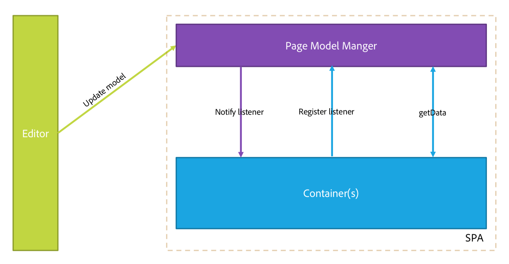

# Información general del editor de SPA {#spa-editor-overview}

Las aplicaciones de una sola página (SPA) pueden oferta de experiencias atractivas para los usuarios de sitios web. Los desarrolladores quieren poder crear sitios con marcos de SPA y los autores quieren editar contenido dentro de AEM sin problemas para un sitio creado con dichos marcos.

El Editor SPA oferta una solución integral para admitir SPA dentro de AEM. Esta página proporciona información general sobre cómo se estructura SPA soporte en AEM, cómo funciona el Editor de SPA y cómo el marco SPA y AEM se mantienen sincronizados.

## Introducción {#introduction}

Los sitios creados con marcos de SPA comunes como React y Angular cargan su contenido a través de JSON dinámico y no proporcionan la estructura HTML necesaria para que el Editor de páginas de AEM pueda colocar controles de edición.

Para habilitar la edición de SPA dentro de AEM, se necesita una asignación entre la salida JSON del SPA y el modelo de contenido en el repositorio AEM para guardar los cambios en el contenido.

SPA compatibilidad en AEM introduce una capa de JS delgada que interactúa con el código JS SPA cuando se carga en el Editor de páginas con el que se pueden enviar eventos y la ubicación de los controles de edición se puede activar para permitir la edición en contexto. Esta función se basa en el concepto de extremo de Content Services API, ya que el contenido de la SPA debe cargarse a través de Content Services.

Para obtener más información sobre SPA en AEM, consulte los siguientes documentos:

* [SPA modelo](blueprint.md) para los requisitos técnicos de un SPA
* [Introducción a la SPA en AEM con React](getting-started-react.md) para un rápido recorrido por un SPA simple con React
* [Introducción a SPA en AEM con Angular](getting-started-angular.md) para un rápido recorrido por un SPA sencillo con Angular

## Diseño {#design}

El componente de página de un SPA no proporciona los elementos HTML de sus componentes secundarios mediante el archivo JSP o HTL. Esta operación se delega en el marco SPA. La representación de los componentes o modelos secundarios se obtiene como una estructura de datos JSON del JCR. Los componentes SPA se agregan a continuación a la página según esa estructura. Este comportamiento diferencia la composición del cuerpo inicial del componente de página de las contrapartidas que no son SPA.

### Administración de modelos de página {#page-model-management}

La resolución y la administración del modelo de página se delegan en una `PageModel` biblioteca proporcionada. El SPA debe utilizar la biblioteca del modelo de página para inicializarse y ser creado por el editor de SPA. Biblioteca de modelo de página proporcionada indirectamente al componente de página de AEM a través de `aem-react-editable-components` npm. El Modelo de página es un intérprete entre AEM y el SPA y por lo tanto siempre debe estar presente. Cuando se crea la página, se `cq.authoring.pagemodel.messaging` debe agregar una biblioteca adicional para habilitar la comunicación con el editor de páginas.

Si el componente de página SPA hereda del componente principal de página, hay dos opciones para que la categoría de biblioteca del `cq.authoring.pagemodel.messaging` cliente esté disponible:

* Si la plantilla es editable, agréguela a la directiva de página.
* O bien, agregue las categorías mediante el `customfooterlibs.html`.

Para cada recurso del modelo exportado, el SPA asignará un componente real que realizará el procesamiento. El modelo, representado como JSON, se procesa mediante las asignaciones de componentes de un contenedor.

>[!CAUTION]
>
>La inclusión de la `cq.authoring.pagemodel.messaging` categoría debería limitarse al contexto del Editor de SPA.

### Tipo de datos de comunicación {#communication-data-type}

Cuando se agrega la `cq.authoring.pagemodel.messaging` categoría a la página, se enviará un mensaje al Editor de páginas para establecer el tipo de datos de comunicación JSON. Cuando el tipo de datos de comunicación se establece en JSON, las solicitudes de GET se comunicarán con los puntos finales del modelo de Sling de un componente. Una vez que se produce una actualización en el editor de páginas, la representación JSON del componente actualizado se envía a la biblioteca del modelo de páginas. A continuación, la biblioteca del modelo de página informa al SPA de las actualizaciones.

## Flujo de trabajo {#workflow}

Puede comprender el flujo de la interacción entre el SPA y el AEM pensando en el Editor de SPA como un mediador entre ambos.

* La comunicación entre el editor de páginas y el SPA se realiza mediante JSON en lugar de HTML.
* El editor de páginas proporciona la versión más reciente del modelo de página al SPA mediante la API de mensajería y iframe.
* El administrador de modelos de página notifica al editor que está listo para la edición y pasa el modelo de página como una estructura JSON.
* El editor no modifica ni siquiera accede a la estructura DOM de la página que se está creando, sino que proporciona el modelo de página más reciente.

### Flujo de trabajo del Editor de SPA básico {#basic-spa-editor-workflow}

Teniendo en cuenta los elementos clave del Editor de SPA, el autor verá el flujo de trabajo de alto nivel de edición de un SPA dentro de AEM de la siguiente manera.

1. Se carga SPA Editor.
1. SPA se carga en un marco independiente.
1. SPA solicita contenido JSON y procesa componentes en el lado del cliente.
1. SPA Editor detecta los componentes procesados y genera superposiciones.
1. El autor hace clic en una superposición y muestra la barra de herramientas de edición del componente.
1. SPA Editor persiste en las ediciones con una solicitud de POST al servidor.
1. SPA Editor solicita el JSON actualizado al Editor de SPA, que se envía al SPA con un Evento DOM.
1. SPA vuelve a procesar el componente afectado, actualizando su DOM.

>[!NOTE]
>
>Recuerde:
>
>* El SPA está siempre a cargo de su visualización.
>* El Editor SPA está aislado del SPA mismo.
>* En producción (publicación), el editor de SPA nunca se carga.

### Flujo de trabajo de edición de páginas de cliente-servidor {#client-server-page-editing-workflow}

Esta es una descripción más detallada de la interacción cliente-servidor al editar un SPA.

1. El SPA se inicializa y solicita el modelo de página al exportador del modelo de Sling.
1. El exportador del modelo de Sling solicita los recursos que componen la página desde el repositorio.
1. El repositorio devuelve los recursos.
1. El exportador del modelo de Sling devuelve el modelo de la página.
1. El SPA crea una instancia de sus componentes según el modelo de página.
1. **6a** El contenido informa al editor de que está listo para la creación.

   **6b** El editor de páginas solicita las configuraciones de creación de componentes.

   **6c** El editor de páginas recibe las configuraciones de componentes.
1. Cuando el autor edita un componente, el editor de páginas publica una solicitud de modificación en el servlet POST predeterminado.
1. El recurso se actualiza en el repositorio.
1. El recurso actualizado se proporciona al servlet POST.
1. El servlet POST predeterminado informa al editor de páginas de que el recurso se ha actualizado.
1. El editor de páginas solicita el nuevo modelo de página.
1. Los recursos que componen la página se solicitan del repositorio.
1. El repositorio proporciona los recursos que componen la página al exportador del modelo de Sling.
1. El modelo de página actualizado se devuelve al editor.
1. El editor de páginas actualiza la referencia del modelo de página del SPA.
1. El SPA actualiza sus componentes en función de la nueva referencia del modelo de página.
1. Se actualizan las configuraciones de componentes de los editores de página.

   **17a** El SPA indica al editor de páginas que el contenido está listo.

   **17b** El editor de páginas proporciona al SPA configuraciones de componentes.

   **17c** El SPA proporciona configuraciones de componentes actualizadas.

### Flujo de trabajo de creación {#authoring-workflow}

Esta es una descripción general más detallada que se centra en la experiencia de creación.

1. El SPA obtiene el modelo de página.
1. **2a** El modelo de página proporciona al editor los datos necesarios para la creación.

   **2b** Cuando se notifica, el organizador de componentes actualiza la estructura de contenido de la página.
1. El orquestador de componentes consulta la asignación entre un tipo de recurso AEM y un componente SPA.
1. El orquestador de componentes crea una instancia dinámica del componente SPA en función del modelo de página y la asignación de componentes.
1. El editor de páginas actualiza el modelo de página.
1. **6a** El modelo de página proporciona datos de creación actualizados al editor de páginas.

   **6b** El modelo de página distribuye cambios en el organizador de componentes.
1. El orquestador de componentes obtiene la asignación de componentes.
1. El organizador de componentes actualiza el contenido de la página.
1. Cuando el SPA finaliza de actualizar el contenido de la página, el editor de páginas carga el entorno de creación.

## Requisitos y limitaciones {#requirements-limitations}

Para permitir que el autor utilice el editor de páginas para editar el contenido de un SPA, la aplicación SPA debe implementarse para interactuar con el SDK del Editor SPA de AEM. Por favor, consulte la sección [Introducción a la SPA en AEM uso de React](getting-started-react.md) documento para obtener información mínima sobre cómo hacer que el suyo funcione.

### Marcos admitidos {#supported-frameworks}

El SDK del Editor de SPA admite las siguientes versiones mínimas:

* Reaccione 16.x y posterior
* Angular 6.x y posterior

Las versiones anteriores de estos marcos pueden funcionar con el SDK del Editor SPA de AEM, pero no son compatibles.

### Marcos adicionales {#additional-frameworks}

Se pueden implementar marcos de SPA adicionales para trabajar con el SDK del Editor de AEM SPA. Consulte el documento de modelo [SPA](blueprint.md) para conocer los requisitos que debe cumplir un módulo para crear un nivel específico del marco de trabajo compuesto de módulos, componentes y servicios que funcionen con el Editor de SPA de AEM.

### Uso de varios selectores {#multiple-selectors}

Los selectores personalizados adicionales se pueden definir y utilizar como parte de una SPA desarrollada para el SDK de AEM SPA. Sin embargo, esta compatibilidad requiere que el `model` selector sea el primer selector y que la extensión sea `.json` la requerida por el exportador JSON.

### Requisitos del Editor de texto {#text-editor-requirements}

Si desea utilizar el editor in situ de un componente de texto creado en SPA, se requiere una configuración adicional.

1. Defina un atributo (puede ser cualquiera) en el elemento de envoltorio de contenedor que contiene el texto HTML. En el caso del proyecto WKND SPA, es un `
` elemento y el selector que se ha utilizado es `data-rte-editelement`.
1. Configure la configuración `editElementQuery` en el componente de texto AEM correspondiente `cq:InplaceEditingConfig` que apunta a ese selector, por ejemplo: `data-rte-editelement`. Esto permite al editor saber qué elemento HTML ajusta el texto HTML.

Para obtener información adicional sobre la propiedad `editElementQuery` y la configuración del editor de texto enriquecido, consulte [Configuración del editor de texto enriquecido.](/help/implementing/developing/extending/rich-text-editor.md)

### Restricciones     {#limitations}

El SDK AEM SPA Editor es totalmente compatible con Adobe y, como nueva función, se sigue ampliando y mejorando. El Editor de SPA aún no admite las siguientes funciones de AEM:

* Modo destinatario
* ContextHub
* Edición de imágenes en línea
* Editar configuraciones (p. ej. oyentes)
* Sistema de estilos
* Deshacer/Rehacer
* Diferencia de página y Deformación de tiempo
* Funciones que realizan la reescritura de HTML en el servidor, como Verificador de vínculos, servicio de reescritura de CDN, acortamiento de URL, etc.
* Modo de desarrollador
* AEM lanzamientos
