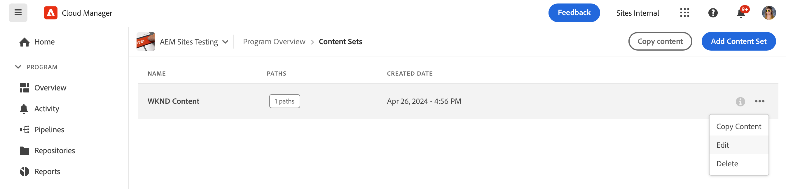

# La herramienta Copia de contenido {#content-copy}

La herramienta de copia de contenido permite a los usuarios copiar contenido mutable bajo demanda desde sus entornos de producción en AEM as a Cloud Service a entornos más bajos para realizar pruebas.

>[!NOTE]
>Aunque el flujo de copia de contenido principal va desde entornos superiores a entornos inferiores, una capacidad adicional - **Flujo de avance** - permite copiar desde entornos inferiores que no sean de producción a entornos superiores que no sean de producción (por ejemplo, Desarrollo → ensayo, RDE → ensayo). Consulte [Limitaciones](#limitations) para obtener más información, incluidos los requisitos de disponibilidad.

## Introducción {#introduction}

Los datos actuales y reales son valiosos para las pruebas, la validación y la aceptación de usuarios. La herramienta de copia de contenido le permite copiar contenido de un entorno de AEM as a Cloud Service de producción a un entorno de ensayo, desarrollo o [entorno de desarrollo rápido (RDE)](/help/implementing/developing/introduction/rapid-development-environments.md) para dichas pruebas.

El contenido que se va a copiar se define mediante un conjunto de contenido. Un conjunto de contenido consiste en una lista de rutas JCR que contienen el contenido mutable que se va a copiar desde un entorno de servicio de creación de origen a un entorno de servicio de creación de destino dentro del mismo programa de Cloud Manager. Se permiten las siguientes rutas en un conjunto de contenido.

```text
/content
/conf/**/settings/wcm
/conf/**/settings/dam/cfm/models
/conf/**/settings/graphql/persistentQueries
/etc/clientlibs/fd/themes
```

Al copiar contenido, el entorno de origen es la fuente de información.

* Si el contenido se ha modificado en el entorno de destino, el contenido del origen lo sobrescribe, si las rutas son iguales.
* Si las rutas son diferentes, el contenido del origen se combinará con el contenido del destino.

## Permisos {#permissions}

Para utilizar la herramienta de copia de contenido, se requieren ciertos permisos tanto en el entorno de origen como en el de destino.

| Función de copia de contenido | Grupo de administradores de AEM | Función Administrador de implementación |
|---|---|---|
| Crear y modificar [conjuntos de contenido](#create-content-set) | No necesario | Requerido |
| Iniciar o cancelar el [proceso de copia de contenido](#copy-content) | Requerido | Requerido |

Para obtener más información sobre los permisos y cómo establecerlos, consulte [Perfiles de equipo y producto de AEM as a Cloud Service](/help/onboarding/aem-cs-team-product-profiles.md).

## Creación de un conjunto de contenido {#create-content-set}

Para poder copiar cualquier contenido, se debe definir un conjunto de contenido. Una vez definido, los conjuntos de contenido se pueden reutilizar para copiar contenido. Siga estos pasos para poder crear un conjunto de contenido.

1. Inicie sesión en Cloud Manager en [my.cloudmanager.adobe.com](https://my.cloudmanager.adobe.com/) y seleccione la organización y el programa adecuados.

1. Con el panel de navegación lateral, vaya a la pestaña **Conjuntos de contenido** de la página **Información general**.

1. En la parte superior derecha de la pantalla, haga clic en **Agregar conjunto de contenido**.

   

1. En la ficha **Detalles** del asistente, proporcione un nombre y una descripción para el conjunto de contenido y seleccione **Continuar**.

   

1. En la pestaña **Rutas de contenido** del asistente, especifique las rutas del contenido mutable que se incluirán en el conjunto de contenido.

   1. Introduzca la ruta en el campo **Añadir ruta de inclusión**.
   1. Haga clic en el botón **Añadir ruta** para agregar la ruta al conjunto de contenido.
   1. Vuelva a hacer clic en **Agregar ruta** según sea necesario.
      * Se permiten hasta 50 rutas.

   

1. Si debe restringir o restringir el conjunto de contenido, se pueden excluir las subrutas.

   1. En la lista de rutas incluidas, haga clic en **Agregar subrutas de exclusión** junto a la ruta que desee restringir.
   1. Introduzca el subtrazado que desea excluir debajo del trazado seleccionado.
   1. Seleccione **Excluir ruta**.
   1. Seleccione **Agregar subrutas de exclusión** de nuevo para agregar rutas adicionales que se excluirán según sea necesario.
      * Las rutas excluidas deben ser relativas a la ruta incluida.
      * No hay límite en el número de rutas excluidas.

   

1. Si es necesario, puede editar las rutas especificadas.

   1. Haga clic en la X situada junto a las subrutas excluidas para poder eliminarlas.
   1. Haga clic en el botón de los tres puntos situado junto a las rutas para mostrar las opciones **Editar** y **Eliminar**.

   

1. Seleccione **Crear** para crear el conjunto de contenido.

A partir de ahora, se puede utilizar el conjunto de contenido para copiar contenido entre entornos.

## Edición de un conjunto de contenido {#edit-content-set}

Siga los mismos pasos que para la creación de un paso de contenido. En lugar de hacer clic en **Agregar conjunto de contenido**, seleccione un conjunto existente de la consola y seleccione **Editar** en el menú de los tres puntos.



Al editar el conjunto de contenido, puede ampliar las rutas configuradas para mostrar las subrutas excluidas.

## Copia de contenido {#copy-content}

Una vez creado un conjunto de contenido, puede utilizarlo para copiar contenido. Siga estos pasos para poder copiar contenido.

>[!NOTE]
> No utilice la copia de contenido en un entorno mientras se esté ejecutando una operación de [transferencia de contenido](/help/journey-migration/content-transfer-tool/using-content-transfer-tool/overview-content-transfer-tool.md) en dicho entorno.

1. Inicie sesión en Cloud Manager en [my.cloudmanager.adobe.com](https://my.cloudmanager.adobe.com/) y seleccione la organización y programa adecuados.

1. Vaya a la pantalla **Entornos** de la página **Información general**.

1. Vaya a la página **Conjuntos de contenido** en la pantalla **Entornos**.

1. Seleccione un conjunto de contenido de la consola y seleccione **Copiar contenido** en el menú de puntos suspensivos.

   

   >[!NOTE]
   >
   >Es posible que no se pueda seleccionar un entorno si ocurre lo siguiente:
   >
   >* El usuario no tiene los permisos adecuados.
   >* El entorno tiene una canalización en ejecución o una operación de copia de contenido en curso.
   >* El entorno está hibernando o iniciándose.

1. En el diálogo **Copiar contenido**, especifique el origen y el destino de la acción de copia de contenido.

   

   * El contenido solo se puede copiar de un entorno superior a un entorno inferior o entre entornos de desarrollo/RDE donde la jerarquía de entornos es la siguiente (de mayor a menor):
      * Producción
      * Ensayo
      * Desarrollo/RDE
   * De forma predeterminada, la copia de contenido entre programas está desactivada. Sin embargo, si el cliente lo solicita, se puede habilitar, lo que hará que esté disponible el campo de entrada **Programa de destino** adicional.

1. Si es necesario, también puede seleccionar **Incluir listas de control de acceso** en el proceso de copia.

1. Seleccione **Copiar**.

Se inicia el proceso de copia. El estado del proceso de copia se refleja en la consola del conjunto de contenido seleccionado.

## Actividad de la copia de contenido {#copy-activity}

Puede controlar el estado de los procesos de la copia en la página **Copiar actividad de contenido**.

1. Inicie sesión en Cloud Manager en [my.cloudmanager.adobe.com](https://my.cloudmanager.adobe.com/) y seleccione la organización y programa adecuados.

1. Vaya a la pantalla **Entornos** de la página **Información general**.

1. Vaya a la página **Copiar actividad de contenido** en la pantalla **Entornos**.


### Estados de la copia de contenido {#statuses}

Una vez que empiece a copiar contenido, el proceso puede tener uno de los siguientes estados.

| Estado | Descripción |
|---|---|
| En curso | La operación de copia de contenido está en curso |
| Error | Error en la operación de copia de contenido |
| Completado | La operación de copia de contenido se ha completado correctamente |
| Cancelado | El usuario cancela una operación de copia de contenido después de iniciarla |

### Cancelación de un proceso de copia {#canceling}

Si debe cancelar una operación de copia de contenido después de iniciarla, puede cancelarla opcionalmente.

Para ello, en la página **Copiar actividad de contenido**, seleccione la acción **Cancelar** del menú de los tres puntos del proceso de copia que inició anteriormente.


>[!NOTE]
>
>Al cancelar una operación de copia de contenido, puede resultar en una copia parcial del contenido en el entorno de destino. Esta situación puede dejar el entorno de destino en un estado inutilizable.
>
>Si su entorno se encuentra en ese estado debido a la cancelación, póngase en contacto con el Servicio de atención al cliente de Adobe para obtener ayuda.

### Acceso a registros {#accessing-logs}

Puede comprobar los registros de los entornos de origen y destino para cualquier proceso de copia de contenido completado.

Para ello, en la página **Copiar actividad de contenido**, seleccione la acción **Registros** del menú de los tres puntos del proceso de copia para el que desea revisar los registros y, a continuación, elija para qué entorno.


Los registros se descargan en el equipo local. Si la descarga no comienza, compruebe la configuración del bloqueador de ventanas emergentes.

## Limitaciones {#limitations}

La herramienta de copia de contenido tiene las siguientes limitaciones.

* La herramienta de copia de contenido admite dos modos de flujo:
   1. Flujo descendente: el contenido se puede copiar desde entornos superiores a entornos inferiores (por ejemplo, Producción → Ensayo, Ensayo → Desarrollo/RDE).
   2. Flujo de avance (nueva función): el contenido también se puede copiar desde un entorno inferior que no sea de producción a un entorno superior que no sea de producción (por ejemplo, Desarrollo → fase, EDR → fase). Esta función solo está disponible bajo solicitud explícita y permanece habilitada hasta que se solicite explícitamente que se deshabilite. Los entornos de producción nunca son destinos válidos para el flujo de reenvío.
* El contenido solo se puede copiar desde y hacia los servicios de creación.
* No es posible ejecutar operaciones de copia de contenido simultáneas en el mismo entorno.
* Se pueden especificar hasta 50 rutas por conjunto de contenido. No hay limitación en las rutas excluidas.
* No utilice la herramienta de copia de contenido como herramienta de clonación o creación de reflejo porque no puede realizar el seguimiento del contenido movido o eliminado en el origen.
* La herramienta de copia de contenido no tiene capacidad de control de versiones y no puede detectar automáticamente el contenido modificado o creado en el entorno de origen en un conjunto de contenido desde la última operación de copia de contenido.
   * Si desea actualizar el entorno de destino solo con cambios de contenido, desde la última operación de copia de contenido, debe crear un conjunto de contenido. A continuación, especifique las rutas en la instancia de origen en las que se han realizado cambios desde la última operación de copia de contenido.
* La información de la versión no se incluye en una copia de contenido.
* [Modelos de fragmentos de contenido](/help/sites-cloud/administering/content-fragments/content-fragment-models.md#data-types) pueden especificar campos de referencia basados en identificadores únicos universales (UUID). Estos UUID son específicos del repositorio, por lo que la herramienta de copia de contenido recalculará estos UUID en el entorno de destino al copiar fragmentos de contenido.
