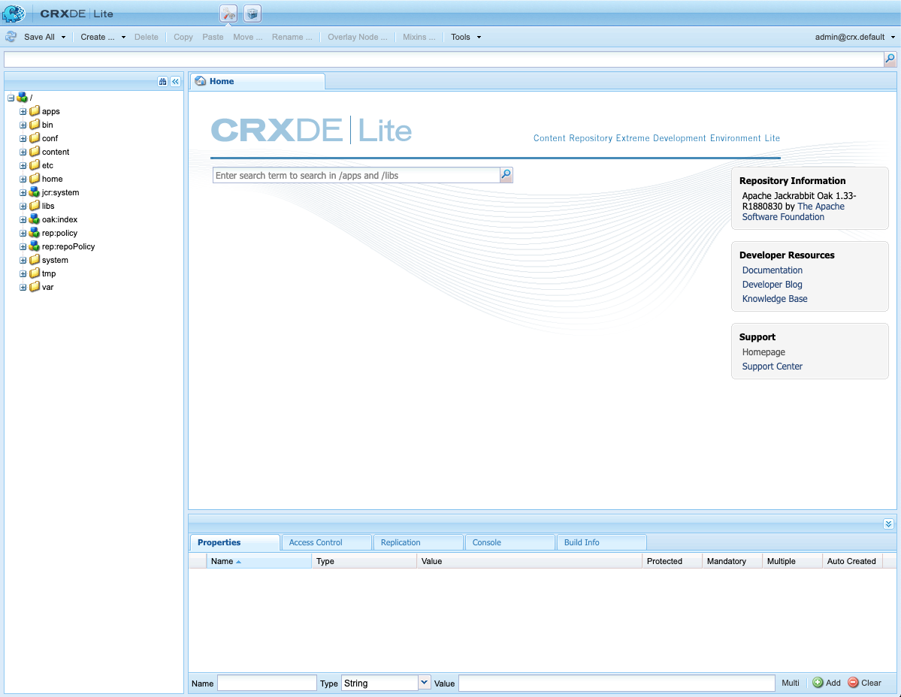

# Uso del CRXDE Lite {#using-crxde-lite}

CRXDE Lite forma parte del inicio rápido de AEM y está disponible para acceder al repositorio y modificarlo en los entornos de desarrollo local dentro del explorador. CRXDE Lite permite editar archivos, carpetas, nodos y propiedades. Todo el repositorio es accesible para usted en esta interfaz fácil de usar.

>[!NOTE]
>
>CRXDE Lite solo está disponible en los entornos de desarrollo local. No está disponible en AEM as a Cloud Service.

## Introducción a CRXDE Lite {#getting-started-with-crxde-lite}

Para empezar a usar CRXDE Lite:

1. Inicie el inicio rápido de desarrollo local de AEM.
1. En su explorador, abra la dirección URL `https://<host>:<port>/crx/de`.
1. Escriba su **nombre de usuario** y su **contraseña**.
1. Haga clic en **OK**.

La interfaz de usuario de CRXDE Lite aparece de la siguiente manera en el explorador:

>[!TIP]
>
>También puede acceder a CRXDE Lite desde el menú AEM. En el menú principal, seleccione **Herramientas** > **General** > **CRXDE Lite**.

## Información general sobre la interfaz de usuario {#overview-of-the-user-interface}

La interfaz de usuario de CRXDE Lite tiene muchas partes y muchas funciones.

### Barra de conmutación superior {#top-switcher-bar}

La barra de cambio superior le permite cambiar rápidamente entre CRXDE Lite y [Administrador de paquetes](package-manager.md).

### Widget de ruta del nodo {#node-path-widget}

El widget Ruta del nodo muestra la ruta al nodo seleccionado actualmente.

También puede usarlo para saltar a un nodo al introducir la ruta a mano o pegarla desde otro lugar y pulsar Intro.

También es compatible con la búsqueda de nodos con un nombre de nodo específico. Introduzca el nombre del nodo que desea buscar y espere (o seleccione el icono de búsqueda en el lado derecho). Si se carga un nodo o nodos determinados en el panel del explorador, se muestra la lista y puede seleccionar la ruta y pulsar Entrar para desplazarse hasta ella. Solo funciona para los nodos cargados actualmente en la aplicación cliente CRXDE en el explorador. Si desea buscar en todo el repositorio, use **Herramientas** -&amp;gt: **Consulta**.

### Panel del explorador {#explorer-pane}

El **panel del explorador** muestra un árbol de todos los nodos del repositorio.

Haga clic en un nodo para mostrar sus propiedades en la ficha **Propiedades**. Después de hacer clic en un nodo, puede seleccionar una acción en la barra de herramientas. Vuelva a hacer clic en el nodo para cambiarle el nombre.

El filtro de navegación de árbol (el icono de prismáticos) permite filtrar los nodos del repositorio para los que el nombre contiene el texto de entrada. Solo se aplica a los nodos que se han cargado localmente.

### Panel de edición {#edit-pane}

El **Panel de edición** le permite ver el contenido del archivo seleccionado actualmente en el repositorio. Cada archivo abierto se representa como su propia pestaña en el panel.

La pestaña **Inicio** le permite buscar contenido o documentación, así como acceder a documentación para desarrolladores y a la asistencia de Adobe.

Haga doble clic en un archivo del **panel del explorador** para mostrar su contenido en el **panel de edición**. A continuación, puede modificarla y guardar los cambios.

Una vez que se edita un archivo en el **Panel de edición**, las siguientes herramientas están disponibles en la barra de herramientas:

* **Mostrar en árbol** - Muestra el archivo en el árbol del repositorio.
* **Buscar/Reemplazar** - Realiza una búsqueda o reemplazo.

Haga doble clic en la línea de estado del **Panel de edición** para abrir el cuadro de diálogo **Ir a la línea** y escribir un número de línea específico.

### Pestaña Propiedades {#properties-tab}

La ficha **Propiedades** muestra las propiedades del nodo que ha seleccionado. Puede añadir nuevas propiedades o eliminar las existentes.

### Pestaña Control de acceso {#access-control-tab}

La **pestaña Control de acceso** muestra los permisos según la ruta, repositorio o entidad de seguridad actual.

Los permisos se dividen en las siguientes categorías.

* **Directiva de control de acceso aplicable**: directivas que se pueden aplicar a la selección actual
* **Directivas de control de acceso local**: las directivas actuales se aplican localmente a la selección actual
* **Directivas efectivas de control de acceso**: las directivas actuales aplicadas a la selección actual, que pueden establecerse localmente o heredarse de los nodos principales

>[!NOTE]
>
>Para poder ver la información de control de acceso, el usuario que ha iniciado sesión en CRXDE Lite debe tener derechos para leer las entradas ACL.

### Pestaña Replicación {#replication-tab}

La **ficha Replicación** muestra el estado de replicación del nodo actual. Puede replicar y replicar y eliminar el nodo actual.

### Pestaña Consola {#console-tab}

La **pestaña Consola** muestra mensajes de registro. Puede configurar el nivel de registro, borrar la consola, fijar la posición de desplazamiento seleccionada y activar o desactivar la visualización de mensajes.

### Pestaña Información de compilación {#build-info-tab}

La **pestaña Información de compilación** muestra información cuando se está creando un paquete.

### Botón Actualizar {#refresh-button}

El **botón Actualizar** actualiza la selección actual. Los cambios de otros usuarios se actualizan en la vista del repositorio. Los cambios que ha realizado no se ven afectados.

### Botón Guardar todo {#save-all-button}

El botón **Guardar todo** guarda todos los cambios que ha realizado. Hasta que elija guardar, los cambios son temporales y se pierden al salir de la consola.

* **Revertir**: descarta todos los cambios realizados en el nodo seleccionado desde la última acción de guardar y, a continuación, vuelve a cargar el estado actual del repositorio para el nodo seleccionado
* **Revertir todo**: descarta todos los cambios realizados en todo el repositorio desde la última acción de guardado y vuelve a cargar el estado actual del repositorio

### Botón Crear {#create-button}

El **botón Crear** es un menú desplegable para crear lo siguiente bajo el nodo seleccionado:

* Nodo: un nodo con un tipo de nodo arbitrario.
* Archivo: un nodo `nt:file` y su subnodo nt:resource
* Carpeta: un nodo `nt:folder`

### Botón Eliminar {#delete-button}

El **botón Eliminar** elimina el nodo seleccionado.

### Botón Copiar {#copy-button}

El **botón Copiar** copia el nodo seleccionado.

## Botón Pegar {#paste-button}

El **botón Pegar** pega el nodo copiado bajo el nodo seleccionado.

### Botón Mover {#move-button}

El **botón Mover** mueve el nodo seleccionado al nodo establecido a través del cuadro de diálogo.

### Cambiar nombre {#rename-button}

El **botón Cambiar nombre** cambia el nombre del nodo seleccionado.

### Mixins {#mixins-button}

El **botón de mixins** le permite agregar tipos de mixins al tipo de nodo. Los tipos de mixin se utilizan principalmente para añadir funciones avanzadas.

### Herramientas {#tools-button}

El **botón Herramientas** es un menú desplegable con las siguientes herramientas disponibles:

* **Configuración del servidor** - para acceder a la consola Felix (también disponible en `https://<host>:<port>/system/console/configMgr`)
* **Consulta** - para consultar el repositorio
* **Privilegios**: para ver y agregar privilegios
* **Probar el control de acceso** - para probar el permiso para cierta ruta y/o entidad de seguridad
* **Exportar tipo de nodo**: para exportar tipos de nodo en el sistema como notación CDN
* **Importar tipo de nodo** - para importar tipos de nodo usando notación CDN.

### Widget de inicio {#login-widget}

El **widget de inicio de sesión** muestra el usuario que ha iniciado sesión en ese momento.

Haga clic en él para iniciar sesión o volver a iniciarla como otro usuario. `@crx.default` representa que se encuentra en el área de trabajo predeterminada (y única) del repositorio.

La opción **Preferencias** se puede usar para definir el idioma de la interfaz de usuario y para ver y personalizar las teclas de marcación rápida para diversas acciones, como guardar, buscar, crear notas, etc.

## Creación de una carpeta {#creating-a-folder}

Para crear una carpeta con CRXDE Lite:

1. Abra CRXDE Lite en el explorador.
1. En el panel de navegación, haga clic con el botón derecho en la carpeta en la que desea crear la nueva carpeta, seleccione **Crear...**, luego **Crear carpeta...**.

1. Escriba la carpeta **Name** y haga clic en **Aceptar**.

1. Haga clic en **Guardar todo** para guardar los cambios en el servidor.

## Creación de un nodo {#creating-a-node}

Para crear un nodo con CRXDE Lite:

1. Abra CRXDE Lite en el explorador.
1. En el [**Panel del explorador**](#explorer-pane), haga clic con el botón secundario en el nodo donde desea crear el nuevo nodo, seleccione **Crear** y, a continuación, **Crear nodo**.
1. Escriba **Name** y seleccione **Type**.
1. Haga clic en **OK**.
1. Haga clic en el botón [**Guardar todo**](#save-all-button) para guardar los cambios en el servidor.

Ahora puede adaptar el nodo a sus necesidades modificando propiedades o creando nuevos nodos.

>[!NOTE]
>
>La mayoría de las operaciones de edición, incluido **Crear nodo**, conserva todos los cambios en la memoria y solo los almacena en el repositorio al guardarlos (con el botón [**Guardar todo**](#save-all-button)). Sin embargo, algunas operaciones, como mover, persisten automáticamente.
>
>El repositorio también lleva a cabo la validación con respecto a si el tipo de nodo del nodo principal permite el nodo creado al guardar los cambios. Si recibe un mensaje de error al guardar un nodo, compruebe si la estructura de contenido es válida (por ejemplo, no puede crear un nodo `nt:unstructured` como secundario del nodo `nt:folder`).

## Creación de una propiedad {#creating-a-property}

Para crear una propiedad con CRXDE Lite:

1. Abra CRXDE Lite en el explorador.
1. En el [**Panel del explorador**](#explorer-pane), seleccione el nodo al que desea agregar la nueva propiedad.
1. En la [**ficha Propiedades**](#properties-tab) del panel inferior, escriba **Nombre**, **Tipo** y **Valor**.
1. Haga clic en **Agregar**.
1. Haga clic en el botón [**Guardar todo**](#save-all-button) para guardar los cambios en el servidor.

## Creación de un archivo {#creating-a-file}

Para crear un archivo con CRXDE Lite:

1. Abra CRXDE Lite en el explorador.
1. En el [**Panel del explorador**](#explorer-pane), haga clic con el botón secundario en el componente donde desea crear el archivo, seleccione **Crear** y, a continuación, **Crear archivo**.
1. Escriba el archivo **Name**, incluida su extensión.
1. Haga clic en **OK**.
1. El nuevo archivo se abrirá como una ficha en el [**Panel de edición**](#edit-pane).
1. Edite el archivo.
1. Haga clic en el botón [**Guardar todo**](#save-all-button) para guardar los cambios.

## Exportación e importación de tipos de nodo {#exporting-and-importing-node-types}

Con CRXDE Lite puede importar o exportar definiciones de tipo de nodo en [Notación del espacio de nombres compacto y la definición del tipo de nodo (CDN)](https://jackrabbit.apache.org/jcr/node-type-notation.html).

Para exportar una definición de tipo de nodo en CRXDE Lite:

1. Abra CRXDE Lite en el explorador.
1. Seleccione el nodo requerido.
1. Seleccione **Herramientas** y luego **Exportar tipo de nodo**.
1. La definición se muestra en notación CDN en una nueva pestaña del explorador.
1. Guarde la información si es necesario.

Para importar una definición de tipo de nodo:

1. Abra CRXDE Lite en el explorador.
1. Seleccione **Herramientas** y luego **Importar tipo de nodo**.
1. Se abre una nueva pestaña en el [**Panel de edición**](#edit-pane) con la etiqueta **Importar tipo de nodo**.
1. Escriba la notación CDN para la definición en el cuadro de texto de la ficha **Importar tipo de nodo**.
1. Marque **Permitir actualización** si está actualizando una definición existente.
1. Haga clic en **Importar**.

## Registro {#logging}

Con CRXDE Lite puede mostrar el archivo `error.log` que se encuentra en el sistema de archivos en `<aem-install-dir>/crx-quickstart/logs` y filtrarlo con el nivel de registro apropiado. Proceda como se indica a continuación:

1. Abra CRXDE Lite en el explorador.
1. En el menú desplegable de la derecha de [**Ficha de consola**](#console-tab) en la parte inferior de la ventana, seleccione **Registros de servidor**.
1. Haga clic en el icono **Detener** para mostrar los mensajes.

Puede hacer lo siguiente:

* Ajuste los parámetros de registro en la consola Felix haciendo clic en el icono **Configuraciones de registro**.
* Borre los mensajes haciendo clic en el icono **Borrar consola**.
* Fijar el mensaje en la selección actual haciendo clic en el icono **Fijar consola**.
* Habilite o deshabilite la visualización de mensajes al hacer clic en el icono **Detener**.
