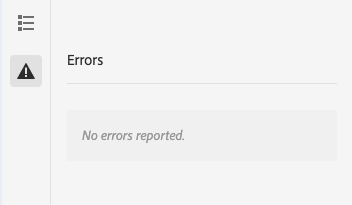

# Modo de desarrollador {#developer-mode}

Al editar páginas en AEM, hay disponibles varios [modos](/help/sites-cloud/authoring/sites-console/introduction.md#page-modes), incluido el modo de desarrollador. El modo de desarrollador abre un panel lateral con varias pestañas que proporcionan al desarrollador información técnica sobre la página actual.

Hay dos pestañas:

* **[Componentes](#components)** para ver información de estructura y rendimiento.
* **[Errores](#errors)** para ver los problemas que se producen.

Esto ayuda a un desarrollador a lo siguiente:

* **Descubra** cómo están compuestas las páginas.
* **Depuración:** qué está sucediendo dónde y cuándo, lo que a su vez ayuda a resolver problemas.

>[!NOTE]
>
>Modo de desarrollador:
>
>* No está disponible en dispositivos móviles ni en ventanas pequeñas en equipos de escritorio (debido a restricciones de espacio). Esto ocurre cuando la anchura es inferior a 1024 píxeles.
>* Solo está disponible para los usuarios que sean miembros del grupo `administrators`.

## Abriendo modo de desarrollador {#opening-developer-mode}

El modo de desarrollador se implementa como panel lateral en el editor de páginas. Para abrir el panel, seleccione **Desarrollador** en el selector de modo de la barra de herramientas del editor de páginas:

El panel se divide en dos pestañas:

* **[Componentes](#components)**: muestra un árbol de componentes, similar al [árbol de contenido](/help/sites-cloud/authoring/page-editor/editor-side-panel.md#content-tree) para autores
* **[Errores](#errors)**: cuando se producen problemas, se muestran los detalles de cada componente.

### Pestaña Componentes {#components}

Muestra un árbol de componentes que:

* Describe la cadena de componentes y plantillas que se representan en la página. El árbol se puede expandir para mostrar el contexto dentro de la jerarquía.
* Muestra el tiempo de cálculo del lado del servidor necesario para procesar el componente.
* Permite expandir el árbol y seleccionar componentes específicos dentro de él. La selección proporciona acceso a los detalles del componente, como:
   * Ruta del repositorio
   * Vínculos a scripts (a los que se accede en CRXDE Lite)
   * Detalles del componente tal como se ve en la [consola Componentes](/help/sites-cloud/authoring/components-console.md)
* Los componentes seleccionados en el árbol se indican mediante un borde azul en el editor.

Esta pestaña de componentes le ayuda a:

* Determine y compare el tiempo de renderización por componente.
* Ver y comprender la jerarquía.
* Comprenda y, a continuación, mejore el tiempo de carga de la página buscando componentes lentos.

Cada entrada de componente puede tener las siguientes opciones:

* **Ver detalles:** Un vínculo a una lista que muestra:
   * Todos los scripts de componente utilizados para procesar el componente.
   * La ruta de contenido del repositorio para este componente específico.

     

* **Editar script:** Un vínculo que abre el script del componente en CRXDE Lite.

* **Ver detalles del componente:** Abre los detalles del componente en la [consola Componentes](/help/sites-cloud/authoring/components-console.md).

La expansión de una entrada de componente al tocar o hacer clic en las comillas angulares también puede mostrar:

    * La jerarquía dentro del componente seleccionado.
    * Tiempos de procesamiento para el componente seleccionado de forma aislada, cualquier componente individual anidado en él y el total combinado.

### Pestaña Errores {#errors}

Esperamos que la ficha **Errores** esté siempre vacía (como se ha indicado anteriormente), pero cuando se produzcan problemas, se mostrarán los siguientes detalles para cada componente:

* Una advertencia si el componente escribe una entrada en el registro de errores, junto con detalles del error y vínculos directos al código adecuado en CRXDE Lite.
* Advertencia si el componente abre una sesión de administración.

Por ejemplo, si se llama a un método indefinido, el error resultante se muestra en la ficha **Errores** y la entrada del componente en el árbol de la ficha **Componentes** también se marcará con un indicador cuando se produzca un error.
