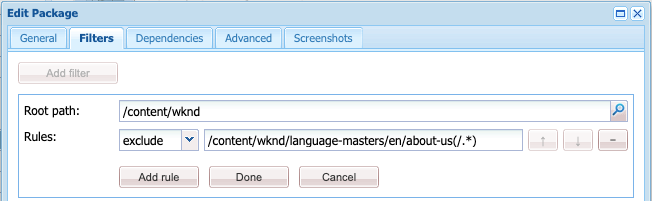

# El administrador de paquetes {#working-with-packages}

Los paquetes permiten importar y exportar el contenido del repositorio. Puede utilizar paquetes para instalar contenido nuevo, transferir contenido entre instancias y realizar copias de seguridad del contenido del repositorio.

AEM Con el Administrador de paquetes, puede transferir paquetes entre la instancia de y el sistema de archivos local para fines de desarrollo.

## ¿Qué son los paquetes? {#what-are-packages}

Un paquete es un archivo zip que contiene contenido del repositorio en forma de serialización del sistema de archivos, denominada serialización de Vault, lo que proporciona una representación fácil de usar y editar de archivos y carpetas. El contenido incluido en el paquete se define mediante filtros.

Un paquete también contiene metainformación de Vault, incluidas las definiciones de filtros y la información de configuración de importación. En el paquete se pueden incluir propiedades de contenido adicionales, que no se utilizan para la extracción de paquetes, como una descripción, una imagen visual o un icono. Estas propiedades de contenido adicionales son para el consumidor del paquete de contenido y solo con fines informativos.

>[!NOTE]
>
>Los paquetes representan la versión actual del contenido en el momento en que se crea el paquete. AEM No incluyen ninguna versión anterior del contenido que se mantiene en el repositorio de la que se haya hecho clic en el botón de la barra de herramientas de la aplicación de la aplicación de la aplicación de la.

## AEM Paquetes en as a Cloud Service {#aemaacs-packages}

AEM Los paquetes de contenido creados para aplicaciones as a Cloud Service de la deben tener una separación limpia entre el contenido inmutable y el mutable. Por lo tanto, el Administrador de paquetes solo se puede utilizar para administrar paquetes que contengan contenido. Cualquier código debe implementarse mediante Cloud Manager.

>[!NOTE]
>
>Los paquetes solo pueden contener contenido. Cualquier funcionalidad (por ejemplo, contenido almacenado en `/apps`) debe ser [implementado mediante su canalización de CI/CD en Cloud Manager.](/help/implementing/cloud-manager/deploy-code.md)

>[!IMPORTANT]
>
>La interfaz de usuario del Administrador de paquetes puede devolver el mensaje de error **Indefinido** si un paquete tarda más de 10 minutos en instalarse.
>
>Esto no se debe a un error en la instalación, sino a un tiempo de espera que Cloud Service tiene para todas las solicitudes.
>
>No vuelva a intentar realizar la instalación si aparece un error de este tipo. La instalación continúa correctamente en el fondo. Si reinicia la instalación, podrían producirse conflictos debido a varios procesos de importación simultáneos.

Para obtener más información sobre cómo administrar paquetes para AEMaaCS, consulte el documento [AEM Implementación en el as a Cloud Service de](/help/implementing/deploying/overview.md) en la guía de usuario sobre implementación.

## Tamaño del paquete {#package-size}

Adobe recomienda no crear paquetes grandes. Esto sirve para evitar problemas de tiempo de espera al cargar y descargar paquetes.

Como regla general, un paquete debe transmitirse en su totalidad en un plazo de 60 segundos. Esto proporciona la siguiente fórmula como guía.

```text
MaxPackageSize (in MB) = ConnectionSpeed (in MB/s) * 60 s
```

Dado que el tráfico de red es variable y siempre es menor que el valor teórico máximo anunciado, intente utilizar una herramienta de prueba de velocidad de conexión a Internet en línea.

Las velocidades de Internet son casi siempre diferentes para las cargas y descargas. Suponiendo que necesite cargar y descargar paquetes, debe utilizar el valor más bajo (normalmente la velocidad de carga) en el cálculo.

### Ejemplos {#example}

Utilizando una herramienta de prueba de velocidad de Internet, veo que mi velocidad de carga actual es de unos 100 Mbps.

```text
100 Mbps = 12.5 MB/s
12.5 MB/s * 60 s = 750 MB
```

Por lo tanto, cualquier paquete que cree debe ser menor que 750 MB.

>[!NOTE]
>
>Las velocidades de la red están sujetas a las condiciones locales actuales. Incluso con una prueba de velocidad reciente, el rendimiento real puede variar.
>
>Por lo tanto, la fórmula proporcionada es solo una guía y el tamaño máximo real del envase recomendado puede variar.

## El administrador de paquetes {#package-manager}

AEM El Administrador de paquetes administra los paquetes en la instalación de la. Después de que tenga [ha asignado los permisos necesarios](#permissions-needed-for-using-the-package-manager) puede utilizar el Administrador de paquetes para realizar diversas acciones, como configurar, crear, descargar e instalar paquetes.

### Permisos necesarios {#required-permissions}

Para crear, modificar, cargar e instalar paquetes, los usuarios deben tener los permisos adecuados en los siguientes nodos:

* Derechos completos excluyendo eliminación en `/etc/packages`
* El nodo que contiene el contenido del paquete

>[!CAUTION]
>
>La concesión de permisos para paquetes puede dar lugar a la divulgación de información confidencial y a la pérdida de datos.
>
>Para limitar estos riesgos, es muy recomendable conceder permisos de grupo específicos solo sobre subárboles dedicados.

### Acceso al Administrador de paquetes {#accessing}

Puede acceder al Administrador de paquetes de tres formas:

1. AEM Desde el menú principal de la -> **Herramientas** -> **Implementación** -> **Paquetes**
1. Desde [CRXDE Lite](crxde.md) uso de la barra superior del conmutador
1. Directamente accediendo a `http://<host>:<port>/crx/packmgr/`

### IU del Administrador de paquetes {#ui}

El Administrador de paquetes se divide en cuatro áreas funcionales principales:

* **Panel de navegación izquierdo** : Este panel le permite filtrar y ordenar la lista de paquetes.
* **Lista de paquetes** : Esta es la lista de paquetes de la instancia filtrados y ordenados por selecciones en el panel de navegación izquierdo.
* **Registro de actividad** : Este panel se minimiza al principio y se expande para detallar la actividad del Administrador de paquetes, como cuando se crea o instala un paquete. Hay botones adicionales en la pestaña Registro de actividad para:
   * **Borrar registro**
   * **Mostrar / Ocultar**
* **Barra de herramientas** : La barra de herramientas contiene botones de actualización para el panel de navegación izquierdo y la lista de paquetes, así como botones para buscar, crear y cargar paquetes.


Al hacer clic en una opción del panel de navegación izquierdo, se filtra inmediatamente la lista de paquetes.

Al hacer clic en el nombre de un paquete, se expande la entrada en la Lista de paquetes para mostrar más detalles sobre el paquete.


Existen varias acciones que se pueden realizar en un paquete a través de los botones de la barra de herramientas disponibles cuando se expanden los detalles del paquete.

* [Editar](#edit-package)
* [Compilación](#building-a-package)
* [Reinstalar](#reinstalling-packages)
* [Descargar](#downloading-packages-to-your-file-system)

Más acciones están disponibles debajo de la **Más** botón.

* [Eliminar](#deleting-packages)
* [Cobertura](#package-coverage)
* [Contenido](#viewing-package-contents-and-testing-installation)
* [Volver a empaquetar](#rewrapping-a-package)
* [Otras versiones](#other-versions)
* [Desinstalar](#uninstalling-packages)
* [Probar instalación](#viewing-package-contents-and-testing-installation)
* [Validate](#validating-packages)
* [Replicar](#replicating-packages)

### Estado del paquete {#package-status}

Cada entrada en la lista de paquetes tiene un indicador de estado para permitirle conocer de un vistazo el estado del paquete. Al pasar el ratón por encima del estado, se muestra información del objeto con el detalle del estado.


Si el paquete se ha cambiado o nunca se ha creado, el estado se presenta como un vínculo para realizar acciones rápidas para reconstruir o instalar el paquete.

## Configuración de paquetes {#package-settings}

Un paquete es esencialmente un conjunto de filtros y los datos del repositorio basados en esos filtros. Con la interfaz de usuario del administrador de paquetes, puede hacer clic en un paquete y luego en el icono **Editar** para ver los detalles de un paquete, incluida la siguiente configuración.

* [Configuración general](#general-settings)
* [Filtros de paquetes](#package-filters)
* [Dependencias del paquete](#package-dependencies)
* [Configuración avanzada](#advanced-settings)
* [Capturas de pantalla de paquetes](#package-screenshots)

### Configuración general {#general-settings}

Puede editar una variedad de configuraciones de paquetes para definir información como la descripción del paquete, las dependencias y los detalles del proveedor.

El **Configuración de paquetes** está disponible a través de la **Editar** botón cuando [creación](#creating-a-new-package) o [edición](#viewing-and-editing-package-information) un paquete. Una vez realizados los cambios, haga clic en **Guardar**.


| Campo | Descripción |
|---|---|
| Nombre | El nombre del paquete |
| Grupo | Para organizar paquetes, puede escribir el nombre de un grupo nuevo o seleccionar uno existente |
| Versión | Texto que se utilizará para la versión |
| Descripción | Una breve descripción del paquete que permite el marcado del HTML para el formato |
| Miniatura    | El icono que aparece con la lista de paquetes |

### Filtros de paquetes {#package-filters}

Los filtros identifican los nodos del repositorio que se van a incluir en el paquete. A **Definición de filtro** especifica la siguiente información:

* El **Ruta raíz** del contenido que desea incluir
* **Reglas** que incluyen o excluyen nodos específicos debajo de la ruta raíz

Añadir reglas mediante el **+** botón. Elimine las reglas con la variable **-** botón.

Las reglas se aplican según su orden, por lo que las coloca según sea necesario utilizando la variable **Arriba** y **Abajo** botones de flecha.

Los filtros pueden incluir cero o más reglas. Cuando no se define ninguna regla, el paquete contiene todo el contenido por debajo de la ruta raíz.

Puede definir una o más definiciones de filtro para un paquete. Utilice más de un filtro para incluir contenido de varias rutas raíz.



Al crear filtros, puede definir una ruta o utilizar una expresión regular para especificar todos los nodos que desee incluir o excluir.

| Tipo de regla | Descripción |
|---|---|
| include | Si se incluye un directorio, se incluirá ese directorio y todos los archivos y carpetas que contiene (es decir, todo el subárbol), pero **no** incluir otros archivos o carpetas de la ruta raíz especificada. |
| excluir | Excluir un directorio excluirá ese directorio y todos los archivos y carpetas de ese directorio (es decir, todo el subárbol). |

Los filtros de paquetes se definen con mayor frecuencia la primera vez que [cree el paquete.](#creating-a-new-package) Sin embargo, también se pueden editar más adelante, después de lo cual el paquete debe volver a crearse para actualizar su contenido en función de las nuevas definiciones de filtro.

>[!TIP]
>
>Un paquete puede contener varias definiciones de filtros para que los nodos de diferentes ubicaciones se puedan combinar fácilmente en un paquete.

### Dependencias {#dependencies}


| Campo | Descripción | Ejemplos/Detalles |
|---|---|---|
| Probado con | El nombre y la versión del producto a los que se dirige este paquete o con los que es compatible. | `AEMaaCS` |
| Problemas solucionados | Un campo de texto que permite enumerar los detalles de los errores corregidos con este paquete, un error por línea | - |
| Depende de | Enumera otros paquetes necesarios para que el paquete actual se ejecute según lo esperado cuando se instale | `groupId:name:version` |
| Reemplaza | Una lista de paquetes obsoletos a los que reemplaza este paquete | `groupId:name:version` |

### Configuración avanzada {#advanced-settings}


| Campo | Descripción | Ejemplos/Detalles |
|---|---|---|
| Nombre | El nombre del proveedor del paquete | `WKND Media Group` |
| URL | URL del proveedor | `https://wknd.site` |
| Vínculo | Vínculo específico del paquete a una página de proveedor | `https://wknd.site/package/` |
| Requiere | Define si hay alguna restricción al instalar el paquete | **Administrador** - El paquete solo debe instalarse con privilegios de administrador <br>**Restart** AEM - se debe reiniciar el paquete después de instalarlo. |
| Administración de AC | Especifica cómo se administra la información de control de acceso definida en el paquete cuando se importa el paquete | **Ignorar** - Conservar ACL en el repositorio <br>**Sobrescribir** - Sobrescribir ACL en el repositorio <br>**Combinar** - Combinar ambos conjuntos de ACL <br>**MergePreserve** - Combine el control de acceso del contenido con el proporcionado con el paquete añadiendo las entradas de control de acceso de las entidades principales no presentes en el contenido <br>**Borrar** - Borrar ACL |

### Capturas de pantalla de paquetes {#package-screenshots}

Puede adjuntar varias capturas de pantalla al paquete para proporcionar una representación visual del aspecto del contenido.


## Acciones de paquete {#package-actions}

Se pueden realizar muchas acciones en un paquete.

### Creación de un paquete {#creating-a-new-package}

1. [Acceda al Administrador de paquetes.](#accessing)

1. Haga clic en **Crear paquete**.

   >[!TIP]
   >
   >Si la instancia tiene muchos paquetes, puede haber una estructura de carpetas configurada. En estos casos, es más fácil navegar a la carpeta de destino requerida antes de crear el nuevo paquete.

1. En el **Nuevo paquete** , introduzca los campos siguientes:

   

   * **Nombre del paquete** - Seleccione un nombre descriptivo para ayudarle (y a otros) a identificar fácilmente el contenido del paquete.

   * **Versión** - Este es un campo de texto para que usted indique una versión. Se anexa al nombre del paquete para formar el nombre del archivo zip.

   * **Grupo** : nombre del grupo de destino (o carpeta). Los grupos le ayudan a organizar sus paquetes. Se crea una carpeta para el grupo si aún no existe. Si deja el nombre del grupo en blanco, se creará el paquete en la lista de paquetes principal.

1. Clic **OK** para crear el paquete.

1. AEM La lista de paquetes nuevos se encuentra en la parte superior de la lista de paquetes.

   

1. Clic **Editar** para definir el [contenido del paquete.](#package-contents) Clic **Guardar** cuando haya terminado de editar la configuración.

1. Ahora puede [Generar](#building-a-package) su paquete.

No es obligatorio crear inmediatamente el paquete después de crearlo. Un paquete sin compilar no contiene contenido y consiste únicamente en los datos de filtro y otros metadatos del paquete.

>[!TIP]
>
>Para evitar tiempos de espera, el Adobe recomienda [no crear paquetes grandes.](#package-size)

### Creación de un paquete {#building-a-package}

A menudo, los paquetes se crean al mismo tiempo que usted [creación del paquete](#creating-a-new-package), pero puede volver más tarde para compilar o volver a compilar el paquete. Esto puede resultar útil si el contenido del repositorio ha cambiado o los filtros del paquete han cambiado.

1. [Acceda al Administrador de paquetes.](#accessing)

1. Abra los detalles del paquete en la lista de paquetes haciendo clic en el nombre del paquete.

1. Clic **Generar**. Un cuadro de diálogo le pedirá que confirme que desea crear el paquete, ya que se sobrescribirá el contenido existente.

1. Haga clic en **Aceptar**. AEM crea el paquete, enumerando todo el contenido añadido al paquete tal y como lo hace en la lista de actividad. AEM Cuando se completa, muestra una confirmación de que el paquete se ha creado y (al cerrar el cuadro de diálogo) actualiza la información de la lista de paquetes.

>[!TIP]
>
>Para evitar tiempos de espera, el Adobe recomienda [no crear paquetes grandes.](#package-size)

### Edición de un paquete {#edit-package}

AEM Una vez cargado un paquete en el repositorio de, puede modificar su configuración.

1. [Acceda al Administrador de paquetes.](#accessing)

1. Abra los detalles del paquete en la lista de paquetes haciendo clic en el nombre del paquete.

1. Clic **Editar** y actualice el **[Configuración de paquetes](#package-settings)** según sea necesario.

1. Clic **Guardar** para guardar.

Es posible que tenga que [reconstruir el paquete](#building-a-package) para actualizar su contenido en función de los cambios realizados.

### Reajuste de un paquete {#rewrapping-a-package}

Una vez que se ha creado un paquete, se puede volver a empaquetar. Al volver a ajustar, se cambia la información del paquete sin incluir miniaturas, descripciones, etc., sin cambiar el contenido del paquete.

1. [Acceda al Administrador de paquetes.](#accessing)

1. Abra los detalles del paquete en la lista de paquetes haciendo clic en el nombre del paquete.

1. Clic **Editar** y actualice el **[Configuración de paquetes](#package-settings)** según sea necesario.

1. Clic **Guardar** para guardar.

1. Clic **Más** -> **Reajustar** y un cuadro de diálogo le pedirá confirmación.

### Visualización de otras versiones de paquetes {#other-versions}

Dado que cada versión de un paquete aparece en la lista como cualquier otro paquete, el Administrador de paquetes puede encontrar otras versiones de un paquete seleccionado.

1. [Acceda al Administrador de paquetes.](#accessing)

1. Abra los detalles del paquete en la lista de paquetes haciendo clic en el nombre del paquete.

1. Clic **Más** -> **Otras versiones** y se abre un cuadro de diálogo con una lista de otras versiones del mismo paquete con información de estado.

### Visualización del contenido del paquete y prueba de la instalación {#viewing-package-contents-and-testing-installation}

Una vez creado un paquete, puede ver su contenido.

1. [Acceda al Administrador de paquetes.](#accessing)

1. Abra los detalles del paquete en la lista de paquetes haciendo clic en el nombre del paquete.

1. Para ver el contenido, haga clic en **Más** -> **Contenido** y Administrador de paquetes muestra todo el contenido del paquete en el registro de actividades.

   

1. Para realizar una ejecución en seco de la instalación, haga clic en **Más** -> **Probar instalación** y el Administrador de paquetes registran los resultados como si se hubiera realizado la instalación.

   

### Descarga de paquetes en el sistema de archivos {#downloading-packages-to-your-file-system}

1. [Acceda al Administrador de paquetes.](#accessing)

1. Abra los detalles del paquete en la lista de paquetes haciendo clic en el nombre del paquete.

1. Haga clic en **Descargar** o el nombre de archivo vinculado del paquete en el área de detalles del paquete.

1. AEM Descarga el paquete en su equipo.

>[!TIP]
>
>Para evitar tiempos de espera, el Adobe recomienda [no crear paquetes grandes.](#package-size)

### Carga de paquetes desde el sistema de archivos {#uploading-packages-from-your-file-system}

1. [Acceda al Administrador de paquetes.](#accessing)

1. Seleccione la carpeta del grupo en la que desea cargar el paquete.

1. Haga clic en **Cargar paquete** botón.

1. Proporcione la información necesaria sobre el paquete cargado.

   

   * **Paquete** - Utilice el **Examinar...** para seleccionar el paquete necesario del sistema de archivos local.
   * **Forzar carga** : Si ya existe un paquete con este nombre, esta opción fuerza la carga y sobrescribe el paquete existente.

1. Clic **OK** y el paquete seleccionado se carga y la lista de paquetes se actualiza en consecuencia.

AEM El contenido del paquete ahora existe en la, pero para que el contenido esté disponible para su uso, asegúrese de lo siguiente [instalar el paquete](#installing-packages).

>[!TIP]
>
>Para evitar tiempos de espera, el Adobe recomienda [no crear paquetes grandes.](#package-size)

### Validación de paquetes {#validating-packages}

Dado que los paquetes pueden modificar el contenido existente, a menudo resulta útil validar estos cambios antes de instalar.

#### Opciones de validación {#validation-options}

El Administrador de paquetes puede realizar las siguientes validaciones:

* [Importaciones de paquetes OSGi](#osgi-package-imports)
* [Superposiciones](#overlays)
* [ACL](#acls)

##### Validar importaciones de paquetes OSGi {#osgi-package-imports}

>[!NOTE]
>
>Dado que los paquetes no se pueden utilizar para implementar código en AEMaaCS, **Importaciones de paquetes OSGi** la validación es innecesaria.

**Qué se ha comprobado**

Esta validación inspecciona el paquete para todos los archivos JAR (paquetes OSGi) y extrae su `manifest.xml` AEM (que contiene las dependencias con versiones en las que se basa dicho paquete OSGi) y verifica la instancia de la exporta dichas dependencias con las versiones correctas.

**Cómo se informa de él**

AEM Cualquier dependencia con versiones que la instancia de la instancia de la aplicación no pueda satisfacer se enumera en el registro de actividad del administrador de paquetes.

**Estados de error**

Si las dependencias no están satisfechas, los paquetes OSGi del paquete con esas dependencias no se iniciarán. Esto resulta en una implementación de aplicación dañada, ya que todo lo que dependa del paquete OSGi no iniciado a su vez no funcionará correctamente.

**Resolución de errores**

Para resolver errores debido a paquetes OSGi no satisfechos, se debe ajustar la versión de dependencia en el paquete con importaciones no satisfechas.

##### Validar capas {#overlays}

>[!NOTE]
>
>Dado que los paquetes no se pueden utilizar para implementar código en AEMaaCS, **Superposiciones** la validación es innecesaria.

**Qué se ha comprobado**

AEM Esta validación determina si el paquete que se está instalando contiene un archivo que ya se superpone en la instancia de destino de la.

Por ejemplo, dada una superposición existente en `/apps/sling/servlet/errorhandler/404.jsp`, un paquete que contiene `/libs/sling/servlet/errorhandler/404.jsp`, de forma que cambie el archivo existente en `/libs/sling/servlet/errorhandler/404.jsp`.

**Cómo se informa de él**

Cualquier superposición de este tipo se describe en el registro de actividad del administrador de paquetes.

**Estados de error**

Un estado de error significa que el paquete intenta implementar un archivo que ya está superpuesto, por lo que los cambios en el paquete se anularán (y, por lo tanto, &quot;ocultarán&quot;) por la superposición y no surtirán efecto.

**Resolución de errores**

Para resolver este problema, el responsable del archivo de superposición en `/apps` debe revisar los cambios en el archivo superpuesto en `/libs` e incorporar los cambios según sea necesario en la superposición ( `/apps`) y vuelva a implementar el archivo superpuesto.

>[!NOTE]
>
>El mecanismo de validación no tiene forma de conciliar si el contenido superpuesto se ha incorporado correctamente al archivo de superposición. Por lo tanto, esta validación seguirá informando sobre los conflictos incluso después de realizar los cambios necesarios.

##### Validar ACL {#acls}

**Qué se ha comprobado**

Esta validación comprueba qué permisos se agregan, cómo se administran (combinar/reemplazar) y si los permisos actuales se ven afectados.

**Cómo se informa de él**

Los permisos se describen en el registro de actividad del administrador de paquetes.

**Estados de error**

No se pueden proporcionar errores explícitos. La validación simplemente indica si se agregan o afectan nuevos permisos ACL al instalar el paquete.

**Resolución de errores**

Con la información proporcionada por la validación, los nodos afectados se pueden revisar en CRXDE y las ACL se pueden ajustar en el paquete según sea necesario.

>[!CAUTION]
>
>AEM Como práctica recomendada, se recomienda que los paquetes no afecten a las ACL proporcionadas por el usuario, ya que esto puede provocar un comportamiento inesperado.

#### Realización de validación {#performing-validation}

La validación de paquetes se puede realizar de dos formas diferentes:

* [A través de la IU del Administrador de paquetes](#via-package-manager)
* [Mediante una solicitud del POST HTTP como con cURL](#via-post-request)

La validación siempre debe producirse después de cargar el paquete, pero antes de instalarlo.

##### Validación De Paquetes Mediante El Administrador De Paquetes {#via-package-manager}

1. [Acceda al Administrador de paquetes.](#accessing)

1. Abra los detalles del paquete en la lista de paquetes haciendo clic en el nombre del paquete.

1. Para validar el paquete, haga clic en **Más** -> **Validate**,

1. En el cuadro de diálogo modal que aparece a continuación, utilice las casillas de verificación para seleccionar los tipos de validación y comenzar la validación haciendo clic en **Validate**.

1. Las validaciones seleccionadas se ejecutan y los resultados se muestran en el registro de actividad del administrador de paquetes.

##### Validación de paquetes mediante solicitud de POST HTTP {#via-post-request}

La solicitud del POST tiene la siguiente forma.

```
https://<host>:<port>/crx/packmgr/service.jsp?cmd=validate&type=osgiPackageImports,overlays,acls
```

El `type` puede ser cualquier lista sin ordenar, separada por comas, que consta de:

* `osgiPackageImports`
* `overlays`
* `acls`

El valor de `type` el valor predeterminado es `osgiPackageImports` si no se pasa explícitamente.

Cuando utilice cURL, ejecute una instrucción similar a la siguiente:

```shell
curl -v -X POST --user admin:admin -F file=@/Users/SomeGuy/Desktop/core.wcm.components.all-1.1.0.zip 'http://localhost:4502/crx/packmgr/service.jsp?cmd=validate&type=osgiPackageImports,overlays,acls'
```

Al validar mediante una solicitud de POST, la respuesta se devuelve como un objeto JSON.

### Visualización de cobertura del paquete {#package-coverage}

Los paquetes se definen mediante sus filtros. Puede hacer que el Administrador de paquetes aplique filtros de un paquete al contenido del repositorio existente para mostrar qué contenido del repositorio está cubierto por la definición del filtro del paquete.

1. [Acceda al Administrador de paquetes.](#accessing)

1. Abra los detalles del paquete en la lista de paquetes haciendo clic en el nombre del paquete.

1. Clic **Más** -> **Cobertura**.

1. Los detalles de cobertura se enumeran en el registro de actividad.

### Instalación de paquetes {#installing-packages}

Al cargar un paquete, solo se añade el contenido del paquete al repositorio, pero no se puede acceder a él. Debe instalar el paquete cargado para utilizar el contenido del paquete.

>[!CAUTION]
>
>La instalación de un paquete puede sobrescribir o eliminar contenido existente. Cargue un paquete únicamente si está seguro de que no elimina ni sobrescribe el contenido que necesita.

Antes de la instalación del paquete, el Administrador de paquetes crea automáticamente un paquete de instantáneas que contiene el contenido que se sobrescribe. Esta instantánea se vuelve a instalar si desinstala el paquete.

1. [Acceda al Administrador de paquetes.](#accessing)

1. Abra los detalles del paquete que desea instalar desde la lista de paquetes haciendo clic en el nombre del paquete.

1. Haga clic en **Instalar** en los detalles del elemento o en el **Instalar** en el estado del paquete.

1. Un cuadro de diálogo solicitará confirmación y permitirá que se especifiquen opciones adicionales.

   * **Extraer solo** : extraiga el paquete solo para que no se cree ninguna instantánea y, por lo tanto, no sea posible la desinstalación
   * **Guardar umbral** : Número de nodos transitorios hasta que se activa el guardado automático (aumento si se producen excepciones de modificación simultáneas)
   * **Extraer subpaquetes** - Habilitar la extracción automática de subpaquetes
   * **Administración de control de acceso** - Especifica cómo se gestiona la información de control de acceso definida en el paquete cuando se instala el paquete (las opciones son las mismas que las [configuración avanzada de paquetes](#advanced-settings))
   * **Administración de dependencias** - Especificar cómo se gestionan las dependencias durante la instalación

1. Clic **Instalar**.

1. El registro de actividad detalla el progreso de la instalación.

Una vez finalizada y correcta la instalación, se actualiza la lista de paquetes y se añade la palabra **Instalado** aparece en el estado del paquete.

### Reinstalación de paquetes {#reinstalling-packages}

La reinstalación de paquetes realiza los mismos pasos en un paquete ya instalado que se procesan cuando [instalar inicialmente el paquete.](#installing-packages)

### Carga e instalación basadas en el sistema de archivos {#file-system-based-upload-and-installation}

Puede renunciar por completo al Administrador de paquetes al instalar paquetes. AEM Puede detectar paquetes colocados en una ubicación específica del sistema de archivos local del equipo host y cargarlos e instalarlos automáticamente.

1. AEM En la carpeta de instalación de la, hay un `crx-quicksart` carpeta junto al frasco y `license.properties` archivo. Cree una carpeta llamada `install` bajo `crx-quickstart` que genera la ruta `<aem-home>/crx-quickstart/install`.

1. En esta carpeta, añada los paquetes. Se cargarán e instalarán automáticamente en su instancia.

1. Una vez completada la carga y la instalación, puede ver los paquetes en el Administrador de paquetes como si hubiera utilizado la interfaz de usuario del Administrador de paquetes para instalarlos.

Si la instancia se está ejecutando, la carga y la instalación comienzan inmediatamente cuando la añade al paquete en `install` carpeta

Si la instancia no se está ejecutando, los paquetes se colocan en la variable `install` Las carpetas se instalan al inicio en orden alfabético.

### Desinstalación de paquetes {#uninstalling-packages}

Al desinstalar un paquete, el contenido del repositorio se revierte a la instantánea realizada automáticamente por el Administrador de paquetes antes de la instalación.

1. [Acceda al Administrador de paquetes.](#accessing)

1. Abra los detalles del paquete que desea desinstalar de la lista de paquetes haciendo clic en el nombre del paquete.

1. Clic **Más** -> **Desinstalar**, para eliminar el contenido de este paquete del repositorio.

1. Un cuadro de diálogo solicitará confirmación y enumerará todos los cambios que se realizan.

1. El paquete se elimina y se aplica la instantánea. El progreso del proceso se muestra en el registro de actividad.

### Eliminación de paquetes {#deleting-packages}

Al eliminar un paquete, solo se eliminan sus detalles del Administrador de paquetes. Si este paquete ya estaba instalado, el contenido instalado no se eliminará.

1. [Acceda al Administrador de paquetes.](#accessing)

1. Abra los detalles del paquete que desee eliminar de la lista de paquetes haciendo clic en el nombre del paquete.

1. AEM La solicita confirmación para eliminar el paquete. Clic **OK** para confirmar la eliminación.

1. La información del paquete se elimina y los detalles se incluyen en el registro de actividad.

### Duplicación de paquetes {#replicating-packages}

Repita el contenido de un paquete para instalarlo en la instancia de publicación.

1. [Acceda al Administrador de paquetes.](#accessing)

1. Abra los detalles del paquete que desee duplicar desde la lista de paquetes haciendo clic en el nombre del paquete.

1. Clic **Más** -> **Replicar**.

1. El paquete se duplica y los detalles se incluyen en el registro de actividad.

## Distribución de software {#software-distribution}

AEM Los paquetes de se pueden utilizar para crear y compartir contenido en entornos AEMaaCS.

[Distribución de software](https://downloads.experiencecloud.adobe.com) AEM AEM proporciona paquetes de datos para su uso en el SDK local de la aplicación de desarrollo de la aplicación (SDK). AEM Los paquetes proporcionados en la distribución de software no deben instalarse en entornos de nube AEMaaCS a menos que el soporte de Adobe los apruebe expresamente.

Para obtener más información, consulte la [Documentación de distribución de software](https://experienceleague.adobe.com/docs/experience-cloud/software-distribution/home.html?lang=es).
