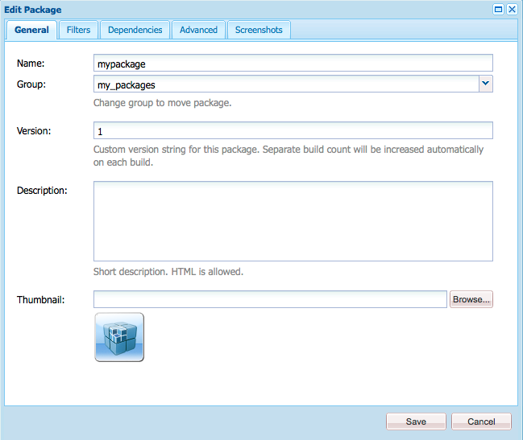

# el administrador de paquetes {#working-with-packages}

Los paquetes permiten importar y exportar el contenido del repositorio. Puede utilizar paquetes para instalar contenido nuevo, transferir contenido entre instancias y realizar una copia de seguridad del contenido del repositorio.

Con el Administrador de paquetes, puede transferir paquetes entre la instancia de AEM y el sistema de archivos local para fines de desarrollo.

## ¿Qué son los paquetes? {#what-are-packages}

Un paquete es un archivo zip que contiene contenido del repositorio en forma de serialización del sistema de archivos, llamado serialización de bóvedas, que proporciona una representación fácil de usar y de editar de archivos y carpetas. El contenido incluido en el paquete se define mediante filtros.

Un paquete también contiene información meta de vault, incluidas las definiciones de filtro y la información de configuración de importación. En el paquete se pueden incluir propiedades de contenido adicionales, que no se utilizan para la extracción de paquetes, como una descripción, una imagen visual o un icono. Estas propiedades de contenido adicionales son para el consumidor de paquetes de contenido y solo para fines informativos.

>[!NOTE]
>
>Los paquetes representan la versión actual del contenido en el momento en que se crea el paquete. No incluyen ninguna versión anterior del contenido que AEM en el repositorio.

## Paquetes en AEM as a Cloud Service {#aemaacs-packages}

Los paquetes de contenido creados para AEM aplicaciones as a Cloud Service deben tener una clara separación entre contenido inmutable y mutable. Por lo tanto, el Administrador de paquetes solo puede utilizarse para administrar paquetes que contengan contenido. Cualquier código debe implementarse mediante Cloud Manager.

>[!NOTE]
>
>Los paquetes solo pueden contener contenido. Cualquier funcionalidad (por ejemplo, contenido almacenado en `/apps`) debe [se implementa mediante la canalización de CI/CD en Cloud Manager.](/help/implementing/cloud-manager/deploy-code.md)

>[!IMPORTANT]
>
>La interfaz de usuario del Administrador de paquetes puede devolver un valor **undefined** mensaje de error si un paquete tarda más de 10 minutos en instalarse.
>
>Esto no se debe a un error en la instalación, sino a un tiempo de espera que el Cloud Service tiene para todas las solicitudes.
>
>No vuelva a intentar realizar la instalación si aparece un error de este tipo. La instalación continúa correctamente en segundo plano. Si reinicia la instalación, varios procesos de importación simultáneos podrían introducir algunos conflictos.

Para obtener más información sobre cómo administrar paquetes para AEMaaCS, consulte el documento [Implementación en AEM as a Cloud Service](/help/implementing/deploying/overview.md) en la guía de usuario sobre implementación.

## el administrador de paquetes {#package-manager}

El Administrador de paquetes administra los paquetes de la instalación de AEM. Después de [se han asignado los permisos necesarios](#permissions-needed-for-using-the-package-manager) puede utilizar el Administrador de paquetes para diversas acciones, como configurar, crear, descargar e instalar sus paquetes.

### Permisos necesarios {#required-permissions}

Para crear, modificar, cargar e instalar paquetes, los usuarios deben tener los permisos adecuados en los siguientes nodos:

* Derechos completos excluyendo la eliminación en `/etc/packages`
* El nodo que contiene el contenido del paquete

>[!CAUTION]
>
>La concesión de permisos para paquetes puede llevar a la divulgación de información confidencial y a la pérdida de datos.
>
>Para limitar estos riesgos, se recomienda conceder permisos de grupo específicos solo sobre subárboles dedicados.

### Acceso al Administrador de paquetes {#accessing}

Puede acceder al Administrador de paquetes de tres formas:

1. Desde el menú principal de AEM -> **Herramientas** -> **Implementación** -> **Paquetes**
1. De [CRXDE Lite](crxde.md) uso de la barra del conmutador superior
1. Directamente accediendo `http://<host>:<port>/crx/packmgr/`

### Interfaz de usuario del administrador de paquetes {#ui}

El administrador de paquetes se divide en cuatro áreas funcionales principales:

* **Panel de navegación izquierdo** - Este panel le permite filtrar y ordenar la lista de paquetes.
* **Lista de paquetes** - Esta es la lista de paquetes de su instancia filtrados y ordenados por selecciones en el Panel de navegación izquierdo.
* **Registro de actividades** - Este panel se minimiza al principio y se amplía para detallar la actividad del Administrador de paquetes como cuando se crea o instala un paquete. Hay botones adicionales en la pestaña Registro de actividades para:
   * **Borrar registro**
   * **Mostrar / Ocultar**
* **Barra de herramientas** - La barra de herramientas contiene botones de actualización para el panel de navegación izquierdo y la lista de paquetes, así como botones para buscar, crear y cargar paquetes.


Al hacer clic en una opción del panel de navegación izquierdo, se filtra inmediatamente la lista de paquetes.

Al hacer clic en un nombre de paquete, se expande la entrada de la lista de paquetes para mostrar más detalles sobre el paquete.


Existen varias acciones que se pueden realizar en un paquete a través de los botones de la barra de herramientas disponibles cuando se expande el detalle del paquete.

* [Editar](#edit-package)
* [Compilación](#building-a-package)
* [Reinstalar](#reinstalling-packages)
* [Descargar](#downloading-packages-to-your-file-system)

Hay más acciones disponibles debajo de la sección **Más** botón.

* [Eliminar](#deleting-packages)
* [Cobertura](#package-coverage)
* [Contenido](#viewing-package-contents-and-testing-installation)
* [Volver a empaquetar](#rewrapping-a-package)
* [Otras versiones](#other-versions)
* [Desinstalar](#uninstalling-packages)
* [Probar instalación](#viewing-package-contents-and-testing-installation)
* [Validar](#validating-packages)
* [Replicar](#replicating-packages)

### Estado del paquete {#package-status}

Cada entrada de la lista de paquetes tiene un indicador de estado para informarle de un vistazo del estado del paquete. Al pasar el ratón por encima del estado, se muestra la información sobre herramientas con los detalles del estado.


Si el paquete se ha cambiado o nunca se ha creado, el estado se presenta como un vínculo para realizar acciones rápidas para reconstruir o instalar el paquete.

## Configuración de paquetes {#package-settings}

Un paquete es esencialmente un conjunto de filtros y los datos del repositorio basados en esos filtros. Con la interfaz de usuario del Administrador de paquetes, puede hacer clic en un paquete y luego en la **Editar** para ver los detalles de un paquete, incluida la siguiente configuración.

* [Configuración general](#general-settings)
* [Filtros del paquete](#package-filters)
* [Dependencias del paquete](#package-dependencies)
* [Configuración avanzada](#advanced-settings)
* [Capturas de pantalla del paquete](#package-screenshots)

### Configuración general {#general-settings}

Puede editar una variedad de configuraciones de paquetes para definir información como la descripción del paquete, las dependencias y los detalles del proveedor.

La variable **Configuración de paquetes** El cuadro de diálogo está disponible a través de la **Editar** botón cuando [creación](#creating-a-new-package) o [editar](#viewing-and-editing-package-information) un paquete. Después de realizar los cambios, haga clic en **Guardar**.



| Campo | Descripción |
|---|---|
| Nombre | El nombre del paquete |
| Agrupar | Para organizar paquetes, puede escribir el nombre de un grupo nuevo o seleccionar un grupo existente |
| Versión | Texto que se utilizará para la versión |
| Descripción | Una breve descripción del paquete que permite el marcado del HTML para el formato |
| Miniatura    | El icono que aparece con la lista de paquetes |

### Filtros del paquete {#package-filters}

Los filtros identifican los nodos del repositorio que se incluyen en el paquete. A **Definición del filtro** especifica la siguiente información:

* La variable **Ruta raíz** del contenido que se va a incluir
* **Reglas** que incluyen o excluyen nodos específicos debajo de la ruta raíz

Agregar reglas usando la variable **+** botón. Elimine las reglas utilizando la variable **-** botón.

Las reglas se aplican según su orden, de modo que se posicionan según sea necesario mediante la variable **Up** y **Down** botones de flecha.

Los filtros pueden incluir cero o más reglas. Cuando no se definen reglas, el paquete contiene todo el contenido debajo de la ruta raíz.

Puede definir una o más definiciones de filtro para un paquete. Utilice más de un filtro para incluir contenido de varias rutas raíz.


Al crear filtros, puede definir una ruta o utilizar una expresión regular para especificar todos los nodos que desea incluir o excluir.

| Tipo de regla | Descripción |
|---|---|
| include | Si se incluye un directorio, se incluirá ese directorio y todos los archivos y carpetas de ese directorio (es decir, todo el subárbol) pero **will not** incluir otros archivos o carpetas de en la ruta raíz especificada. |
| excluir | Excluir un directorio excluirá ese directorio y todos los archivos y carpetas de ese directorio (es decir, todo el subárbol). |

Los filtros de paquetes se definen con mayor frecuencia al principio [cree el paquete.](#creating-a-new-package) Sin embargo, también se pueden editar más adelante, tras lo cual el paquete debe reconstruirse para actualizar su contenido en función de las nuevas definiciones de filtro.

>[!TIP]
>
>Un paquete puede contener varias definiciones de filtro para que los nodos de diferentes ubicaciones se puedan combinar fácilmente en un paquete.

### Dependencias {#dependencies}


| Campo | Descripción | Ejemplo/Detalles |
|---|---|---|
| Probado con | El nombre y la versión del producto a los que se dirige este paquete o con los que es compatible. | `AEMaaCS` |
| Problemas solucionados | Un campo de texto que permite enumerar los detalles de errores corregidos con este paquete, un error por línea | - |
| Depende de | Enumera otros paquetes necesarios para que el paquete actual se ejecute como se espera cuando se instala | `groupId:name:version` |
| Reemplaza | Una lista de paquetes obsoletos que este paquete reemplaza | `groupId:name:version` |

### Configuración avanzada {#advanced-settings}


| Campo | Descripción | Ejemplo/Detalles |
|---|---|---|
| Nombre | El nombre del proveedor del paquete | `WKND Media Group` |
| URL | URL del proveedor | `https://wknd.site` |
| Vincular | Enlace específico del paquete a una página de proveedor | `https://wknd.site/package/` |
| Requiere | Define si hay restricciones al instalar el paquete | **Administrador** - El paquete solo debe instalarse con privilegios de administrador <br>**Restart** - AEM debe reiniciarse después de instalar el paquete |
| Administración de AC | Especifica cómo se gestiona la información de control de acceso definida en el paquete cuando se importa | **Ignorar** - Preservar ACL en el repositorio <br>**Sobrescribir** - Sobrescribir ACL en el repositorio <br>**Combinar** - Combinar ambos conjuntos de ACL <br>**PreservarCombinar** - Combine el control de acceso en el contenido con el que se proporciona con el paquete añadiendo las entradas de control de acceso de los principales que no están presentes en el contenido <br>**Borrar** - Borrar ACL |

### Capturas de pantalla del paquete {#package-screenshots}

Puede adjuntar varias capturas de pantalla al paquete para proporcionar una representación visual del aspecto del contenido.


## Acciones de paquete {#package-actions}

Hay muchas acciones que se pueden realizar en un paquete.

### Creación de un paquete {#creating-a-new-package}

1. [Acceda al Administrador de paquetes.](#accessing)

1. Haga clic en **Crear paquete**.

   >[!TIP]
   >
   >Si la instancia tiene muchos paquetes, puede haber una estructura de carpetas en su lugar. En estos casos, es más fácil navegar a la carpeta de destino necesaria antes de crear el nuevo paquete.

1. En el **Nuevo paquete** , introduzca los campos siguientes:

   

   * **Nombre del paquete** - Seleccione un nombre descriptivo para ayudarle (y a otros) a identificar fácilmente el contenido del paquete.

   * **Versión** - Este es un campo de texto para que usted indique una versión. Se adjunta al nombre del paquete para formar el nombre del archivo zip.

   * **Grupo** - Este es el nombre del grupo de destino (o carpeta). Los grupos le ayudan a organizar sus paquetes. Se crea una carpeta para el grupo si aún no existe. Si deja el nombre del grupo en blanco, se creará el paquete en la lista del paquete principal.

1. Haga clic en **OK** para crear el paquete.

1. AEM enumera el nuevo paquete en la parte superior de la lista de paquetes.

   

1. Haga clic en **Editar** para definir la variable [contenido del paquete.](#package-contents) Haga clic en **Guardar** una vez que haya terminado de editar la configuración.

1. Ahora puede [Generar](#building-a-package) su paquete.

No es obligatorio construir inmediatamente el paquete después de crearlo. Un paquete sin compilar no contiene contenido y solo consta de los datos de filtro y otros metadatos del paquete.

### Creación de un paquete {#building-a-package}

Un paquete se crea a menudo al mismo tiempo que usted [crear el paquete](#creating-a-new-package), pero puede volver en un punto posterior para crear o reconstruir el paquete. Esto puede resultar útil si el contenido del repositorio ha cambiado o los filtros de paquete han cambiado.

1. [Acceda al Administrador de paquetes.](#accessing)

1. Abra los detalles del paquete en la lista de paquetes haciendo clic en el nombre del paquete.

1. Haga clic en **Generar**. Un cuadro de diálogo solicita confirmación de que desea crear el paquete, ya que se sobrescribirá cualquier contenido existente del paquete.

1. Haga clic en **Aceptar**. AEM crea el paquete, enumera todo el contenido agregado al paquete tal como lo hace en la lista de actividades. Cuando se completa AEM muestra una confirmación de que el paquete se creó y (cuando cierra el cuadro de diálogo) actualiza la información de la lista de paquetes.

### Edición de un paquete {#edit-package}

Una vez cargado un paquete en AEM, puede modificar su configuración.

1. [Acceda al Administrador de paquetes.](#accessing)

1. Abra los detalles del paquete en la lista de paquetes haciendo clic en el nombre del paquete.

1. Haga clic en **Editar** y actualice la variable **[Configuración de paquetes](#package-settings)** según sea necesario.

1. Haga clic en **Guardar** para guardar.

Es posible que necesite [reconstruir el paquete](#building-a-package) para actualizar su contenido en función de los cambios realizados.

### Ajustar un paquete {#rewrapping-a-package}

Una vez creado un paquete, se puede volver a ajustar. Al volver a ajustar se cambia la información del paquete sin tener que cambiar la miniatura, la descripción, etc., sin cambiar el contenido del paquete.

1. [Acceda al Administrador de paquetes.](#accessing)

1. Abra los detalles del paquete en la lista de paquetes haciendo clic en el nombre del paquete.

1. Haga clic en **Editar** y actualice la variable **[Configuración de paquetes](#package-settings)** según sea necesario.

1. Haga clic en **Guardar** para guardar.

1. Haga clic en **Más** -> **Ajustar** y un cuadro de diálogo solicitará confirmación.

### Visualización de otras versiones de paquetes {#other-versions}

Dado que cada versión de un paquete aparece en la lista como cualquier otro paquete, el Administrador de paquetes puede encontrar otras versiones de un paquete seleccionado.

1. [Acceda al Administrador de paquetes.](#accessing)

1. Abra los detalles del paquete en la lista de paquetes haciendo clic en el nombre del paquete.

1. Haga clic en **Más** -> **Otras versiones** y se abre un cuadro de diálogo con una lista de otras versiones del mismo paquete con información de estado.

### Visualización del contenido del paquete y prueba de la instalación {#viewing-package-contents-and-testing-installation}

Una vez creado un paquete, puede ver el contenido.

1. [Acceda al Administrador de paquetes.](#accessing)

1. Abra los detalles del paquete en la lista de paquetes haciendo clic en el nombre del paquete.

1. Para ver el contenido, haga clic en **Más** -> **Contenido**, y el Administrador de paquetes enumera todo el contenido del paquete en el registro de actividades.

   

1. Para realizar una ejecución en seco de la instalación, haga clic en **Más** -> **Probar instalación** y el Administrador de paquetes en el registro de actividad registran los resultados como si se hubiera realizado la instalación.

   

### Descarga de paquetes en el sistema de archivos {#downloading-packages-to-your-file-system}

1. [Acceda al Administrador de paquetes.](#accessing)

1. Abra los detalles del paquete en la lista de paquetes haciendo clic en el nombre del paquete.

1. Haga clic en el **Descargar** o el nombre de archivo vinculado del paquete en el área de detalles del paquete.

1. AEM descarga el paquete en su equipo.

### Carga de paquetes desde el sistema de archivos {#uploading-packages-from-your-file-system}

1. [Acceda al Administrador de paquetes.](#accessing)

1. Seleccione la carpeta del grupo en la que desea que se cargue el paquete.

1. Haga clic en el **Cargar paquete** botón.

1. Proporcione la información necesaria sobre el paquete cargado.

   

   * **Paquete** - Utilice la variable **Examinar...** para seleccionar el paquete requerido del sistema de archivos local.
   * **Forzar carga** - Si ya existe un paquete con este nombre, esta opción fuerza la carga y sobrescribe el paquete existente.

1. Haga clic en **OK** y el paquete seleccionado se carga y la lista de paquetes se actualiza en consecuencia.

El contenido del paquete ahora existe en AEM, pero para que el contenido esté disponible para su uso, asegúrese de [instalar el paquete](#installing-packages).

### Validación de paquetes {#validating-packages}

Dado que los paquetes pueden modificar el contenido existente, suele ser útil validar estos cambios antes de realizar la instalación.

#### Opciones de validación {#validation-options}

El Administrador de paquetes puede realizar las siguientes validaciones:

* [Importaciones de paquetes OSGi](#osgi-package-imports)
* [Superposiciones](#overlays)
* [ACL](#acls)

##### Validar importaciones de paquetes OSGi {#osgi-package-imports}

>[!NOTE]
>
>Debido a que los paquetes no se pueden usar para implementar código en AEMaaCS, **Importaciones de paquetes OSGi** la validación no es necesaria.

**Qué se ha marcado**

Esta validación inspecciona el paquete para todos los archivos JAR (paquetes OSGi), extrae sus `manifest.xml` (que contiene las dependencias versionadas en las que se basa dicho paquete OSGi), y verifica las AEM de exportación de instancias de dichas dependencias con las versiones correctas.

**Cómo se informa**

Las dependencias con versiones que la instancia de AEM no pueda satisfacer se enumeran en el registro de actividades del Administrador de paquetes.

**Estados de error**

Si las dependencias no están satisfechas, los paquetes OSGi del paquete con esas dependencias no se iniciarán. Esto da como resultado una implementación de aplicación rota, ya que todo lo que dependa del paquete OSGi no iniciado a su vez no funcionará correctamente.

**Resolución de errores**

Para resolver errores debido a paquetes OSGi insatisfechos, se debe ajustar la versión de dependencia del paquete con importaciones insatisfechas.

##### Validar capas {#overlays}

>[!NOTE]
>
>Debido a que los paquetes no se pueden usar para implementar código en AEMaaCS, **Superposiciones** la validación no es necesaria.

**Qué se ha marcado**

Esta validación determina si el paquete que se está instalando contiene un archivo que ya está superpuesto en la instancia de AEM de destino.

Por ejemplo, si se da una superposición existente en `/apps/sling/servlet/errorhandler/404.jsp`, un paquete que contenga `/libs/sling/servlet/errorhandler/404.jsp`, de modo que cambie el archivo existente en `/libs/sling/servlet/errorhandler/404.jsp`.

**Cómo se informa**

Estas superposiciones se describen en el registro de actividades del Administrador de paquetes.

**Estados de error**

Un estado de error significa que el paquete está intentando implementar un archivo que ya está superpuesto, por lo que los cambios en el paquete serán anulados (y por lo tanto &quot;ocultos&quot;) por la superposición y no tendrán efecto.

**Resolución de errores**

Para resolver este problema, el mantenedor del archivo de superposición en `/apps` debe revisar los cambios en el archivo superpuesto en `/libs` e incorpore los cambios según sea necesario en la superposición ( `/apps`) y vuelva a implementar el archivo superpuesto.

>[!NOTE]
>
>El mecanismo de validación no tiene forma de cuadrarse si el contenido superpuesto se ha incorporado correctamente en el archivo de superposición. Por lo tanto, esta validación seguirá informando sobre los conflictos incluso después de realizar los cambios necesarios.

##### Validar ACL {#acls}

**Qué se ha marcado**

Esta validación comprueba qué permisos se están agregando, cómo se gestionarán (combinar/reemplazar) y si los permisos actuales se verán afectados.

**Cómo se informa**

Los permisos se describen en el registro de actividades del Administrador de paquetes.

**Estados de error**

No se pueden proporcionar errores explícitos. La validación simplemente indica si se agregarán o afectarán nuevos permisos ACL al instalar el paquete.

**Resolución de errores**

Utilizando la información proporcionada por la validación, los nodos afectados pueden revisarse en CRXDE y las ACL pueden estar ajustándose en el paquete según sea necesario.

>[!CAUTION]
>
>Se recomienda que los paquetes no afecten a las ACL proporcionadas por AEM, ya que esto puede provocar un comportamiento inesperado.

#### Realización de la validación {#performing-validation}

La validación de los paquetes puede realizarse de dos maneras diferentes:

* [A través de la interfaz de usuario del Administrador de paquetes](#via-package-manager)
* [A través de una solicitud de POST HTTP como con cURL](#via-post-request)

La validación debe producirse siempre después de cargar el paquete, pero antes de instalarlo.

##### Validación De Paquetes Mediante El Administrador De Paquetes {#via-package-manager}

1. [Acceda al Administrador de paquetes.](#accessing)

1. Abra los detalles del paquete en la lista de paquetes haciendo clic en el nombre del paquete.

1. Para validar el paquete, haga clic en **Más** -> **Validar**,

1. En el cuadro de diálogo modal que aparece a continuación, utilice las casillas de verificación para seleccionar los tipos de validación y comenzar la validación haciendo clic en **Validar**.

1. A continuación, se ejecutan las validaciones seleccionadas y los resultados se muestran en el registro de actividades del Administrador de paquetes.

##### Validación de paquetes mediante solicitud de POST HTTP {#via-post-request}

La solicitud del POST adopta el siguiente formulario.

```
https://<host>:<port>/crx/packmgr/service.jsp?cmd=validate&type=osgiPackageImports,overlays,acls
```

La variable `type` puede ser cualquier lista desordenada separada por comas que consista en:

* `osgiPackageImports`
* `overlays`
* `acls`

El valor de `type` toma como valor predeterminado `osgiPackageImports` si no se pasa explícitamente.

Cuando utilice cURL, ejecute una instrucción similar a la siguiente:

```shell
curl -v -X POST --user admin:admin -F file=@/Users/SomeGuy/Desktop/core.wcm.components.all-1.1.0.zip 'http://localhost:4502/crx/packmgr/service.jsp?cmd=validate&type=osgiPackageImports,overlays,acls'
```

Al validar mediante una solicitud del POST, la respuesta se devuelve como un objeto JSON.

### Visualización de la cobertura del paquete {#package-coverage}

Los paquetes se definen mediante sus filtros. Puede hacer que el Administrador de paquetes aplique filtros de un paquete al contenido existente del repositorio para mostrar qué contenido del repositorio está cubierto por la definición de filtro del paquete.

1. [Acceda al Administrador de paquetes.](#accessing)

1. Abra los detalles del paquete en la lista de paquetes haciendo clic en el nombre del paquete.

1. Haga clic en **Más** -> **Cobertura**.

1. Los detalles de cobertura se enumeran en el registro de actividades.

### Instalación de paquetes {#installing-packages}

Al cargar un paquete solo se añade el contenido del paquete al repositorio, pero no se puede acceder a él. Debe instalar el paquete cargado para utilizar el contenido del paquete.

>[!CAUTION]
>
>La instalación de un paquete puede sobrescribir o eliminar el contenido existente. Solo cargue un paquete si está seguro de que no elimina ni sobrescribe el contenido que necesita.

Antes de la instalación del paquete, el Administrador de paquetes crea automáticamente un paquete de instantánea que contiene el contenido que se sobrescribirá. Esta instantánea se reinstalará si desinstala el paquete.

1. [Acceda al Administrador de paquetes.](#accessing)

1. Abra los detalles del paquete que desea instalar de la lista de paquetes haciendo clic en el nombre del paquete.

1. Haga clic en el botón **Instalar** en los detalles del elemento o en la **Instalar** en el estado del paquete.

1. Un cuadro de diálogo solicitará confirmación y permitirá especificar opciones adicionales.

   * **Extraer solo** - Extraiga solo el paquete para que no se cree ninguna instantánea y, por lo tanto, la desinstalación no sea posible
   * **Guardar umbral** - Número de nodos transitorios hasta que se activa el guardado automático (aumente si se producen excepciones de modificación concurrentes)
   * **Extraer subpaquetes** - Habilitar la extracción automática de subpaquetes
   * **Gestión del control de acceso** - Especifica cómo se gestiona la información de control de acceso definida en el paquete cuando se instala (las opciones son las mismas que la [configuración avanzada de paquetes](#advanced-settings))
   * **Administración de dependencias** - Especificar cómo se gestionan las dependencias durante la instalación

1. Haga clic en **Instalar**.

1. El registro de actividades detalla el progreso de la instalación.

Una vez finalizada y correcta la instalación, se actualiza la lista de paquetes y se añade la palabra **Installed** aparece en el estado del paquete.

### Reinstalación de paquetes {#reinstalling-packages}

La reinstalación de paquetes realiza los mismos pasos en un paquete ya instalado que se procesan al [instalar inicialmente el paquete.](#installing-packages)

### Carga e instalación basadas en el sistema de archivos {#file-system-based-upload-and-installation}

Puede renunciar al administrador de paquetes al instalar paquetes. AEM detectar paquetes colocados en una ubicación específica en el sistema de archivos local del equipo host y cargarlos e instalarlos automáticamente.

1. En la carpeta de instalación de AEM, hay un `crx-quicksart` carpeta junto al jar y `license.properties` archivo. Crear una carpeta con el nombre `install` under `crx-quickstart` resultando en la ruta `<aem-home>/crx-quickstart/install`.

1. En esta carpeta, agregue sus paquetes. Se cargarán automáticamente y se instalarán en su instancia.

1. Una vez completada la carga y la instalación, puede ver los paquetes en el Administrador de paquetes como si hubiera utilizado la interfaz de usuario del Administrador de paquetes para instalarlos.

Si la instancia se está ejecutando, la carga y la instalación comienzan inmediatamente cuando se agrega al paquete al `install` carpeta

Si la instancia no se está ejecutando, los paquetes colocados en la variable `install` se instalan al inicio en orden alfabético.

### Desinstalación de paquetes {#uninstalling-packages}

La desinstalación del paquete revierte el contenido del repositorio a la instantánea realizada automáticamente por el Administrador de paquetes antes de la instalación.

1. [Acceda al Administrador de paquetes.](#accessing)

1. Abra los detalles del paquete que desea desinstalar de la lista de paquetes haciendo clic en el nombre del paquete.

1. Haga clic en **Más** -> **Desinstalar**, para eliminar el contenido de este paquete del repositorio.

1. Un cuadro de diálogo solicitará confirmación y enumerará todos los cambios que se realicen.

1. El paquete se elimina y se aplica la instantánea. El progreso del proceso se muestra en el registro de actividades.

### Eliminación de paquetes {#deleting-packages}

Al eliminar un paquete, solo se eliminan sus detalles del Administrador de paquetes. Si este paquete ya estaba instalado, el contenido instalado no se eliminará.

1. [Acceda al Administrador de paquetes.](#accessing)

1. Abra los detalles del paquete que desea eliminar de la lista de paquetes haciendo clic en el nombre del paquete.

1. AEM solicita confirmación de que desea eliminar el paquete. Haga clic en **OK** para confirmar la eliminación.

1. La información del paquete se elimina y los detalles se incluyen en el registro de actividades.

### Duplicación de paquetes {#replicating-packages}

Repita el contenido de un paquete para instalarlo en la instancia de publicación.

1. [Acceda al Administrador de paquetes.](#accessing)

1. Abra los detalles del paquete que desea duplicar de la lista de paquetes haciendo clic en el nombre del paquete.

1. Haga clic en **Más** -> **Replicar**.

1. El paquete se replica y los detalles se incluyen en el registro de actividades.

## Distribución de software {#software-distribution}

AEM paquetes se pueden usar para crear y compartir contenido en entornos AEMaaCS.

[Distribución de software](https://downloads.experiencecloud.adobe.com) proporciona paquetes AEM para su uso en el SDK de AEM de desarrollo local. AEM paquetes proporcionados en la distribución de software no deben instalarse en entornos de nube AEMaaCS a menos que el Soporte técnico de Adobe lo apruebe expresamente.

Para obtener más información, consulte la [Documentación de distribución de software](https://experienceleague.adobe.com/docs/experience-cloud/software-distribution/home.html).
