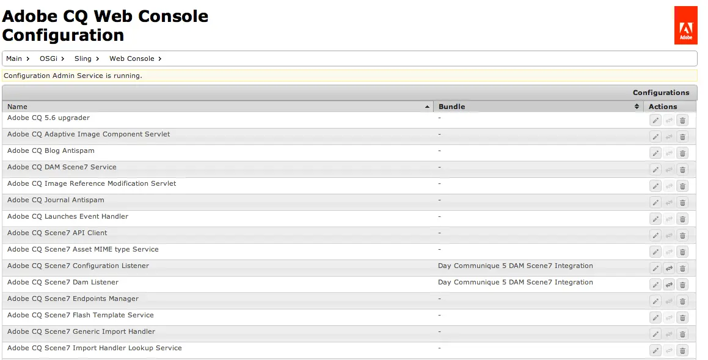

# Consola web {#web-console}

Aprenda a utilizar la consola web de Adobe Experience Manager (AEM) para administrar la configuración de OSGi y los paquetes para el desarrollo local.

## Información general {#overview}

AEM as a Cloud Service trata la configuración y el código [como inmutables en tiempo de ejecución.](/help/release-notes/aem-cloud-changes.md#apps-libs-immutable) Esto significa que todas las configuraciones deben implementarse como lo haría con el código en un entorno de producción. En las instancias de producción, esto garantiza que se pasen las puertas de calidad y ofrece un nivel de estabilidad y claridad del entorno actual.

Sin embargo, con fines de desarrollo, las actualizaciones de configuración de OSGi y los cambios de paquetes suelen ser necesarios para probar cambios de desarrollo específicos. Como parte de AEM as a Cloud Service SDK, la consola web lo permite. Consulte el documento [Configuración de OSGi para Adobe Experience Manager as a Cloud Service](/help/implementing/deploying/configuring-osgi.md) para obtener más información sobre las configuraciones de OSGi para AEM as a Cloud Service.

Se puede acceder a la consola desde `http://<host>:<port>/system/console`

La consola web ofrece una selección de pantallas para mantener los paquetes OSGi, que incluyen:

* [Configuración](#configuration): se usa para configurar los paquetes OSGi y, por lo tanto, es el mecanismo subyacente para configurar los parámetros del sistema de AEM
* [Paquetes](#bundles): utilizados para instalar paquetes
* [Componentes](#components): utilizados para controlar el estado de los componentes necesarios para AEM

Los cambios realizados se aplican inmediatamente al sistema de desarrollo en ejecución. No es necesario reiniciar.

En la consola web, cualquier descripción que mencione la configuración predeterminada está relacionada con los valores predeterminados de Sling. AEM tiene sus propios valores predeterminados y, por lo tanto, los valores predeterminados establecidos pueden diferir de los documentados en la consola.

La consola web de Adobe Experience Manager (AEM) se basa en [Apache Felix Web Management Console](https://felix.apache.org/documentation/subprojects/apache-felix-web-console.html). Apache Felix es un esfuerzo de la comunidad para implementar la plataforma de servicio OSGi R4, que incluye el marco OSGi y los servicios estándar.

>[!NOTE]
>
>La consola web solo está disponible en AEM as a Cloud Service SDK para fines de desarrollo local. No está disponible en producción.

>[!TIP]
>
>Para comprobar el estado de las configuraciones, los paquetes y los componentes de OSGi en un entorno de producción, use [Developer Console.](/help/implementing/developing/introduction/aem-developer-console.md)

## Configuración {#configuration}

La pantalla **Configuration** se usa para configurar paquetes OSGi y, por lo tanto, es el mecanismo subyacente para configurar parámetros del sistema de AEM. Se puede acceder a la ficha **Configuración** mediante:

* El menú desplegable: **OSGi -> Configuración**
* URL: `http://<host>:<port>/system/console/configMgr`

Se muestra una lista de configuraciones:

Hay dos tipos de configuraciones disponibles en las listas desplegables de esta pantalla:

* **Configuraciones** le permiten actualizar las configuraciones existentes. Tienen una identidad persistente (PID) y pueden ser las siguientes:
   * Estándar e integral para AEM: estos son necesarios; si se eliminan, los valores vuelven a la configuración predeterminada.
   * Instancias creadas a partir de configuraciones de fábrica: estas instancias las crea el usuario; la eliminación elimina la instancia.
* **Configuraciones de fábrica** le permiten crear una instancia del objeto de funcionalidad requerido. Se asigna a una identidad persistente y, a continuación, se enumera en la lista desplegable Configuraciones.

Al seleccionar cualquier entrada de la lista, se muestran los parámetros relacionados con esa configuración:

A continuación, puede actualizar los parámetros según sea necesario y:

* **Guardar** para guardar los cambios realizados.
   * Para una configuración de fábrica, esto crea una instancia con una identidad persistente.
   * La nueva instancia se muestra en Configuraciones.
* **Restablecer** para restablecer los parámetros mostrados en la pantalla a los guardados en último lugar.
* **Eliminar** para eliminar la configuración actual.
   * Si son estándar, los parámetros se devuelven a la configuración predeterminada.
   * Si se crea a partir de una configuración de fábrica, se elimina la instancia específica.
* **Desenlazar** para desenlazar la configuración actual del paquete.
* **Cancelar** para cancelar los cambios actuales.

>[!TIP]
>
>Consulte [Configuración de OSGi con la consola web](/help/implementing/deploying/configuring-osgi.md) para obtener más información.

## Paquetes {#bundles}

La pantalla **Paquetes** se usa para instalar los paquetes OSGi necesarios para AEM. Se accede a la pantalla mediante cualquiera de los métodos siguientes:

* El menú desplegable: **OSGi -> Grupos**
* URL: `http://<host>:<port>/system/console/bundles`

Se muestra una lista de paquetes:

Con esta pantalla puede:

* **Instalar o actualizar** para instalar un paquete nuevo o actualizar uno existente.
   * Puede **Examinar** para buscar el archivo que contiene su paquete y especificar si debe **Iniciar** inmediatamente y en qué **Nivel de inicio**.
* **Vuelva a cargar** para actualizar la lista mostrada.
* **Actualizar paquetes** para comprobar las referencias de todos los paquetes y actualizar, según sea necesario.
   * Por ejemplo, después de una actualización, es posible que tanto la versión antigua como la nueva se sigan ejecutando debido a referencias anteriores. Esta opción comprueba y mueve todas las referencias a la nueva versión, lo que permite detener la versión antigua.
* **Iniciar** para iniciar un paquete según el nivel de inicio especificado.
* **Detener** para detener el paquete.
* **Desinstalar** para desinstalar el paquete del sistema.

La lista especifica el estado del paquete. haciendo clic en el nombre de un paquete específico con mostrar más información.

>[!TIP]
>
>Después de **Actualizar**, Adobe recomienda hacer clic en **Actualizar paquetes**.

## Componentes {#components}

La pantalla **Componentes** le permite habilitar y deshabilitar componentes. Se puede acceder a ella mediante:

* El menú desplegable: **Principal -> Componentes**

* URL: `http://<host>:<port>/system/console/components`

Se muestra una lista de componentes. Hay varios iconos disponibles para permitirle habilitar, deshabilitar o (cuando corresponda) abrir los detalles de configuración de un componente específico.

Al hacer clic en el nombre de un componente en particular, se muestra más información sobre su estado. Aquí también puede habilitar, deshabilitar o volver a cargar el componente.

>[!NOTE]
>
>Activar o desactivar un componente solo se aplica hasta que se reinicia SDK.
>
>El estado de inicio se define dentro del descriptor del componente, que se genera durante el desarrollo y se almacena en el paquete en el momento de la creación del paquete.

## Generación de configuraciones de OSGi {#generating-osgi-configs}

La consola web se puede utilizar para configurar componentes OSGi y exportar configuraciones de OSGi como JSON. Esto resulta útil para configurar componentes OSGi proporcionados por AEM cuyas propiedades OSGi y sus formatos de valor puede que el desarrollador que define las configuraciones OSGi en el proyecto de AEM no entienda bien.

Consulte el documento [Configuración de OSGi para Adobe Experience Manager as a Cloud Service](/help/implementing/deploying/configuring-osgi.md#generating-osgi-configurations-using-the-web-console) para obtener más información.
