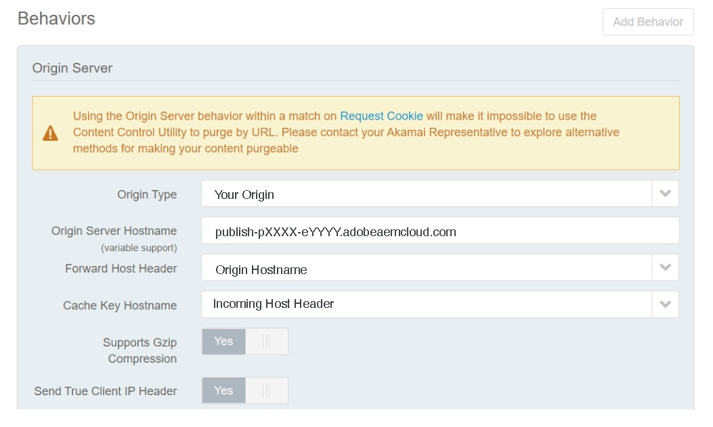

# CDN en AEM as a Cloud Service {#cdn}

>[!CONTEXTUALHELP]
>id="aemcloud_golive_cdn"
>title="CDN en AEM as a Cloud Service"
>abstract="AEM as a Cloud Service se envía con una CDN integrada. Su objetivo principal es reducir la latencia mediante la entrega de contenido procesable desde los nodos de CDN en el extremo, cerca del explorador. Está completamente administrado y configurado para un rendimiento óptimo de las aplicaciones AEM."

AEM as a Cloud Service viene con una CDN integrada, diseñada para reducir la latencia al ofrecer contenido almacenable en caché de nodos Edge cerca del explorador del usuario. Esta CDN completamente administrada está optimizada para el rendimiento de la aplicación de AEM.

La CDN administrada por AEM satisface las necesidades de rendimiento y seguridad de la mayoría de los clientes. Para el nivel de publicación, los clientes pueden elegir enrutar el tráfico a través de su propia CDN, que deben administrar. Esta opción está disponible caso por caso, especialmente cuando los clientes tienen integraciones heredadas existentes con un proveedor de CDN que son difíciles de reemplazar.

Los clientes que deseen publicar en el nivel de Edge Delivery Services pueden aprovechar la CDN administrada de Adobe. Consulte [CDN administrada por Adobe](#aem-managed-cdn). <!-- CQDOC-21758, 5b -->


<!-- ERROR: NEITHER URL IS FOUND (HTTP ERROR 404) Also, see the following videos [Cloud 5 AEM CDN Part 1](https://experienceleague.adobe.com/docs/experience-manager-learn/cloud-service/cloud-5/cloud5-aem-cdn-part1.html) and [Cloud 5 AEM CDN Part 2](https://experienceleague.adobe.com/docs/experience-manager-learn/cloud-service/cloud-5/cloud5-aem-cdn-part2.html) for additional information about CDN in AEM as a Cloud Service. -->

## CDN administrada por Adobe {#aem-managed-cdn}

<!-- CQDOC-21758, 5a -->

Para prepararse para la entrega de contenido mediante la CDN integrada de AEM a través de la interfaz de usuario de autoservicio de Cloud Manager, puede aprovechar las funciones de CDN administradas de Adobe. Esta funcionalidad le permite gestionar la administración de CDN de autoservicio, incluida la configuración e instalación de certificados SSL como certificados DV (validación de dominio) o EV/OV (validación extendida/de organización). Para obtener más información sobre estos métodos, consulte lo siguiente:

* [Edge Delivery Services en Cloud Manager](/help/implementing/cloud-manager/edge-delivery/introduction-to-edge-delivery-services.md)
* [Introducción a los nombres de dominio personalizados](/help/implementing/cloud-manager/custom-domain-names/introduction.md)
* [Introducción a los certificados SSL](/help/implementing/cloud-manager/managing-ssl-certifications/introduction-to-ssl-certificates.md)
* [Configuración de una CDN](/help/implementing/cloud-manager/domain-mappings/add-domain-mapping.md)

**Restricción de tráfico**

De forma predeterminada, en una configuración de CDN administrada por AEM, todo el tráfico público puede llegar al servicio de publicación, tanto para entornos de producción como de no producción (desarrollo y fase). Puede limitar el tráfico al servicio de publicación para un entorno determinado (por ejemplo, limitando el ensayo por un rango de direcciones IP) mediante la interfaz de usuario de Cloud Manager.

Consulte [administración de listas de IP permitidas](/help/implementing/cloud-manager/ip-allow-lists/introduction.md) para obtener más información.

>[!CAUTION]
>
>La CDN administrada de AEM solo atiende solicitudes de direcciones IP permitidas. Si dirige su propia CDN a la CDN administrada por AEM, asegúrese de que las IP de su CDN estén incluidas en la Lista de permitidos IP.

### Configuración del tráfico en la CDN {#cdn-configuring-cloud}

Puede configurar el tráfico en la CDN de varias formas, entre ellas:

* bloquear tráfico malintencionado con [Reglas de filtro de tráfico](/help/security/traffic-filter-rules-including-waf.md) (incluidas las reglas de WAF avanzadas con licencia opcional)
* modificando la naturaleza de [solicitud y respuesta](/help/implementing/dispatcher/cdn-configuring-traffic.md#request-transformations)
* aplicando [redirecciones del lado del cliente](/help/implementing/dispatcher/cdn-configuring-traffic.md#client-side-redirectors) 301/302
* declarando [selectores de origen](/help/implementing/dispatcher/cdn-configuring-traffic.md#client-side-redirectors) para revertir proxy a una solicitud a backends que no son de AEM

Utilice archivos YAML en Git para configurar estas funciones. Y use la [Canalización de configuración](/help/implementing/dispatcher/cdn-configuring-traffic.md) de Cloud Manager para implementarlos.

### Configurar páginas de error de CDN {#cdn-error-pages}

Puede configurar una página de error de CDN para reemplazar la página predeterminada sin marca. Esta página personalizada se muestra en el improbable caso de que AEM no esté disponible. Para obtener más información, consulte [Configuración de páginas de error de CDN](/help/implementing/dispatcher/cdn-error-pages.md).

### Purga del contenido en caché en la CDN {#purge-cdn}

La configuración de TTL con el encabezado de HTTP de control de caché es un enfoque eficaz para equilibrar el rendimiento de la entrega de contenido y la actualización del mismo. Sin embargo, en situaciones en las que es fundamental ofrecer contenido actualizado inmediatamente, puede resultar beneficioso depurar directamente la caché de CDN.

Obtenga información sobre [configurar un token de API de depuración](/help/implementing/dispatcher/cdn-credentials-authentication.md#purge-API-token) y [purgar contenido de CDN en caché](/help/implementing/dispatcher/cdn-cache-purge.md).

### Autenticación básica en CDN {#basic-auth}

Para casos de uso de autenticación ligera, incluidas las partes interesadas de la empresa que revisan el contenido, proteja el contenido mostrando un cuadro de diálogo de autenticación básico que requiera un nombre de usuario y una contraseña. [Más información](/help/implementing/dispatcher/cdn-credentials-authentication.md).

## La CDN administrada por el cliente apunta a una CDN administrada por AEM {#point-to-point-CDN}

>[!CONTEXTUALHELP]
>id="aemcloud_golive_byocdn"
>title="La CDN del cliente apunta a una CDN administrada de AEM"
>abstract="AEM as a Cloud Service ofrece una opción para que los clientes utilicen su CDN existente. Para el nivel de publicación, los clientes pueden apuntar opcionalmente a él desde su propia CDN, que deben administrar. Este escenario se permite caso por caso, en función del cumplimiento de ciertos requisitos previos que incluyen, entre otros, que el cliente tenga una integración heredada con su proveedor de CDN que sea difícil de abandonar."

Si un cliente debe utilizar su CDN existente (o cualquier tipo de proxy inverso, por ejemplo, un equilibrador de carga o un WAF), puede administrarlo y dirigirlo al CDN administrado por AEM, siempre que se cumpla lo siguiente:

* El cliente debe tener una CDN existente que sería oneroso reemplazar.
* El cliente debe administrarlo.
* El cliente debe poder configurar la CDN para que funcione con AEM as a Cloud Service; consulte las instrucciones de configuración que se presentan a continuación.
* El cliente debe tener expertos en CDN de ingeniería que estén de guardia en caso de que surjan problemas relacionados.
* El cliente debe realizar y aprobar correctamente una prueba de carga antes de ir a producción.

Instrucciones de configuración:

1. Dirija su CDN a la entrada de la CDN de Adobe como su dominio de origen. Por ejemplo, `publish-p<PROGRAM_ID>-e<ENV-ID>.adobeaemcloud.com`.
1. Configure SNI para la entrada de CDN de Adobe.
1. Configure el encabezado Host en el dominio de origen. Por ejemplo: `Host:publish-p<PROGRAM_ID>-e<ENV-ID>.adobeaemcloud.com`.
1. Establezca el encabezado `X-Forwarded-Host` con el nombre de dominio para que AEM pueda determinar el encabezado de host. Por ejemplo: `X-Forwarded-Host:example.com`.
1. Establezca `X-AEM-Edge-Key`. El valor debe configurarse mediante una canalización de configuración de Cloud Manager, como se describe en [este artículo](/help/implementing/dispatcher/cdn-credentials-authentication.md#CDN-HTTP-value).

   * Necesario para que la CDN de Adobe pueda validar el origen de las solicitudes y pasar los encabezados `X-Forwarded-*` a la aplicación de AEM. Por ejemplo, `X-Forwarded-For` se usa para determinar la dirección IP del cliente. Por lo tanto, es responsabilidad del llamador de confianza (es decir, de la CDN administrada por el cliente) garantizar la corrección de los encabezados de `X-Forwarded-*` (consulte la nota a continuación).
   * Opcionalmente, el acceso a la entrada de CDN de Adobe se puede bloquear cuando `X-AEM-Edge-Key` no está presente. Informe a Adobe si necesita acceso directo a la entrada de CDN de Adobe (que se debe bloquear).

Consulte la sección [Configuraciones de proveedor de CDN de muestra](#sample-configurations) para ver ejemplos de configuración de los principales proveedores de CDN.

Antes de aceptar tráfico en directo, debe validar con el servicio de atención al cliente de Adobe que el enrutamiento de tráfico de extremo a extremo funciona correctamente.

Después de establecer `X-AEM-Edge-Key`, puede probar que la solicitud se enruta correctamente de la siguiente manera.

En Linux®:

```
curl https://publish-p<PROGRAM_ID>-e<ENV-ID>.adobeaemcloud.com -H "X-Forwarded-Host: example.com" -H "X-AEM-Edge-Key: <PROVIDED_EDGE_KEY>"
```

En Windows:

```
curl https://publish-p<PROGRAM_ID>-e<ENV-ID>.adobeaemcloud.com --header "X-Forwarded-Host: example.com" --header "X-AEM-Edge-Key: <PROVIDED_EDGE_KEY>"
```

>[!NOTE]
>
>Al utilizar su propia CDN, no es necesario instalar dominios y certificados en Cloud Manager. El enrutamiento en la CDN de Adobe se realiza utilizando el dominio predeterminado `publish-p<PROGRAM_ID>-e<ENV-ID>.adobeaemcloud.com`, que debe enviarse en el encabezado de la solicitud `Host`. Si se sobrescribe el encabezado de solicitud `Host` con un nombre de dominio personalizado, es posible que la solicitud se enrute incorrectamente a través de la CDN de Adobe o que se produzcan errores 421.

>[!NOTE]
>
>Los clientes que administran su propia CDN deben garantizar la integridad de los encabezados que se envían a través de la CDN de AEM. Por ejemplo, se recomienda que los clientes borren todos los encabezados `X-Forwarded-*` y los establezcan en valores conocidos y controlados. Por ejemplo, `X-Forwarded-For` debe contener la dirección IP del cliente, mientras que `X-Forwarded-Host` debe contener el host del sitio.

>[!NOTE]
>
>Los entornos de programa de zona protegida no admiten una CDN proporcionada por el cliente.

El salto adicional entre la CDN del cliente y la CDN de AEM solo es necesario si se produce una pérdida de caché. Al utilizar las estrategias de optimización de caché descritas en este artículo, la adición de una CDN de cliente solo debe introducir una latencia insignificante.

Esta configuración de CDN del cliente es compatible con el nivel de publicación y el de previsualización, pero no delante del de creación.

### Depuración de configuración

Para depurar una configuración de BYOCDN, use el encabezado `x-aem-debug` con un valor de `edge=true`. Por ejemplo:

En Linux®:

```
curl https://publish-p<PROGRAM_ID>-e<ENV-ID>.adobeaemcloud.com -v -H "X-Forwarded-Host: example.com" -H "X-AEM-Edge-Key: <PROVIDED_EDGE_KEY>" -H "x-aem-debug: edge=true"
```

En Windows:

```
curl https://publish-p<PROGRAM_ID>-e<ENV-ID>.adobeaemcloud.com -v --header "X-Forwarded-Host: example.com" --header "X-AEM-Edge-Key: <PROVIDED_EDGE_KEY>" --header "x-aem-debug: edge=true"
```

Este proceso refleja ciertas propiedades utilizadas en la solicitud del encabezado de respuesta `x-aem-debug`. Por ejemplo:

```
x-aem-debug: byocdn=true,edge=true,edge-auth=edge-auth,edge-key=edgeKey1,X-AEM-Edge-Key=set,host=publish-p87058-e257304-cmstg.adobeaemcloud.com,x-forwarded-host=wknd.site,adobe_unlocked_byocdn=true
```

Este proceso permite verificar detalles como los valores de host, la configuración de autenticación perimetral y el valor del encabezado x-forwarded-host. También identifica si se establece una clave perimetral y qué clave se utiliza si existe una coincidencia.

>[!NOTE]
>
>Puede utilizar un entorno de desarrollo rápido (RDE) para implementar y probar la configuración:
>
>* [Entornos de desarrollo rápido](/help/implementing/developing/introduction/rapid-development-environments.md)
>* [Cómo usar el entorno de desarrollo rápido](https://experienceleague.adobe.com/en/docs/experience-manager-learn/cloud-service/developing/rde/how-to-use#deploy-configuration-yaml-files)

### Configuraciones de proveedor de CDN de muestra {#sample-configurations}

A continuación se presentan varios ejemplos de configuración de varios proveedores de CDN líderes.

**Akamai**




**Amazon CloudFront**


**Cloudflare**


### Errores comunes {#common-errors}

Las configuraciones de muestra proporcionadas muestran la configuración base necesaria. Sin embargo, una configuración de cliente puede tener otras reglas de impacto que quitan, editan o reorganizan los encabezados necesarios para que AEM as a Cloud Service sirva al tráfico. A continuación, se muestran errores comunes que se producen al configurar una CDN administrada por el cliente para que apunte a AEM as a Cloud Service.

**Redirección al extremo del servicio de publicación**

Cuando una solicitud recibe una respuesta 403 prohibida, significa que a la solicitud le faltan algunos encabezados obligatorios. Una causa común de esto es que la red de distribución de contenido (CDN) está administrando el tráfico de dominio Apex y `www`, pero no está agregando el encabezado correcto para el dominio `www`. Este problema se puede solucionar comprobando los registros de CDN de AEM as a Cloud Service y los encabezados de solicitud necesarios.

**Error 421 de redirección mal dirigida**

Un error 421 con el mensaje `Requested host does not match any Subject Alternative Names (SANs) on TLS certificate` indica que HTTP `Host` no coincide con ningún host enumerado en el certificado. Este problema suele indicar que `Host` o la configuración de SNI es incorrecta. Asegúrese de que tanto la configuración de `Host` como la de SNI apuntan al host publish-p&lt;PROGRAM_ID>-e.adobeaemcloud.com.

**Demasiadas redirecciones en bucle**

Cuando una página recibe un bucle de &quot;Demasiadas redirecciones&quot;, se añade algún encabezado de solicitud en la CDN que coincide con una redirección que la obliga a volver a sí misma. A modo de ejemplo:

* Se crea una regla de CDN para que coincida con el dominio Apex o con el dominio www y agrega el encabezado X-Forwarded-Host solo del dominio Apex.
* Una solicitud de dominio Apex coincide con esta regla de CDN, que agrega el dominio Apex como encabezado X-Forwarded-Host.
* Se envía una solicitud al origen donde una redirección coincide con el encabezado de host explícitamente para el dominio Apex (por ejemplo, ^example.com).
* Se activa una regla de reescritura que reescribe la solicitud del dominio Apex en https con el subdominio www.
* Esa redirección se envía entonces al perímetro del cliente, donde la regla de CDN se vuelve a activar y se vuelve a añadir el encabezado X-Forwarded-Host para el dominio Apex, no el subdominio www. A continuación, el proceso se inicia de nuevo hasta que falla la solicitud.

Para resolver este problema, evalúe la estrategia de redireccionamiento SSL, las reglas de CDN y las combinaciones de reglas de redireccionamiento y reescritura.

## Encabezados de geolocalización {#geo-headers}

La CDN administrada por AEM agrega encabezados a cada solicitud con:

* código de país: `x-aem-client-country`
* código de continente: `x-aem-client-continent`

>[!NOTE]
>
>Si hay una CDN administrada por el cliente, estas cabeceras reflejan la ubicación del servidor proxy CDN del cliente en lugar del cliente real. Los clientes deben administrar los encabezados de geolocalización a través de su propia CDN al utilizar una CDN administrada por el cliente.

Los valores de los códigos de país son los códigos Alpha-2 descritos en [ISO 3166-1](https://en.wikipedia.org/wiki/ISO_3166-1).

Los valores de los códigos de continente son:

* AF África
* UNA Antártida
* AS Asia
* UE Europa
* NA América del Norte
* OC Oceanía
* SA América del Sur

Esta información resulta útil para redirigir a una dirección URL diferente en función del país de origen de la solicitud. Utilice el encabezado Vary para almacenar en caché las respuestas que dependen de la información geográfica. Por ejemplo, las redirecciones a una página de aterrizaje de un país específico siempre deben contener `Vary: x-aem-client-country`. Si es necesario, puede usar `Cache-Control: private` para evitar el almacenamiento en caché. Consulte también [Almacenamiento en caché](/help/implementing/dispatcher/caching.md#html-text).
