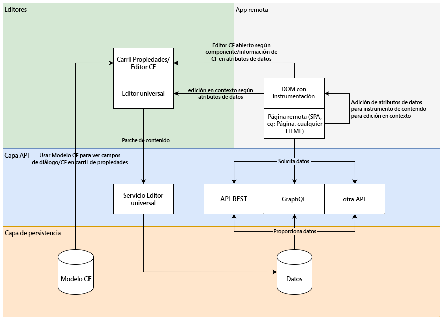
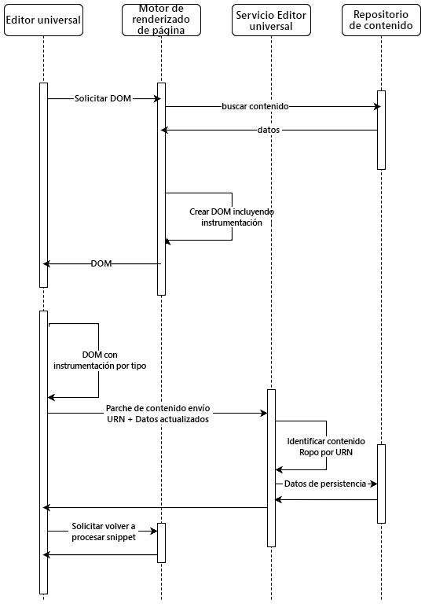
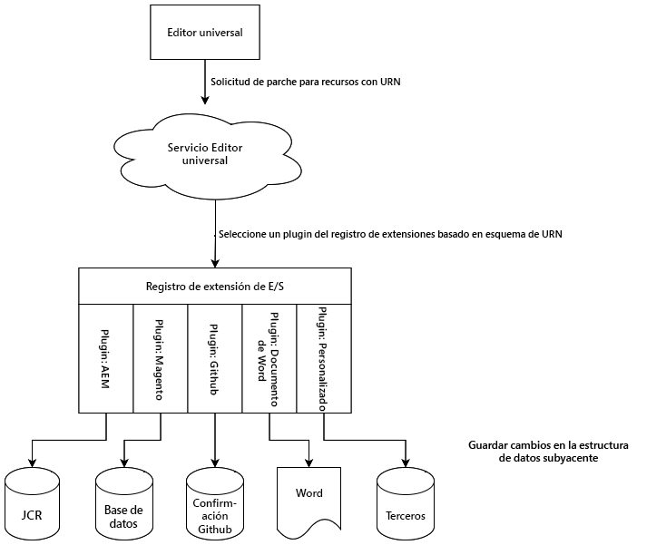
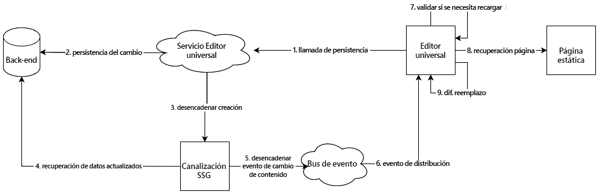
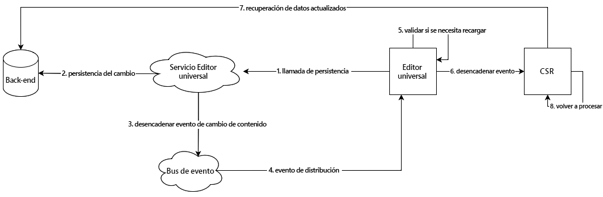

# Arquitectura del editor universal {#architecture}

Obtenga información sobre la arquitectura del editor universal y cómo fluyen los datos entre sus servicios y capas.

## Bloques de creación de arquitectura {#building-blocks}

El editor universal se compone de cuatro componentes básicos esenciales que interactúan para permitir que los autores de contenido editen cualquier aspecto de cualquier contenido en cualquier implementación, de modo que pueda ofrecer experiencias excepcionales, aumentar la velocidad del contenido y proporcionar una experiencia de desarrollador avanzada.

1. [Editores](#editors)
1. [Aplicación remota](#remote-app)
1. [Capa de la API](#api-layer)
1. [Capa de persistencia](#persistence-layer)

Este documento describe cada uno de estos bloques de creación básicos y cómo intercambian datos.

>[!TIP]
>
>Para ver el Editor universal y su arquitectura en acción, consulte [AEM Introducción al editor universal en el entorno de trabajo de la aplicación de](getting-started.md) AEM para obtener información sobre cómo acceder al editor universal y cómo empezar a instrumentar la primera aplicación de la que se utiliza la aplicación de la.

### Editores {#editors}

* **Editor universal**: el editor universal utiliza un DOM instrumentado para permitir la edición in situ del contenido. Consulte [Atributos y tipos](attributes-types.md) para obtener más información sobre los metadatos necesarios. Consulte el documento [Introducción al editor universal en AEM](getting-started.md) para ver un ejemplo de la instrumentación en AEM.
* **Carril de propiedades**: algunas propiedades de los componentes no se pueden editar en contexto, por ejemplo, el tiempo de rotación de un carrusel o qué pestaña del acordeón debe abrirse o cerrarse siempre. Para permitir la edición de dicha información de componentes, se proporciona un editor basado en formularios en el carril lateral.

### Aplicación remota {#remote-app}

Para que una aplicación se pueda editar en contexto dentro del editor universal, se debe instrumentar el DOM. La aplicación remota debe representar ciertos atributos en el DOM. Consulte [Atributos y tipos](attributes-types.md) para obtener más información sobre los metadatos necesarios. Consulte el documento [Introducción al editor universal en AEM](getting-started.md) para ver un ejemplo de la instrumentación en AEM.

El editor universal se esfuerza por conseguir un SDK mínimo, por lo que la instrumentación es responsabilidad de la implementación de la aplicación remota.

### Capa de la API {#api-layer}

* **Datos de contenido**: para el editor universal, no es importante ni los sistemas de origen de los datos de contenido ni la forma en que se consumen. Solo es importante definir y proporcionar los atributos necesarios utilizando datos editables en contexto.
* **Datos persistentes**: para cada dato editable hay un identificador URN. Este URN se utiliza para enrutar la persistencia al sistema y recurso correctos.

### Capa de persistencia {#persistence-layer}

* **Modelo de fragmento de contenido**: para admitir el carril para editar las propiedades del Fragmento de contenido, el editor de Fragmentos de contenido y los editores basados en formularios, se requieren modelos por componente y por fragmento de contenido.
* **Contenido**: se puede almacenar en cualquier parte, como en AEM, Magento, etc.

## Servicio de editor universal y envío del sistema back-end {#service}

El editor universal envía todos los cambios de contenido a un servicio centralizado denominado Servicio del editor universal. Este servicio, que se ejecuta en Adobe I/O Runtime, carga los complementos disponibles en el Registro de extensiones en función del URN proporcionado. El complemento es responsable de comunicarse con el back-end y devolver una respuesta unificada.

## Canalizaciones de renderización {#rendering-pipelines}

### Procesamiento del lado del servidor {#server-side}

### Generación estática del sitio {#static-generation}

### Renderización del lado del cliente {#client-side}

## Recursos adicionales {#additional-resources}

Para obtener más información acerca del editor universal, consulte estos documentos.

* [Introducción al editor universal](introduction.md) - Descubra cómo el editor universal permite editar cualquier aspecto de cualquier contenido en cualquier implementación para que pueda ofrecer experiencias excepcionales, aumentar la velocidad del contenido y proporcionar una experiencia de desarrollador avanzada.
* [Creación de contenido con el editor universal](authoring.md): aprenda lo fácil e intuitivo que es para los autores de contenido crearlo con el editor universal.
* [Publicación de contenido con el editor universal](publishing.md): descubra cómo el editor visual universal publica contenido y cómo sus aplicaciones pueden gestionar el publicado.
* [Introducción al editor universal en AEM](getting-started.md): obtenga información sobre cómo acceder y cómo instrumentar la primera aplicación de AEM para utilizar el editor universal.
* [Atributos y tipos](attributes-types.md): obtenga información acerca de los atributos y tipos de datos que requiere el editor universal.
* [Autenticación del editor universal](authentication.md): obtenga información sobre cómo se autentica el editor universal.
