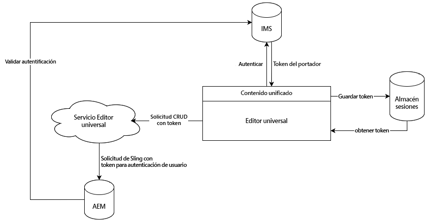

# Autenticación del editor universal {#authentication}

Obtenga información sobre cómo se autentica el editor universal.

## Opciones {#options}

El editor universal utiliza la autenticación del sistema Identity Management de Adobe (IMS), que se proporciona a través de Unified Shell.

Todas las aplicaciones o páginas remotas son responsables de la autenticación en los sistemas backend necesarios. El servicio del editor universal necesita esta autenticación en sistemas backend para realizar operaciones CRUD, ya que es un servicio independiente.

## Flujo estándar {#standard-flow}

Esta es la solución para AEM as a Cloud Service y AMS que utilizan IMS para utilizar el editor universal.

Para utilizar el editor universal, el usuario debe iniciar sesión en Unified Shell que se autentica con IMS. El token IMS proporcionado se almacena en el almacén de sesiones de los usuarios.

Cada vez que un usuario realiza una operación CRUD, se envía una llamada al servicio del editor universal con el token de portador de IMS en el encabezado HTTP. A continuación, el servicio del editor universal utiliza el token de portador para autenticar la solicitud en el sistema back-end de AEM para ejecutar operaciones en el nombre del usuario.

Este diagrama y este artículo describen la autenticación interna del editor universal propiamente dicho.

{{ue-headless-auth}}
