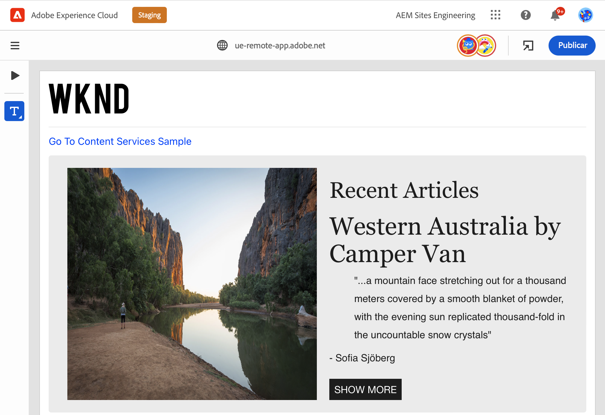
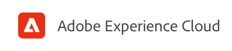
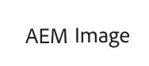
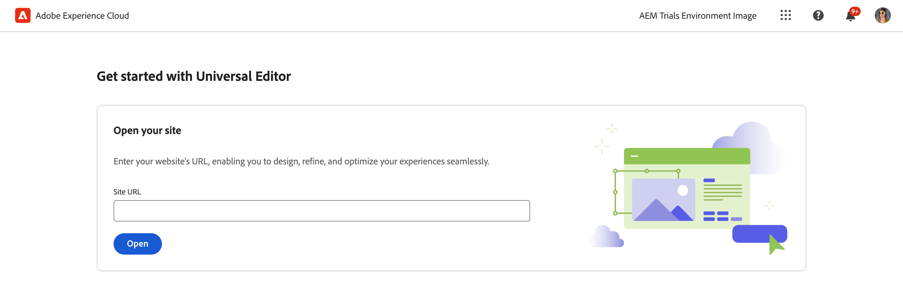
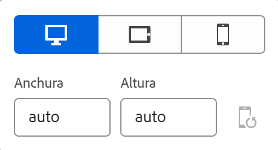
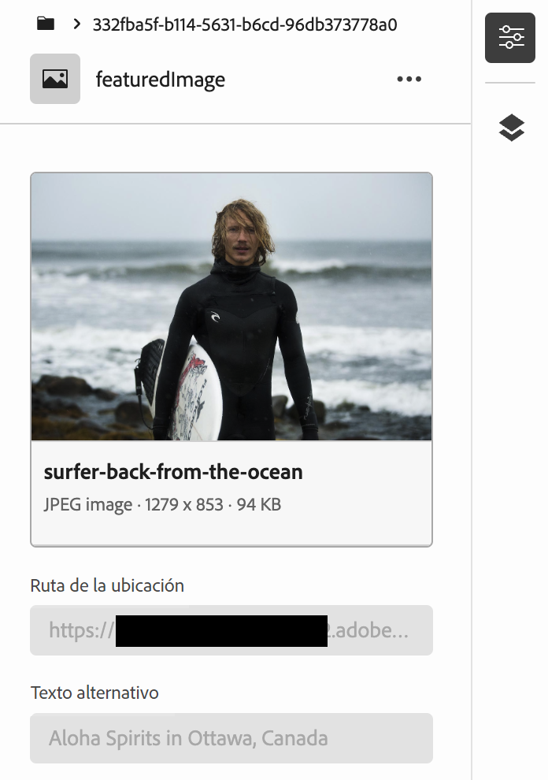
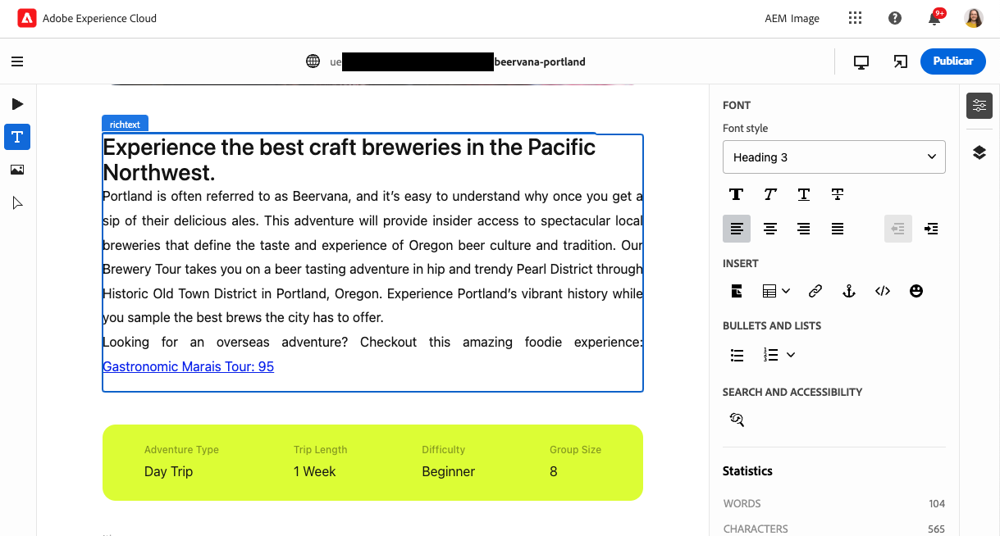
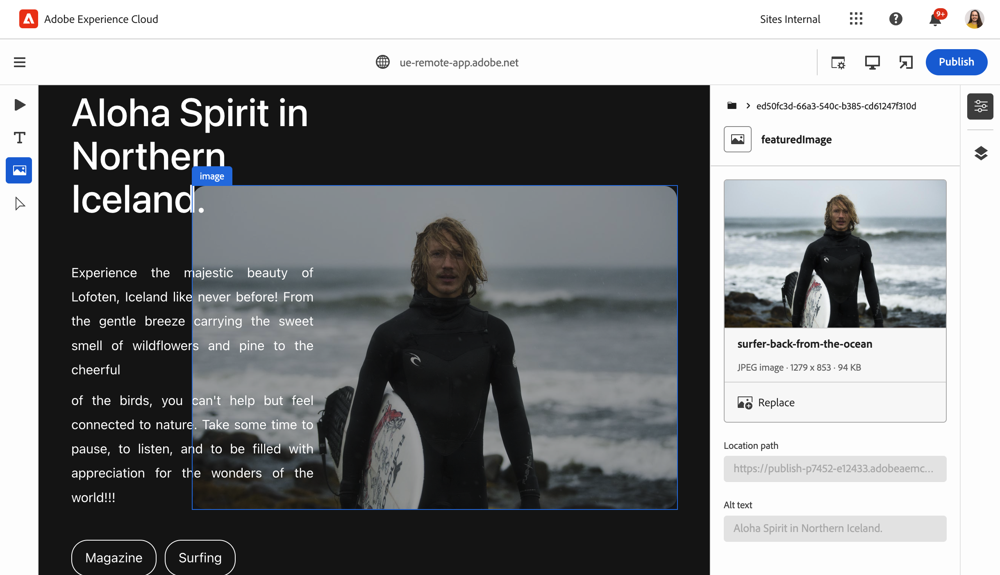
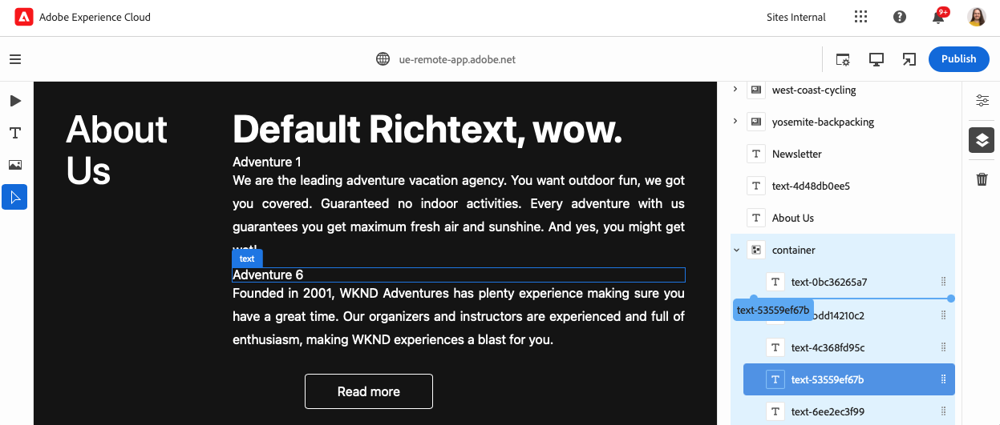

# Creación de contenido con el editor universal {#authoring}

Aprenda lo fácil e intuitivo que es para los autores crear contenido con el editor universal.

{{universal-editor-status}}

## Introducción {#introduction}

El editor universal permite editar cualquier aspecto de todo tipo de contenido en todas las implementaciones para que pueda ofrecer experiencias excepcionales, aumentar la velocidad del contenido y proporcionar una experiencia de última generación a los desarrolladores.

Para ello, se proporciona una IU intuitiva que requiere una formación mínima para comenzar a editar contenido. Este documento describe la experiencia de creación del editor universal.

>[!TIP]
>
>Para obtener una introducción más detallada al editor universal, consulte el documento [Introducción al editor universal.](introduction.md)

## Preparación de la aplicación {#prepare-app}

Para poder crear contenido para una aplicación con el editor universal, el desarrollador debe instrumentarla para que admita el editor.

>[!TIP]
>
>Consulte el documento [Introducción al editor universal en AEM](getting-started.md) para ver un ejemplo de cómo configurar una aplicación de AEM para que funcione con el editor universal.

## Inicio de sesión {#sign-in}

Una vez que la aplicación esté instrumentada para trabajar con el Editor universal, inicie sesión en el Editor universal. Necesita un Adobe ID para iniciar sesión y [tener acceso al Editor universal.](getting-started.md#request-access)

Una vez que haya iniciado sesión, introduzca la URL de la página que desea editar en la [barra de ubicación.](#location-bar) para que pueda empezar a editar contenido como [contenido de texto](#text-mode) o [contenido multimedia.](#media-mode)

## Comprensión de la IU {#ui}

La interfaz de usuario de se divide en estas áreas principales.

* [El encabezado de Experience Cloud](#experience-cloud-header)
* [Barra de herramientas del Editor universal](#universal-editor-toolbar)
* [El editor](#editor)
* [El carril de propiedades](#properties-rail)

### El encabezado de Experience Cloud {#experience-cloud-header}

El encabezado de Experience Cloud siempre está presente en la parte superior de la pantalla. Es un anclaje que le dice dónde se encuentra dentro de Experience Cloud y le ayuda a navegar a otras aplicaciones.

#### Experience Manager {#experience-manager}

Seleccione el vínculo de Adobe Experience Cloud a la izquierda del encabezado para ir a la raíz de la solución de Experience Manager y acceder a herramientas como [Cloud Manager,](/help/onboarding/cloud-manager-introduction.md) [Cloud Acceleration Manager](/help/journey-migration/cloud-acceleration-manager/introduction/overview-cam.md) y [Distribución de software.](https://experienceleague.adobe.com/docs/experience-cloud/software-distribution/home.html?lang=es)

#### Organización {#organization}

Muestra la organización en la que ha iniciado sesión. Seleccione esta opción para cambiar a otra organización si su Adobe ID está asociado a varias.

#### Soluciones {#solutions}

Al tocar o hacer clic en el conmutador de soluciones, puede ir rápidamente a otras soluciones de Experience Cloud.

#### Ayuda {#help}

El icono de ayuda proporciona acceso rápido a los recursos de aprendizaje y asistencia.

#### Notificaciones {#notifications}

Este icono se muestra con la cantidad de [notificaciones](/help/implementing/cloud-manager/notifications.md) incompletas asignadas actualmente.

#### Propiedades del usuario {#user-properties}

Seleccione el icono que representa a su usuario para acceder a la configuración. Si no tiene una imagen de usuario configurada, se le asigna un icono de forma aleatoria.

### Barra de herramientas del editor universal {#universal-editor-toolbar}

La barra de herramientas del Editor universal siempre está presente en la parte superior de la pantalla, justo debajo de [ el encabezado del Experience Cloud.](#experience-cloud-header) Le permite un acceso rápido a otra página para editarla y publicar la actual.

#### El botón Inicio {#home-button}

El botón Inicio le devuelve a la página de inicio del Editor universal

En la página de inicio puede introducir la dirección URL del sitio que desea editar con el editor universal.

>[!NOTE]
>
>Cualquier página que desee editar con el editor universal debe estar [instrumentada para admitir el editor universal.](getting-started.md)

#### Barra de ubicación {#location-bar}

La barra de ubicación muestra la dirección de la página que está editando. Seleccione para introducir la dirección de otra página que desea editar.

>[!TIP]
>
>Utilice la tecla de acceso directo `L` para abrir la barra de direcciones.

>[!NOTE]
>
>Cualquier página que desee editar con el editor universal debe estar [instrumentada para admitir el editor universal.](getting-started.md)

#### Configuración del encabezado de autenticación {#authentication-settings}

Seleccione el icono de configuración del encabezado de autenticación si necesita [establecer un encabezado de autenticación personalizado con fines de desarrollo local.](/help/implementing/universal-editor/developer-overview.md#auth-header)

#### Configuración del emulador {#emulator}

Seleccione el icono de emulación para definir cómo el editor universal procesa la página.

Al tocar o hacer clic en el icono de emulación, se muestran las opciones.

De forma predeterminada, el editor se abre en un diseño de escritorio en el que el explorador define automáticamente la altura y la anchura.

En el editor universal, también puede emular un dispositivo móvil, además de lo siguiente:

* Definir su orientación
* Definir la anchura y la altura
* Cambiar la orientación

#### Modo de vista previa {#preview-mode}

En el modo de vista previa, la página se procesa en el editor tal como se vería en el servicio publicado. Esto permite al autor del contenido navegar por el contenido haciendo clic en vínculos, etc.

>[!TIP]
>
>Utilice la tecla de acceso directo `P` para alternar desde y hacia el modo de vista previa.

#### Apertura de la vista previa de la aplicación {#open-app-preview}

Seleccione el icono de abrir vista previa de la aplicación para abrir la página que está editando en su propia pestaña del explorador, sin utilizar el editor, para previsualizar el contenido.

>[!TIP]
>
>Utilice la tecla de acceso directo `O` (la letra O) para abrir la vista previa de la aplicación.

#### Publicación {#publish}

Seleccione el botón Publicar para poder publicar los cambios en el contenido publicado para que los lectores lo consuman.

>[!TIP]
>
>Consulte el documento [Publicación de contenido con el editor universal](publishing.md) para obtener más información sobre cómo publicar con el editor universal.

### El Editor {#editor}

El editor ocupa la mayor parte de la ventana y es donde se procesa la página especificada en [la barra de ubicación](#location-bar).

Si el editor se encuentra en [modo de vista previa,](#preview-mode) el contenido se podrá navegar y podrá seguir los vínculos, pero no podrá editar el contenido.

### Carril de propiedades {#properties-rail}

El carril de propiedades siempre está presente a la derecha del editor. Según su modo, puede mostrar detalles de un componente seleccionado en el contenido o la jerarquía del contenido de la página.

#### Modo propiedades {#properties-mode}

En el modo propiedades, el carril muestra las propiedades del componente seleccionado actualmente en el editor. Este es el modo predeterminado del carril de propiedades cuando se carga una página.

Según el tipo de componente que seleccione, los detalles se pueden mostrar y modificar en el carril de propiedades.

No todos los componentes tienen detalles que se puedan mostrar o editar.

>[!TIP]
>
>Utilice la tecla de acceso directo `D` para cambiar al modo de propiedades.

#### Modo de árbol de contenido {#content-tree-mode}

En el modo de árbol de contenido, el carril muestra la jerarquía del contenido de la página.

Al seleccionar un elemento en el árbol de contenido, el editor se desplaza hasta ese contenido y lo selecciona.

>[!TIP]
>
>Utilice la tecla de acceso directo `F` para cambiar al modo de árbol de contenido.

##### Editar {#edit}

Al editar, las opciones del componente seleccionado aparecen en el carril de propiedades, donde puede editar el componente seleccionado. Si el componente seleccionado es un fragmento de contenido, también puede seleccionar el botón Editar.

Al tocar o hacer clic en el botón Editar, se abre [Editor de fragmentos de contenido](/help/assets/content-fragments/content-fragments-managing.md#opening-the-fragment-editor) en una nueva pestaña. Esto le permite acceder a toda la potencia del editor de fragmentos de contenido para editar el fragmento de contenido asociado.

Según las necesidades del flujo de trabajo, es posible que desee editar el fragmento de contenido en el editor universal o directamente en el editor de fragmentos de contenido.

>[!TIP]
>
>Utilice la tecla de acceso directo `E` para editar un componente seleccionado.

##### Añadir {#add}

Si selecciona un componente de contenedor en el árbol de contenido o en el editor, la opción Añadir aparecerá en el carril de propiedades.

Al tocar o hacer clic en el botón Agregar, se abre un menú desplegable de componentes disponibles para [agregar al contenedor seleccionado.](#adding-components)

>[!TIP]
>
>Utilice la tecla de acceso directo `A` para agregar un componente a un componente contenedor seleccionado.

##### Eliminar {#delete}

Si selecciona un componente dentro de un componente contenedor en el árbol de contenido o en el editor, la opción Eliminar aparece en el carril de propiedades.

Al tocar o hacer clic en el botón Eliminar [se elimina el componente.](#deleting-components)

>[!TIP]
>
>Utilice la tecla de acceso directo `Shift+Backspace` para eliminar un componente seleccionado de un contenedor.

## Edición de contenido {#editing-content}

La edición de contenido es sencilla e intuitiva. Al pasar el ratón sobre el contenido en el editor, el contenido editable se resalta con un cuadro azul.

>[!TIP]
>
>De forma predeterminada, al tocar o hacer clic en el contenido, se selecciona para editarlo. Si desea navegar por el contenido mediante los siguientes vínculos, cambie al [modo de vista previa.](#preview-mode)

Según el contenido que seleccione, es posible que tenga diferentes opciones de edición in situ, así como información y opciones adicionales para el contenido en el carril [properties.](#properties-rail)

### Edición de texto sin formato {#edit-plain-text}

Puede editar el texto en su lugar haciendo doble clic o pulsando dos veces el componente.

Pulse Intro o Retorno o seleccione fuera del cuadro de texto para guardar los cambios.

Al seleccionar el componente de texto, sus detalles se muestran en el carril de propiedades. También puede editar el texto en el carril.

Además, los detalles del texto están disponibles en el carril de propiedades. Los cambios se guardan automáticamente una vez que el enfoque abandona el campo editado en el carril de propiedades.

### Edición de texto enriquecido {#edit-rich-text}

Puede editar el texto en su lugar haciendo doble clic o pulsando dos veces el componente.

Para su comodidad, las opciones de formato y los detalles del texto están disponibles en dos lugares.

* El **menú contextual** se abre sobre el bloque de texto enriquecido y ofrece opciones de formato básicas en contexto. Debido a limitaciones de espacio, algunas opciones pueden estar ocultas detrás del botón de los tres puntos.
* El **carril de propiedades** muestra todas las opciones de formato disponibles junto con el texto.

Los cambios se guardan automáticamente una vez que el enfoque abandona el campo editado.

### Edición de medios {#edit-media}

Puede ver sus detalles en el carril de propiedades.

1. Toque o haga clic en la previsualización de la imagen seleccionada en el carril de propiedades.
1. Se abre la ventana [selector de recursos](/help/assets/asset-selector.md#using-asset-selector) para que pueda seleccionar un recurso.
1. Seleccione para seleccionar un nuevo recurso.
1. Seleccione **Select** para volver al carril de propiedades en el que se reemplazó el recurso.

Los cambios se guardan automáticamente en el contenido.

### Edición de fragmentos de contenido {#edit-content-fragment}

Si selecciona un [fragmento de contenido](/help/sites-cloud/administering/content-fragments/overview.md), podrá editar sus detalles en el carril de propiedades.

Los campos definidos en el modelo de contenido del fragmento de contenido seleccionado se muestran y pueden editarse en el carril de propiedades.

Si selecciona un campo relacionado con un fragmento de contenido, el fragmento de contenido se carga en el carril de componentes y el campo se desplaza automáticamente a.

Los cambios se guardan automáticamente una vez que el enfoque abandona el campo editado en el carril de propiedades.

Si en su lugar desea editar el fragmento de contenido en [editor de fragmentos de contenido](/help/sites-cloud/administering/content-fragments/authoring.md), haga clic en el [botón de edición](#edit) en el carril de modo.

Según las necesidades del flujo de trabajo, es posible que desee editar el fragmento de contenido en el editor universal o directamente en el editor de fragmentos de contenido.

### Adición de componentes a contenedores {#adding-components}

1. Seleccione un componente de contenedor en el árbol de contenido o en el editor.
1. A continuación, seleccione el icono de añadir en el carril de propiedades.

   

El componente se inserta en el contenedor y se puede editar en el editor.

>[!TIP]
>
>Utilice la tecla de acceso directo `A` para agregar un componente al contenedor seleccionado.

### Eliminación de componentes de contenedores {#deleting-components}

1. Seleccione un componente de contenedor en el árbol de contenido o en el editor.
1. Seleccione el icono de cheurón del contenedor para expandir su contenido en el árbol de contenido.
1. A continuación, en el árbol de contenido, seleccione un componente dentro del contenedor.
1. Seleccione el icono Eliminar en el carril de propiedades.

   

El componente seleccionado se ha eliminado.

>[!TIP]
>
>Utilice la tecla de acceso directo `Shift+Backspace` para eliminar el componente seleccionado de su contenedor.

### Reordenación de componentes en contenedores {#reordering-components}

1. Seleccione un componente de contenedor en el árbol de contenido o en el editor.
1. Si aún no está en [modo de árbol de contenido,](#content-tree-mode) cambie a él.
1. Seleccione el icono de cheurón del contenedor para expandir su contenido en el árbol de contenido.
1. Arrastre los iconos de control junto a los componentes dentro del contenedor para mostrar que puede reorganizarlos. Arrastre los componentes para reordenarlos dentro del contenedor.

   

1. El componente arrastrado se vuelve gris en el árbol de componentes, mientras que el punto de inserción se representa mediante una línea azul. Suelte el componente para colocarlo en su nueva ubicación.

Los componentes se reordenan tanto en el árbol de contenido como en el editor

## Vista previa del contenido {#previewing-content}

Cuando haya terminado de editar el contenido, a menudo querrá navegar por él para ver cómo queda dentro del contenido de otras páginas. En el [modo de vista previa](#preview-mode), puede hacer clic en los vínculos para navegar por el contenido como lo haría un lector. El contenido se muestra en el editor tal y como se publicaría.

En el modo de vista previa, tocar o hacer clic en el contenido reacciona como lo haría con un lector. Si desea seleccionar el contenido para editarlo, salga del [modo de vista previa.](#preview-mode)

## Recursos adicionales {#additional-resources}

Para obtener más información acerca del editor universal, consulte estos documentos.

* [Publicación de contenido con el editor universal](publishing.md): aprenda cómo el editor universal publica contenido y cómo sus aplicaciones pueden gestionar el contenido publicado.
