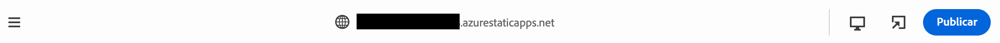

# Creación de contenido con el editor universal {#authoring}

Aprenda lo fácil e intuitivo que es para los autores crear contenido con el editor universal.

## Introducción {#introduction}

El editor universal permite editar cualquier aspecto de cualquier contenido en cualquier implementación para que pueda ofrecer experiencias excepcionales, aumentar la velocidad del contenido y proporcionar una experiencia de desarrollador avanzada.

Para ello, se proporciona una IU intuitiva que requiere una formación mínima para comenzar a editar contenido.

>[!TIP]
>
>Para obtener una introducción más detallada al editor universal, consulte el documento [Introducción al editor universal.](introduction.md)

>[!NOTE]
>
>El editor universal aún está en desarrollo; actualmente no se puede editar cualquier tipo de contenido.

## Preparación de la aplicación {#prepare-app}

Para crear contenido para una aplicación con el editor universal, la aplicación debe estar instrumentada por un desarrollador para admitir el editor.

>[!TIP]
>
>Consulte [AEM Introducción al editor universal en el entorno de trabajo de la aplicación de](getting-started.md) AEM para ver un ejemplo de cómo configurar una aplicación de la para que funcione con el editor universal.

## Inicio de sesión {#sign-in}

Una vez instrumentada la aplicación para que funcione con el editor universal, deberá iniciar sesión. Para el editor universal, necesitará el Adobe ID para iniciar sesión y [tener acceso.](getting-started.md#request-access)

Cuando haya iniciado sesión, introduzca la dirección URL de la página que desea editar en la [barra de direcciones.](#address-bar) para que pueda empezar [editar el contenido.](#edit-content)

## Comprensión de la IU {#ui}

La IU se divide en cuatro áreas principales.

* [El encabezado de Experience Cloud](#experience-cloud-header)
* [El encabezado del editor universal](#universal-editor-header)
* [El carril](#rail)
* [El editor](#editor)

### El encabezado de Experience Cloud {#experience-cloud-header}

El encabezado de Experience Cloud siempre está presente en la parte superior de la pantalla. Es un anclaje que le dice dónde se encuentra dentro de Experience Cloud y le ayuda a navegar a otras aplicaciones.

#### Experience Manager {#experience-manager}

Seleccione el vínculo de Adobe Experience Cloud a la izquierda del encabezado para ir a la raíz de la solución de Experience Manager y acceder a herramientas como [Cloud Manager,](/help/onboarding/cloud-manager-introduction.md) [Cloud Acceleration Manager](/help/journey-migration/cloud-acceleration-manager/introduction/overview-cam.md) y [Distribución de software.](https://experienceleague.adobe.com/docs/experience-cloud/software-distribution/home.html?lang=es)

#### Organización {#organization}

Muestra la organización en la que ha iniciado sesión. Toque o haga clic para cambiar a otra organización si su Adobe ID está asociado a varias.

#### Soluciones {#solutions}

Al tocar o hacer clic en el conmutador de soluciones, puede ir rápidamente a otras soluciones de Experience Cloud.

#### Ayuda {#help}

El icono de ayuda proporciona acceso rápido a los recursos de aprendizaje y asistencia.

#### Notificaciones {#notifications}

Este icono tiene la insignia con el número de asignaciones incompletas actualmente [notificaciones](/help/implementing/cloud-manager/notifications.md).

#### Propiedades del usuario {#user-properties}

Toque o haga clic en el icono que representa a su usuario para acceder a la configuración. Si no tiene configurada una imagen de usuario, se asigna un icono de forma aleatoria.

### El encabezado del editor universal {#universal-editor-header}

El encabezado del editor universal siempre está presente en la parte superior de la pantalla, justo debajo [del encabezado de Experience Cloud.](#experience-cloud-header) Esto le permite desplazarse rápidamente a otra página para editarla y publicarla.

#### Menú de hamburguesa {#hamburger-menu}

El menú de hamburguesa aún no está implementado.

#### Barra de ubicación {#Location-bar}

La barra de ubicación muestra la dirección de la página que está editando. Toque o haga clic para introducir la dirección de otra página que desea editar.

>[!TIP]
>
>Utilice la tecla de acceso directo `L` para abrir la barra de direcciones.

>[!NOTE]
>
>Todas las páginas que desee editar deben [instrumentarse para admitir el editor universal.](getting-started.md)

#### Apertura de la vista previa de la aplicación {#open-app-preview}

Toque o haga clic en el icono Abrir vista previa de la aplicación para abrir la página que esté editando en su propio explorador, sin tener que usar el editor para previsualizar los cambios.

>[!TIP]
>
>Utilice la tecla de acceso directo `O` para abrir la vista previa de la aplicación.

#### Publicación {#publish}

Toque o haga clic en el botón Publicar para poder publicar los cambios en el contenido en directo para que los consuman sus lectores.

>[!TIP]
>
>Consulte el documento [Publicación de contenido con el editor visual universal](publishing.md) para obtener más información sobre la publicación con el editor universal.

### El carril {#rail}

El carril siempre está presente en la parte izquierda del editor. Permite conmutar fácilmente el editor entre el modo de previsualización y el de edición.

#### Modo de vista previa {#preview-mode}

En el modo de vista previa, la página se procesa en el editor tal como se vería en el servicio publicado. Esto permite al autor del contenido navegar por el contenido haciendo clic en los vínculos, etc.

>[!TIP]
>
>Utilice la tecla de acceso directo `P` para cambiar al modo de vista previa.

#### Modo de edición {#edit-mode}

En el modo de edición, la página se procesa en el editor, pero el autor del contenido puede hacer clic para seleccionar el contenido que desea editar. Este es el modo predeterminado del editor cuando se carga una página.

### El Editor {#editor}

El editor ocupa la mayor parte de la ventana y es donde se procesa la página especificada en [la barra de direcciones](#address-bar).

Dependiendo de si el editor se encuentra en [modo de edición](#edit-mode) o [modo de vista previa,](#edit-mode) el contenido puede editarse o se puede navegar por él, respectivamente.

## Edición de contenido {#editing-content}

La edición de contenido es sencilla e intuitiva. Entrada [modo de edición,](#edit-mode) al pasar el ratón sobre el contenido en el editor, el contenido editable se resalta con un cuadro azul.

Simplemente, toque o haga clic en el contenido dentro del cuadro azul para editar y realizar los cambios. Pulse Intro o Volver para guardar los cambios.

Tenga en cuenta que, en el modo de edición, que si toca o hace clic en el contenido se selecciona para editar. Si desea navegar por el contenido mediante los siguientes vínculos, cambie a [modo de vista previa.](#preview-mode)

## Vista previa del contenido {#previewing-content}

Cuando haya terminado de editar el contenido, a menudo querrá navegar por él para ver cómo queda dentro del contenido de otras páginas. En el [modo de vista previa](#preview-mode), puede hacer clic en los vínculos para navegar por el contenido como lo haría un lector. El contenido se muestra en el editor tal y como se publicaría.

Tenga en cuenta que, en el modo de vista previa, tocar o hacer clic en el contenido reacciona como lo haría con un lector. Si desea seleccionar contenido para editar, cambie a [modo de edición.](#edit-mode)

## Recursos adicionales {#additional-resources}

Para obtener más información acerca del editor universal, consulte estos documentos.

* [Introducción al editor universal](introduction.md) - Descubra cómo el editor universal permite editar cualquier aspecto de cualquier contenido en cualquier implementación para que pueda ofrecer experiencias excepcionales, aumentar la velocidad del contenido y proporcionar una experiencia de desarrollador avanzada.
* [Publicación de contenido con el editor universal](publishing.md): descubra cómo el editor visual universal publica contenido y cómo sus aplicaciones pueden gestionar el publicado.
* [Introducción al editor universal en AEM](getting-started.md): obtenga información sobre cómo acceder al editor universal y cómo instrumentar la primera aplicación de AEM para utilizarlo.
* [Arquitectura del editor universal](architecture.md): obtenga información acerca de la arquitectura del editor universal y cómo fluyen los datos entre sus servicios y capas.
* [Atributos y tipos](attributes-types.md): obtenga información acerca de los atributos y tipos de datos que requiere el editor universal.
* [Autenticación del editor universal](authentication.md): obtenga información sobre cómo se autentica el editor universal.
