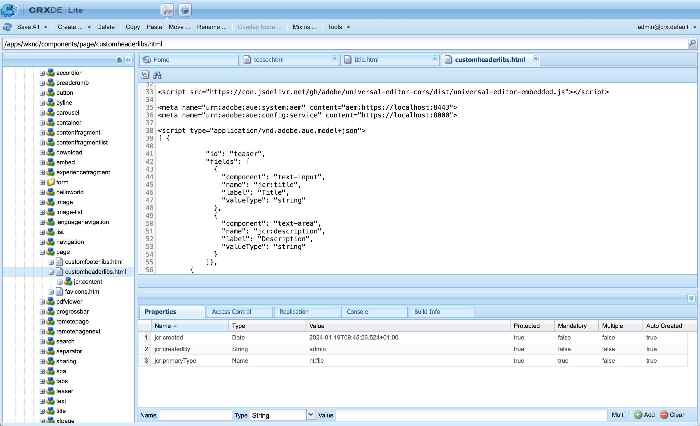

# AEM Información general del editor universal para desarrolladores {#developer-overview}

AEM Si usted es un desarrollador de interesado en cómo funciona el editor universal y cómo utilizarlo en su proyecto, este documento le ofrece una introducción completa al instrumentarlo para que trabaje con el editor universal.

## Función {#purpose}

Este documento sirve como introducción para desarrolladores sobre cómo funciona el editor universal y cómo instrumentar la aplicación para que funcione con él.

AEM Para ello, toma un ejemplo estándar con el que la mayoría de los desarrolladores están familiarizados, los componentes principales y el sitio WKND, e instrumenta algunos componentes de ejemplo para que se puedan editar con el editor universal.

>[!TIP]
>
>Este documento realiza pasos adicionales para ilustrar cómo funciona el editor universal y tiene la intención de profundizar la comprensión del editor por parte del desarrollador. Por lo tanto, no toma la ruta más directa para instrumentar una aplicación, sino la más ilustrativa del editor universal y cómo funciona.
>
>Si desea ponerse en marcha lo más rápido posible, consulte la [AEM Introducción al editor universal en el entorno de trabajo de la aplicación de](/help/implementing/universal-editor/getting-started.md) documento.

## Requisitos previos {#prerequisites}

Para seguir esta descripción general, necesita disponer de lo siguiente.

* [AEM Una instancia de desarrollo local de as a Cloud Service](https://experienceleague.adobe.com/docs/experience-cloud/software-distribution/home.html?lang=es)
   * La instancia de desarrollo local debe ser [configurado con HTTPS con fines de desarrollo en `localhost`.](https://experienceleague.adobe.com/docs/experience-manager-learn/foundation/security/use-the-ssl-wizard.html?lang=es)
   * [Se debe instalar el sitio de demostración de WKND.](https://github.com/adobe/aem-guides-wknd)
* [Acceso al editor universal](/help/implementing/universal-editor/getting-started.md#onboarding)
* [Un servicio de editor universal local](/help/implementing/universal-editor/local-dev.md) ejecución con fines de desarrollo
   * Asegúrese de dirigir el explorador a [acepte el certificado autofirmado de los servicios locales.](/help/implementing/universal-editor/local-dev.md#editing)

AEM Más allá de la familiaridad general con el desarrollo web, este documento supone una familiaridad básica con el desarrollo de la. AEM Si no tiene experiencia con el desarrollo de la, considere la posibilidad de revisar [Utilice el tutorial de WKND antes de continuar.](/help/implementing/developing/introduction/develop-wknd-tutorial.md)

## AEM Inicio y inicio de sesión en el editor universal de la aplicación {#sign-in}

AEM Si aún no lo ha hecho, debe tener la instancia de desarrollo local de en ejecución con WKND instalado y HTTPS habilitado como [se detalla en los requisitos previos.](#prerequisites) Esta descripción general supone que la instancia se está ejecutando en `https://localhost:8443`.

1. AEM Abra la página principal de WKND en inglés en el Editor de.

   ```text
   https://localhost:8443/editor.html/content/wknd/language-masters/en.html
   ```

1. En el **Información de página** del editor, seleccione. **Ver como aparece publicado**. AEM Se abrirá la misma página en una nueva pestaña con el Editor de páginas desactivado

   ```text
   https://localhost:8443/content/wknd/language-masters/en.html?wcmmode=disabled
   ```

1. Copie este vínculo.

1. Ahora inicie sesión en el editor universal.

   ```text
   https://experience.adobe.com/#/aem/editor
   ```

1. Pegue el vínculo que ha copiado anteriormente del contenido de WKND en la **URL del sitio** del editor universal y haga clic en **Abrir**.

   

## El editor universal intenta cargar el contenido {#sameorigin}

El editor universal carga el contenido que se va a editar en un marco. AEM La configuración predeterminada para las opciones de X-Frame lo impide, lo que se puede ver claramente en el explorador como un error y detallado en la salida de la consola al intentar cargar la copia local de WKND.


La opción X-Frame `sameorigin` AEM evita la representación de páginas de la página dentro de un marco. Debe quitar este encabezado para permitir que las páginas se carguen en el editor universal.

1. Abra el Administrador de configuración.

   ```text
   https://localhost:8443/system/console/configMgr
   ```

1. Editar la configuración de OSGi `org.apache.sling.engine.impl.SlingMainServlet`

   

1. Eliminar la propiedad `X-Frame-Options=SAMEORIGIN` de la propiedad **Encabezados de respuesta adicionales**.

1. Guarde los cambios.

AEM Ahora, si vuelve a cargar el editor universal, verá que se carga la página de la.

>[!TIP]
>
>* Ver el documento [AEM Introducción al editor universal en el entorno de trabajo de la aplicación de](/help/implementing/universal-editor/getting-started.md#sameorigin) para obtener más información sobre esta configuración de OSGi.
>* Ver el documento [Configurar OSGi para Adobe Experience Manager as a Cloud Service](/help/implementing/deploying/configuring-osgi.md) AEM para obtener más información sobre OSGi en la.

## Gestión de cookies del mismo sitio {#samesite-cookies}

AEM Cuando el Editor universal carga la página, se carga en la página de inicio de sesión de la aplicación para asegurarse de que se ha autenticado para realizar cambios.

Sin embargo, no puede iniciar sesión correctamente. Al mostrar la consola del explorador, puede ver que el explorador ha bloqueado la entrada en el marco


AEM La cookie del token de inicio de sesión se envía a los usuarios como un dominio de terceros. AEM Por lo tanto, se deben permitir las cookies del mismo sitio en los.

1. Abra el Administrador de configuración.

   ```text
   https://localhost:8443/system/console/configMgr
   ```

1. Editar la configuración de OSGi `com.day.crx.security.token.impl.impl.TokenAuthenticationHandler`

   

1. Cambiar la propiedad **Atributo SameSite para la cookie de token de inicio de sesión** hasta `None`.

1. Guarde los cambios.

AEM Ahora, si vuelve a cargar el editor universal, puede iniciar sesión correctamente en el editor y se cargará la página de destino.

>[!TIP]
>
>* Ver el documento [AEM Introducción al editor universal en el entorno de trabajo de la aplicación de](/help/implementing/universal-editor/getting-started.md#samesite-cookies) para obtener más información sobre esta configuración de OSGi.
>* Ver el documento [Configurar OSGi para Adobe Experience Manager as a Cloud Service](/help/implementing/deploying/configuring-osgi.md) AEM para obtener más información sobre OSGi en la.

## El editor universal se conecta al marco remoto {#ue-connect-remote-frame}

AEM Con la página cargada en el Editor universal y con la sesión iniciada en el Editor universal, éste intenta conectarse al marco remoto. El Editor universal intenta conectarse a la página desde el Editor universal. Esto se realiza mediante una biblioteca JavaScript que debe cargarse en el marco remoto. Si la biblioteca JavaScript no está presente, la página crea finalmente un error de tiempo de espera en la consola.


Debe añadir la biblioteca JavaScript necesaria al componente Página de la aplicación WKND.

1. Abra el CRXDE Lite.

   ```text
   https://localhost:8443/crx/de
   ```

1. En `/apps/wknd/components/page`, edite el archivo `customheaderlibs.html`.

   

1. Añada la biblioteca JavaScript al final del archivo.

   ```html
   <script src="https://universal-editor-service.experiencecloud.live/corslib/LATEST"></script>
   ```

1. Clic **Guardar todo** y, a continuación, vuelva a cargar el Editor universal.

La página ahora se carga con la biblioteca JavaScript adecuada para permitir que el editor universal se conecte a su página y el error de tiempo de espera ya no aparece en la consola.

>[!TIP]
>
>* La biblioteca se puede cargar en el encabezado o en el pie de página.
>* El `universal-editor-embedded.js` biblioteca [está disponible en NPM](https://www.npmjs.com/package/@adobe/universal-editor-cors) y puede alojarlo usted mismo si es necesario o colocarlo directamente en su aplicación.

## Definición de una conexión para mantener los cambios {#connection}

La página WKND ahora se carga correctamente en el Editor universal y la biblioteca JavaScript se carga para conectar el editor a la aplicación.

Sin embargo, es probable que haya observado que no puede interactuar con la página en el editor universal. En realidad, el editor universal no puede editar su página. Para que el editor universal pueda editar el contenido, debe definir una conexión para que sepa dónde escribirlo. AEM Para el desarrollo local, debe escribir en la instancia de desarrollo local de la en `https://localhost:8443`.

1. Abra el CRXDE Lite.

   ```text
   https://localhost:8443/crx/de
   ```

1. En `/apps/wknd/components/page`, edite el archivo `customheaderlibs.html`.

   

1. AEM Añada los metadatos necesarios para la conexión con la instancia de la local al final del archivo.

   ```html
   <meta name="urn:adobe:aue:system:aem" content="aem:https://localhost:8443">
   ```

   * Siempre se recomienda la versión más reciente de la biblioteca. Si necesita una versión anterior, consulte el documento [AEM Introducción al editor universal en la documentación de la aplicación de la versión de.](/help/implementing/universal-editor/getting-started.md#alternative)

1. Agregue los metadatos necesarios para la conexión al servicio Editor universal local al final del archivo.

   ```html
   <meta name="urn:adobe:aue:config:service" content="https://localhost:8000">
   ```

1. Clic **Guardar todo** y, a continuación, vuelva a cargar el Editor universal.

AEM Ahora, el editor universal no solo puede cargar el contenido correctamente desde la instancia de desarrollo de la aplicación local, sino que también sabe dónde persistir los cambios que realice con el servicio de editor universal local. Este es el primer paso para instrumentar la aplicación para que se pueda editar con el editor universal.

>[!TIP]
>
>* Ver el documento [AEM Introducción al editor universal en el entorno de trabajo de la aplicación de](/help/implementing/universal-editor/getting-started.md#connection) para obtener más información sobre los metadatos de la conexión.
>* Ver el documento [Arquitectura del editor universal](/help/implementing/universal-editor/architecture.md#service) para obtener más información sobre la estructura del editor universal.
>* Ver el documento [AEM Desarrollo local con el editor universal de la aplicación](/help/implementing/universal-editor/local-dev.md) para obtener más información sobre cómo conectarse a una versión autoalojada del editor universal.

## Instrumentación de componentes {#instrumenting-components}

Sin embargo, es probable que observe que todavía puede hacer poco con el editor universal. Si intenta hacer clic en el teaser de la parte superior de la página WKND en el editor universal, no puede seleccionarlo (ni nada más en la página).

Los componentes también deben estar instrumentados para poder editarlos con el editor universal. Para ello, debe editar el componente Teaser. Por lo tanto, debe superponer los componentes principales, ya que estos se encuentran en `/libs`, que es inmutable.

1. Abra el CRXDE Lite.

   ```text
   https://localhost:8443/crx/de
   ```

1. Seleccione el nodo `/libs/core/wcm/components` y haga clic en **Nodo de superposición** en la barra de herramientas.

1. Con `/apps/` seleccionado como **Ubicación de superposición**, haga clic en **OK**.

   

1. Seleccione el `teaser` nodo bajo `/libs/core/wcm/components` y haga clic en **Copiar** en la barra de herramientas.

1. Seleccione el nodo superpuesto en `/apps/core/wcm/components` y haga clic en **Pegar** en la barra de herramientas.

1. Haga doble clic en el archivo `/apps/core/wcm/components/teaser/v2/teaser/teaser.html` para editarlo.

   

1. Al final de la primera `div` aproximadamente en la línea 26, añada los detalles de instrumentación del componente.

   ```text
   data-aue-resource="urn:aem:${resource.path}"
   data-aue-type="component"
   data-aue-label="Teaser"
   ```

1. Clic **Guardar todo** en la barra de herramientas y vuelva a cargar el editor universal.

1. En el editor universal, haga clic en el componente teaser en la parte superior de la página y verá que ahora puede seleccionarlo.

1. Si hace clic en **Árbol de contenido** en el carril de propiedades del Editor universal, puede ver que el editor reconoce todos los teasers de la página ahora que los ha instrumentado. El teaser que seleccionó es el resaltado.

   

>[!TIP]
>
>Ver el documento [Uso de la fusión de recursos de Sling en Adobe Experience Manager as a Cloud Service](/help/implementing/developing/introduction/sling-resource-merger.md) para obtener más información sobre la superposición de nodos.

## Subcomponentes de instrumento del teaser {#subcomponents}

Ahora puede seleccionar el teaser, pero aún no editarlo. Esto se debe a que el teaser está compuesto por diferentes componentes, como la imagen y el componente de título. Debe instrumentar estos subcomponentes para poder editarlos.

1. Abra el CRXDE Lite.

   ```text
   https://localhost:8443/crx/de
   ```

1. Seleccione el nodo `/apps/core/wcm/components/teaser/v2/teaser/` y haga doble clic en `title.html` archivo.

   

1. Inserte las siguientes propiedades al final del `h2` etiqueta (cerca de la línea 17).

   ```text
   data-aue-prop="jcr:title"
   data-aue-type="text"
   data-aue-label="Title"
   ```

1. Clic **Guardar todo** en la barra de herramientas y vuelva a cargar el editor universal.

1. Haga clic en el título del mismo componente de teaser en la parte superior de la página y verá que ahora puede seleccionarlo. El árbol de contenido también muestra el título como parte del componente teaser seleccionado.

   

Ahora puede editar el título del componente Teaser.

## ¿Qué significa todo esto? {#what-does-it-mean}

Ahora que puede editar el título del teaser, vamos a dedicar un momento a revisar lo que ha logrado y cómo.

Ha identificado el componente teaser en el editor universal mediante su instrumentación.

* `data-aue-resource` AEM identifica el recurso en el que se está editando la.
* `data-aue-type` define que los elementos deben tratarse como un componente de página (en lugar de, por ejemplo, un contenedor).
* `data-aue-label` muestra una etiqueta fácil de usar en la interfaz de usuario del teaser seleccionado.

También ha instrumentado el componente de título dentro del componente teaser.

* `data-aue-prop` es el atributo JCR que se escribe.
* `data-aue-type` es la forma en que se debe editar el atributo. En este caso, con el editor de texto, ya que es un título (a diferencia de, por ejemplo, el editor de texto enriquecido).

## Definición de encabezados de autenticación {#auth-header}

Ahora puede editar el título del teaser en línea y los cambios se mantienen en el explorador.


Sin embargo, si vuelve a cargar el explorador, se vuelve a cargar el título anterior. AEM AEM Esto se debe a que, aunque el editor universal sabe cómo conectarse a la instancia de la, aún no puede autenticarse en la instancia de la para escribir cambios en el JCR.

Si muestra la pestaña de red de las herramientas para desarrolladores del navegador y busca `update`, puede ver que se encuentra con un error 401 al intentar editar el título.


AEM AEM Cuando se utiliza el editor universal para editar el contenido de la producción, el editor universal utiliza el mismo token de IMS que se utilizó para iniciar sesión en el editor para autenticarse y para facilitar la escritura en el JCR. El editor universal utiliza el mismo token de IMS que se utilizó para iniciar sesión en el editor y, a continuación, se autentica para facilitar la escritura en el JCR.

AEM Cuando se desarrolla localmente, no se puede utilizar el proveedor de identidad de, ya que los tokens de IMS solo se pasan a dominios propiedad de la Adobe. Debe proporcionar manualmente una forma de autenticarse configurando explícitamente un encabezado de autenticación.

1. En la interfaz del Editor universal, haga clic en **Encabezados de autenticación** en la barra de herramientas.

1. AEM Copie en el encabezado de autenticación necesario para autenticarse en la instancia de local y haga clic en **Guardar**.

   

1. Vuelva a cargar el editor universal y, a continuación, edite el título del teaser.

AEM Ya no se notifican errores en la consola del explorador y los cambios se conservan en la instancia de desarrollo de la local.

Si investiga el tráfico en las herramientas para desarrolladores de navegadores y busca la variable `update` eventos, puede ver los detalles de la actualización.


```json
{
  "connections": [
    {
      "name": "aem",
      "protocol": "aem",
      "uri": "https://localhost:8443"
    }
  ],
  "target": {
    "resource": "urn:aem:/content/wknd/language-masters/en/jcr:content/root/container/carousel/item_1571954853062",
    "type": "text",
    "prop": "jcr:title"
  },
  "value": "Tiny Toon Adventures"
}
```

* `connections` AEM es la conexión con la instancia de local
* `target` es el nodo y las propiedades exactos que se actualizan en el JCR
* `value` es la actualización que ha realizado.

Puede ver que el cambio persiste en el JCR.


>[!TIP]
>
>Hay muchas herramientas disponibles en línea para generar los encabezados de autenticación necesarios para los fines de prueba y desarrollo.
>
>Ejemplo del encabezado de autenticación básico `Basic YWRtaW46YWRtaW4=` es para la combinación de usuario y contraseña de `admin:admin` AEM como es común para el desarrollo local de la.

## Instrumentación de la aplicación para el carril Propiedades {#properties-rail}

Ahora tiene una aplicación instrumentada para poder editarla con el editor universal.

Actualmente, la edición se limita a la edición en línea del título del teaser. Sin embargo, hay casos en los que la edición in situ no es suficiente. El texto, como el título del teaser, se puede editar donde está con la entrada de teclado. Sin embargo, los elementos más complicados deben poder mostrarse y permitir la edición de datos estructurados independientemente de cómo se representen en el explorador. Para esto sirve el carril de propiedades.

Para actualizar la aplicación y utilizar el carril de propiedades para editarla, vuelva al archivo de encabezado del componente de página de la aplicación. AEM Aquí es donde ya ha establecido las conexiones con la instancia de desarrollo de la aplicación local y con el servicio de editor universal local. Aquí debe definir los componentes editables en la aplicación y sus modelos de datos.

1. Abra el CRXDE Lite.

   ```text
   https://localhost:8443/crx/de
   ```

1. En `/apps/wknd/components/page`, edite el archivo `customheaderlibs.html`.

   

1. Al final del archivo, añada la secuencia de comandos necesaria para definir los componentes.

   ```html
   <script type="application/vnd.adobe.aue.component+json">
   {
     "groups": [
       {
         "title": "General Components",
         "id": "general",
         "components": [
           {
             "title": "Teaser",
             "id": "teaser",
             "plugins": {
               "aem": {
                 "page": {
                   "resourceType": "wknd/components/teaser"
                 }
               }
             }
           },
           {
             "title": "Title",
             "id": "title",
             "plugins": {
               "aem": {
                 "page": {
                   "resourceType": "wknd/components/title"
                 }
               }
             }
           }
         ]
       }
     ]
   }
   </script>
   ```

1. Debajo, al final del archivo, añada la secuencia de comandos necesaria para definir el modelo.

   ```html
   <script type="application/vnd.adobe.aue.model+json">
   [
     {
       "id": "teaser",
       "fields": [
         {
           "component": "text-input",
           "name": "jcr:title",
           "label": "Title",
           "valueType": "string"
         },
         {
           "component": "text-area",
           "name": "jcr:description",
           "label": "Description",
           "valueType": "string"
         }
       ]
     },
     {
       "id": "title",
       "fields": [
         {
           "component": "select",
           "name": "type",
           "value": "h1",
           "label": "Type",
           "valueType": "string",
           "options": [
             { "name": "h1", "value": "h1" },
             { "name": "h2", "value": "h2" },
             { "name": "h3", "value": "h3" },
             { "name": "h4", "value": "h4" },
             { "name": "h5", "value": "h5" },
             { "name": "h6", "value": "h6" }
           ]
         }
       ]
     }
   ]
   </script>
   ```

1. Clic **Guardar todo** en la barra de herramientas.

## ¿Qué significa todo esto? {#what-does-it-mean-2}

Para poder editar mediante el carril de propiedades, los componentes deben estar asignados a `groups`, de modo que cada definición comienza como una lista de grupos que contienen los componentes.

* `title` es el nombre del grupo.
* `id` es el identificador único del grupo, en este caso componentes generales que componen el contenido de la página, a diferencia de componentes avanzados para el diseño de página, por ejemplo.

A continuación, cada grupo tiene una matriz de `components`.

* `title` es el nombre del componente.
* `id` es el identificador único del componente, en este caso un teaser.

AEM A continuación, cada componente tiene una definición de complemento que define cómo se asigna el componente a los elementos de la interfaz de usuario de la interfaz de usuario de.

* `aem` es el complemento que administra la edición. Esto se puede considerar como el servicio que procesa el componente.
* `page` define qué tipo de componente es, en este caso un componente de página estándar.
* `resourceType` AEM es la asignación al componente de la real.

Cada componente debe asignarse a una `model` para definir los campos editables individuales.

* `id` es el identificador único del modelo, que debe coincidir con el ID del componente.
* `fields` es una matriz de campos individuales.
* `component` es el tipo de entrada, como texto o área de texto.
* `name` es el nombre del campo en el JCR al que está asignado el campo.
* `label` es la descripción del campo que aparece en la interfaz de usuario del editor.
* `valueType` es el tipo de datos.

## Instrumentación del componente para el carril de propiedades {#properties-rail-component}

También debe definir a nivel de componente qué modelo debe utilizar el componente.

1. Abra el CRXDE Lite.

   ```text
   https://localhost:8443/crx/de
   ```

1. Haga doble clic en el archivo `/apps/core/wcm/components/teaser/v2/teaser/teaser.html` para editarlo.

   

1. Al final de la primera `div` aproximadamente en la línea 32, después de las propiedades agregadas anteriormente, agregue los detalles de instrumentación para el modelo que utilizará el componente teaser.

   ```text
   data-aue-model="teaser"
   ```

1. Clic **Guardar todo** en la barra de herramientas y vuelva a cargar el editor universal.

Ahora está listo para probar el carril de propiedades instrumentado para su componente.

1. En el editor universal, haga clic en el título del teaser para editarlo una vez más.

1. Haga clic en el carril de propiedades para mostrar la pestaña de propiedades y ver los campos que acaba de instrumentar.

   

Ahora puede editar el título del teaser en línea como lo había hecho anteriormente o en el carril de propiedades. AEM En ambos casos, los cambios se conservan en la instancia de desarrollo de la comunidad local de la que se haya realizado el.

## Añadir campos adicionales al carril Propiedades {#add-fields}

Con la estructura básica del modelo de datos para el componente que ya ha implementado, puede agregar campos adicionales siguiendo el mismo modelo.

Por ejemplo, puede añadir un campo para ajustar el estilo del componente.

1. Abra el CRXDE Lite.

   ```text
   https://localhost:8443/crx/de
   ```

1. En `/apps/wknd/components/page`, edite el archivo `customheaderlibs.html`.

   

1. En el script de definición del modelo, agregue un elemento adicional a la variable `fields` matriz para el campo de estilo. Recuerde agregar una coma después del último campo antes de insertar el nuevo.

   ```json
   {
      "component": "select",
      "name": "cq:styleIds",
      "label": "Style",
      "valueType": "string",
        "multi": true,
      "options": [
        {"name": "hero", "value":"1555543212672"},
        {"name": "card", "value":"1605057868937"}
      ]
   }
   ```

1. Clic **Guardar todo** en la barra de herramientas y vuelva a cargar el editor universal.

1. Haga clic en el título del teaser para editarlo una vez más.

1. Haga clic en el carril de propiedades y verá que hay un nuevo campo para ajustar el estilo del componente.

   

Cualquier campo del JCR del componente se puede exponer en el editor universal de esta manera.

## Resumen {#summary}

Felicitaciones. AEM Ahora puede instrumentar sus propias aplicaciones de para que funcionen con el editor universal.

Cuando empiece a instrumentar su propia aplicación, tenga en cuenta los pasos básicos que ha realizado en este ejemplo.

1. [El entorno de desarrollo se configura.](#prerequisites)
   * AEM Se ejecuta localmente en HTTPS con WKND instalado
   * Servicio de editor universal que se ejecuta localmente en HTTPS
1. AEM Ha actualizado la configuración de OSGi para permitir que su contenido se cargue de forma remota.
   * [`org.apache.sling.engine.impl.SlingMainServlet`](#sameorigin)
   * [`com.day.crx.security.token.impl.impl.TokenAuthenticationHandler`](#samesite-cookies)
1. [Ha añadido la variable ](#ue-connect-remote-frame)
1. [Ha definido una conexión para mantener los cambios en ](#connection)
   * AEM Ha definido una conexión con la instancia de desarrollo de la local.
   * También ha definido una conexión con el servicio de Universal Editor local.
1. [Ha instrumentado el componente teaser.](#instrumenting-components)
1. [Ha instrumentado los subcomponentes del teaser.](#subcomponents)
1. [Ha definido un encabezado de autenticación personalizado para poder guardar los cambios mediante el servicio de editor universal local.](#auth-header)
1. [Ha instrumentado la aplicación para que utilice el carril de propiedades.](#properties-rail)
1. [Ha instrumentado el componente teaser para utilizar el carril de propiedades.](#properties-rail-component)

Puede seguir los mismos pasos para instrumentar su propia aplicación y utilizarla con el editor universal. Todas las propiedades del JCR se pueden exponer al editor universal.

## Recursos adicionales {#additional-resources}

Consulte los siguientes documentos para obtener más información y detalles sobre las funciones del editor universal.

* Si desea ponerse en marcha lo más rápido posible, consulte la [AEM Introducción al editor universal en el entorno de trabajo de la aplicación de](/help/implementing/universal-editor/getting-started.md) documento.
* Ver el documento [AEM Introducción al editor universal en el entorno de trabajo de la aplicación de](/help/implementing/universal-editor/getting-started.md#sameorigin) para obtener más información sobre las configuraciones de OSGi necesarias.
* Ver el documento [AEM Introducción al editor universal en el entorno de trabajo de la aplicación de](/help/implementing/universal-editor/getting-started.md#connection) para obtener más información sobre los metadatos de la conexión.
* Ver el documento [Arquitectura del editor universal](/help/implementing/universal-editor/architecture.md#service) para obtener más información sobre la estructura del editor universal.
* Ver el documento [AEM Desarrollo local con el editor universal de la aplicación](/help/implementing/universal-editor/local-dev.md) para obtener más información sobre cómo conectarse a una versión autoalojada del editor universal.
* Ver el documento [Uso de la fusión de recursos de Sling en Adobe Experience Manager as a Cloud Service](/help/implementing/developing/introduction/sling-resource-merger.md) para obtener más información sobre la superposición de nodos.

