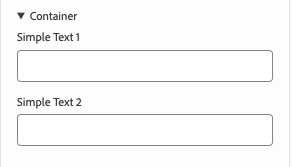
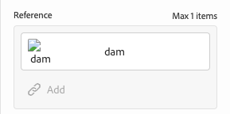

# Definiciones del modelo, campos y tipos de componentes {#field-types}

Obtenga información acerca de los campos y los tipos de componentes que el editor universal puede editar en el panel de propiedades con ejemplos. Descubra cómo puede instrumentar su propia aplicación creando una definición de modelo y vinculándola al componente.

## Información general {#overview}

Al adaptar sus propias aplicaciones para utilizarlas con el editor universal, debe instrumentar los componentes y definir qué campos y tipos de componentes pueden manipular en el panel de propiedades del editor. Para ello, cree un modelo y estableciendo el vínculo con él desde el componente.

Este documento proporciona información general sobre la definición de un modelo, los campos y los tipos de componentes disponibles, así como configuraciones de ejemplo.

>[!TIP]
>
>Si no sabe cómo instrumentar su aplicación para el editor universal, consulte el documento [Información general del editor universal para desarrolladores de AEM](/help/implementing/universal-editor/developer-overview.md).

## Estructura de definición de modelo {#model-structure}

Para configurar un componente a través del panel de propiedades del editor universal, debe existir una definición de modelo y estar vinculada al componente.

La definición del modelo es una estructura JSON que comienza con una matriz de modelos.

```json
[
  {
    "id": "model-id",        // must be unique
    "fields": []             // array of fields which shall be rendered in the properties panel
  }
]
```

Consulte la sección **[Campos](#fields)** de este documento para obtener más información sobre cómo definir la matriz `fields`.

Puede vincular un modelo a un componente de dos maneras: usando la [definición de componente](#component-definition) o [a través de la instrumentación.](#instrumentation)

### Vinculación con la definición del componente {#component-definition}

Este es el método preferido para vincular el modelo al componente. Al hacerlo, puede mantener el vínculo de forma centralizada en la definición del componente, lo que permite arrastrar componentes entre distintos contenedores.

Solo hay que incluir la propiedad `model` en el objeto de componente en la matriz `components` del archivo `component-definition.json`.

Para obtener más información, consulte el documento [Definición de componente.](/help/implementing/universal-editor/component-definition.md)

### Vinculación a través de la instrumentación {#instrumentation}

Para usar la definición del modelo con un componente, se puede usar el atributo `data-aue-model`.

```html
<div data-aue-resource="urn:datasource:/content/path" data-aue-type="component"  data-aue-model="model-id">Click me</div>
```

>[!NOTE]
>
>El editor universal comprueba primero si un modelo está vinculado a través de la instrumentación y utiliza eso antes de comprobar la definición del componente. Esto significa lo siguiente:
>
>* Los proyectos que hayan implementado el vínculo al modelo a través de la instrumentación seguirán funcionando tal cual sin necesidad de cambios.
>* Si define el modelo en la [definición de componente](#component-definition) así como en la instrumentación, se utilizará siempre la instrumentación.

## Carga de una definición de modelo {#loading-model}

Una vez creado un modelo, se puede hacer referencia a él como un archivo externo.

```html
<script type="application/vnd.adobe.aue.model+json" src="<url-of-model-definition>"></script>
```

De forma alternativa, también puede definir el modelo en línea.

```html
<script type="application/vnd.adobe.aue.model+json">
  { ... model definition ... }
</script>
```

## Campos {#fields}

Un objeto de campo tiene la siguiente definición de tipo.

| Configuración | Tipo de valor | Descripción | Necesario |
|---|---|---|---|
| `component` | `ComponentType` | Procesador del componente | Sí |
| `name` | `string` | Propiedad [o ruta](#nesting) donde se mantendrán los datos | Sí |
| `label` | `FieldLabel` | Etiqueta del campo | Sí |
| `description` | `FieldDescription` | Descripción del campo | No |
| `value` | `FieldValue` | Es un valor predeterminado que sirve como marcador de posición. Si no se establece ningún valor, el Editor universal persistirá independientemente de lo que se defina como `value` en la definición del modelo. Esto garantiza que lo que vea coincidirá con lo que se mantiene en el backend. | No |
| `valueType` | `ValueType` | La validación estándar puede ser `string`, `string[]`, `number`, `date` o `boolean` | No |
| `required` | `boolean` | ¿Es el campo obligatorio? | No |
| `readOnly` | `boolean` | ¿Es el campo de solo lectura? | No |
| `hidden` | `boolean` | Está oculto el campo de forma predeterminada | No |
| `condition` | `RulesLogic` | Regla para mostrar u ocultar el campo según una [condición](/help/implementing/universal-editor/customizing.md#conditionally-hide) | No |
| `multi` | `boolean` | ¿Es el campo un campo múltiple?<br/>Tenga en cuenta que no se permite anidar contenedores para campos múltiples en el panel de propiedades | No |
| `validation` | `ValidationType` | Regla o reglas de validación para el campo | No |
| `raw` | `unknown` | Datos sin procesar que el componente puede utilizar | No |

>[!NOTE]
>
>No se permite el guion bajo (`_`) en los nombres de campo al usar los complementos [`aem` o `xwalk`.](/help/implementing/universal-editor/component-definition.md#plugins)

### campo Nombre y anidamiento {#nesting}

El campo `name` puede señalar directamente a una propiedad del recurso actual o, en el caso de los componentes de `cq:Pages`, también puede utilizar una ruta de acceso a una propiedad anidada. Por ejemplo:

```json
"name": "teaser/image/fileReference"
```

### tipos de componentes {#component-types}

A continuación se indican los tipos de componentes que se pueden utilizar para procesar campos.

| Descripción | Tipo de componente |
|---|---|
| [Etiqueta de AEM](#aem-tag) | `aem-tag` |
| [Contenido de AEM](#aem-content) | `aem-content` |
| [Booleano](#boolean) | `boolean` |
| [Grupo de casillas de verificación](#checkbox-group) | `checkbox-group` |
| [Contenedor](#container) | `container` |
| [Fragmento de contenido](#content-fragment) | `aem-content-fragment` |
| [Fecha y hora](#date-time) | `date-time` |
| [Fragmento de experiencia](#experience-fragment) | `aem-experience-fragment` |
| [Selección múltiple](#multiselect) | `multiselect` |
| [Número](#number) | `number` |
| [Grupo de opciones](#radio-group) | `radio-group` |
| [Referencia](#reference) | `reference` |
| [Texto enriquecido](#rich-text) | `richtext` |
| [Seleccionar](#select) | `select` |
| [Pestaña](#tab) | `tab` |
| [Texto](#text) | `text` |
| [Área de texto](#textarea) | `textarea` |

#### Etiqueta de AEM {#aem-tag}

El tipo de componente de etiquetas de AEM habilita un selector de etiquetas de AEM que se puede utilizar para adjuntar etiquetas al componente.

>[!BEGINTABS]

>[!TAB Muestra]

```json
{
  "id": "aem-tag-picker",
  "fields": [
    {
      "component": "aem-tag",
      "label": "AEM Tag Picker",
      "name": "cq:tags",
      "valueType": "string"
    }
  ]
}
```

>[!TAB Captura de pantalla]


>[!ENDTABS]

>[!TIP]
>
>Consulte el documento [Administración de datos de taxonomía](https://www.aem.live/docs/authoring-taxonomy) para obtener más información sobre cómo puede usar hojas de cálculo para gestionar los datos de taxonomía de su proyecto de Edge Delivery Services.

#### Contenido de AEM {#aem-content}

Un tipo de componente de contenido de AEM habilita un selector de contenido de AEM, que se puede utilizar para seleccionar cualquier recurso de AEM. A diferencia del [componente de referencia](#reference), que solo puede seleccionar recursos, el componente de contenido de AEM puede hacer referencia a cualquier contenido de AEM. Ofrece un tipo de validación adicional.

| Tipo de validación | Tipo de valor | Descripción | Necesario |
|---|---|---|---|
| `rootPath` | `string` | Ruta que abrirá el selector de contenido para que el usuario seleccione contenido de AEM, lo que limita la selección a ese directorio y subdirectorios | No |

>[!BEGINTABS]

>[!TAB Muestra]

```json
{
  "id": "aem-content-picker",
  "fields": [
    {
      "component": "aem-content",
      "name": "reference",
      "value": "",
      "label": "AEM Content Picker",
      "valueType": "string",
      "validation": {
            "rootPath": "/content/refresh"
        }
    }
  ]
}
```

>[!TAB Captura de pantalla]


>[!ENDTABS]

#### Booleano {#boolean}

Un tipo de componente booleano almacena un valor true/false simple procesado como conmutador. Ofrece un tipo de validación adicional.

| Tipo de validación | Tipo de valor | Descripción | Necesario |
|---|---|---|---|
| `customErrorMsg` | `string` | Mensaje que se muestra si el valor introducido no es un valor booleano | No |

>[!BEGINTABS]

>[!TAB Muestra 1]

```json
{
  "id": "boolean",
  "fields": [
    {
      "component": "boolean",
      "label": "Boolean",
      "name": "boolean",
      "valueType": "boolean"
    }
  ]
}
```

>[!TAB Muestra 2]

```json
{
  "id": "another-boolean",
  "fields": [
    {
      "component": "boolean",
      "label": "Boolean",
      "name": "boolean",
      "valueType": "boolean",
      "validation": {
        "customErrorMsg": "Think, McFly. Think!"
      }
    }
  ]
}
```

>[!TAB Captura de pantalla]


>[!ENDTABS]

#### Grupo de casillas de verificación {#checkbox-group}

Similar a un booleano, un tipo de componente de grupo de casillas de verificación permite la selección de varios elementos true/false, representados como varias casillas de verificación.

>[!BEGINTABS]

>[!TAB Muestra]

```json
{
  "id": "checkbox-group",
  "fields": [
    {
      "component": "checkbox-group",
      "label": "Checkbox Group",
      "name": "checkbox",
      "valueType": "string[]",
      "options": [
        { "name": "Option 1", "value": "option1" },
        { "name": "Option 2", "value": "option2" }
      ]
    }
  ]
}
```

>[!TAB Captura de pantalla]


>[!ENDTABS]

#### Contenedor {#container}

Un tipo de componente contenedor permite agrupar componentes, incluida la compatibilidad con varios campos. Ofrece una configuración adicional. Tenga en cuenta que no se permite anidar contenedores para campos múltiples en el panel de propiedades

| Configuración | Tipo de valor | Descripción | Necesario |
|---|---|---|---|
| `collapsible` | `boolean` | ¿Es contraíble el contenedor? | No |

>[!BEGINTABS]

>[!TAB Muestra]

```json
 {
  "id": "container",
  "fields": [
    {
      "component": "container",
      "label": "Container",
      "name": "container",
      "valueType": "string",
      "collapsible": true,
      "fields": [
        {
          "component": "text-input",
          "label": "Simple Text 1",
          "name": "text",
          "valueType": "string"
        },
        {
          "component": "text-input",
          "label": "Simple Text 2",
          "name": "text2",
          "valueType": "string"
        }
      ]
    }
  ]
}
```

>[!TAB Captura de pantalla]



>[!TAB Compatibilidad de varios campos]

```json
{
  "component": "container",
  "name": "test",
  "label": "Multi Text",
  "multi": true,
  "fields": [
    {
      "component": "reference",
      "name": "image",
      "value": "",
      "label": "Sample Image",
      "valueType": "string"
    },
    {
      "component": "text",
      "name": "alt",
      "value": "",
      "label": "Alt Text",
      "valueType": "string"
    }
  ]
}
```

>[!ENDTABS]


#### Fragmento de contenido {#content-fragment}

El selector de fragmentos de contenido se puede usar para seleccionar un [fragmento de contenido](/help/sites-cloud/authoring/fragments/content-fragments.md) y sus variaciones (si es necesario). Ofrece una configuración adicional.

| Configuración | Tipo de valor | Descripción | Necesario |
|---|---|---|---|
| `variationName` | `string` | Nombre de variable para acceder a la variación seleccionada. Si no se define, no se muestra ningún selector de variación | No |

También ofrece un tipo de validación adicional.

| Tipo de validación | Tipo de valor | Descripción | Necesario |
|---|---|---|---|
| `rootPath` | `string` | Ruta que abrirá el selector de contenido para que el usuario seleccione el fragmento de contenido, lo que limita la selección a ese directorio y subdirectorios | No |

>[!NOTE]
>
>El editor universal [valida los campos de fragmento de contenido según sus modelos](/help/assets/content-fragments/content-fragments-models.md#validation), lo que le permite aplicar reglas de integridad de datos como patrones regex y restricciones de exclusividad.
>
>Esto garantiza que el contenido cumple los requisitos de la empresa antes de su publicación.

>[!BEGINTABS]

>[!TAB Muestra 1]

```json
[
  {
    "id": "aem-content-fragment",
    "fields": [
      {
        "component": "aem-content-fragment",
        "name": "picker",
        "label": "Content Fragment Picker",
        "valueType": "string",
        "variationName": "contentFragmentVariation",
        "validation": {
            "rootPath": "/content/refresh"
        }
      }
    ]
  }
]
```

>[!TAB Captura de pantalla]


>[!ENDTABS]

#### Fecha y hora {#date-time}

Un tipo de componente de fecha y hora permite especificar una fecha, una hora o una combinación de ambas. Ofrece configuraciones adicionales.

| Configuración | Tipo de valor | Descripción | Necesario |
|---|---|---|---|
| `displayFormat` | `string` | Formato con el que se muestra la cadena de fecha | Sí |
| `valueFormat` | `string` | Formato en el que se almacena la cadena de fecha | Sí |

También ofrece un tipo de validación adicional.

| Tipo de validación | Tipo de valor | Descripción | Necesario |
|---|---|---|---|
| `customErrorMsg` | `string` | Mensaje que se mostrará si no se cumple `valueFormat` | No |

>[!BEGINTABS]

>[!TAB Muestra 1]

```json
{
  "id": "date-time",
  "fields": [
    {
      "component": "date-time",
      "label": "Date & Time",
      "name": "date",
      "valueType": "date"
    }
  ]
}
```

>[!TAB Muestra 2]

```json
{
  "id": "another-date-time",
  "fields": [
    {
      "component": "date-time",
       "valueType": "date-time",
      "name": "field1",
      "label": "Date Time",
      "description": "This is a date time field that stores both date and time.",
      "required": true,
      "placeholder": "YYYY-MM-DD HH:mm:ss",
      "displayFormat": null,
      "valueFormat": null,
      "validation": {
        "customErrorMsg": "Marty! You have to come back with me!"
      }
    },
    {
      "component": "date-time",
      "valueType": "date",
      "name": "field2",
      "label": "Another Date Time",
      "description": "This is another date time field that only stores the date.",
      "required": true,
      "placeholder": "YYYY-MM-DD",
      "displayFormat": null,
      "valueFormat": null,
      "validation": {
        "customErrorMsg": "Back to the future!"
      }
    },
    {
      "component": "date-time",
      "valueType": "time",
      "name": "field3",
      "label": "Yet Another Date Time",
      "description": "This is another date time field that only stores the time.",
      "required": true,
      "placeholder": "HH:mm:ss",
      "displayFormat": null,
      "valueFormat": null,
      "validation": {
        "customErrorMsg": "Great Scott!"
      }
    }
  ]
}
```

>[!TAB Captura de pantalla]


>[!ENDTABS]

#### Fragmento de experiencia {#experience-fragment}

El selector Fragmento de experiencia se puede usar para seleccionar un [fragmento de experiencia](/help/sites-cloud/authoring/fragments/experience-fragments.md) y sus variaciones (si es necesario). Ofrece una configuración adicional.

| Configuración | Tipo de valor | Descripción | Necesario |
|---|---|---|---|
| `variationName` | `string` | Nombre de variable para acceder a la variación seleccionada. Si no se define, no se muestra ningún selector de variación | No |

También ofrece un tipo de validación adicional.

| Tipo de validación | Tipo de valor | Descripción | Necesario |
|---|---|---|---|
| `rootPath` | `string` | Ruta que abrirá el selector de contenido para que el usuario seleccione el fragmento de experiencia, lo que limita la selección a ese directorio y subdirectorios | No |

>[!BEGINTABS]

>[!TAB Muestra 1]

```json
[
  {
    "id": "experience-fragment",
    "fields": [
      {
        "component": "aem-experience-fragment",
        "valueType": "string",
        "name": "experience-fragment",
        "label": "experience-fragment",
        "variationName": "experienceFragmentVariation",
        "validation": {
            "rootPath": "/content/refresh"
        }
      }
    ]
  }
]
```

>[!TAB Captura de pantalla]


>[!ENDTABS]


#### Selección múltiple {#multiselect}

Un tipo de componente de selección múltiple presenta varios elementos para su selección en una lista desplegable, incluida la capacidad de agrupar los elementos seleccionables.

>[!BEGINTABS]

>[!TAB Muestra 1]

```json
{
  "id": "multiselect",
  "fields": [
    {
      "component": "multiselect",
      "name": "multiselect",
      "label": "Multi Select",
      "valueType": "string",
      "options": [
        { "name": "Option 1", "value": "option1" },
        { "name": "Option 2", "value": "option2" }
      ]
    }
  ]
}
```

>[!TAB Muestra 2]

```json
{
  "id": "multiselect-grouped",
  "fields": [
    {
      "component": "multiselect",
      "name": "property",
      "label": "Multiselect field",
      "valueType": "string",
      "required": true,
      "maxSize": 2,
      "options": [
        {
          "name": "Theme",
          "children": [
            { "name": "Light", "value": "light" },
            { "name": "Dark",  "value": "dark" }
          ]
        },
        {
          "name": "Type",
          "children": [
            { "name": "Alpha", "value": "alpha" },
            { "name": "Beta", "value": "beta" },
            { "name": "Gamma", "value": "gamma" }
          ]
        }
      ]
    }
  ]
}
```

>[!TAB Capturas de pantalla]


>[!ENDTABS]

#### Número {#number}

Un tipo de componente numérico permite introducir un número. Ofrece tipos de validación adicionales.

| Tipo de validación | Tipo de valor | Descripción | Necesario |
|---|---|---|---|
| `numberMin` | `number` | Número mínimo permitido | No |
| `numberMax` | `number` | Número máximo permitido | No |
| `customErrorMsg` | `string` | Mensaje que se mostrará si `numberMin` o `numberMax` no se cumplen | No |

>[!BEGINTABS]

>[!TAB Muestra 1]

```json
{
  "id": "number",
  "fields": [
    {
      "component": "number",
      "name": "number",
      "label": "Number",
      "valueType": "number",
      "value": 0
    }
  ]
}
```

>[!TAB Muestra 2]

```json
{
  "id": "another-number",
  "fields": [
   {
      "component": "number",
      "valueType": "number",
      "name": "field1",
      "label": "Number Field",
      "description": "This is a number field.",
      "required": true,
      "placeholder": null,
      "validation": {
        "numberMin": 0,
        "numberMax": 88,
        "customErrorMsg": "You also need 1.21 gigawatts."
      }
    }
  ]
}
```

>[!TAB Captura de pantalla]


>[!ENDTABS]

#### Grupo de opciones {#radio-group}

Un tipo de componente de grupo de radio permite una selección mutuamente excluyente de varias opciones representadas como un grupo similar a un grupo de casillas de verificación.

>[!BEGINTABS]

>[!TAB Muestra]

```json
{
  "id": "radio-group",
  "fields": [
    {
      "component": "radio-group",
      "label": "Radio Group",
      "name": "radio",
      "valueType": "string",
      "options": [
        { "name": "Option 1", "value": "option1" },
        { "name": "Option 2", "value": "option2" }
      ]
    }
  ]
}
```

>[!TAB Captura de pantalla]


>[!ENDTABS]

#### Referencia {#reference}

Un tipo de componente de referencia habilita un selector de recursos AEM, que se puede utilizar para seleccionar cualquier recurso de AEM al que hacer referencia. A diferencia del [componente de contenido de AEM](#aem-content), que puede seleccionar cualquier recurso de AEM, el componente de referencia solo puede hacer referencia a recursos. Ofrece un tipo de validación adicional.

Un tipo de componente de referencia permite hacer referencia a otro objeto de datos del objeto actual.

>[!BEGINTABS]

>[!TAB Muestra]

```json
{
  "id": "reference",
  "fields": [
    {
      "component": "reference",
      "label": "Reference",
      "name": "reference",
      "valueType": "string"
    }
  ]
}
```

>[!TAB Captura de pantalla]



>[!ENDTABS]

#### Texto enriquecido {#rich-text}

El texto enriquecido permite la entrada de texto enriquecido multilínea.

>[!BEGINTABS]

>[!TAB Muestra 1]

```json
{
  "id": "richtext",
  "fields": [
    {
      "component": "richtext",
      "name": "rte",
      "label": "Rich Text",
      "valueType": "string"
    }
  ]
}
```

>[!TAB Captura de pantalla]


>[!ENDTABS]

#### Seleccionar {#select}

Un tipo de componente de selección permite seleccionar una sola opción de una lista de opciones predefinidas en un menú desplegable.

>[!BEGINTABS]

>[!TAB Muestra]

```json
{
  "id": "select",
  "fields": [
    {
      "component": "select",
      "label": "Select",
      "name": "select",
      "valueType": "string",
      "options": [
        { "name": "Option 1", "value": "option1" },
        { "name": "Option 2", "value": "option2" }
      ]
    }
  ]
}
```

>[!TAB Captura de pantalla]


>[!ENDTABS]

#### Pestaña {#tab}

Un tipo de componente de pestaña le permite agrupar otros campos de entrada en varias pestañas para mejorar la organización del diseño para los autores.

Una definición de `tab` se puede considerar como un separador en la matriz de `fields`. Todo lo que venga después de `tab` se colocará en esa pestaña hasta que se encuentre un nuevo `tab`, tras lo cual los siguientes elementos se situarán en la nueva pestaña.

Si desea que los elementos aparezcan encima de todas las pestañas, deben definirse antes que las pestañas.

>[!BEGINTABS]

>[!TAB Muestra]

```json
{
  "id": "tab",
  "fields": [
    {
      "component": "tab",
      "label": "Tab 1",
      "name": "tab1"
    },
    {
      "component": "text-input",
      "label": "Text 1",
      "name": "text1",
      "valueType": "string"
    },
    {
      "component": "tab",
      "label": "Tab 2",
      "name": "tab2"
    },
    {
      "component": "text-input",
      "label": "Text 2",
      "name": "text2",
      "valueType": "string"
    }
  ]
}
```

>[!TAB Captura de pantalla]


>[!ENDTABS]

#### Texto {#text}

El texto permite introducir una sola línea de texto.  Incluye tipos de validación adicionales.

| Tipo de validación | Tipo de valor | Descripción | Necesario |
|---|---|---|---|
| `minLength` | `number` | Número mínimo de caracteres permitidos | No |
| `maxLength` | `number` | Número máximo de caracteres permitidos | No |
| `regExp` | `string` | Expresión regular con la que debe coincidir el texto de entrada | No |
| `customErrorMsg` | `string` | Mensaje que se mostrará si se infringen `minLength`, `maxLength` o `regExp` | No |

>[!BEGINTABS]

>[!TAB Muestra 1]

```json
{
  "id": "simpletext",
  "fields": [
    {
      "component": "text",
      "name": "text",
      "label": "Simple Text",
      "valueType": "string"
    }
  ]
}
```

>[!TAB Muestra 2]

```json
{
  "id": "another simpletext",
  "fields": [
    {
      "component": "text",
      "name": "text",
      "label": "Simple Text",
      "valueType": "string",
      "valueFormat": "regexp",
      "description": "This is a text input with validation.",
      "required": true,
      "validation": {
        "minLength": 1955,
        "maxLength": 1985,
        "regExp": "^foo:.*",
        "customErrorMsg": "Why don't you make like a tree and get outta here?"
      }
    }
  ]
}
```

>[!TAB Captura de pantalla]


>[!ENDTABS]

#### Área de texto {#textarea}

El área de texto permite varias líneas de entrada de texto.

>[!BEGINTABS]

>[!TAB Muestra]

```json
{
  "id": "longertext",
  "fields": [
    {
      "component": "textarea",
      "name": "textarea",
      "label": "Text Area",
      "valueType": "string"
    }
  ]
}
```

>[!TAB Captura de pantalla]


>[!ENDTABS]
