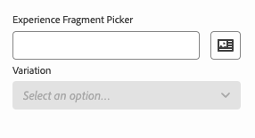

# Definiciones del modelo, campos y tipos de componentes {#field-types}

Obtenga información acerca de los campos y los tipos de componentes que el Editor universal puede editar en el carril de propiedades con ejemplos. Descubra cómo puede instrumentar su propia aplicación creando una definición de modelo y vinculándola al componente.

## Información general {#overview}

Al adaptar sus propias aplicaciones para utilizarlas con el editor universal, debe instrumentar los componentes y definir qué campos y tipos de componentes pueden manipular en el carril de propiedades del editor. Para ello, cree un modelo y vincúlelo a él desde el componente.

Este documento proporciona información general sobre la definición de un modelo, los campos y los tipos de componentes disponibles, así como configuraciones de ejemplo.

>[!TIP]
>
>Si no conoce cómo instrumentar la aplicación para el editor universal, consulte el documento [AEM Información general del editor universal para desarrolladores de.](/help/implementing/universal-editor/developer-overview.md)

## Estructura de definición de modelo {#model-structure}

Para configurar un componente a través del carril de propiedades en el Editor universal, debe existir una definición de modelo y estar vinculada al componente.

La definición del modelo es una estructura JSON que comienza con una matriz de modelos.

```json
[
  {
    "id": "model-id",        // must be unique
    "fields": []             // array of fields which shall be rendered in the properties rail
  }
]
```

Consulte la **[Campos](#fields)** de este documento para obtener más información sobre cómo definir su `fields` matriz.

Para utilizar la definición del modelo con un componente, la variable `data-aue-model` se puede utilizar el atributo.

```html
<div data-aue-resource="urn:datasource:/content/path" data-aue-type="component"  data-aue-model="model-id">Click me</div>
```

## Carga de una definición de modelo {#loading-model}

Una vez creado un modelo, se puede hacer referencia a él como un archivo externo.

```html
<script type="application/vnd.adobe.aue.model+json" src="<url-of-model-definition>"></script>
```

También puede definir el modelo en línea.

```html
<script type="application/vnd.adobe.aue.model+json">
  { ... model definition ... }
</script>
```

## Campos {#fields}

Un objeto de campo tiene la siguiente definición de tipo.

| Configuración | Tipo de valor | Descripción | Requerido |
|---|---|---|---|
| `component` | `ComponentType` | Procesador del componente | Sí |
| `name` | `string` | Propiedad donde se mantendrán los datos | Sí |
| `label` | `FieldLabel` | Etiqueta del campo | Sí |
| `description` | `FieldDescription` | Descripción del campo | No |
| `placeholder` | `string` | Marcador de posición para el campo | No |
| `value` | `FieldValue` | Valor predeterminado | No |
| `valueType` | `ValueType` | La validación estándar puede ser `string`, `string[]`, `number`, `date`, `boolean` | No |
| `required` | `boolean` | ¿El campo es obligatorio? | No |
| `readOnly` | `boolean` | Es el campo de solo lectura | No |
| `hidden` | `boolean` | El campo está oculto de forma predeterminada | No |
| `condition` | `RulesLogic` | Regla para mostrar u ocultar el campo en función de una [condición](/help/implementing/universal-editor/customizing.md#conditionally-hide) | No |
| `multi` | `boolean` | ¿El campo es un campo múltiple? | No |
| `validation` | `ValidationType` | Regla o reglas de validación para el campo | No |
| `raw` | `unknown` | Datos sin procesar que el componente puede utilizar | No |

### Tipos de componentes {#component-types}

A continuación se indican los tipos de componentes que se pueden utilizar para procesar campos.

| Descripción | Tipo de componente |
|---|---|
| [AEM Etiqueta de](#aem-tag) | `aem-tag` |
| [AEM Contenido de](#aem-content) | `aem-content` |
| [Booleana](#boolean) | `boolean` |
| [Grupo de casillas](#checkbox-group) | `checkbox-group` |
| [Contenedor](#container) | `container` |
| [Fragmento de contenido](#content-fragment) | `aem-content-fragment` |
| [Fecha y hora](#date-time) | `date-time` |
| [Multiselect](#multiselect) | `multiselect` |
| [Número](#number) | `number` |
| [Grupo de radio](#radio-group) | `radio-group` |
| [Referencia](#reference) | `reference` |
| [Texto enriquecido](#rich-text) | `rich-text` |
| [Seleccionar](#select) | `select` |
| [Ficha](#tab) | `tab` |
| [Texto](#text) | `text` |

#### AEM Etiqueta de {#aem-tag}

AEM AEM Un tipo de componente de etiqueta de habilita un selector de etiquetas de, que se puede utilizar para adjuntar etiquetas al componente.

>[!BEGINTABS]

>[!TAB Muestra]

```json
{
  "id": "aem-tag-picker",
  "fields": [
    {
      "component": "aem-tag",
      "label": "AEM Tag Picker",
      "name": "cq:tags",
      "valueType": "string"
    }
  ]
}
```

>[!TAB Captura de pantalla]


>[!ENDTABS]

#### AEM Contenido de {#aem-content}

AEM AEM Un tipo de componente de contenido de habilita un selector de contenido de la aplicación, que se puede utilizar para establecer referencias de contenido.

>[!BEGINTABS]

>[!TAB Muestra]

```json
{
  "id": "aem-content-picker",
  "fields": [
    {
      "component": "aem-content",
      "name": "reference",
      "value": "",
      "label": "AEM Content Picker",
      "valueType": "string"
    }
  ]
}
```

>[!TAB Captura de pantalla]


>[!ENDTABS]

#### Booleano {#boolean}

Un tipo de componente booleano almacena un valor true/false simple procesado como alternancia. Ofrece un tipo de validación adicional.

| Tipo de validación | Tipo de valor | Descripción | Requerido |
|---|---|---|---|
| `customErrorMsg` | `string` | Mensaje que se muestra si el valor introducido no es un valor booleano | No |

>[!BEGINTABS]

>[!TAB Muestra 1]

```json
{
  "id": "boolean",
  "fields": [
    {
      "component": "boolean",
      "label": "Boolean",
      "name": "boolean",
      "valueType": "boolean"
    }
  ]
}
```

>[!TAB Muestra 2]

```json
{
  "id": "another-boolean",
  "fields": [
    {
      "component": "boolean",
      "label": "Boolean",
      "name": "boolean",
      "valueType": "boolean",
      "validation": {
        "customErrorMsg": "Think, McFly. Think!"
      }
    }
  ]
}
```

>[!TAB Captura de pantalla]


>[!ENDTABS]

#### Grupo de casillas de verificación {#checkbox-group}

Similar a un booleano, un tipo de componente de grupo de casillas de verificación permite la selección de varios elementos true/false, representados como varias casillas de verificación.

>[!BEGINTABS]

>[!TAB Muestra]

```json
{
  "id": "checkbox-group",
  "fields": [
    {
      "component": "checkbox-group",
      "label": "Checkbox Group",
      "name": "checkbox",
      "valueType": "string[]",
      "options": [
        { "name": "Option 1", "value": "option1" },
        { "name": "Option 2", "value": "option2" }
      ]
    }
  ]
}
```

>[!TAB Captura de pantalla]


>[!ENDTABS]

#### Contenedor {#container}

Un tipo de componente contenedor permite agrupar componentes. Ofrece una configuración adicional.

| Configuración | Tipo de valor | Descripción | Requerido |
|---|---|---|---|
| `collapsible` | `boolean` | ¿El contenedor es contraíble? | No |

>[!BEGINTABS]

>[!TAB Muestra]

```json
 {
  "id": "container",
  "fields": [
    {
      "component": "container",
      "label": "Container",
      "name": "container",
      "valueType": "string",
      "collapsible": true,
      "fields": [
        {
          "component": "text-input",
          "label": "Simple Text 1",
          "name": "text",
          "valueType": "string"
        },
        {
          "component": "text-input",
          "label": "Simple Text 2",
          "name": "text2",
          "valueType": "string"
        }
      ]
    }
  ]
}
```

>[!TAB Captura de pantalla]


>[!ENDTABS]

#### Fragmento de contenido {#content-fragment}

El selector de fragmentos de contenido se puede utilizar para seleccionar un [Fragmento de contenido](/help/sites-cloud/authoring/fragments/content-fragments.md) y sus variaciones (si es necesario). Ofrece una configuración adicional.

| Configuración | Tipo de valor | Descripción | Requerido |
|---|---|---|---|
| `variationName` | `string` | Nombre de variable para almacenar la variación seleccionada. Si no se define, no se muestra ningún selector de variaciones | No |

>[!BEGINTABS]

>[!TAB Muestra 1]

```json
[
  {
    "id": "aem-content-fragment",
    "fields": [
      {
        "component": "aem-content-fragment",
        "name": "picker",
        "label": "Content Fragment Picker",
        "valueType": "string",
        "variationName": "contentFragmentVariation"
      }
    ]
  }
]
```

>[!TAB Captura de pantalla]


>[!ENDTABS]

#### Fecha y hora {#date-time}

Un tipo de componente de fecha y hora permite especificar una fecha, una hora o una combinación de ambas. Ofrece configuraciones adicionales.

| Configuración | Tipo de valor | Descripción | Requerido |
|---|---|---|---|
| `displayFormat` | `string` | Formato con el que se muestra la cadena de fecha | Sí |
| `valueFormat` | `string` | Formato en el que se almacenará la cadena de fecha | Sí |

También ofrece un tipo de validación adicional.

| Tipo de validación | Tipo de valor | Descripción | Requerido |
|---|---|---|---|
| `customErrorMsg` | `string` | Mensaje que se mostrará si `valueFormat` no se cumple | No |

>[!BEGINTABS]

>[!TAB Muestra 1]

```json
{
  "id": "date-time",
  "fields": [
    {
      "component": "date-time",
      "label": "Date & Time",
      "name": "date",
      "valueType": "date"
    }
  ]
}
```

>[!TAB Muestra 2]

```json
{
  "id": "another-date-time",
  "fields": [
    {
      "component": "date-time",
       "valueType": "date-time",
      "name": "field1",
      "label": "Date Time",
      "description": "This is a date time field that stores both date and time.",
      "required": true,
      "placeholder": "YYYY-MM-DD HH:mm:ss",
      "displayFormat": null,
      "valueFormat": null,
      "validation": {
        "customErrorMsg": "Marty! You have to come back with me!"
      }
    },
    {
      "component": "date-time",
      "valueType": "date",
      "name": "field2",
      "label": "Another Date Time",
      "description": "This is another date time field that only stores the date.",
      "required": true,
      "placeholder": "YYYY-MM-DD",
      "displayFormat": null,
      "valueFormat": null,
      "validation": {
        "customErrorMsg": "Back to the future!"
      }
    },
    {
      "component": "date-time",
      "valueType": "time",
      "name": "field3",
      "label": "Yet Another Date Time",
      "description": "This is another date time field that only stores the time.",
      "required": true,
      "placeholder": "HH:mm:ss",
      "displayFormat": null,
      "valueFormat": null,
      "validation": {
        "customErrorMsg": "Great Scott!"
      }
    }
  ]
}
```

>[!TAB Captura de pantalla]


>[!ENDTABS]

#### Fragmento de experiencias {#experience-fragment}

El selector de Fragmento de experiencia se puede utilizar para seleccionar una [Fragmento de experiencia](/help/sites-cloud/authoring/fragments/experience-fragments.md) y sus variaciones (si es necesario). Ofrece una configuración adicional.

| Configuración | Tipo de valor | Descripción | Requerido |
|---|---|---|---|
| `variationName` | `string` | Nombre de variable para almacenar la variación seleccionada. Si no se define, no se muestra ningún selector de variaciones | No |

>[!BEGINTABS]

>[!TAB Muestra 1]

```json
[
  {
    "id": "aem-experience-fragment",
    "fields": [
      {
        "component": "aem-experience-fragment",
        "name": "picker",
        "label": "Experience Fragment Picker",
        "valueType": "string",
        "variationName": "experienceFragmentVariation"
      }
    ]
  }
]
```

>[!TAB Captura de pantalla]



>[!ENDTABS]


#### Multiselect {#multiselect}

Un tipo de componente de selección múltiple presenta varios elementos para su selección en una lista desplegable, incluida la capacidad de agrupar los elementos seleccionables.

>[!BEGINTABS]

>[!TAB Muestra 1]

```json
{
  "id": "multiselect",
  "fields": [
    {
      "component": "multiselect",
      "name": "multiselect",
      "label": "Multi Select",
      "valueType": "string",
      "options": [
        { "name": "Option 1", "value": "option1" },
        { "name": "Option 2", "value": "option2" }
      ]
    }
  ]
}
```

>[!TAB Muestra 2]

```json
{
  "id": "multiselect-grouped",
  "fields": [
    {
      "component": "multiselect",
      "name": "property",
      "label": "Multiselect field",
      "valueType": "string",
      "required": true,
      "maxSize": 2,
      "options": [
        {
          "name": "Theme",
          "children": [
            { "name": "Light", "value": "light" },
            { "name": "Dark",  "value": "dark" }
          ]
        },
        {
          "name": "Type",
          "children": [
            { "name": "Alpha", "value": "alpha" },
            { "name": "Beta", "value": "beta" },
            { "name": "Gamma", "value": "gamma" }
          ]
        }
      ]
    }
  ]
}
```

>[!TAB Capturas de pantalla]


>[!ENDTABS]

#### Número {#number}

Un tipo de componente numérico permite introducir un número. Ofrece tipos de validación adicionales.

| Tipo de validación | Tipo de valor | Descripción | Requerido |
|---|---|---|---|
| `numberMin` | `number` | Número mínimo permitido | No |
| `numberMax` | `number` | Número máximo permitido | No |
| `customErrorMsg` | `string` | Mensaje que se mostrará si `numberMin` o `numberMax` no se cumple | No |

>[!BEGINTABS]

>[!TAB Muestra 1]

```json
{
  "id": "number",
  "fields": [
    {
      "component": "number",
      "name": "number",
      "label": "Number",
      "valueType": "number",
      "value": 0
    }
  ]
}
```

>[!TAB Muestra 2]

```json
{
  "id": "another-number",
  "fields": [
   {
      "component": "number",
      "valueType": "number",
      "name": "field1",
      "label": "Number Field",
      "description": "This is a number field.",
      "required": true,
      "placeholder": null,
      "validation": {
        "numberMin": 0,
        "numberMax": 88,
        "customErrorMsg": "You also need 1.21 gigawatts."
      }
    }
  ]
}
```

>[!TAB Captura de pantalla]


>[!ENDTABS]

#### Grupo de radio {#radio-group}

Un tipo de componente de grupo de radio permite una selección mutuamente excluyente de varias opciones representadas como un grupo similar a un grupo de casillas de verificación.

>[!BEGINTABS]

>[!TAB Muestra]

```json
{
  "id": "radio-group",
  "fields": [
    {
      "component": "radio-group",
      "label": "Radio Group",
      "name": "radio",
      "valueType": "string",
      "options": [
        { "name": "Option 1", "value": "option1" },
        { "name": "Option 2", "value": "option2" }
      ]
    }
  ]
}
```

>[!TAB Captura de pantalla]


>[!ENDTABS]

#### Referencia {#reference}

Un tipo de componente de referencia permite hacer referencia a otro objeto de datos del objeto actual.

>[!BEGINTABS]

>[!TAB Muestra]

```json
{
  "id": "reference",
  "fields": [
    {
      "component": "reference",
      "label": "Reference",
      "name": "reference",
      "valueType": "string"
    }
  ]
}
```

>[!TAB Captura de pantalla]


>[!ENDTABS]

#### Texto enriquecido {#rich-text}

El texto enriquecido permite la entrada de texto enriquecido multilínea. Ofrece tipos de validación adicionales.

| Tipo de validación | Tipo de valor | Descripción | Requerido |
|---|---|---|---|
| `maxSize` | `number` | Número máximo de caracteres permitidos | No |
| `customErrorMsg` | `string` | Mensaje que se mostrará si `maxSize` se ha superado | No |

>[!BEGINTABS]

>[!TAB Muestra 1]

```json
{
  "id": "richtext",
  "fields": [
    {
      "component": "richtext",
      "name": "rte",
      "label": "Rich Text",
      "valueType": "string"
    }
  ]
}
```

>[!TAB Muestra 2]

```json
{
  "id": "another-richtext",
  "fields": [
    {
      "component": "richtext",
      "name": "rte",
      "label": "Rich Text",
      "valueType": "string",
      "validation": {
        "maxSize": 1000,
        "customErrorMsg": "That's about as funny as a screen door on a battleship."
      }
    }
  ]
}
```

>[!TAB Captura de pantalla]


>[!ENDTABS]

#### Seleccionar {#select}

Un tipo de componente Seleccionar permite seleccionar una sola opción de una lista de opciones predefinidas en un menú desplegable.

>[!BEGINTABS]

>[!TAB Muestra]

```json
{
  "id": "select",
  "fields": [
    {
      "component": "select",
      "label": "Select",
      "name": "select",
      "valueType": "string",
      "options": [
        { "name": "Option 1", "value": "option1" },
        { "name": "Option 2", "value": "option2" }
      ]
    }
  ]
}
```

>[!TAB Captura de pantalla]


>[!ENDTABS]

#### Pestaña {#tab}

Un tipo de componente de pestaña le permite agrupar otros campos de entrada en varias pestañas para mejorar la organización del diseño para los autores.

A `tab` definición se puede considerar como un separador en la matriz de `fields`. Todo lo que viene después de un `tab` se colocará en esa pestaña hasta que se cree un nuevo `tab` se encuentra, después de lo cual los siguientes elementos se colocarán en la nueva pestaña.

Si desea que los elementos aparezcan encima de todas las pestañas, deben definirse antes que las pestañas.

>[!BEGINTABS]

>[!TAB Muestra]

```json
{
  "id": "tab",
  "fields": [
    {
      "component": "tab",
      "label": "Tab 1",
      "name": "tab1"
    },
    {
      "component": "text-input",
      "label": "Text 1",
      "name": "text1",
      "valueType": "string"
    },
    {
      "component": "tab",
      "label": "Tab 2",
      "name": "tab2"
    },
    {
      "component": "text-input",
      "label": "Text 2",
      "name": "text2",
      "valueType": "string"
    }
  ]
}
```

>[!TAB Captura de pantalla]


>[!ENDTABS]

#### Texto {#text}

El texto permite introducir una sola línea de texto.  Incluye tipos de validación adicionales.

| Tipo de validación | Tipo de valor | Descripción | Requerido |
|---|---|---|---|
| `minLength` | `number` | Número mínimo de caracteres permitidos | No |
| `maxLength` | `number` | Número máximo de caracteres permitidos | No |
| `regExp` | `string` | Expresión regular con la que debe coincidir el texto de entrada | No |
| `customErrorMsg` | `string` | Mensaje que se mostrará si `minLength`, `maxLength`, y/o `regExp` es/son violados | No |

>[!BEGINTABS]

>[!TAB Muestra 1]

```json
{
  "id": "simpletext",
  "fields": [
    {
      "component": "text",
      "name": "text",
      "label": "Simple Text",
      "valueType": "string"
    }
  ]
}
```

>[!TAB Muestra 2]

```json
{
  "id": "another simpletext",
  "fields": [
    {
      "component": "text",
      "name": "text",
      "label": "Simple Text",
      "valueType": "string",
      "description": "This is a text input with validation.",
      "required": true,
      "validation": {
        "minLength": 1955,
        "maxLength": 1985,
        "regExp": "^foo:.*",
        "customErrorMsg": "Why don't you make like a tree and get outta here?"
      }
    }
  ]
}
```

>[!TAB Captura de pantalla]


>[!ENDTABS]
