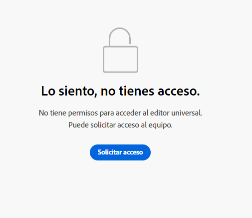

# Introducción al Editor universal en AEM {#getting-started}

Obtenga información sobre cómo acceder al Editor universal y cómo instrumentar la primera aplicación de AEM para utilizarla.

>[!TIP]
>
>Si prefiere bucear directamente en un ejemplo, puede revisar la [Aplicación de muestra del Editor universal en GitHub.](https://github.com/adobe/universal-editor-sample-editable-app)

## Pasos para la incorporación {#onboarding}

Aunque el Editor universal puede editar contenido desde cualquier fuente, este documento utilizará una aplicación AEM como ejemplo.

Hay varios pasos para incorporar la aplicación de AEM e instrumentarla para utilizar el editor universal.

1. [Solicite acceso al Editor universal.](#request-access)
1. [Incluya la biblioteca principal del Editor universal.](#core-library)
1. [Añada la configuración OSGi necesaria.](#osgi-configurations)
1. [Instrumente la página.](#instrument-page)

Este documento le guiará a través de estos pasos.

## Solicitar acceso al editor universal {#request-access}

Primero debe solicitar acceso al Editor universal. Vaya a [https://experience.adobe.com/#/aem/editor,](https://experience.adobe.com/#/aem/editor) inicie sesión y valide si tiene acceso al Editor universal.

En caso de que no tenga acceso, puede solicitarlo a través de un formulario vinculado en la misma página.



Haga clic en **Solicitud de acceso** y rellene el formulario como se le indica para solicitar acceso. Un representante del Adobe revisará su solicitud y contactará con para analizar su caso de uso.

## Incluir la biblioteca principal del editor universal {#core-library}

Para que la aplicación se pueda instrumentar para su uso con el Editor universal, debe incluir la siguiente dependencia.

```javascript
@adobe/universal-editor-cors
```

Para activar la instrumentación, debe agregarse la siguiente importación a su `index.js`.

```javascript
import "@adobe/universal-editor-cors";
```

### Alternativa para aplicaciones no reaccionadas {#alternative}

Si no va a implementar una aplicación React o requiere procesamiento en el lado del servidor, un método alternativo es incluir lo siguiente en el cuerpo del documento.

```html
<script src="https://cdn.jsdelivr.net/gh/adobe/universal-editor-cors/dist/universal-editor-embedded.js" async></script>
```

## Añadir las configuraciones de OSGi necesarias {#osgi-configurations}

Para poder editar AEM contenido con la aplicación mediante el editor universal, la configuración de cookies y CORS debe realizarse en AEM.

Lo siguiente [Las configuraciones de OSGi deben configurarse en la instancia de creación de AEM.](/help/implementing/deploying/configuring-osgi.md)

* `SameSite Cookies = None` en `com.day.crx.security.token.impl.impl.TokenAuthenticationHandler`
* Elimine los OPTIONS X-FRAME: Encabezado SAMEORIGIN `org.apache.sling.engine.impl.SlingMainServlet`

### com.day.crx.security.token.impl.impl.TokenAuthenticationHandler {#samesite-cookies}

La cookie del token de inicio de sesión debe enviarse a AEM como un dominio de terceros. Por lo tanto, la cookie del mismo sitio debe configurarse explícitamente como `None`.

Esta propiedad debe establecerse en la variable `com.day.crx.security.token.impl.impl.TokenAuthenticationHandler` Configuración de OSGi.

```xml
<?xml version="1.0" encoding="UTF-8"?>
<jcr:root xmlns:sling="http://sling.apache.org/jcr/sling/1.0"
          xmlns:jcr="http://www.jcp.org/jcr/1.0" jcr:primaryType="sling:OsgiConfig"
          token.samesite.cookie.attr="None" />
```

### org.apache.sling.engine.impl.SlingMainServlet {#sameorigin}

X-Frame-Options: SAMEORIGIN evita el procesamiento de páginas AEM dentro de un iframe. Al eliminar el encabezado, se pueden cargar las páginas.

Esta propiedad debe establecerse en la variable `org.apache.sling.engine.impl.SlingMainServlet` Configuración de OSGi.

```xml
<?xml version="1.0" encoding="UTF-8"?>
<jcr:root xmlns:sling="http://sling.apache.org/jcr/sling/1.0"
          xmlns:jcr="http://www.jcp.org/jcr/1.0"
          jcr:primaryType="sling:OsgiConfig"
          sling.additional.response.headers="[X-Content-Type-Options=nosniff]"/>
```

## Instrumentación de la página {#instrument-page}

El servicio Editor universal requiere un [nombre de recurso uniforme (URN)](https://en.wikipedia.org/wiki/Uniform_Resource_Name) para identificar y utilizar el sistema back-end correcto para el contenido de la aplicación que se está editando. Por lo tanto, se requiere un esquema URN para volver a asignar contenido a los recursos de contenido.

Los atributos de instrumentación agregados a la página constan principalmente de [Microdatos del HTML,](https://developer.mozilla.org/en-US/docs/Web/HTML/Microdata) un estándar del sector que también puede utilizarse para hacer que el HTML sea más semántico, hacer que los documentos HTML sean indexables, etc.

### Creación de conexiones {#connections}

Las conexiones que se utilizan en la aplicación se almacenan como `<meta>` etiquetas en la página `<head>`.

```html
<meta name="urn:auecon:<referenceName>" content="<protocol>:<url>">
```

* `<referenceName>` - Se trata de un nombre corto que se reutiliza en el documento para identificar la conexión. Por ejemplo, `aemconnection`
* `<protocol>` : indica qué complemento de persistencia utilizar del servicio de persistencia del editor universal. Por ejemplo, `aem`
* `<url>` - Esta es la URL del sistema en el que deben persistir los cambios. Por ejemplo, `http://localhost:4502`

El identificador corto `auecon` significa Conexión con el Editor universal de Adobe.

`itemid`s utilizará la variable `urn` para abreviar el identificador.

```html
itemid="urn:<referenceName>:<resource>"
```

* `<referenceName>` - Esta es la referencia denominada mencionada en la `<meta>` etiqueta. Por ejemplo, `aemconnection`
* `<resource>` : es un puntero al recurso en el sistema de destino. Por ejemplo, una ruta de contenido AEM como `/content/page/jcr:content`

>[!TIP]
>
>Consulte el documento [Atributos y tipos](attributes-types.md) para obtener más información sobre los atributos y tipos de datos que requiere el editor universal.

### Conexión de ejemplo {#example}

```html
<html>
<head>
    <meta name="urn:auecon:aemconnection" content="aem:https://localhost:4502">
    <meta name="urn:auecon:fcsconnection" content="fcs:https://example.franklin.adobe.com/345fcdd">
</head>
<body>
        <aside>
          <ul itemscope itemid="urn:aemconnection:/content/example/list" itemtype="container">
            <li itemscope itemid="urn:aemconnection/content/example/listitem" itemtype="component">
              <p itemprop="name" itemtype="text">Jane Doe</p>
              <p itemprop="title" itemtype="text">Journalist</p>
              
            </li>
 
...
 
            <li itemscope itemid="urn:fcsconnection:/documents/mytext" itemtype="component">
              <p itemprop="name" itemtype="text">John Smith</p>
              <p itemid="urn:aemconnection/content/example/another-source" itemprop="title" itemtype="text">Photographer</p>
              
            </li>
          </ul>
        </aside>
</body>
</html>
```

## Está listo para usar el editor universal {#youre-ready}

La aplicación ya está instrumentada para utilizar el editor universal.

Consulte el documento [Creación de contenido con el editor universal](authoring.md) para aprender lo fácil e intuitivo que es para los autores de contenido crear contenido con el editor universal.

## Recursos adicionales {#additional-resources}

Para obtener más información sobre el Editor universal, consulte estos documentos.

* [Introducción al Editor universal](introduction.md) : Descubra cómo el Editor universal permite editar cualquier aspecto de cualquier contenido en cualquier implementación para ofrecer experiencias excepcionales, aumentar la velocidad de contenido y proporcionar una experiencia de desarrollador de última generación.
* [Creación de contenido con el editor universal](authoring.md) : Aprenda lo fácil e intuitivo que es para los autores de contenido crear contenido con el Editor universal.
* [Publicación de contenido con el Editor universal](publishing.md) : Descubra cómo el Editor visual universal publica contenido y cómo sus aplicaciones pueden gestionar el contenido publicado.
* [Arquitectura de editor universal](architecture.md) - Obtenga información sobre la arquitectura del Editor universal y cómo fluyen los datos entre sus servicios y capas.
* [Atributos y tipos](attributes-types.md) : Obtenga información sobre los atributos y tipos de datos que requiere el Editor universal.
* [Autenticación del editor universal](authentication.md) - Obtenga información sobre cómo se autentica el editor universal.
