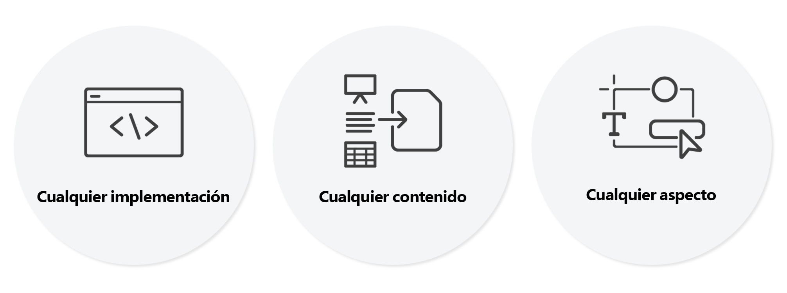

# Introducción al editor visual universal {#introduction}

Descubra cómo el editor visual universal (también conocido como editor universal) habilita la edición de lo que se ve es lo que se obtiene (WYSIWYG) de cualquier experiencia sin encabezado y con encabezado. Descubra cómo puede ayudar a los autores de contenido a ofrecer contenidos excepcionales y mayor velocidad, y una experiencia de última generación a los desarrolladores.

## Fondo {#background}

La herramienta más potente para crear contenido en AEM fue el editor de páginas. El editor de páginas ofrece una experiencia de creación WYSIWYG intuitiva, visual y en contexto, que requiere una formación mínima y muestra a los autores cómo aparecerá el contenido exactamente.

Sin embargo, el editor de páginas solo puede editar contenidos, estructuras y componentes de las páginas de AEM. Sin embargo, en la actualidad, el contenido rara vez proviene de una sola ubicación. El editor universal ofrece la misma experiencia de edición in situ que el editor de páginas, pero para todos los aspectos de los contenidos en cualquier implementación.

## Verdaderamente universal {#universal}

El editor universal puede instrumentarse para cualquier implementación, contenido y aspecto del contenido.

### Cualquier implementación {#any-implementation}

Dado que las experiencias se pueden crear de muchas formas, cualquier implementación puede aprovechar el editor universal para que los autores puedan editar en contexto.

Los usuarios suelen pensar que una implementación sin encabezado limita a los autores a editar todo el contenido en una IU basada en formularios, pero esto no es cierto con el editor universal.

Los requisitos de una implementación para aprovechar el editor universal son muy sencillos y compatibles con lo siguiente:

* **Cualquier arquitectura**: procesamiento del lado del servidor, procesamiento del lado del borde, procesamiento del lado del cliente, etc.
* **Cualquier marco**: Vanilla AEM o cualquier estructura de terceros como React, Next.js, Angular, etc.
* **Cualquier alojamiento**: se puede alojar localmente en AEM o en un dominio remoto.

### Cualquier contenido {#any-content}

Un autor de contenido debe tener la misma experiencia de edición potente que ofrecía anteriormente el editor de páginas de AEM. Sin embargo, el dditor universal permite a los autores de contenido editar **cualquier** contenido visual y en contexto. Admite lo siguiente:

* **Estructuras de página de AEM**: `cq:Components` anidados de `cq:Pages`, incluidos los fragmentos de experiencias.
* **Fragmentos de contenido de AEM**: edite el contenido de los fragmentos de contenido tal y como aparecen en el contexto de la experiencia.
* **Documentos**: la prueba de conceptos ha demostrado que también los documentos de Word, Excel, Google Docs o Markdown pueden editarse de la misma manera (esto está en progreso).

### Cualquier aspecto {#any-aspect}

Para un autor de contenidos, estos no se limitan a la información que contienen, sino a cómo se presentan y reciben. El contenido viene con metadatos adicionales y reglas de instrumentación que el editor universal puede comprender y editar, como por ejemplo:

* **Aplicación de diseño y estilo**: mediante un sistema de estilos, el profesional del marketing y el autor de contenido pueden aplicar distintos estilos a su contenido y crear diferentes diseños, como columnas, carruseles, pestañas, acordeones, etc.

## Valor {#value}

Al desvincular la experiencia de edición de contenido de cualquier sistema de envío en particular, el editor se vuelve universal y flexible, lo que permite al autor ofrecer experiencias excepcionales, aumentar la velocidad y proporcionar una experiencia de desarrollo de última generación.

* **Ofrecer experiencias excepcionales**: para que los profesionales creen una experiencia atractiva para los visitantes, el editor universal les permite generar y editar el contenido en el contexto de la vista previa. Esto les permite crear contenido que se ajuste al diseño de la experiencia y que constituya un recorrido significativo para los visitantes.
* **Aumentar la velocidad del contenido**: para simplificar el flujo de trabajo de administración de los profesionales, el editor universal permite editar contenido en la vista previa para guiarlos, mostrando solo las opciones que son relevantes para ese contexto. Con ello, el flujo de trabajo es independiente de las fuentes de contenido.
* **Experiencia de desarrollo de última generación**: para adaptarse al heterogéneo panorama de aplicaciones del mundo real, el editor universal está totalmente separado y es independiente de la tecnología, lo que permite a los desarrolladores utilizar su pila tecnológica preferida para implementar la experiencia.

## Editor visual universal y Editor de fragmentos de contenido {#universal-editor-content-fragment-editor}

A primera vista, puede parecer que el editor visual universal y el editor de fragmentos de contenido proporcionan funciones de edición similares. Sin embargo, estos editores ofrecen capacidades muy diferentes y ejecutan diferentes trabajos del profesional del marketing.

### Editor de fragmentos de contenido {#content-fragment-editor}

Un profesional del marketing quiere crear contenido sin tener que preocuparse por su diseño, de modo que se pueda reutilizar en numerosos contextos de la experiencia.

* El trabajo subyacente que se debe llevar a cabo es escalar la estrategia de contenido.

### Editor visual universal {#universal-editor}

Un profesional del marketing quiere crear contenido que esté adaptado al diseño de un contexto determinado para ofrecer una experiencia excepcional.

* El trabajo subyacente que hay que realizar es conectar de manera convincente con los lectores.

## Hoja de ruta {#road-map}

Es importante señalar que el editor universal está en progreso y algunas de las capacidades que se describen en este documento son una visión del editor final, no necesariamente representativas de sus capacidades actuales.

Hable con su contacto de Adobe para obtener más información sobre las próximas funciones planificadas para el editor universal.

## Recursos adicionales {#additional-resources}

Para obtener más información acerca del editor universal, consulte estos documentos.

* [Creación de contenido con el editor universal](authoring.md): aprenda lo fácil e intuitivo que es para los autores de contenido crearlo con el editor universal.
* [Publicación de contenido con el editor universal](publishing.md): descubra cómo el editor visual universal publica contenido y cómo sus aplicaciones pueden gestionar el publicado.
* [Introducción al editor universal en AEM](getting-started.md): obtenga información sobre cómo acceder al editor universal y cómo instrumentar la primera aplicación de AEM para utilizarlo.
* [Arquitectura del editor universal](architecture.md): obtenga información acerca de la arquitectura del editor universal y cómo fluyen los datos entre sus servicios y capas.
* [Atributos y tipos](attributes-types.md): obtenga información acerca de los atributos y tipos de datos que requiere el editor universal.
* [Autenticación del editor universal](authentication.md): obtenga información sobre cómo se autentica el editor universal.
