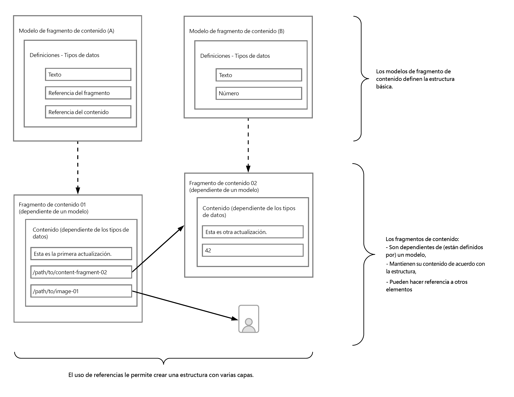

# Descubra los conceptos básicos del modelado de contenido sin encabezado con AEM {#content-modeling-headless-basics}

## La historia hasta ahora {#story-so-far}

Al principio del [Recorrido de arquitecto de contenido sin encabezado de AEM](overview.md), la [Introducción](introduction.md) abarcaba los conceptos básicos y la terminología relevantes para el modelado de contenido sin encabezado.

Este artículo se basa en estos principios para que pueda comprender cómo modelar el contenido para su proyecto de AEM sin encabezado.

## Objetivo {#objective}

* **Público**: principiante
* **Objetivo**: introduzca los conceptos de Modelado de contenido sin encabezado de CMS.

## Modelado de contenido con modelos de fragmento de contenido {#architect-content-fragment-models}

El modelado de contenido o de datos es un conjunto de técnicas establecidas, que a menudo se utilizan cuando se desarrollan las bases de datos de relaciones, entonces ¿qué significa el modelado de contenido sin encabezado de AEM?

### ¿Por qué? {#why}

Para garantizar que su aplicación pueda solicitar y recibir de forma consistente y eficiente el contenido necesario de AEM, debe estar estructurado.

Esto significa que la aplicación conoce de antemano la forma de respuesta y, por lo tanto, cómo procesarla. Esto es mucho más fácil que recibir contenido de forma libre, que debe analizarse para determinar qué contiene y, por lo tanto, cómo puede utilizarse.

### Introducción a ¿Cómo hacerlo? {#how}

AEM utiliza fragmentos de contenido para proporcionar las estructuras necesarias para la entrega sin encabezado del contenido en las aplicaciones.

La estructura del modelo de contenido:

* Se consigue mediante la definición del modelo de fragmento de contenido.
* Se utiliza como base de los fragmentos de contenido utilizados para la generación de contenido.

>[!NOTE]
>
>Los modelos de fragmento de contenido también se utilizan como base de los esquemas de GraphQL de AEM, que se utilizan para recuperar el contenido. Encuentre más información al respecto en el Recorrido para desarrolladores.

Las solicitudes de contenido se realizan mediante la API de AEM, GraphQL, una implementación personalizada de la API de GraphQL estándar. La API de AEM, GraphQL, permite que las aplicaciones realicen consultas complejas en sus fragmentos de contenido; cada consulta se realiza según un tipo de modelo específico.

Las aplicaciones pueden utilizar el contenido devuelto.

## Creación de la estructura con modelos de fragmento de contenido {#create-structure-content-fragment-models}

Los modelos de fragmento de contenido proporcionan varios mecanismos que permiten definir la estructura del contenido.

Un modelo de fragmento de contenido describe una entidad.

>[!NOTE]
>La funcionalidad de fragmento de contenido debe estar habilitada en el explorador de configuración para poder crear modelos nuevos.

>[!TIP]
>
>Se debe asignar un nombre al modelo para que el autor del contenido sepa qué modelo seleccionar al crear un fragmento de contenido.

Dentro de un modelo:

1. Los **Tipos de datos** permiten definir los atributos individuales.
Por ejemplo, defina el campo que contiene el nombre de un profesor como **Texto** y sus años de servicio como un **Número**.
1. Los tipos de datos **Referencia de contenido** y **Referencia de fragmento** permiten crear relaciones con otro contenido dentro de AEM.
1. El tipo de datos **referencia de fragmento** le permite obtener varios niveles de estructura anidando los fragmentos de contenido (según el tipo de modelo). Esto es importante para el modelado de contenido.

Por ejemplo:

## Tipos de datos {#data-types}

AEM proporciona los siguientes tipos de datos para modelar el contenido:

* Texto de línea única
* Texto multilínea
* Número
* Booleano
* Fecha y hora
* Enumeración
* Etiquetas
* Referencia al fragmento
* Referencia de fragmento (UUID)
* Referencia de contenido
* Referencia de contenido (UUID)
* Objeto JSON
* Marcador de posición de pestaña

>[!NOTE]
>
>Encontrará más información en Modelos de fragmento de contenido: tipos de datos.

## Referencias y contenido anidado {#references-nested-content}

Dos tipos de datos proporcionan referencias al contenido fuera de un fragmento específico:

* **Referencia de contenido**/**Referencia de contenido (UUID)**
Proporciona una sencilla referencia a otro contenido de cualquier tipo.
Por ejemplo, puede hacer referencia a una imagen en una ubicación específica.

* **Referencia de fragmento**/**Referencia de fragmento (UUID)**
Proporciona referencias a otros fragmentos de contenido.
Este tipo de referencia se utiliza para crear contenido anidado e introduce las relaciones necesarias para modelar el contenido.
El tipo de datos se puede configurar para que los autores de fragmentos puedan hacer lo siguiente:
   * Editar directamente el fragmento al que se hace referencia.
   * Crear un nuevo fragmento de contenido basado en el modelo apropiado

>[!NOTE]
>
>También puede crear referencias improvisadas utilizando vínculos dentro de bloques de texto.

>[!NOTE]
>
>En el editor, las referencias UUID especifican la ruta al recurso al que se hace referencia; internamente, estas referencias se mantienen como ID únicos universales (UUID) que hacen referencia a los recursos.

## Niveles de estructura (fragmentos anidados) {#levels-of-structure-nested-fragments}

Para modelar contenido, el tipo de datos **Referencia a fragmentos** le permite crear varios niveles de estructura y relaciones.

Con esta referencia, puede *conectar* varios modelos de fragmento de contenido para representar las interrelaciones. Esto permite que la aplicación sin encabezado siga las conexiones y acceda al contenido según sea necesario.

>[!NOTE]
>
>Esto debe usarse con precaución y la práctica recomendada se define como *anidar todo lo necesario, pero lo menos posible*.

Las referencias a fragmentos hacen precisamente eso: le permiten hacer referencia a otro fragmento.

Por ejemplo, puede que tenga definidos los siguientes modelos de fragmento de contenido:

* Ciudad
* Compañía
* Persona
* Premios

Parece bastante sencillo, pero una Compañía tiene un director ejecutivo (CEO) y empleados…y todas ellas se definen como una persona.

Una persona puede obtener un premio (o tal vez dos).

* Mi compañía: compañía
   * CEO: persona
   * Empleado(s): persona
      * Premio(s) personal(es): premio

Y esto es solo para empezar. Según la complejidad, un premio podría ser específico de una compañía, o una compañía podría tener su oficina principal en una ciudad específica.

Representar estas interrelaciones se puede lograr con Referencias a fragmentos, tal como usted (el arquitecto), el autor del contenido y las aplicaciones sin encabezado lo entienden.

## Siguientes pasos {#whats-next}

Ahora que ha aprendido lo básico, el siguiente paso consiste en [Obtener información sobre la creación de modelos de fragmento de contenido en AEM](model-structure.md). Esto introducirá y tratará las distintas referencias disponibles, y cómo crear niveles de estructura con las Referencias a fragmentos, una parte clave del modelado para el contenido sin encabezado.

## Recursos adicionales {#additional-resources}

* [Modelos de fragmento de contenido](/help/sites-cloud/administering/content-fragments/managing-content-fragment-models.md)

   * [Modelos de fragmento de contenido: tipos de datos](/help/sites-cloud/administering/content-fragments/content-fragment-models.md#data-types)

* [Conceptos de creación](/help/sites-cloud/authoring/author-publish.md)

* [Gestión básica](/help/sites-cloud/authoring/basic-handling.md): esta página se basa principalmente en la consola **Sites**, pero muchas funciones (la mayoría de ellas) también son relevantes para la creación de **Fragmentos de contenido** en la consola **Recursos**.

* [Trabajar con fragmentos de contenido](/help/sites-cloud/administering/content-fragments/overview.md)
