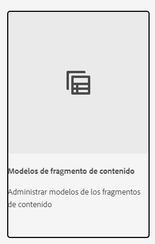

# Obtenga información acerca de la creación de modelos de fragmento de contenido en AEM {#architect-headless-content-fragment-models}

## La historia hasta ahora {#story-so-far}

Al principio del [recorrido de autor de contenido sin encabezado de AEM](overview.md), los [Conceptos básicos de modelado de contenido para usuarios sin encabezado con AEM](basics.md) abarcaban los conceptos básicos y la terminología relevantes para la creación sin encabezado.

Este artículo se basa en estos modelos para que pueda comprender cómo crear sus propios modelos de fragmento de contenido para su proyecto sin encabezado de AEM.

## Objetivo {#objective}

* **Audiencia**: principiante
* **Objetivo**: obtener conceptos y mecanismos de modelado de contenido para su CMS sin encabezado utilizando los modelos de fragmentos de contenido.

<!-- which persona does this? -->
<!-- and who allows the configuration on the folders? -->

<!--
## Enabling Content Fragment Models {#enabling-content-fragment-models}

At the very start you need to enable Content Fragment Models for your site, this is done in the Configuration Browser; under Tools -> General -> Configuration Browser. You can either select to configure the global entry, or create a new configuration. For example:

>[!NOTE]
>
>See Additional Resources - Content Fragments in the Configuration Browser
-->

## Creación de modelos de fragmento de contenido {#creating-content-fragment-models}

A continuación, se pueden crear los modelos de fragmento de contenido y definir la estructura. Esto se puede hacer en **Herramientas** -> **General** -> **Modelos de fragmento de contenido**.

Después de seleccionarlo, navegue a la ubicación del modelo y seleccione **Crear**. Aquí puede introducir varios detalles fundamentales.

La opción **Habilitar modelo** está activada de forma predeterminada. Esto significa que el modelo estará disponible para su uso (en la creación de fragmentos de contenido) en cuanto lo haya guardado. Puede desactivarlo si lo desea; más adelante tendrá la oportunidad de habilitar (o deshabilitar) un modelo existente.

Confirme con **Crear** y entonces podrá **Abrir** el modelo para comenzar a definir la estructura.

## Definición de los modelos de fragmento de contenido {#defining-content-fragment-models}

Cuando abra un nuevo modelo por primera vez, verá un gran espacio en blanco a la izquierda y una larga lista de **Tipos de datos** a la derecha:

Entonces, ¿qué se debe hacer?

Puede arrastrar instancias de los **Tipos de datos** en el espacio de la izquierda: ya estará definiendo su modelo.

 

Una vez que haya agregado un tipo de datos, se le pedirá que defina las **Propiedades** para ese campo. Estas dependerán del tipo que se utilice. Por ejemplo:

Se pueden agregar tantos campos como se necesite. Por ejemplo:

### Sus autores de contenido {#your-content-authors}

Sus autores de contenido no verán los tipos de datos ni las propiedades reales que utilizó para crear los modelos. Esto significa que es posible que tenga que proporcionar ayuda e información sobre cómo completar campos específicos. Para obtener información básica, puede utilizar la etiqueta de campo y el valor predeterminado, pero puede que sea necesario tener en cuenta casos más complejos como la documentación específica del proyecto.

>[!NOTE]
>
>Consulte Recursos adicionales: Modelos de fragmento de contenido.

## Administración de modelos de fragmento de contenido {#managing-content-fragment-models}

<!-- needs more details -->

La administración de modelos de fragmento de contenido implica lo siguiente:

* Habilitarlos (o deshabilitarlos): esto hace que estén disponibles para los autores al crear fragmentos de contenido.
* Eliminación: la eliminación siempre es necesaria, pero debe tener en cuenta la eliminación de un modelo que ya se esté utilizando para los fragmentos de contenido, en particular los fragmentos que ya se han publicado.

## Publicación {#publishing}

<!-- needs more details -->

Los modelos de fragmento de contenido deben publicarse cuando se publican fragmentos de contenido dependientes, o antes de hacerlo.

>[!NOTE]
>
>Si un autor intenta publicar un fragmento de contenido para un modelo que aún no se ha publicado, la lista de selección lo indicará y el modelo se publicará con el fragmento.

En cuanto se publica el modelo, aparece *bloqueado* en modo de SOLO LECTURA en el autor. Esto tiene como objetivo evitar cambios que pudieran provocar errores en los esquemas y consultas de GraphQL existentes, especialmente en el entorno de publicación. En la consola se indica como **Bloqueado**.

Cuando el modelo está **Bloqueado** (en modo de SOLO LECTURA), puede ver el contenido y la estructura de los modelos, pero no puede editarlos directamente; aunque puede administrar los modelos **Bloqueados** desde la consola o desde el editor de modelos.

## Siguientes pasos {#whats-next}

Ahora que ha aprendido los conceptos básicos, el siguiente paso es comenzar a crear sus propios modelos de fragmento de contenido.

## Recursos adicionales {#additional-resources}

* [Conceptos de creación](/help/sites-cloud/authoring/getting-started/concepts.md)

* [Gestión básica](/help/sites-cloud/authoring/getting-started/basic-handling.md): esta página se basa principalmente en la consola de **Sitios**, pero muchas de las funciones principales también son relevantes para desplazarse y realizar acciones en el apartado **Modelos de fragmento de contenido** en la consola **General**.

* [Trabajar con fragmentos de contenido](/help/sites-cloud/administering/content-fragments/content-fragments.md)

   * [Modelos de fragmento de contenido](/help/sites-cloud/administering/content-fragments/content-fragments-models.md)

      * [Definición del modelo de fragmento de contenido](/help/sites-cloud/administering/content-fragments/content-fragments-models.md#defining-your-content-fragment-model)

      * [Activación o desactivación de un modelo de fragmento de contenido](/help/sites-cloud/administering/content-fragments/content-fragments-models.md#enabling-disabling-a-content-fragment-model)

      * [Permitir modelos de fragmento de contenido en la carpeta Recursos](/help/sites-cloud/administering/content-fragments/content-fragments-models.md#allowing-content-fragment-models-assets-folder)

      * [Eliminación de un modelo de fragmento de contenido](/help/sites-cloud/administering/content-fragments/content-fragments-models.md#deleting-a-content-fragment-model)

      * [Publicación de un modelo de fragmento de contenido](/help/sites-cloud/administering/content-fragments/content-fragments-models.md#publishing-a-content-fragment-model)

      * [Cancelación de la publicación de un modelo de fragmento de contenido](/help/sites-cloud/administering/content-fragments/content-fragments-models.md#unpublishing-a-content-fragment-model)

      * [Modelos de fragmento de contenido bloqueados (publicados)](/help/sites-cloud/administering/content-fragments/content-fragments-models.md#locked-published-content-fragment-models)

* Guías de introducción

   * [Creación de Modelos de fragmento de contenido: configuración sin encabezado](/help/headless/setup/create-content-model.md)
