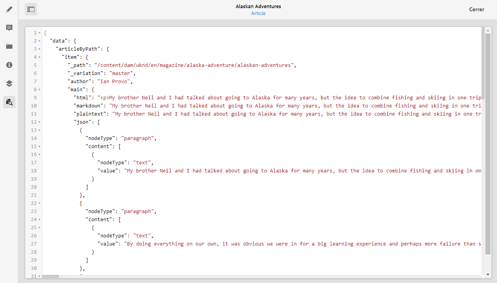
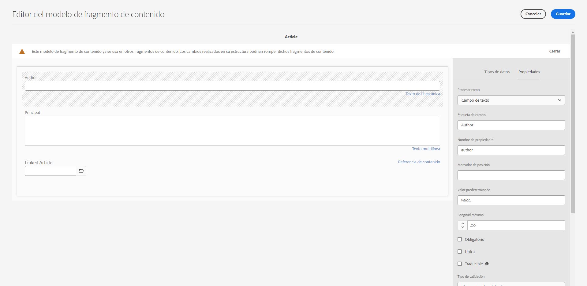

# Cómo acceder al contenido a través de las API de envío de AEM {#access-your-content}

En esta parte del [AEM Recorrido para desarrolladores sin encabezado,](overview.md) puede aprender a utilizar las consultas de GraphQL para acceder al contenido de los fragmentos de contenido y alimentarlo en la aplicación (entrega sin encabezado).

## La historia hasta ahora {#story-so-far}

En el documento anterior del recorrido sin AEM, [Cómo modelar el contenido](model-your-content.md) ha aprendido los conceptos básicos del modelado de contenido en AEM, por lo que ahora debe comprender cómo modelar la estructura de contenido y, a continuación, comprender esa estructura utilizando AEM modelos de fragmentos de contenido y fragmentos de contenido:

* Reconocer los conceptos y la terminología relacionados con el modelado de contenido.
* Comprenda por qué el modelado de contenido es necesario para la entrega de contenido sin encabezado.
* Obtenga información sobre cómo llevar a cabo esta estructura mediante AEM modelos de fragmento de contenido (y cree contenido con fragmentos de contenido).
* Comprender cómo modelar el contenido; principios con muestras básicas.

Este artículo se basa en estos aspectos básicos para que pueda comprender cómo acceder al contenido sin encabezado existente en AEM mediante la API de GraphQL de AEM.

* **Audiencia**: Principiante
* **Objetivo**: Obtenga información sobre cómo acceder al contenido de los fragmentos de contenido mediante AEM consultas de GraphQL:
   * Presente GraphQL y la API de AEM GraphQL.
   * Descubra los detalles de la API de AEM GraphQL.
   * Observe algunas consultas de ejemplo para ver cómo funcionan las cosas en la práctica.

## ¿Le gustaría acceder a su contenido? {#so-youd-like-to-access-your-content}

Así que...tiene todo este contenido, bien estructurado (en fragmentos de contenido) y esperando para alimentar su nueva aplicación. La pregunta es: ¿cómo llegar allí?

Lo que necesita es una forma de segmentar contenido específico, seleccionar lo que necesita y devolverlo a su aplicación para un procesamiento posterior.

Con Adobe Experience Manager (AEM) as a Cloud Service, puede acceder de forma selectiva a los fragmentos de contenido mediante la API de AEM GraphQL para devolver solo el contenido que necesite. Esto significa que puede realizar envíos sin objetivos de contenido estructurado para utilizarlo en sus aplicaciones.

>[!NOTE]
>
>AEM API de GraphQL es una implementación personalizada, basada en la especificación estándar de la API de GraphQL.

## GraphQL: Una introducción {#graphql-introduction}

GraphQL es una especificación de código abierto que proporciona:

* lenguaje de consulta que permite seleccionar contenido específico de objetos estructurados.
* un tiempo de ejecución para realizar estas consultas con el contenido estructurado.

GraphQL es un *strong* API escrita. Esto significa que *all* el contenido debe estar claramente estructurado y organizado por tipo, de modo que GraphQL *comprende* qué acceder y cómo hacerlo. Los campos de datos se definen en los esquemas de GraphQL, que definen la estructura de los objetos de contenido.

Los extremos de GraphQL proporcionan las rutas que responden a las consultas de GraphQL.

Todo esto significa que la aplicación puede seleccionar de forma precisa, fiable y eficaz el contenido que necesita, justo lo que necesita cuando se utiliza con AEM.

>[!NOTE]
>
>Consulte *GraphQL*.org y *GraphQL*.com.

<!--
## AEM and GraphQL {#aem-graphql}

GraphQL is used in various locations in AEM; for example:

* Content Fragments
  * A customized API has been developed for this use-case (Headless Delivery to your app).
    * This is the AEM GraphQL API.
* Commerce
  * AEM Commerce consumes data from a Commerce platform via GraphQL.
  * There are GraphQL integrations between AEM and various third-party commerce solutions, used with the extension hooks provided by the CIF Core Components.
    * This does not use the AEM GraphQL API.

>[!NOTE]
>
>This step of the Headless Journey is only concerned with the AEM GraphQL API and Content Fragments.
-->

## API de AEM GraphQL {#aem-graphql-api}

La API de AEM GraphQL es una versión personalizada basada en la especificación estándar de la API de GraphQL, especialmente configurada para permitirle realizar consultas (complejas) en los fragmentos de contenido.

Se utilizan fragmentos de contenido, ya que el contenido está estructurado según los modelos de fragmento de contenido. Esto cumple un requisito básico de GraphQL.

* Un modelo de fragmento de contenido está formado por uno o más campos.
   * Cada campo se define según un Tipo de datos.
* Los modelos de fragmento de contenido se utilizan para generar los esquemas AEM de GraphQL correspondientes.

Para acceder realmente a GraphQL para AEM (y el contenido) se utiliza un punto final para proporcionar la ruta de acceso.

El contenido devuelto, a través de la API de AEM GraphQL, puede ser utilizado por sus aplicaciones.

Para ayudarle a introducir y probar consultas directamente, también está disponible una implementación de la interfaz estándar de GraphiQL para su uso con AEM GraphQL (esto se puede instalar con AEM). Proporciona funciones como resaltado de sintaxis, autocompletado, autosugerencia, junto con un historial y documentación en línea.

>[!NOTE]
>
>La implementación de la API de AEM GraphQL se basa en las bibliotecas Java de GraphQL.

<!--
### Use Cases for Author and Publish Environments {#use-cases-author-publish-environments}

The use cases for the AEM GraphQL API can depend on the type of AEM as a Cloud Service environment:

* Publish environment; used to: 
  * Query content for JS application (standard use-case)

* Author environment; used to: 
  * Query content for "content management purposes":
    * GraphQL in AEM as a Cloud Service is currently a read-only API.
    * The REST API can be used for CR(u)D operations.
-->

## Fragmentos de contenido para su uso con la API de AEM GraphQL {#content-fragments-use-with-aem-graphql-api}

Los fragmentos de contenido se pueden usar como base para GraphQL para AEM esquemas y consultas como:

* Permiten diseñar, crear, depurar y publicar contenido independiente de las páginas que se pueda entregar sin problemas.
* Se basan en un modelo de fragmento de contenido, que predefine la estructura del fragmento resultante mediante una selección de tipos de datos.
* Se pueden lograr capas de estructura adicionales con el tipo de datos Referencia de fragmento , disponible al definir un modelo.

### Modelos de fragmento de contenido {#content-fragments-models}

Estos modelos de fragmento de contenido:

* se utilizan para generar los esquemas, una vez **Habilitado**.
* Proporcione los tipos de datos y campos requeridos para GraphQL. Se aseguran de que la aplicación solo solicita lo que es posible y recibe lo que se espera.
* El tipo de datos **Referencias de fragmento** se puede utilizar en el modelo para hacer referencia a otro fragmento de contenido y, por lo tanto, introducir niveles de estructura adicionales.

### Referencias de fragmento {#fragment-references}

La variable **Referencia de fragmento**:

* Es un tipo de datos específico disponible al definir un modelo de fragmento de contenido.
* Hace referencia a otro fragmento, según un modelo de fragmento de contenido específico.
* Permite crear y recuperar datos estructurados.

   * Cuando se define como **multifuente**, el fragmento principal puede hacer referencia (recuperar) a varios subfragmentos.

### Vista previa de JSON {#json-preview}

Para ayudar a diseñar y desarrollar los modelos de fragmento de contenido, puede obtener una vista previa del resultado de JSON en el Editor de fragmentos de contenido.



<!--
## GraphQL Schema Generation from Content Fragments {#graphql-schema-generation-content-fragments}

GraphQL is a strongly typed API, which means that content must be clearly structured and organized by type. The GraphQL specification provides a series of guidelines on how to create a robust API for interrogating content on a certain instance. To do this, a client needs to fetch the Schema, which contains all the types necessary for a query. 

For Content Fragments, the GraphQL schemas (structure and types) are based on **Enabled** Content Fragment Models and their data types.

>[!CAUTION]
>
>All the GraphQL schemas (derived from Content Fragment Models that have been **Enabled**) are readable through the GraphQL endpoint.
>
>This means that you need to ensure that no sensitive content is available, to ensure that no sensitive data is exposed via GraphQL endpoints; for example, this includes information that could be present as field names in the model definition.

For example, if a user created a Content Fragment Model called `Article`, then AEM generates the object `article` that is of a type `ArticleModel`. The fields within this type correspond to the fields and data types defined in the model.

1. A Content Fragment Model:

   

1. The corresponding GraphQL schema (output from GraphiQL automatic documentation):
   

   This shows that the generated type `ArticleModel` contains several [fields](#fields). 
   
   * Three of them have been controlled by the user: `author`, `main` and `referencearticle`.

   * The other fields were added automatically by AEM, and represent helpful methods to provide information about a certain Content Fragment; in this example, `_path`, `_metadata`, `_variations`. These [helper fields](#helper-fields) are marked with a preceding `_` to distinguish between what has been defined by the user and what has been auto-generated.

1. After a user creates a Content Fragment based on the Article model, it can then be interrogated through GraphQL. For examples, see the Sample Queries.md#graphql-sample-queries) (based on a sample Content Fragment structure for use with GraphQL.

In GraphQL for AEM, the schema is flexible. This means that it is auto-generated each and every time a Content Fragment Model is created, updated or deleted. The data schema caches are also refreshed when you update a Content Fragment Model.

The Sites GraphQL service listens (in the background) for any modifications made to a Content Fragment Model. When updates are detected, only that part of the schema is regenerated. This optimization saves time and provides stability.

So for example, if you:

1. Install a package containing `Content-Fragment-Model-1` and `Content-Fragment-Model-2`:
 
   1. GraphQL types for `Model-1` and `Model-2` will be generated.

1. Then modify `Content-Fragment-Model-2`:

   1. Only the `Model-2` GraphQL type will get updated.

   1. Whereas `Model-1` will remain the same. 

>[!NOTE]
>
>This is important to note in case you want to do bulk updates on Content Fragment Models through the REST api, or otherwise.

The schema is served through the same endpoint as the GraphQL queries, with the client handling the fact that the schema is called with the extension `GQLschema`. For example, performing a simple `GET` request on `/content/cq:graphql/global/endpoint.GQLschema` will result in the output of the schema with the Content-type: `text/x-graphql-schema;charset=iso-8859-1`.

### Schema Generation - Unpublished Models {#schema-generation-unpublished-models}

When Content Fragments are nested it can happen that a parent Content Fragment Model is published, but a referenced model is not.

>[!NOTE]
>
>The AEM UI prevents this happening, but if publishing is made programmatically, or with content packages, it can occur.

When this happens, AEM generates an *incomplete* Schema for the parent Content Fragment Model. This means that the Fragment Reference, which is dependent on the unpublished model, is removed from the schema.

## AEM GraphQL Endpoints {#aem-graphql-endpoints}

An endpoint is the path used to access GraphQL for AEM. Using this path you (or your app) can:

* access the GraphQL schemas,
* send your GraphQL queries,
* receive the responses (to your GraphQL queries).

AEM allows for:

* A global endpoint - available for use by all sites.
* Endpoints for specific Sites configurations - that you can configure (in the Configuration Browser), specific to a specified site/project.

## Permissions {#permissions}

The permissions are those required for accessing Assets.

## The AEM GraphiQL Interface {#aem-graphiql-interface}

To help you directly input, and test queries, an implementation of the standard GraphiQL interface is available for use with AEM GraphQL. This can be installed with AEM.

>[!NOTE]
>
>GraphiQL is bound the global endpoint (and does not work with other endpoints for specific Sites configurations).

It provides features such as syntax-highlighting, auto-complete, auto-suggest, together with a history and online documentation.


-->

## Uso real de la API de AEM GraphQL {#actually-using-aem-graphiql}

### Configuración inicial {#initial-setup}

Antes de comenzar con consultas sobre el contenido, debe:

* Habilitar el punto final
   * Uso de herramientas -> Recursos -> GraphQL
   * [Activación del punto de conexión de GraphQL](/help/headless/graphql-api/graphql-endpoint.md)

* Instale GraphiQL (si es necesario)
   * Instalado como un paquete dedicado
   * [Instalación de la interfaz AEM GraphiQL](/help/headless/graphql-api/graphiql-ide.md)

### Estructura de muestra {#sample-structure}

Para utilizar la API de AEM GraphQL en una consulta, podemos utilizar las dos estructuras básicas del Modelo de fragmento de contenido:

* Compañía
   * Nombre - Texto
   * CEO (Persona): referencia de fragmento
   * Empleados (personas) - Referencia de fragmento
* Persona
   * Nombre - Texto
   * Nombre - Texto

Como puede ver, los campos CEO y Empleados hacen referencia a los fragmentos Persona .

Se utilizarán los modelos de fragmento:

* al crear el contenido en el editor de fragmentos de contenido
* para generar los esquemas de GraphQL que vaya a consultar

### Dónde probar las consultas {#where-to-test-your-queries}

Las consultas se pueden introducir en la interfaz de GraphiQL, por ejemplo en:

* `http://localhost:4502/content/graphiql.html`


### Introducción a las consultas {#getting-Started-with-queries}

Una consulta directa es devolver el nombre de todas las entradas del esquema Company. Aquí puede solicitar una lista de todos los nombres de compañía:

```xml
query {
  companyList {
    items {
      name
    }
  }
}
```

Una consulta ligeramente más compleja es seleccionar todas las personas que no tienen un nombre de &quot;Trabajos&quot;. Esto filtrará todas las personas para aquellas que no tengan el nombre Trabajos. Esto se logra con el operador EQUALS_NOT (hay muchos más):

```xml
query {
  personList(filter: {
    name: {
      _expressions: [
        {
          value: "Jobs"
          _operator: EQUALS_NOT
        }
      ]
    }
  }) {
    items {
      name
      firstName
    }
  }
}
```

También puede crear consultas más complejas. Por ejemplo, realice una consulta a todas las empresas que tengan al menos un empleado con el nombre &quot;Smith&quot;. Esta consulta ilustra el filtrado para cualquier persona de nombre &quot;Smith&quot;, que devuelve información de los fragmentos anidados:

```xml
query {
  companyList(filter: {
    employees: {
      _match: {
        name: {
          _expressions: [
            {
              value: "Smith"
            }
          ]
        }
      }
    }
  }) {
    items {
      name
      ceo {
        name
        firstName
      }
      employees {
        name
        firstName
      }
    }
  }
}
```

<!-- need code / curl / cli examples-->

Para obtener toda la información sobre el uso de la API de AEM GraphQL, junto con la configuración de los elementos necesarios, puede hacer referencia a:

* Aprender a usar GraphQL con AEM
* La estructura de fragmento de contenido de ejemplo
* Formación para utilizar GraphQL con AEM: contenido y consultas de muestra

## Siguientes pasos {#whats-next}

Ahora que ha aprendido a acceder y consultar el contenido sin encabezado mediante la API de AEM GraphQL, ahora puede [obtenga información sobre cómo utilizar la API de REST para acceder y actualizar el contenido de los fragmentos de contenido](update-your-content.md).

## Recursos adicionales {#additional-resources}

* [GraphQL.org](https://graphql.org)
   * [Esquemas](https://graphql.org/learn/schema/)
   * [Variables](https://graphql.org/learn/queries/#variables)
   * [Bibliotecas Java de GraphQL](https://graphql.org/code/#java)
* [GraphiQL](https://graphql.org/learn/serving-over-http/#graphiql)
* [Aprender a usar GraphQL con AEM](/help/headless/graphql-api/content-fragments.md)
   * [Activación del punto de conexión de GraphQL](/help/headless/graphql-api/graphql-endpoint.md)
   * [Instalación de la interfaz AEM GraphiQL](/help/headless/graphql-api/graphiql-ide.md)
* [La estructura de fragmento de contenido de ejemplo](/help/headless/graphql-api/sample-queries.md#content-fragment-structure-graphql)
* [Formación para utilizar GraphQL con AEM: contenido y consultas de muestra](/help/headless/graphql-api/sample-queries.md)
   * [Consulta de muestra: un solo fragmento de ciudad específico](/help/headless/graphql-api/sample-queries.md#sample-single-specific-city-fragment)
   * [Consulta de muestra para metadatos: enumera los metadatos de los premios titulados GB](/help/headless/graphql-api/sample-queries.md#sample-metadata-awards-gb)
   * [Consulta de muestra: todas las ciudades con una variación con nombre](/help/headless/graphql-api/sample-queries.md#sample-cities-named-variation)
* [Habilitar la funcionalidad de fragmento de contenido en el navegador de configuración](/help/assets/content-fragments/content-fragments-configuration-browser.md#enable-content-fragment-functionality-in-configuration-browser)
* [Trabajar con fragmentos de contenido](/help/assets/content-fragments/content-fragments.md)
   * [Modelos de fragmento de contenido](/help/assets/content-fragments/content-fragments-models.md)
   * [Salida JSON](/help/assets/content-fragments/content-fragments-json-preview.md)
* [Comprender el uso compartido de recursos de origen cruzado (CORS)](https://experienceleague.adobe.com/docs/experience-manager-learn/foundation/security/understand-cross-origin-resource-sharing.html?lang=en#understand-cross-origin-resource-sharing-(cors))
* [Generación de tokens de acceso para las API del servidor](/help/implementing/developing/introduction/generating-access-tokens-for-server-side-apis.md)
* [Introducción a AEM sin encabezado](https://experienceleague.adobe.com/docs/experience-manager-learn/getting-started-with-aem-headless/graphql/overview.html?lang=es) : una breve serie de tutoriales de vídeo que ofrecen información general sobre el uso de AEM funciones sin encabezado, incluidos el modelado de contenido y GraphQL.
