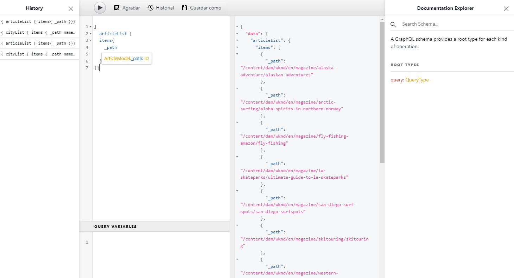

# Cómo acceder al contenido a través de las API de entrega de AEM {#access-your-content}

En esta parte del [Recorrido para desarrolladores de contenido de AEM sin encabezado](overview.md), puede aprender a utilizar las consultas de GraphQL para acceder al contenido de sus fragmentos de contenido y alimentarlo en su aplicación (entrega sin encabezado).

## Lo que hemos visto hasta ahora {#story-so-far}

En el documento anterior del recorrido sin encabezado de AEM, [Cómo modelar el contenido](model-your-content.md), ha aprendido los conceptos básicos del modelado de contenido en AEM, por lo que ahora debe comprender cómo modelar la estructura de contenido y, a continuación, comprender dicha estructura utilizando modelos de fragmentos de contenido de AEM y los fragmentos de contenido.

* Reconocer los conceptos y la terminología relacionados con el modelado de contenido.
* Comprender por qué el modelado de contenido es necesario para la entrega de contenido sin encabezado.
* Comprender cómo llevar a cabo esta estructura mediante modelos de fragmento de contenido de AEM (y crear contenido con fragmentos de contenido).
* Comprender cómo modelar el contenido; principios con muestras básicas.

Este artículo se centra en estos aspectos básicos para que entienda cómo acceder al contenido sin encabezado existente en AEM mediante GraphQL, la API de AEM.

* **Público**: principiante
* **Objetivo**: aprender a acceder al contenido de los fragmentos de contenido mediante consultas en GraphQL de AEM.
   * Introducción a GraphQL y a la API de AEM, GraphQL.
   * Descubrir los detalles de la API de AEM, GraphQL.
   * Observar algunas consultas de ejemplo para ver cómo funcionan las cosas en la práctica.

## Acceso a su contenido? {#so-youd-like-to-access-your-content}

Tiene mucho contenido bien estructurado (en fragmentos de contenido) para alimentar su nueva aplicación. La pregunta es: ¿cómo lograr eso?

Lo que necesita es una forma de segmentar el contenido específico, seleccionar lo que necesita y devolverlo a su aplicación para un procesamiento posterior.

Con Adobe Experience Manager (AEM) as a Cloud Service, puede acceder de forma selectiva a los fragmentos de contenido mediante la API de AEM, GraphQL, para devolver solo el contenido que necesite. Esto significa que puede realizar entrega sin encabezado de contenido estructurado para utilizarlo en sus aplicaciones.

>[!NOTE]
>
>La API de AEM, GraphQL, es una implementación personalizada, basada en la especificación de la API, GraphQL estándar.

## GraphQL: introducción {#graphql-introduction}

GraphQL es una especificación de código abierto que proporciona lo siguiente:

* un lenguaje de consulta que permite seleccionar contenido específico de objetos estructurados.
* un tiempo de ejecución para realizar estas consultas con el contenido estructurado.

GraphQL es una API muy tipificada. Esto significa que *todo* el contenido debe estar claramente estructurado y organizado por tipo, para que GraphQL *entienda* a qué acceder y cómo hacerlo. Los campos de datos se definen dentro de esquemas de GraphQL, que definen la estructura de los objetos de contenido.

Los puntos finales de GraphQL proporcionan las rutas que responden a las consultas de GraphQL.

Todo esto significa que la aplicación puede seleccionar de forma precisa, fiable y eficaz el contenido que necesita cuando se utiliza con AEM.

>[!NOTE]
>
>Consulte *GraphQL*.org y *GraphQL*.com.

<!--
## AEM and GraphQL {#aem-graphql}

GraphQL is used in various locations in AEM; for example:

* Content Fragments
  * A customized API has been developed for this use-case (Headless Delivery to your app).
    * This is the AEM GraphQL API.
* Commerce
  * AEM Commerce consumes data from a Commerce platform via GraphQL.
  * There are GraphQL integrations between AEM and various third-party commerce solutions, used with the extension hooks provided by the CIF Core Components.
    * This does not use the AEM GraphQL API.

>[!NOTE]
>
>This step of the Headless Journey is only concerned with the AEM GraphQL API and Content Fragments.
-->

## GraphQL, la API de AEM {#aem-graphql-api}

La API de AEM, GraphQL, es una versión personalizada basada en la especificación estándar de la API GraphQL, especialmente configurada para permitirle realizar consultas (complejas) en los fragmentos de contenido.

Se utilizan fragmentos de contenido, ya que el contenido está estructurado según los modelos de fragmento de contenido. Esto cumple un requisito básico de GraphQL.

* Un modelo de fragmento de contenido está formado por uno o más campos.
   * Cada campo se define según el tipo de datos.
* Los modelos de fragmento de contenido se utilizan para generar los esquemas de GraphQL de AEM correspondientes.

Para acceder realmente a GraphQL para AEM (y el contenido) se utiliza un punto final para proporcionar la ruta de acceso.

El contenido devuelto, a través de la API de AEM, GraphQL, puede ser utilizado por sus aplicaciones.

Para ayudarle a introducir directamente y probar consultas, también está disponible una implementación de la interfaz estándar de GraphiQL para utilizarse con GraphQL de AEM (esto se puede instalar con AEM). Proporciona funciones como resaltado de sintaxis, autocompletado o autosugerencia, junto con un historial y documentación en línea.

>[!NOTE]
>
>La implementación de la API de AEM, GraphQL, se basa en las bibliotecas Java de GraphQL.

<!--
### Use Cases for Author and Publish Environments {#use-cases-author-publish-environments}

The use cases for the AEM GraphQL API can depend on the type of AEM as a Cloud Service environment:

* Publish environment; used to: 
  * Query content for JS application (standard use-case)

* Author environment; used to: 
  * Query content for "content management purposes":
    * GraphQL in AEM as a Cloud Service is currently a read-only API.
    * The REST API can be used for CR(u)D operations.
-->

## Fragmentos de contenido para su uso con GraphQL, la API de AEM {#content-fragments-use-with-aem-graphql-api}

Los fragmentos de contenido se pueden usar como base para GraphQL para esquemas y consultas en AEM, puesto que:

* Permiten diseñar, crear, depurar y publicar contenido independiente de las páginas que se puede entregar sin encabezado.
* Se basan en un modelo de fragmento de contenido que predefine la estructura del fragmento resultante mediante una selección de tipos de datos.
* Se pueden lograr capas de estructura adicionales con el tipo de datos Referencia a fragmento, disponible al definir un modelo.

### Modelos de fragmento de contenido {#content-fragments-models}

Estos modelos de fragmentos de contenido:

* Se utilizan para generar los esquemas una vez **habilitados**.
* Proporcionan los tipos de datos y campos requeridos para GraphQL. Se aseguran de que la aplicación solo solicita lo que es posible y recibe lo que se espera.
* El tipo de datos **Referencias de fragmento** se puede utilizar en el modelo para hacer referencia a otro fragmento de contenido y, por lo tanto, introducir niveles de estructura adicionales.

### Referencias a fragmento {#fragment-references}

**Referencia de fragmento** y **UUID de referencia de fragmento**:

* Son tipos de datos específicos que están disponibles cuando se define un modelo de fragmento de contenido.
* Hace referencia a otro fragmento, según un modelo de fragmento de contenido específico.
* Permite crear datos estructurados y luego recuperarlos.

   * Cuando se define como **multifuente**, el fragmento principal puede hacer referencia (recuperar) a varios subfragmentos.

## Utilización real de GraphQL, la API de AEM {#actually-using-aem-graphiql}

### Configuración inicial {#initial-setup}

Antes de comenzar con consultas sobre el contenido, debe realizar lo siguiente:

* Habilitar el punto final
   * Uso de herramientas -> General -> GraphQL
   * [Habilitación del punto final de GraphQL](/help/headless/graphql-api/graphql-endpoint.md)
      * Se habilitará también el IDE de GraphiQL.

### Estructura de muestra {#sample-structure}

Para utilizar GraphQL, la API de AEM en una consulta, podemos utilizar las dos estructuras básicas del modelo de fragmento de contenido:

* Compañía
   * Nombre: texto
   * CEO (Persona): referencia de fragmento
   * Empleados (personas): referencias de fragmento
* Persona
   * Nombre: texto
   * Nombre: texto

Como puede ver, los campos CEO y Empleados hacen referencia a los fragmentos Persona.

Se utilizan los modelos de fragmento:

* al crear el contenido en el editor de fragmentos de contenido
* para generar los esquemas de GraphQL que se consultarán

### Dónde probar las consultas {#where-to-test-your-queries}

Las consultas se pueden introducir en la interfaz de GraphiQL. Puede acceder al editor de consultas desde:

* **Herramientas** > **General** > **Editor de consultas de GraphQL**
* directamente; por ejemplo, `http://localhost:4502/aem/graphiql.html`



### Introducción a las consultas {#getting-Started-with-queries}

Una consulta sencilla es devolver el nombre de todas las entradas del esquema Compañía. Aquí puede solicitar una lista de todos los nombres de compañía:

```xml
query {
  companyList {
    items {
      name
    }
  }
}
```

Una consulta un poco más compleja consiste en seleccionar todas las personas que no tengan el nombre de un “Trabajo”. Se filtrarán todas las personas que no tengan el nombre de un “Trabajo”. Esto se logra con el operador EQUALS_NOT (hay muchos más):

```xml
query {
  personList(filter: {
    name: {
      _expressions: [
        {
          value: "Jobs"
          _operator: EQUALS_NOT
        }
      ]
    }
  }) {
    items {
      name
      firstName
    }
  }
}
```

También se pueden crear consultas más complejas. Por ejemplo, realizar una consulta de todas las empresas que tengan al menos un empleado con el apellido “Smith”. Esta consulta ilustra el filtrado de cualquier persona con el apellido “Smith”, y devuelve información de todos los fragmentos anidados: 

```xml
query {
  companyList(filter: {
    employees: {
      _match: {
        name: {
          _expressions: [
            {
              value: "Smith"
            }
          ]
        }
      }
    }
  }) {
    items {
      name
      ceo {
        name
        firstName
      }
      employees {
        name
        firstName
      }
    }
  }
}
```

Para obtener información completa sobre el uso de GraphQL, la API de AEM, junto con la configuración de los elementos necesarios, puede consultar lo siguiente:

* Formación para utilizar GraphQL con AEM
* La estructura de fragmento de contenido de muestra
* Formación para utilizar GraphQL con AEM: contenido y consultas de muestra

## Siguientes pasos {#whats-next}

Ahora que ha aprendido a acceder al contenido sin encabezado y consultarlo mediante la API de AEM GraphQL, puede [aprender a utilizar la API REST para acceder al contenido de los fragmentos de contenido y actualizarlo](update-your-content.md).

## Recursos adicionales {#additional-resources}

* [API de Adobe Experience Manager as a Cloud Service](https://developer.adobe.com/experience-cloud/experience-manager-apis/)
* [GraphQL.org](https://graphql.org)
   * [Esquemas](https://graphql.org/learn/schema/)
   * [Variables](https://graphql.org/learn/queries/#variables)
   * [Bibliotecas Java de GraphQL](https://graphql.org/code/#java)
* [GraphiQL](https://graphql.org/learn/serving-over-http/#graphiql)
* [Formación para utilizar GraphQL con AEM](/help/headless/graphql-api/content-fragments.md)
   * [Habilitación del punto final de GraphQL](/help/headless/graphql-api/graphql-endpoint.md)
   * [Instalación de la interfaz de GraphiQL de AEM](/help/headless/graphql-api/graphiql-ide.md)
* [La estructura de fragmento de contenido de muestra](/help/headless/graphql-api/sample-queries.md#content-fragment-structure-graphql)
* [Formación para utilizar GraphQL con AEM: contenido y consultas de muestra](/help/headless/graphql-api/sample-queries.md)
   * [Consulta de muestra: un solo fragmento de ciudad específico](/help/headless/graphql-api/sample-queries.md#sample-single-specific-city-fragment)
   * [Consulta de muestra para metadatos: enumera los metadatos de los premios titulados GB](/help/headless/graphql-api/sample-queries.md#sample-metadata-awards-gb)
   * [Consulta de muestra: todas las ciudades con una variación con nombre](/help/headless/graphql-api/sample-queries.md#sample-cities-named-variation)
* [Habilitación de la funcionalidad de fragmento de contenido en el explorador de la configuración](/help/sites-cloud/administering/content-fragments/setup.md#enable-content-fragment-functionality-configuration-browser)
* [Trabajar con fragmentos de contenido](/help/sites-cloud/administering/content-fragments/overview.md)
   * [Modelos de fragmento de contenido](/help/sites-cloud/administering/content-fragments/managing-content-fragment-models.md)
   * [Salida JSON](/help/assets/content-fragments/content-fragments-json-preview.md)
* [Comprender el uso compartido de recursos de origen cruzado (Cross-Origin Resource Sharing, CORS)](https://experienceleague.adobe.com/docs/experience-manager-learn/foundation/security/understand-cross-origin-resource-sharing.html?lang=es#understand-cross-origin-resource-sharing-(cors))
* [Consultas persistentes de GraphQL: habilitar el almacenamiento en caché en Dispatcher](/help/headless/deployment/dispatcher-caching.md)
* [Generación de los tókenes de acceso para las API del servidor](/help/implementing/developing/introduction/generating-access-tokens-for-server-side-apis.md)
* [Introducción a AEM sin encabezado](https://experienceleague.adobe.com/docs/experience-manager-learn/getting-started-with-aem-headless/graphql/overview.html?lang=es): una breve serie de tutoriales de vídeo que ofrecen información general sobre el uso de las funciones de AEM sin encabezado, incluidos el modelado de contenido y GraphQL.
