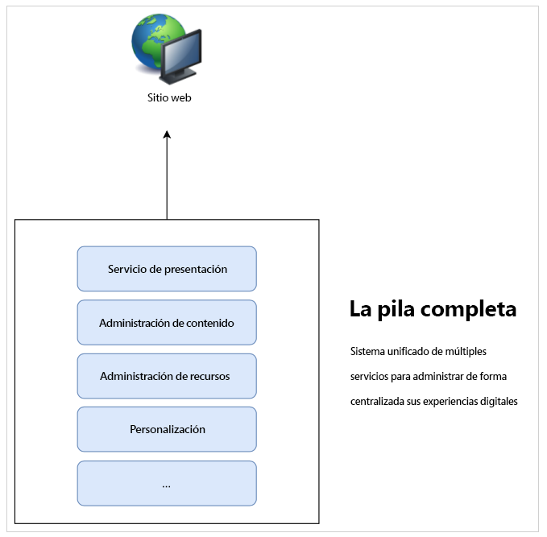
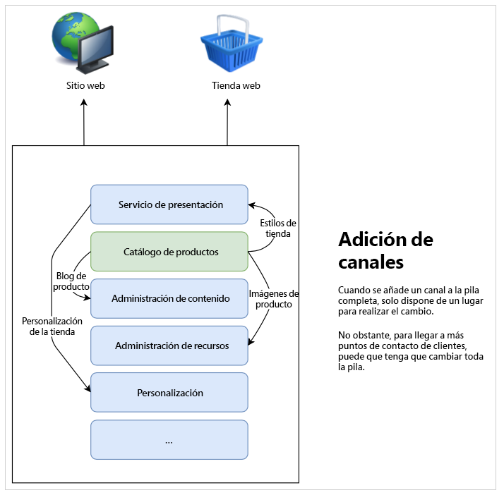

# Obtenga más información acerca del desarrollo de CMS sin encabezado {#learn-about}

En esta parte del [recorrido para desarrolladores sin encabezado de AEM](overview.md), aprenderá sobre la tecnología sin encabezado y los motivos por los que utilizarla.

## Objetivo {#objective}

Este documento le ayuda a comprender la entrega de contenido sin encabezado y por qué debería usarse. Después de leer, debería haber logrado lo siguiente:

* Comprender los conceptos básicos y la terminología de la entrega de contenido sin periféricos
* Comprender por qué y cuándo se requiere un proceso sin encabezado
* Conocer en un nivel superior cómo se utilizan los conceptos sin encabezado y cómo se interrelacionan

## Entrega de contenido de pila completa {#full-stack}

Desde que han surgido los sistemas de administración de contenido (CMS) a gran escala y fáciles de usar, las organizaciones los han utilizado como una ubicación central que permite administrar los mensajes, la promoción de la marca y las comunicaciones. El uso de CMS como punto central para administrar experiencias ha mejorado la eficiencia al eliminar la necesidad de duplicar tareas en sistemas dispares.

En un CMS de pila completa, la funcionalidad para manipular su contenido está en el CMS. Las características del sistema componen diferentes componentes de la pila de CMS. La solución de pila completa tiene muchas ventajas.

* Tiene un sistema que mantener.
* El contenido se administra de forma centralizada.
* Todos los servicios del sistema están integrados.
* La creación de contenido es directa.

Por lo tanto, si desea agregar un canal nuevo o admitir nuevos tipos de experiencias, puede insertar uno o más componentes nuevos en la pila y solo tiene un lugar donde realizar los cambios.

La complejidad de las dependencias dentro de la pila se hace evidente rápidamente, ya que puede que sea necesario ajustar otros elementos de la pila para adaptarse a los cambios.

## Límites de entrega de pila completa {#limits}

El método de pila completa crea inherentemente un silo donde todas las experiencias aterrizan en un sistema. Los cambios o adiciones a un componente del silo requieren cambios en otros componentes que pueden hacer que los cambios requieran mucho tiempo y sean costosos.

Esto es particularmente cierto en el caso del sistema de presentación, que en configuraciones tradicionales, a menudo está estrechamente vinculado al CMS. Cualquier canal nuevo generalmente significa una actualización del sistema de presentación, que puede afectar a todos los demás canales.

Las limitaciones de este silo natural pueden hacerse evidentes a medida que se dedica más esfuerzo a coordinar los cambios en todos los componentes de la pila.

Los usuarios esperan que haya participación independientemente de la plataforma o el punto de contacto, lo que requiere agilidad en la forma de ofrecer sus experiencias.  Este enfoque multicanal es el estándar de las experiencias digitales y, en determinadas circunstancias, un enfoque de pila completa puede resultar inflexible.

## HEAD sin encabezado {#the-head}

El HEAD de cualquier sistema es generalmente el procesador de salida de dicho sistema, normalmente en forma de GUI u otra salida gráfica.

Por ejemplo, puede que un servidor sin encabezado esté sentado en una estantería, en una sala de servidores en algún lugar y no tenga conectado un monitor. Para acceder a él, debe conectarse de forma remota. En este caso, el monitor es la cabeza, ya que se encarga de procesar el output del servidor. Usted, como consumidor del servicio, proporcione su propio monitor cuando se conecte de forma remota a él.

Cuando hablamos de un CMS sin encabezado, el CMS administra el contenido y continúa entregándolo a los consumidores. Sin embargo, al entregar únicamente **contenido** de forma estandarizada, un CMS sin encabezado omite el procesamiento de salida final, dejando la **presentación** del contenido al servicio que lo consume.

Los servicios que consumen, ya sean experiencias AR, una tienda web, experiencias móviles, aplicaciones web progresivas (PWA), etc., reciben contenido del CMS sin encabezado y proporcionan su propia representación. Se ocupan de proporcionar sus propios HEADS para su contenido.

Omitir el HEAD simplifica el CMS al eliminar la complejidad. Al hacerlo, también se traslada la responsabilidad de procesar el contenido a los servicios que realmente necesitan el contenido y que a menudo son más adecuados para dicho procesamiento.

## Desacoplamiento {#decoupling}

La entrega sin encabezado es posible mediante la exposición de un conjunto de interfaces de programación de aplicaciones (API) sólidas y flexibles que todas sus experiencias pueden seleccionar. La API sirve como idioma común entre los servicios, y los une en el ámbito del contenido mediante una entrega de contenido estandarizada, pero permitiéndoles la flexibilidad para implementar sus propias soluciones.

El contenido sin encabezado es un ejemplo de desvinculación del contenido de su presentación. O en un sentido más genérico, desacoplando el front-end del back-end de su pila de servicios. En una configuración sin encabezado, el sistema de presentación (la cabeza) está desacoplada de la administración de contenido (la cola). Los dos únicamente interactúan mediante llamadas de API.

Este desacoplamiento significa que cada servicio consumidor (el front-end) puede generar su experiencia en función del mismo contenido que se entrega a través de las API, lo que garantiza la reutilización del contenido y la coherencia. Los servicios de consumo pueden implementar sus propios sistemas de presentación, lo que permite que la pila de administración de contenido (el back end) se escale fácilmente horizontalmente.

## Fundamentos tecnológicos {#technology}

Un enfoque sin encabezado le permite generar una pila de tecnologías que se adapte rápida y fácilmente a las futuras exigencias de experiencias digitales.

Las API para CMS en el pasado generalmente se basaban en REST. La transferencia de estado representativo (REST) proporciona recursos como texto en modo sin estado. Esto permite leer y modificar los recursos con un conjunto predefinido de operaciones. REST permite una buena interoperabilidad entre los servicios de la web al garantizar la representación sin estado del contenido.

Sigue siendo necesario contar con API de REST sólidas. Sin embargo, las solicitudes REST pueden ser grandes y detalladas. Si tiene varios consumidores haciendo llamadas REST para todos sus canales, esta diversidad de compuestos y el rendimiento pueden verse afectados.

La entrega de contenido sin encabezado suele utilizar las API de GraphQL. GraphQL permite una transferencia sin estado similar, pero permite consultas más específicas, reduce el número total de consultas necesarias y mejora el rendimiento. Es habitual ver que las soluciones utilizan una mezcla de REST y GraphQL, eligiendo esencialmente la mejor herramienta para el trabajo en cuestión.

Independientemente de cuál sea su API elegida, al definir un sistema sin encabezado basado en API comunes, puede utilizar el explorador más reciente y otras tecnologías web, como aplicaciones web progresivas (PWA). Las API crean una interfaz estándar que es fácilmente ampliable y adaptable.

Normalmente, el contenido se representa en el lado del cliente. Normalmente, esto significa que alguien llama a su contenido en un dispositivo móvil, su CMS envía el contenido y, a continuación, el dispositivo móvil (el cliente) es responsable de procesar el contenido que ha servido. Si el dispositivo es antiguo o lento, la experiencia digital también es lenta.

Desvincular contenido de la presentación significa que puede haber más control sobre estas preocupaciones de rendimiento del lado del cliente. El procesamiento del lado del servidor (SSR) transfiere la responsabilidad de procesar el contenido desde el explorador del cliente al servidor. Esto le permite, como proveedor del contenido, ofrecer un nivel de rendimiento garantizado al público si es necesario.

## Desafíos organizativos {#organization}

El contenido sin encabezado abre un mundo de flexibilidad para ofrecer sus experiencias digitales. Pero esta flexibilidad también puede representar su propio desafío.

Tener muchos canales diferentes puede significar que cada uno tiene sus propios sistemas de presentación. Aunque todas consumen el mismo contenido a través de las mismas API, la experiencia puede ser diferente debido a las diferentes presentaciones. Se debe prestar atención y atención a garantizar la coherencia de la experiencia del cliente.

Al implementar sistemas de diseño cuidadosos, compartir bibliotecas de patrones y utilizar componentes de diseño reutilizables, y marcos abiertos y establecidos del lado del cliente, se pueden asegurar experiencias coherentes, pero esto debe planificarse.

## El futuro es el contenido sin encabezado y es ahora {#future}

Las experiencias digitales seguirán definiendo la forma en que las marcas interactúan con los clientes. Lo que es interesante acerca del diseño sin encabezado es la flexibilidad que nos proporciona para responder a las expectativas de los clientes en evolución.

Es imposible predecir el futuro, pero el contenido sin encabezado le da la agilidad de reaccionar a lo que traiga el futuro.

## AEM y el contenido sin encabezado {#aem-and-headless}

A medida que continúe con este recorrido para desarrolladores, aprenderá cómo AEM admite la entrega de contenido sin encabezado junto con sus funciones de entrega de pila completa.

Como líder del sector en la administración de experiencias digitales, Adobe se da cuenta de que la solución ideal a los desafíos del mundo real que enfrentan los creadores de experiencias rara vez es una opción binaria. Por este motivo, AEM no solo admite ambos modelos, sino que también permite de forma exclusiva la combinación híbrida continua de los dos, fusionando las ventajas del contenido sin encabezado y de pila completa, para ayudarle a servir mejor a los consumidores de su contenido, independientemente del lugar en que se encuentren.

Este recorrido se centra en el modelo de entrega de contenido sin encabezado únicamente. Sin embargo, una vez que tenga este conocimiento fundacional, puede explorar más a fondo cómo utilizar el poder de ambos modelos.

## Siguientes pasos {#what-is-next}

Gracias por empezar con el recorrido de contenido sin encabezado de AEM Ahora que lee este documento, debe realizar lo siguiente:

* Comprender los conceptos básicos y la terminología de la entrega de contenido sin encabezado.
* Comprenda por qué y cuándo es necesario el contenido sin encabezado.
* Conocer en un nivel superior cómo se utilizan los conceptos del contenido sin encabezado y cómo se interrelacionan.

Aproveche este conocimiento y continúe su recorrido de contenido sin encabezado de AEM al revisar el documento [Introducción a AEM Headless as a Cloud Service](getting-started.md) donde aprenderá a configurar las herramientas necesarias y a empezar a pensar en cómo AEM aborda la entrega de contenido sin encabezado y sus requisitos previos.

## Recursos adicionales {#additional-resources}

Aunque se recomienda pasar a la siguiente parte del recorrido de desarrollo de contenido sin encabezado, al documento [Introducción al contenido sin encabezado de AEM as a Cloud Service](getting-started.md), a continuación se presentan algunos recursos adicionales y opcionales que profundizan en conceptos, pero que no son necesarios para continuar con el recorrido de desarrollo sin encabezado.

* [Introducción a la arquitectura de Adobe Experience Manager as a Cloud Service](/help/overview/architecture.md): comprender la estructura de AEM as a Cloud Service.
* Una [Introducción a AEM como CMS sin encabezado](/help/headless/introduction.md)
* El [Portal para desarrolladores de AEM](https://experienceleague.adobe.com/landing/experience-manager/headless/developer.html?lang=es)
* [Tutoriales de contenido sin encabezado de AEM](https://experienceleague.adobe.com/docs/experience-manager-learn/getting-started-with-aem-headless/overview.html?lang=es): utilice estos tutoriales prácticos para explorar cómo utilizar las distintas opciones para enviar contenido a puntos de conexión sin encabezado con AEM y elegir el más adecuado para usted.
