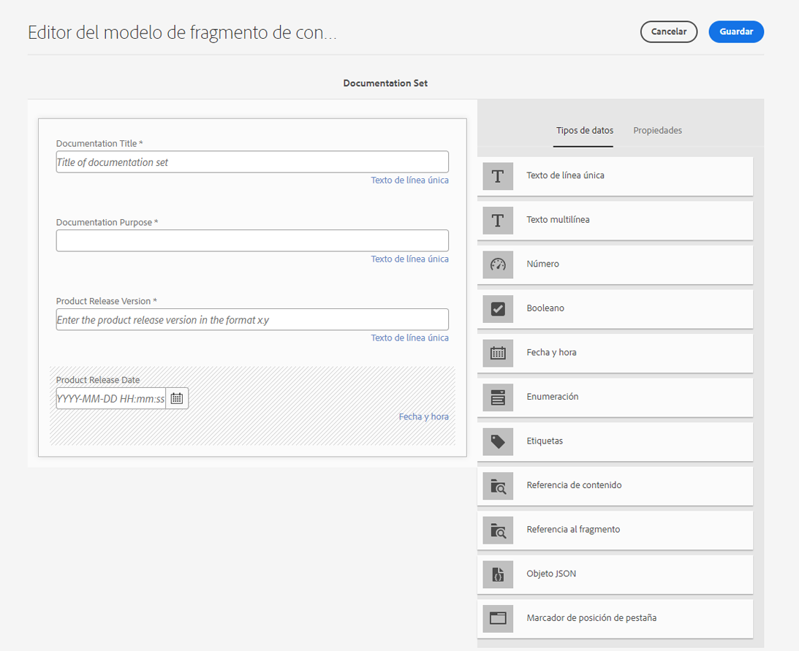
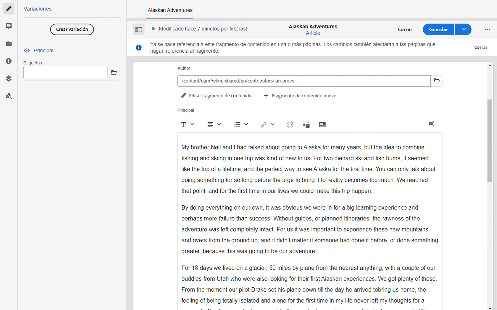

# Cómo modelar el contenido {#model-your-content}

En esta parte del [AEM Recorrido de desarrollador sin encabezado](overview.md), aprenderá a modelar la estructura de contenido. A continuación, observe esa estructura para Adobe Experience Manager (AEM) mediante los modelos de fragmentos de contenido y los fragmentos de contenido, para reutilizarla en todos los canales.

## La historia hasta ahora {#story-so-far}

Al principio, [Obtenga información acerca del desarrollo sin encabezado CMS](learn-about.md) cubrió la entrega de contenido sin encabezado y por qué se utiliza. A continuación, la [Introducción al contenido sin encabezado de AEM as a Cloud Service](getting-started.md) describía el contenido sin encabezado de AEM en el contexto de su propio proyecto.

En el documento anterior del recorrido del contenido sin encabezado de AEM, [Ruta hacia la primera experiencia al usar contenido sin encabezado de AEM](path-to-first-experience.md), aprendió los pasos necesarios para implementar su primer proyecto. Después de leerlo, puede hacer lo siguiente:

* Comprenda y explique las consideraciones de planificación importantes para diseñar el contenido
* Comprenda y explique los pasos para implementar sin encabezado, según los requisitos de nivel de integración.
* Configurar las herramientas y configuraciones de AEM necesarias.
* Conozca las prácticas recomendadas para que pueda hacer que su recorrido sin encabezado sea fluido, mantener la eficiencia de la generación de contenido y garantizar que el contenido se entregue rápidamente.

Este artículo se basa en estos fundamentos para que entienda cómo preparar su propio proyecto de AEM sin encabezado.

## Objetivo {#objective}

* **Audiencia**: principiante
* **Objetivo**: aprenda a modelar la estructura de contenido y, a continuación, a llevar a cabo esa estructura utilizando modelos de fragmentos de contenido y fragmentos de contenido de AEM.
   * Introduzca conceptos y terminología relacionados con el modelado de datos/contenido.
   * Descubra por qué se necesita el modelado de contenido para la entrega de contenido sin encabezado.
   * Aprenda a llevar a cabo esta estructura utilizando modelos de fragmento de contenido de AEM (y a crear contenido con fragmentos de contenido).
   * Aprenda a modelar el contenido y los principios con muestras básicas.

>[!NOTE]
>
>El modelado de datos es un campo grande, ya que se utiliza al desarrollar bases de datos relacionales. Hay muchos libros y fuentes de información en línea disponibles.
>
>Este recorrido AEM solo tiene en cuenta los aspectos que son de interés al modelar datos para utilizarlos con sin encabezado

## Modelado de contenido {#content-modeling}

*Es un mundo grande y peligroso*.

Quizás sí, pero quizás no. Es sin duda un ***complicado*** El mundo exterior y el modelado de datos se utilizan para definir una representación simplificada de una subsección muy (muy) pequeña, utilizando la información específica que se necesita para un determinado propósito.

>[!NOTE]
>
>AEM Como trata el contenido, este recorrido hace referencia al modelado de datos como modelado de contenido.

Por ejemplo:

Hay muchas escuelas, pero todas tienen varias cosas en común.

* Una ubicación,
* un director
* muchos profesores,
* muchos miembros del personal no docente,
* muchos alumnos,
* muchos exprofesores,
* muchos exalumnos,
* muchos salones,
* muchos libros,
* mucho equipamiento,
* muchas actividades extraescolares,
* etc...

Incluso en un ejemplo tan pequeño, la lista puede parecer interminable. Pero si sólo desea que la aplicación realice una tarea sencilla, limite la información a lo esencial.

Por ejemplo, anunciar eventos especiales para todas las escuelas de la zona:

* Nombre del colegio
* Ubicación
* Director
* Tipo de evento
* Fecha del evento
* Profesor que organiza el evento

### Conceptos  {#concepts}

Lo que desea describir se denomina **Entidades** - básicamente las &quot;cosas&quot; sobre las que quieres almacenar información.

La información que desea almacenar sobre ellos es la siguiente **Atributos** (propiedades), como Nombre y Cualificaciones para los profesores.

A continuación, hay varias **Relaciones** entre las entidades. Por ejemplo, normalmente una escuela tiene un director y varios profesores (normalmente, el director también suele ser un profesor).

El proceso de análisis y definición de esta información, junto con las relaciones entre ellos se denomina **Modelado de contenido**.

### Datos básicos {#basics}

A menudo, debe empezar por redactar un **Esquema conceptual** que describe las entidades y sus relaciones. Normalmente es de alto nivel conceptual.

Cuando haya terminado, puede convertir los modelos en un **Esquema lógico** que describe las entidades, junto con los atributos y las relaciones. En este nivel, examine detenidamente las definiciones para eliminar la duplicación y optimizar el diseño.

>[!NOTE]
>
>A veces, estos dos pasos se combinan; a menudo, esto depende de la complejidad del escenario.

Por ejemplo, ¿necesita entidades independientes para `Head Teacher` y `Teacher`, o simplemente un atributo adicional en el modelo `Teacher`?

### Garantía de integridad de los datos {#data-integrity}

La integridad de los datos es necesaria para garantizar la precisión y coherencia del contenido durante todo su ciclo de vida. Esto incluye garantizar que los autores de contenido puedan comprender fácilmente qué almacenar y dónde, por lo que los elementos siguientes son vitales:

* una estructura clara,
* una estructura lo más concisa posible (sin sacrificar la precisión),
* validación de campos individuales,
* cuando proceda, restringir el contenido de campos específicos a lo que sea significativo.

### Eliminación de la redundancia de datos {#data-redundancy}

La redundancia de datos se produce cuando la misma información se almacena dos veces dentro de la estructura de contenido. Esto debe evitarse, ya que puede provocar confusión al crear el contenido y errores en la consulta; sin mencionar el uso indebido del espacio de almacenamiento.

### Optimización y rendimiento {#optimization-and-performance}

Al optimizar su estructura, puede mejorar el rendimiento, tanto para la creación de contenido como para realizar consultas.

Todo es un acto de equilibrio, pero la creación de una estructura que es demasiado compleja o tiene demasiados niveles puede resultar confusa para los autores que generan el contenido. Además, puede afectar gravemente al rendimiento si la consulta tiene que acceder a varios fragmentos de contenido anidados (referenciados) para recuperar el contenido requerido.

## Modelado de contenido sin encabezado de AEM {#content-modeling-for-aem-headless}

El modelado de datos es un conjunto de técnicas establecidas, que a menudo se utilizan cuando se han desarrollado bases de datos de relaciones; por consiguiente, ¿qué significa el modelado de contenido sin encabezado de AEM?

### ¿Por qué? {#why}

Para garantizar que su aplicación pueda solicitar y recibir de forma consistente y eficiente el contenido necesario de AEM, debe estar estructurado.

Esto significa que la aplicación conoce de antemano la forma de respuesta y, por lo tanto, cómo procesarla. Esto es más fácil que recibir contenido de forma libre, que debe analizarse para determinar qué contiene y, por lo tanto, cómo se puede utilizar.

### Introducción a ¿Cómo hacerlo? {#how}

AEM utiliza fragmentos de contenido para proporcionar las estructuras necesarias para la entrega sin encabezado del contenido en las aplicaciones.

La estructura del modelo de contenido:

* Se consigue mediante la definición del modelo de fragmento de contenido.
* Se utiliza como base de los fragmentos de contenido utilizados para la generación de contenido.

>[!NOTE]
>
>Los modelos de fragmento de contenido también se utilizan como base de los esquemas AEM GraphQL, que se utilizan para recuperar el contenido; más información al respecto en una sesión posterior.

Las solicitudes de contenido se realizan mediante la API de AEM, GraphQL, una implementación personalizada de la API de GraphQL estándar. AEM La API de GraphQL le permite realizar consultas (complejas) en los fragmentos de contenido, estando cada consulta según un tipo de modelo específico.

Las aplicaciones pueden utilizar el contenido devuelto.

## Creación de la estructura con modelos de fragmento de contenido {#create-structure-content-fragment-models}

Los modelos de fragmento de contenido proporcionan varios mecanismos que permiten definir la estructura del contenido.

Un modelo de fragmento de contenido describe una entidad.

>[!NOTE]
>Debe habilitar la funcionalidad Fragmento de contenido en el Explorador de configuración para poder crear modelos.

>[!TIP]
>
>Se debe asignar un nombre al modelo para que el autor del contenido sepa qué modelo seleccionar al crear un fragmento de contenido.

Dentro de un modelo:

1. Los **Tipos de datos** permiten definir los atributos individuales.
Por ejemplo, defina el campo que contiene el nombre de un profesor como **Texto** y sus años de servicio como un **Número**.
1. Los tipos de datos **Referencia de contenido** y **Referencia de fragmento** permiten crear relaciones con otro contenido dentro de AEM.
1. El **Referencia a fragmento** El tipo de datos permite realizar varios niveles de estructura anidando los fragmentos de contenido (según el tipo de modelo). Esto es importante para el modelado de contenido.

Por ejemplo:

### Tipos de datos {#data-types}

AEM proporciona los siguientes tipos de datos para modelar el contenido:

* Texto de una sola línea
* Texto de varias líneas
* Número
* Booleano
* Fecha y hora
* Lista desglosada
* Etiquetas
* Referencia de contenido
* Referencia al fragmento
* Objeto JSON

### Referencias y contenido anidado {#references-nested-content}

Dos tipos de datos proporcionan referencias al contenido fuera de un fragmento específico:

* **Referencia de contenido**
Proporciona una sencilla referencia a otro contenido de cualquier tipo.
Por ejemplo, puede hacer referencia a una imagen en una ubicación específica.

* **Referencia de fragmento**
Proporciona referencias a otros fragmentos de contenido.
Este tipo de referencia se utiliza para crear contenido anidado e introduce las relaciones necesarias para modelar el contenido.
El tipo de datos se puede configurar para que los autores de fragmentos puedan hacer lo siguiente:
   * Editar directamente el fragmento al que se hace referencia.
   * Crear un fragmento de contenido basado en el modelo adecuado

### Creación de modelos de fragmento de contenido {#creating-content-fragment-models}

Al principio, debe habilitar Modelos de fragmento de contenido para el sitio. Esto se realiza en el Explorador de configuración en **Herramientas** > **General** > **Explorador de configuración**. Puede seleccionar para configurar la entrada global o crear una configuración. Por ejemplo:

>[!NOTE]
>
>Consulte Recursos adicionales: Fragmentos de contenido en el explorador de configuración

A continuación, se pueden crear los modelos de fragmento de contenido y definir la estructura. Esto se puede hacer en **Herramientas** > **General** > **Modelos de fragmento de contenido**. Por ejemplo:

>[!NOTE]
>
>Consulte Recursos adicionales: Modelos de fragmento de contenido.

## Uso del modelo para crear contenido con fragmentos de contenido {#use-content-to-author-content}

Los fragmentos de contenido se basan siempre en un modelo de fragmento de contenido. El modelo proporciona la estructura, el fragmento incluye el contenido.

### Selección del modelo apropiado {#select-model}

El primer paso para crear el contenido es crear un fragmento de contenido. Esto se realiza mediante Crear > Fragmento de contenido en la carpeta requerida en Recursos > Archivos. El asistente le guiará por los pasos.

Un fragmento de contenido se basa en un modelo de fragmento de contenido específico que se selecciona como primer paso del proceso de creación.

### Creación y edición de contenido estructurado {#create-edit-structured-content}

Una vez creado el fragmento, puede abrirlo en el Editor de fragmentos de contenido. Aquí puede hacer lo siguiente:

* Edite el contenido en modo normal o de pantalla completa.
* Dé formato al contenido como Texto completo, Texto sin formato o Markdown.
* Cree y administre variaciones de contenido.
* Asociar contenido.
* Editar los metadatos.
* Mostrar la estructura de árbol.
* Previsualizar la representación JSON.

### Creación de fragmentos de contenido {#creating-content-fragments}

Después de seleccionar el modelo adecuado, se abre un fragmento de contenido para editarlo en el Editor de fragmentos de contenido:

>[!NOTE]
>
>Consulte Recursos adicionales: trabajar con fragmentos de contenido.

## Introducción a algunos ejemplos {#getting-started-examples}

<!--
tbc...
...and/or see the structures covered for the GraphQL samples...
...will those (ever) be delivered as an official sample package?
-->

Para obtener una estructura básica como ejemplo, consulte La estructura del fragmento de contenido de muestra.

## Siguientes pasos {#whats-next}

Ahora que ha aprendido a modelar su estructura y a crear contenido en función de ella, el siguiente paso es [Aprender a utilizar las consultas de GraphQL para acceder al contenido de los fragmentos de contenido y recuperarlo](access-your-content.md). En esta sección se presenta y se analiza GraphQL y, a continuación, se examinan algunas consultas de ejemplo para ver cómo funcionan las cosas en la práctica.

## Recursos adicionales {#additional-resources}

* [Trabajar con fragmentos de contenido](/help/sites-cloud/administering/content-fragments/overview.md): la página de inicio de los fragmentos de contenido
   * [Fragmentos de contenido en el explorador de configuración](/help/sites-cloud/administering/content-fragments/setup.md#enable-content-fragment-functionality-configuration-browser): habilitar la funcionalidad Fragmento de contenido en el explorador de configuración
   * [Modelos de fragmentos de contenido](/help/sites-cloud/administering/content-fragments/content-fragment-models.md): creación y edición de modelos de fragmentos de contenido
   * [Administración de fragmentos de contenido](/help/sites-cloud/administering/content-fragments/managing.md) : creación y creación de fragmentos de contenido; esta página le lleva a otras secciones detalladas
* [Esquemas de GraphQL de AEM](access-your-content.md): cómo GraphQL realiza modelos
* [La estructura de fragmento de contenido de muestra](/help/headless/graphql-api/sample-queries.md#content-fragment-structure-graphql)
* [Introducción al contenido sin encabezado de AEM](https://experienceleague.adobe.com/docs/experience-manager-learn/getting-started-with-aem-headless/graphql/overview.html?lang=es): una breve serie de tutoriales de vídeo que ofrecen información general sobre el uso de las funciones de AEM sin encabezado, incluidos el modelado de contenido y GraphQL.
   * [Conceptos básicos de modelado de GraphQL](https://experienceleague.adobe.com/docs/experience-manager-learn/getting-started-with-aem-headless/graphql/video-series/modeling-basics.html?lang=es): aprenda a definir y utilizar fragmentos de contenido en Adobe Experience Manager (AEM) para su uso con GraphQL.
