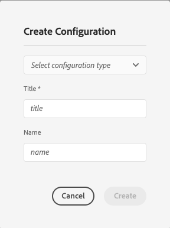

# Configuración del conector de traducción {#configure-connector}

Aprenda a conectar AEM a un servicio de traducción.

## La historia hasta ahora {#story-so-far}

En el documento anterior del recorrido de localización AEM sin encabezado, [Introducción a AEM localización sin encabezado](learn-about.md) ha aprendido a organizar el contenido sin encabezado y cómo funcionan AEM herramientas de localización, y ahora debería:

* Comprenda la importancia de la estructura de contenido para la localización.
* Comprenda cómo AEM almacena contenido sin encabezado.
* Familiarícese con AEM herramientas de localización.

Este artículo se basa en estos aspectos básicos para que pueda realizar el primer paso de configuración y configurar un servicio de traducción, que utilizará más adelante en el recorrido para traducir el contenido.

## Objetivo {#objective}

Este documento le ayuda a comprender cómo configurar un conector de AEM en el servicio de traducción seleccionado. Después de leer, debe:

* Comprender los parámetros importantes del marco de integración de traducción en AEM.
* Puede configurar su propia conexión con el servicio de traducción.

## El marco de integración de la traducción {#tif}

AEM Translation Integration Framework se integra con los servicios de traducción de terceros para organizar la traducción de AEM contenido. Requiere tres pasos básicos.

1. Conéctese a su proveedor de servicios de traducción.
1. Cree una configuración del marco de integración de traducción.
1. Asocie la configuración con el contenido.

## Conexión a un proveedor de servicios de traducción {#connect-translation-provider}

El primer paso es elegir qué servicio de traducción desea utilizar. Hay muchas opciones para servicios de traducción humana y automática disponibles para AEM. Consulte la sección [Recursos adicionales](#additional-resources) para obtener una selección de las opciones disponibles.

La mayoría de los proveedores ofrecen un paquete de traductores para instalar. Para los fines de este recorrido, utilizaremos el traductor de Microsoft que AEM proporciona una licencia de prueba lista para usar. Consulte la sección [Recursos adicionales](#additional-resources) para obtener más información sobre este proveedor.

Si elige otro proveedor, deberá instalar el paquete conector según las instrucciones proporcionadas por el servicio de traducción.

>[!NOTE]
>
>El uso del traductor de Microsoft incorporado en AEM no requiere ninguna configuración adicional y funciona tal cual sin tener que configurar el conector adicional.
>
>Si decide utilizar el conector de Microsoft Translator para realizar pruebas, no es necesario realizar los pasos de las dos secciones siguientes, pero se recomienda leerlos para que esté familiarizado con el momento en que necesite conectar su conector preferido.
>
>La licencia de prueba del conector de Microsoft Translator no está pensada para fines de producción y si decide otorgarla, deberá seguir los siguientes pasos detallados en la sección [Additional Resources](#additional-resources) al final de este documento para configurar esa licencia.

## Creación de una configuración de integración de traducción {#create-config}

Primero debe crear una configuración del marco de integración de traducción para especificar cómo traducir el contenido. La configuración incluye la siguiente información:

* Qué proveedor de servicios de traducción utilizar
* Si se va a realizar una traducción humana o automática
* Si se deben traducir otros contenidos asociados con el fragmento de contenido, como etiquetas

Para crear una nueva configuración de traducción:

1. En el menú de navegación global, pulse o haga clic en **Herramientas** -> **Cloud Services** -> **Cloud Services de traducción**.
1. Desplácese hasta donde desee crear la configuración en la estructura de contenido. Esto suele basarse en un proyecto en particular o puede ser global.
   * Por ejemplo, en este caso, se podría realizar una configuración global para aplicar a todo el contenido o solo para el proyecto WKND.

   

1. Proporcione la siguiente información en los campos y, a continuación, toque o haga clic en **Crear**.
   1. Seleccione **Tipo de configuración** en la lista desplegable. Seleccione **Translation Integration** en la lista.
   1. Introduzca un **Título** para la configuración. El **Título** identifica la configuración en la consola **Cloud Services**, así como en las listas desplegables de propiedades de página.
   1. Opcionalmente, escriba un **Nombre** para utilizarlo para el nodo del repositorio que almacena la configuración.

   

1. Toque o haga clic en **Crear** y aparecerá la ventana **Editar configuración** donde puede configurar las propiedades de configuración.

1. Recuerde que los fragmentos de contenido se almacenan como recursos en AEM. Toque o haga clic en la pestaña **Assets**.


1. Proporcione la siguiente información.

   1. **Método de traducción** : seleccione  **Traducción** automática o  **Traducción** humana según su proveedor de traducción. A los efectos del presente recorrido asumiremos la traducción automática.
   1. **Proveedores de traducción** : seleccione el conector que instaló para el servicio de traducción en la lista.
   1. **Categoría de contenido** : seleccione la categoría más adecuada para destinar mejor la traducción (solo para traducción automática).
   1. **Traducir recursos del fragmento de contenido** - ???
   1. **Traducir recursos** : Marque esta opción para traducir los recursos.
   1. **Traducir metadatos** : Marque esta opción para traducir metadatos de recursos.
   1. **Traducir etiquetas** : Marque esta opción para traducir etiquetas asociadas al recurso.
   1. **Ejecución automática de la traducción** : compruebe esta propiedad si desea que las traducciones se envíen automáticamente al servicio de traducción.

1. Toque o haga clic en **Guardar y cerrar**.

Ahora ha configurado el conector en el servicio de traducción.

## Asociar la configuración con el contenido {#associate}

AEM es una herramienta flexible y potente que soporta múltiples servicios de traducción simultánea a través de múltiples conectores y configuraciones. La configuración de esta opción está fuera del ámbito de este recorrido, pero significa que debe especificar qué conectores y configuración deben utilizarse para traducir el contenido.

Para ello, vaya a la raíz de idioma del contenido. Para nuestros propósitos de ejemplo, esto es

```text
/content/dam/<your-project>/en
```

1. Vaya a la navegación global y vaya a **Navegación** -> **Assets** -> **Archivos**.
1. En la consola de recursos, seleccione la raíz de idioma que desea configurar y pulse o haga clic en **Propiedades**.
1. Toque o haga clic en la pestaña **Cloud Services**.
1. En **Configuraciones del Cloud Service** en la lista desplegable **Agregar configuración**, seleccione el conector. Debe aparecer en el menú desplegable cuando haya instalado su paquete como [descrito anteriormente.](#connect-translation-provider)
1. En **Configuraciones del Cloud Service** en la lista desplegable **Agregar configuración**, también seleccione la configuración.
1. Toque o haga clic en **Guardar y cerrar**.


## Siguientes pasos {#what-is-next}

Ahora que ha completado esta parte del recorrido de localización sin encabezado, debe:

* Comprender los parámetros importantes del marco de integración de traducción en AEM.
* Puede configurar su propia conexión con el servicio de traducción.

Aproveche este conocimiento y continúe con su recorrido de localización AEM sin encabezado revisando el documento [Configure translation rules,](translation-rules.md) donde aprenderá a definir qué contenido traducir.

## Recursos adicionales {#additional-resources}

Aunque se recomienda pasar a la siguiente parte del recorrido de localización sin encabezado revisando el documento [Configure translation rules](translation-rules.md), los siguientes son algunos recursos opcionales adicionales que profundizan en algunos conceptos mencionados en este documento, pero no son necesarios para continuar en el recorrido sin encabezado.

* [Configuración del marco de integración de traducción](/help/sites-cloud/administering/translation/integration-framework.md) : Aprenda a configurar el marco de integración de traducción para integrarlo con servicios de traducción de terceros.
* [Conexión a Microsoft Translator](/help/sites-cloud/administering/translation/connect-ms-translator.md) : AEM proporciona una cuenta de Microsoft Translation de prueba para realizar pruebas.
