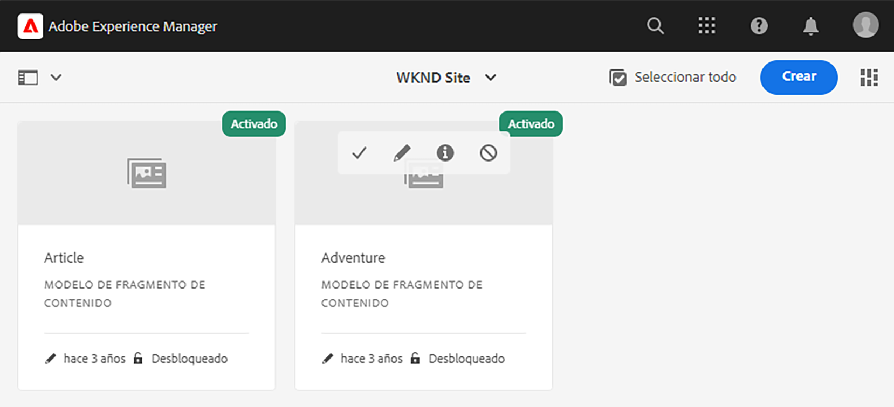
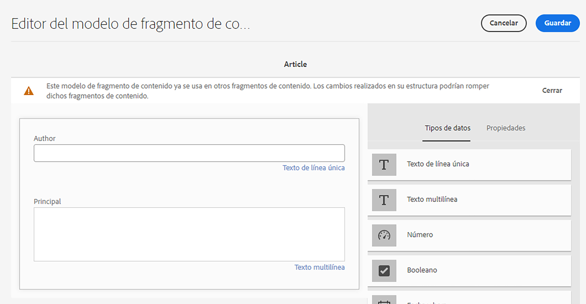
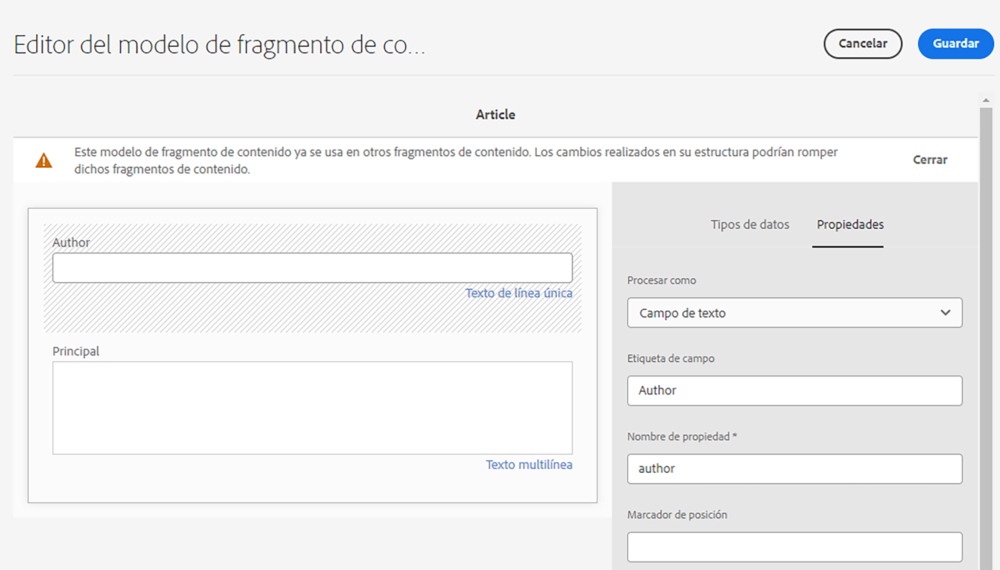

# Introducción a AEM traducción sin encabezado {#getting-started}

Conozca cómo organizar su contenido sin encabezado y cómo funcionan AEM herramientas de traducción.

## La historia hasta ahora {#story-so-far}

En el documento anterior del recorrido de traducción sin AEM, [Obtenga información sobre el contenido sin encabezado y cómo traducirlo en AEM](learn-about.md) aprendió la teoría básica de lo que es un CMS sin cabeza y ahora debería:

* Comprender los conceptos básicos de la entrega de contenido sin encabezado.
* Familiarícese con cómo AEM admite la traducción y la eliminación de periféricos.

Este artículo se basa en estos fundamentos para que entienda cómo AEM almacena y administra contenido sin objetivos y cómo puede utilizar AEM herramientas de traducción para traducir ese contenido.

## Objetivo {#objective}

Este documento le ayuda a comprender cómo empezar a traducir contenido sin encabezado en AEM. Después de leer, debería haber logrado lo siguiente:

* Comprender la importancia de la estructura de contenido para la traducción.
* Comprenda cómo AEM almacena contenido sin encabezado.
* Estar familiarizado con las herramientas de traducción de AEM.

## Requisitos y requisitos previos {#requirements-prerequisites}

Antes de empezar a traducir el contenido AEM sin encabezado, existen varios requisitos.

### Conocimiento {#knowledge}

* Experiencia en la traducción de contenido en un CMS
* Experiencia utilizando las funciones básicas de un CMS a gran escala
* Conocimiento práctico de la gestión básica de AEM
* Comprensión del servicio de traducción que utiliza
* Comprensión básica del contenido que está traduciendo

>[!TIP]
>
>Si no está familiarizado con el uso de un CMS a gran escala como AEM, considere la posibilidad de revisar la documentación de [Gestión básica](/help/sites-cloud/authoring/getting-started/basic-handling.md) antes de continuar. La documentación de Gestión básica no forma parte del recorrido, por lo que debe volver a esta página cuando haya terminado.

### Herramientas {#tools}

* Acceso a zona protegida para probar la traducción del contenido
* Credenciales para conectarse al servicio de traducción preferido
* Ser miembro del grupo `project-administrators` en AEM

## La estructura es clave {#content-structure}

AEM contenido, ya sea páginas web tradicionales o sin encabezado, está impulsado por su estructura. AEM impone pocos requisitos a la estructura de contenido, pero tener en cuenta la jerarquía de contenido como parte de la planificación del proyecto puede hacer que la traducción sea mucho más sencilla.

>[!TIP]
>
>Planee la traducción al comienzo del proyecto sin encabezado. Trabaje en estrecha colaboración con el gestor del proyecto y los arquitectos de contenido desde un primer momento.
>
>Un gestor de proyectos de internacionalización puede ser un actor independiente, cuya responsabilidad es definir qué contenido debe traducirse y cuál no, y qué contenido traducido pueden modificar los productores de contenido regionales o locales.

## Cómo AEM Almacena Contenido Sin Cabeza {#headless-content-in-aem}

Para el especialista en traducción, no es importante comprender en profundidad cómo AEM gestiona el contenido sin encabezado. Sin embargo, familiarizarse con los conceptos básicos y la terminología resultará útil, ya que más adelante utilizará las herramientas de traducción de AEM. Lo más importante es que debe comprender su propio contenido y cómo está estructurado para traducirlo de forma eficaz.

### Modelos de contenido {#content-models}

Para que el contenido sin encabezado se envíe de forma coherente entre canales, regiones e idiomas, el contenido debe estar muy estructurado. AEM usa modelos de contenido para aplicar esta estructura. Considere los modelos de contenido como una especie de plantilla o patrón para crear contenido sin encabezado. Dado que cada proyecto tiene sus propias necesidades, cada proyecto define sus propios modelos de fragmento de contenido. AEM no tiene requisitos ni estructura fijos para estos modelos.

El arquitecto de contenido trabaja al principio del proyecto para definir esta estructura. Como especialista en traducción, debe trabajar estrechamente con el arquitecto de contenido para comprender y organizar el contenido.

>[!NOTE]
>
>Es responsabilidad del arquitecto de contenido definir los modelos de contenido. El especialista en traducción solo debe familiarizarse con su estructura como se describe en los pasos siguientes.

Dado que los modelos de contenido definen la estructura del contenido, debe saber qué campos de los modelos se deben traducir. Normalmente, se trabaja con el arquitecto de contenido para definir esto. Para examinar los campos de los modelos de contenido, siga los pasos a continuación.

1. Vaya a **Herramientas** -> **General** -> **Modelos de fragmento de contenido**.
1. Los modelos de fragmento de contenido generalmente se almacenan en una estructura de carpetas. Toque o haga clic en la carpeta de su proyecto.
1. Se muestran los modelos. Toque o haga clic en el modelo para ver los detalles.
   
1. La variable **Editor del modelo de fragmento de contenido** se abre.
   1. La columna izquierda contiene los campos del modelo. Esta columna nos interesa.
   1. La columna derecha contiene los campos que se pueden agregar al modelo. Esta columna se puede ignorar.
      
1. Toque o haga clic en uno de los campos del modelo. AEM marca y los detalles de ese campo se muestran en la columna derecha.
   
1. El arquitecto de contenido habilita la variable **Translatable** en todos los campos del Modelo de contenido que deban traducirse.

>[!TIP]
>
>Generalmente, el arquitecto de contenido es responsable de identificar qué campos se necesitan para la traducción. Los pasos anteriores se proporcionan para la comprensión del especialista en traducción.

### Fragmentos de contenido {#content-fragments}

Los autores de contenido utilizan los modelos de contenido para crear el contenido sin encabezado real. Los autores de contenido seleccionan en qué modelo basar su contenido y luego crean fragmentos de contenido. Los fragmentos de contenido son instancias de los modelos y representan el contenido real que se va a entregar sin problemas.

Si los modelos de contenido son los patrones para el contenido, los fragmentos de contenido son el contenido real basado en esos patrones. Los fragmentos de contenido representan el contenido que debe traducirse.

Los fragmentos de contenido se administran como recursos en AEM como parte de la administración de recursos digitales (DAM). Esto es importante, ya que todas están situadas debajo de la ruta `/content/dam`.

## Estructura de contenido recomendada {#recommended-structure}

Como se recomendó anteriormente, trabaje con su arquitecto de contenido para determinar la estructura de contenido adecuada para su propio proyecto. Sin embargo, lo siguiente es una estructura probada, simple e intuitiva bastante efectiva.

Defina una carpeta base para su proyecto en `/content/dam`.

```text
/content/dam/<your-project>
```

El idioma en el que se crea el contenido se denomina raíz del idioma. En nuestro ejemplo es inglés y debería estar en esta ruta.

```text
/content/dam/<your-project>/en
```

Todo el contenido del proyecto que pueda ser necesario localizar debe colocarse bajo la raíz del idioma.

```text
/content/dam/<your-project>/en/<your-project-content>
```

Las traducciones deben crearse como carpetas del mismo nivel a lo largo de la raíz del idioma con un nombre de carpeta que represente el código de idioma ISO-2 correspondiente. Por ejemplo, el alemán tendría la siguiente ruta.

```text
/content/dam/<your-project>/de
```

>[!NOTE]
>
>Por lo general, el arquitecto de contenido es responsable de crear estas carpetas de idioma. Si no se crean, AEM no podrá crear más adelante trabajos de traducción.

La estructura final puede tener un aspecto similar al siguiente.

```text
/content
    |- dam
        |- your-project
            |- en
                |- some
                |- exciting
                |- headless
                |- content
            |- de
            |- fr
            |- it
            |- ...
        |- another-project
        |- ...
```

Debe tomar nota de la ruta específica del contenido, ya que será necesaria más adelante para configurar la traducción.

>[!NOTE]
>
>Generalmente es responsabilidad del arquitecto de contenido definir la estructura del contenido, pero puede colaborar con el especialista en traducción.
>
>Se detalla aquí para completar la información.

## Herramientas de traducción de AEM {#translation-tools}

Ahora que comprende qué son los fragmentos de contenido y la importancia de la estructura de contenido, podemos ver cómo traducir este contenido. Las herramientas de traducción de AEM son bastante potentes, pero son sencillas de entender a alto nivel.

* **Conector de traducción**: el conector es el vínculo entre AEM y el servicio de traducción que utiliza.
* **Proyectos de traducción**: los proyectos de traducción reúnen contenido que debe tratarse en un esfuerzo de traducción único y rastrean el progreso de la traducción. Interactúan con el conector para transmitir el contenido que debe traducirse y recibirlo de nuevo desde el servicio de traducción.

Normalmente, solo configura el conector una vez para su instancia. Entonces, utiliza proyectos de traducción para traducir el contenido y mantener las traducciones actualizadas de forma continua.

## Siguientes pasos {#what-is-next}

Ahora que ha completado esta parte del recorrido de traducción sin encabezado, debe:

* Comprender la importancia de la estructura de contenido para la traducción.
* Comprenda cómo AEM almacena contenido sin encabezado.
* Estar familiarizado con las herramientas de traducción de AEM.

Aproveche este conocimiento y continúe su recorrido de traducción sin AEM cabeza revisando el documento [Configuración del conector de traducción](configure-connector.md) donde aprenderá a conectar AEM a un servicio de traducción.|

## Recursos adicionales {#additional-resources}

Aunque se recomienda pasar a la siguiente parte del recorrido de traducción sin encabezado revisando el documento [Configuración del conector de traducción](configure-connector.md) los siguientes son algunos recursos opcionales adicionales que profundizan en algunos conceptos mencionados en este documento, pero no son necesarios para continuar en el recorrido sin encabezado.

* [Gestión básica de AEM](/help/sites-cloud/authoring/getting-started/basic-handling.md): conozca los conceptos básicos de la IU de AEM para poder navegar con comodidad y desempeñar tareas esenciales como encontrar el contenido.
* [Identificación del contenido para traducir](/help/sites-cloud/administering/translation/rules.md): aprenda cómo las reglas de traducción identifican el contenido que necesita traducirse.
* [Configuración del marco de integración de traducciones](/help/sites-cloud/administering/translation/integration-framework.md): aprenda a configurar el marco de integración de traducciones para integrarlo con servicios de traducción de terceros.
* [Administración de proyectos de traducción](/help/sites-cloud/administering/translation/managing-projects.md): aprenda a crear y administrar proyectos de traducción automática y humana en AEM.
