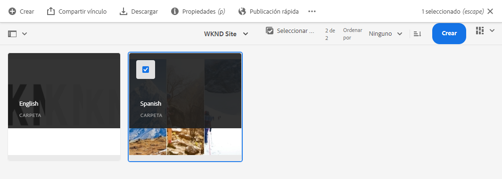

# Publicar contenido traducido sin encabezado {#publish-content}

Aprenda a publicar el contenido traducido y a actualizar las traducciones como actualizaciones de contenido.

## Lo que hemos visto hasta ahora {#story-so-far}

En el documento anterior del recorrido de traducción sin encabezado de AEM, [Traducir contenido](configure-connector.md), ha aprendido a utilizar proyectos de traducción de AEM para traducir contenido sin encabezado. Ahora debería ser capaz de:

* Comprender qué es un proyecto de traducción.
* Poder crear nuevos proyectos de traducción.
* Utilice los proyectos de traducción para traducir el contenido sin encabezado.

Ahora que la traducción inicial ha finalizado, este artículo le explica el siguiente paso para publicar ese contenido y qué hacer para actualizar sus traducciones como el contenido subyacente en los cambios de la raíz del idioma.

## Objetivo {#objective}

Este documento le ayuda a comprender cómo publicar contenido sin encabezado en AEM y cómo crear un flujo de trabajo continuo para mantener las traducciones actualizadas. Después de leer este documento, debería poder hacer lo siguiente:

* Comprender el modelo de creación y publicación de AEM.
* Obtener información sobre cómo publicar el contenido traducido.
* Poder implementar un modelo de actualización continua para el contenido traducido.

## Modelo de creación y publicación de AEM {#author-publish}

Antes de publicar el contenido, es aconsejable comprender el modelo de creación y publicación de AEM. En términos simplificados, AEM divide a los usuarios del sistema en dos grupos.

1. Aquellos que crean y administran el contenido y el sistema
1. Aquellos que consumen el contenido del sistema

Por lo tanto, AEM se separa físicamente en dos instancias.

1. La instancia de **autor** es el sistema donde los autores y administradores de contenido trabajan para crear y administrar contenido.
1. La instancia de **publicación** es el sistema que envía el contenido a los consumidores.

Una vez creado el contenido en la instancia de autor, debe transferirse a la instancia de publicación para que esté disponible para el consumo. Se llama al proceso de transferencia del autor a la **publicación**.

## Publicación del contenido traducido {#publishing}

Una vez que esté satisfecho con el estado del contenido traducido, debe publicarse para que los servicios sin encabezados puedan consumirlo. Esta tarea no suele ser responsabilidad del especialista en traducción, pero se documenta aquí para ilustrar el flujo de trabajo completo.

>[!NOTE]
>
>Por lo general, cuando se completa la traducción, el especialista en traducciones informa a los propietarios de los contenidos de que las traducciones están listas para su publicación. A continuación, los propietarios de contenido las publican.
>
>Se proporcionan los siguientes pasos para que se comprenda.

La forma más sencilla de publicar las traducciones es ir hasta la carpeta Recursos.

```text
/content/dam/<your-project>/
```

Esta ruta tiene subcarpetas para cada idioma de traducción y puede elegir cuál publicar.

1. Vaya a **Navegación** > **Recursos** > **Archivos** y abra la carpeta del proyecto. 
1. Aquí puede ver la carpeta raíz y todas las demás carpetas del idioma. Seleccione el o los idiomas localizados que desee publicar.
   
1. Seleccione **Administrar publicación**.
1. En la ventana **Administrar publicación**, asegúrese de que **Publicación** se seleccione automáticamente en **Acción** y **Ahora** se seleccione en **Programación**. Seleccione **Siguiente**.
   
1. En la siguiente ventana **Administrar publicación**, confirme que la ruta o rutas correctas están seleccionadas. Seleccione **Publicar**.
   
1. AEM confirma la acción de publicación con un mensaje emergente en la parte inferior de la pantalla.
   

El contenido sin encabezado traducido se publica. Ahora sus servicios sin encabezado pueden acceder a ellos y consumirlos.

>[!TIP]
>
>Cuando realice la publicación, puede seleccionar varios elementos (es decir, carpetas de varios idiomas) para publicar varias traducciones al mismo tiempo.

Existen opciones adicionales al publicar el contenido que están fuera del ámbito de este recorrido, como programar una hora de publicación. Consulte la sección [Recursos adicionales](#additional-resources) al final del documento para obtener más información.

## Actualización del contenido traducido {#updating-translations}

La traducción no suele ser una tarea de una sola vez. Normalmente, los autores siguen agregando y modificando el contenido en la raíz del idioma una vez completada la traducción inicial. Esto significa que también se debe actualizar el contenido traducido.

Los requisitos específicos del proyecto definen la frecuencia con la que se deben actualizar las traducciones y qué proceso de decisión se sigue antes de realizar una actualización. Una vez que haya decidido actualizar sus traducciones, el proceso en AEM es muy sencillo. Como la traducción inicial se basó en un proyecto de traducción, también lo son las actualizaciones.

Sin embargo, como ya se mencionó, el proceso difiere un poco si elige crear el proyecto de traducción de forma automática o manual.

### Actualización de un proyecto de traducción creado automáticamente {#updating-automatic-project}

1. Vaya a **Navegación** > **Recursos** > **Archivos**. Recuerde que el contenido sin encabezado de AEM se almacena como recursos conocidos como Fragmentos de contenido.
1. Seleccione la raíz de idioma del proyecto. En este caso, se ha seleccionado `/content/dam/wknd/en`.
1. Seleccione el selector de carril y muestre el panel **Referencias**.
1. Seleccione **copias de idioma**.
1. Marque la casilla de verificación **Copias de idioma**.
1. Expanda la sección **Actualizar copias de idioma** en la parte inferior del panel de referencias.
1. En el menú desplegable **Proyecto**, seleccione **Agregar a un proyecto de traducción existente**.
1. En el menú desplegable **Proyecto de traducción existente**, seleccione el proyecto creado para la traducción inicial.
1. Seleccione **Inicio**.


El contenido se agrega al proyecto de traducción existente. Para ver el proyecto de traducción, haga lo siguiente:

1. Vaya a **Navegación** > **Proyectos**.
1. Seleccione el proyecto que acaba de actualizar.
1. Haga clic en el idioma o en uno de los idiomas que ha actualizado.

Verá que se ha agregado una nueva tarjeta de trabajo al proyecto. En este ejemplo, se ha añadido otra traducción al español.


Puede observar que las estadísticas que aparecen en la nueva tarjeta (número de recursos y fragmentos de contenido) son diferentes. Esto se debe a que AEM reconoce qué ha cambiado desde la última traducción y solo incluye el contenido que debe traducirse. Esto incluye una nueva traducción del contenido actualizado, así como la primera traducción del contenido nuevo.

A partir de este punto, [inicie y administre su trabajo de traducción tal como lo hizo con el original](translate-content.md#using-translation-project).

### Actualización de un proyecto de traducción creado manualmente {#updating-manual-project}

Para actualizar una traducción, puede agregar un nuevo trabajo al proyecto existente que sea responsable de traducir el contenido actualizado.

1. Vaya a **Navegación** > **Proyectos**.
1. Seleccione el proyecto que debe actualizar.
1. Haga clic en el botón **Agregar** en la parte superior de la ventana.
1. En la ventana **Agregar mosaico**, haga clic en **Trabajo de traducción** y luego **Enviar**.

   

1. En la tarjeta del nuevo trabajo de traducción, haga clic en el botón de comillas angulares en la parte superior de la tarjeta y seleccione **Actualizar Destino** para definir el idioma de destino del nuevo trabajo.

   

1. En el cuadro de diálogo **Seleccionar idioma de destino**, utilice la lista desplegable para seleccionar el idioma y haga clic en **Listo**.

   

1. Una vez configurado el idioma de destino del nuevo trabajo de traducción, haga clic en el botón de puntos suspensivos en la parte inferior de la tarjeta de trabajo para ver los detalles del trabajo.
1. El trabajo está vacío la primera vez que se crea. Añada contenido al trabajo tocando o haciendo clic en el botón **Añadir** y utilizando el explorador de rutas [como lo hizo previamente al crear el proyecto de traducción](translate-content.md##manually-creating).

>[!TIP]
>
>Los avanzados filtros del explorador de rutas pueden ser útiles de nuevo para encontrar solo el contenido que se ha actualizado.
>
>Puede obtener más información sobre el explorador de rutas en la [sección de recursos adicionales](#additional-resources).

A partir de este punto, [inicie y administre su trabajo de traducción tal como lo hizo con el original](translate-content.md#using-translation-project).

## ¿Fin del recorrido? {#end-of-journey}

Felicitaciones. Ha completado el recorrido de traducción sin encabezado. Ahora debería ser capaz de:

* Obtener información general sobre qué es la entrega de contenido sin encabezado.
* Tener un conocimiento básico de las funciones de AEM sin encabezado.
* Conocer las funciones de traducción de AEM y cómo se relacionan con el contenido sin encabezado.
* Ahora puede empezar a traducir su propio contenido sin encabezado.

Ya está listo para traducir su propio contenido sin encabezado en AEM. Aun así, AEM es una herramienta potente y hay muchas opciones adicionales disponibles. Consulte algunos de los recursos adicionales disponibles en la [sección de Recursos adicionales](#additional-resources) para obtener más información acerca de las funciones que ha visto en este recorrido.

## Recursos adicionales {#additional-resources}

* [Administración de proyectos de traducción](/help/sites-cloud/administering/translation/managing-projects.md): conozca los detalles de los proyectos de traducción y las funciones adicionales, como los flujos de trabajo de traducción humana y proyectos en varios idiomas.
* [Conceptos de creación](/help/sites-cloud/authoring/author-publish.md): obtenga más información sobre el modelo de autor y publicación de AEM en más detalle. Este documento se centra en la creación de páginas en lugar de en los fragmentos de contenido, pero la teoría sigue aplicándose.
* [Publicación de páginas](/help/sites-cloud/authoring/sites-console/publishing-pages.md): obtenga información sobre las funciones adicionales disponibles al publicar contenido. Este documento se centra en la creación de páginas en lugar de en los fragmentos de contenido, pero la teoría sigue aplicándose.
* [Herramientas y entorno de creación](/help/sites-cloud/authoring/path-selection.md#path-selection): AEM ofrece varios mecanismos para organizar y editar el contenido, incluido un explorador de rutas robusto.
