# Traducir contenido sin encabezado {#translate-content}

Utilice el conector de traducción para traducir el contenido sin encabezado.

## Lo que hemos visto hasta ahora {#story-so-far}

En el documento anterior del recorrido de traducción sin encabezado de AEM, [Configurar el conector de traducción](configure-connector.md) aprendió sobre el marco de trabajo de traducción en AEM. Ahora debería ser capaz de:

* Comprender los parámetros importantes del marco de trabajo de integración de traducción en AEM.
* Puede configurar su propia conexión con el servicio de traducción.

Ahora que el conector está configurado, este artículo le guiará por el siguiente paso de traducción del contenido sin encabezado.

## Objetivo {#objective}

Este documento le ayuda a comprender cómo utilizar los proyectos de traducción de AEM junto con el conector para traducir contenido. Después de leer este documento, debería poder hacer lo siguiente:

* Comprender qué es un proyecto de traducción.
* Poder crear nuevos proyectos de traducción.
* Utilice los proyectos de traducción para traducir el contenido sin encabezado.

## Creación de un proyecto de traducción {#creating-translation-project}

Los proyectos de traducción le permitirán administrar la traducción del contenido sin encabezado de AEM. Un proyecto de traducción reúne el contenido que se traduce a otros idiomas en una ubicación para obtener una vista central del esfuerzo de traducción.

Cuando se añade contenido a un proyecto de traducción, se crea un trabajo de traducción para este. Los trabajos proporcionan comandos e información de estado que se utilizan para administrar los flujos de trabajo de traducción humana y traducción automática que se ejecutan en los recursos.

Los proyectos de traducción se pueden crear de dos formas:

1. Seleccione la raíz de idioma del contenido y deje que AEM cree automáticamente el proyecto de traducción en función de la ruta de contenido.
1. Cree un proyecto vacío y seleccione manualmente el contenido que desee añadir al proyecto de traducción

Ambos son enfoques válidos que normalmente solo difieren según el usuario que realice la traducción:

* El gestor de proyectos de traducción (TPM) suele necesitar la flexibilidad de seleccionar manualmente el contenido del proyecto de traducción.
* Si el propietario del contenido también es responsable de la traducción, dejar que AEM cree automáticamente el proyecto en función de la ruta de contenido seleccionada suele ser más fácil.

Ambos enfoques se analizan en las secciones siguientes.

### Creación automática de un proyecto de traducción basado en la ruta de contenido {#automatically-creating}

Para los propietarios de contenido que también son responsables de la traducción, a menudo es más fácil dejar que AEM cree automáticamente el proyecto de traducción. Para que AEM cree automáticamente un proyecto de traducción basado en la ruta de contenido:

1. Vaya a **Navegación** > **Recursos** > **Archivos**. Recuerde que el contenido sin encabezado de AEM se almacena como recursos conocidos como Fragmentos de contenido.
1. Seleccione la raíz de idioma del proyecto. En este caso, se ha seleccionado `/content/dam/wknd/en`.
1. Seleccione el selector de carril y muestre el panel **Referencias**.
1. Seleccione **copias de idioma**.
1. Marque la casilla de verificación **Copias de idioma**.
1. Expanda la sección **Actualizar copias de idioma** en la parte inferior del panel de referencias.
1. En el menú desplegable **Proyecto**, seleccione **Crear proyecto(s) de traducción**
1. Proporcione un título adecuado para el proyecto de traducción.
1. Seleccione **Inicio**.

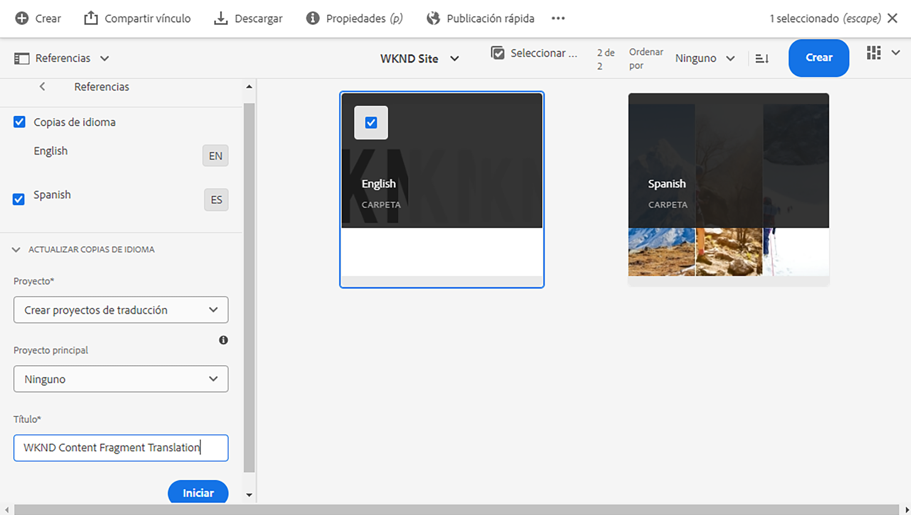

Recibirá un mensaje que indica que se creó el proyecto.

>[!NOTE]
>
>Se supone que ya se ha creado la estructura lingüística necesaria para los idiomas de traducción como parte de la [definición de la estructura de contenido](getting-started.md#content-structure). Esto debería hacerse en colaboración con el arquitecto de contenido.
>
>Si las carpetas de idioma no se crean con antelación, no podrá crear copias de idioma como se describió en los pasos anteriores.

### Creación manual de un proyecto de traducción seleccionando su contenido {#manually-creating}

Para los gestores de proyectos de traducción, a menudo es necesario seleccionar manualmente contenido específico para incluirlo en un proyecto de traducción. Para crear un proyecto de traducción manual de este tipo, debe empezar creando un proyecto vacío y luego seleccionar el contenido que desea añadir.

1. Vaya a **Navegación** > **Proyectos**.
1. Seleccione **Crear**> **Carpeta** para crear una carpeta para sus proyectos.
   * Esto es opcional, pero resulta útil para organizar los esfuerzos de traducción.
1. En la ventana **Crear proyecto**, agregue un **Título** para la carpeta y, a continuación, seleccione **Crear**.

   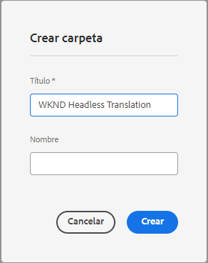

1. Seleccione la carpeta para abrirla.
1. En la nueva carpeta del proyecto, seleccione **Crear** > **Proyecto**.
1. Los proyectos se basan en plantillas. Seleccione la plantilla **Proyecto de traducción** y, a continuación,  **Siguiente**.

   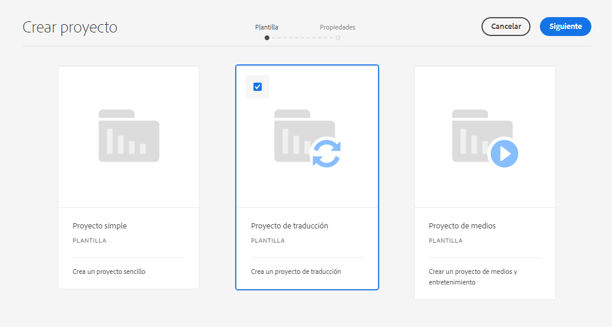

1. En la pestaña **Básico**, escriba un nombre para el nuevo proyecto.

   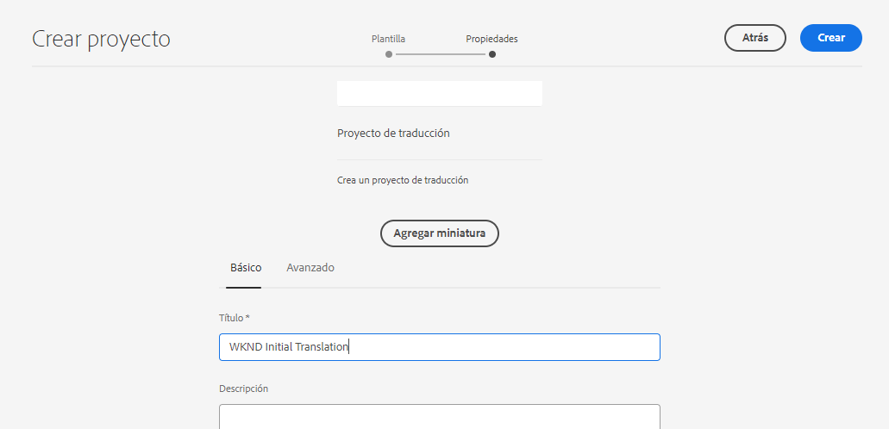

1. En la pestaña **Avanzada**, utilice el desplegable **Idioma de destinatario** para seleccionar los idiomas a los que se debe traducir el contenido. Seleccione **Crear**.

   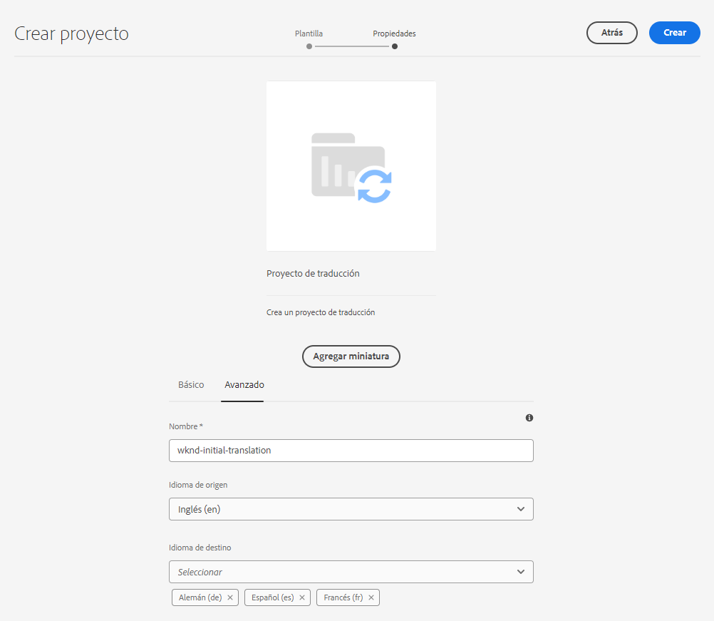

1. Seleccione **Abrir** en el cuadro de diálogo de confirmación.

   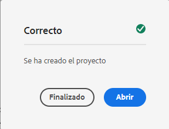

El proyecto se ha creado, pero no contiene contenido para traducir. La siguiente sección detalla cómo se estructura el proyecto y cómo añadir contenido.

## Uso de un proyecto de traducción {#using-translation-project}

Los proyectos de traducción están diseñados para recopilar todo el contenido y las tareas relacionadas con un esfuerzo de traducción en un solo lugar para que la traducción sea sencilla y fácil de administrar.

Para ver el proyecto de traducción, haga lo siguiente:

1. Vaya a **Navegación** > **Proyectos**.
1. Seleccione el proyecto que ha creado en la sección anterior.

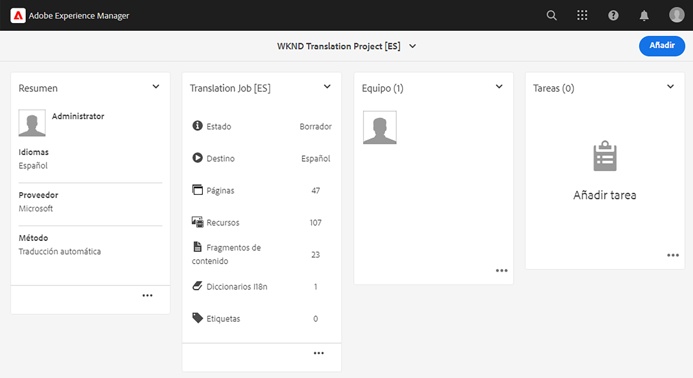

El proyecto se divide en varias tarjetas.

* **Resumen** - Esta tarjeta muestra la información básica del encabezado del proyecto, incluido el propietario, el idioma y el proveedor de traducción.
* **Trabajo de traducción**: esta tarjeta o estos programas de tarjetas proporcionan una visión general del trabajo de traducción real, incluyendo el estado, el número de archivos, etc. Generalmente, hay un trabajo por idioma con el código de idioma ISO-2 anexado al nombre del trabajo.
* **Equipo** - Esta tarjeta muestra los usuarios que están colaborando en este proyecto de traducción. Este recorrido no cubre este tema.
* **Tareas**: Tareas adicionales asociadas con la traducción del contenido, como hacer elementos o elementos de flujo de trabajo. Este recorrido no cubre este tema.

El uso de un proyecto de traducción depende de cómo se creó: automáticamente por AEM o manualmente.

### Uso de un proyecto de traducción creado automáticamente {#using-automatic-project}

Al crear automáticamente el proyecto de traducción, AEM evalúa el contenido sin encabezado en la ruta seleccionada. Basándose en esa evaluación, extrae el contenido que requiere traducción en un nuevo proyecto de traducción. Sabe qué campos se deben traducir en función de los campos marcados como **Traducible** por el arquitecto de contenido.

Para ver los detalles del contenido sin encabezado incluidos en este proyecto, haga lo siguiente:

1. Seleccione el botón de los tres puntos en la parte inferior de la tarjeta del **Trabajo de traducción**.
1. La ventana **Trabajo de traducción** lista todos los elementos del trabajo.
   
1. Seleccione una línea para ver el detalle de esa línea, teniendo en cuenta que una línea puede representar varios elementos de contenido para traducir.
1. Seleccione la casilla de verificación de selección de un elemento de línea para ver más opciones, como la opción de eliminarlo del trabajo o verlo en las consolas Fragmentos de contenido o Recursos.

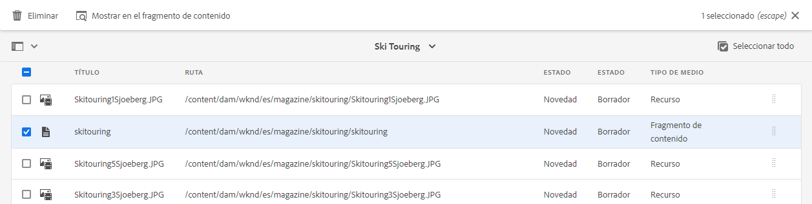

Normalmente, el contenido del trabajo de traducción se inicia en el estado **Borrador** tal como indica la columna **Estado** en la ventana **Trabajo de traducción**.

Para iniciar el trabajo de traducción, vuelva a la descripción general del proyecto de traducción y seleccione el botón de comillas angulares en la parte superior de la tarjeta **Trabajo de traducción** e **Iniciar**.

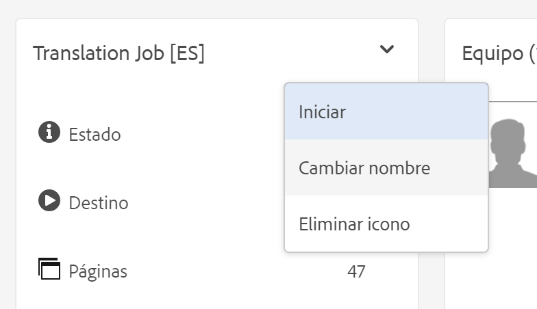

Ahora, AEM se comunica con la configuración de traducción y con el conector para enviar el contenido al servicio de traducción. Para ver el progreso de la traducción, vuelva a la ventana **Trabajo de traducción** y visualice la columna **Estado** de las entradas.

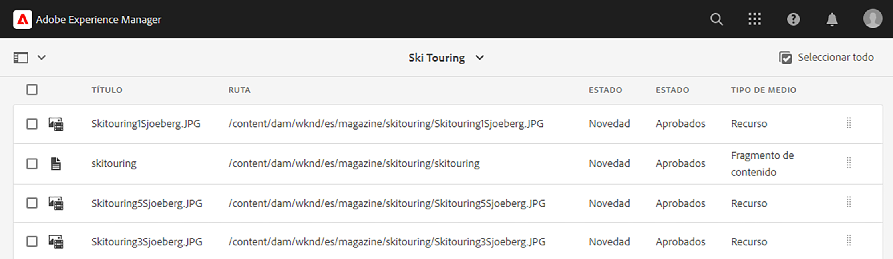

Las traducciones automáticas se devuelven automáticamente con un estado de **Aprobado**. La traducción humana permite una mayor interacción, pero está fuera del alcance de este recorrido.

### Uso de un proyecto de traducción creado manualmente {#using-manual-project}

Al crear manualmente un proyecto de traducción, AEM crea los trabajos necesarios, pero no selecciona automáticamente ningún contenido para incluirlo. Esto permite al gestor del proyecto de traducción tener la flexibilidad de elegir qué contenido traducir.

Para añadir contenido a un trabajo de traducción:

1. Seleccione los puntos suspensivos en la parte inferior de una de las tarjetas de **Trabajo de traducción**.
1. Compruebe que el trabajo no incluya contenido. Seleccione el botón **Agregar** en la parte superior de la ventana y, a continuación, **Recursos/Páginas** en la lista desplegable.

   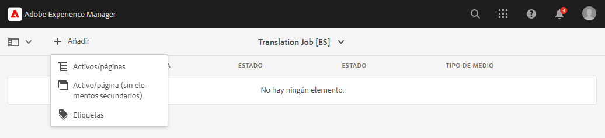

1. Se abre un navegador de rutas que le permite seleccionar específicamente qué contenido añadir. Busque el contenido y haga clic para seleccionarlo.

   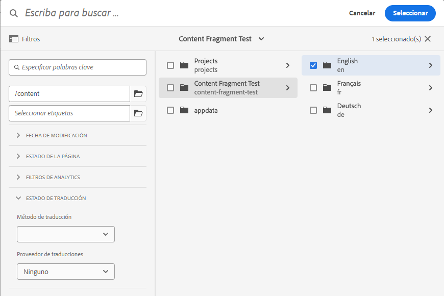

1. Elija **Seleccionar** para añadir el contenido seleccionado al trabajo.
1. En el cuadro de diálogo **Traducir**, especifique que desea **Crear copia de idioma**.

   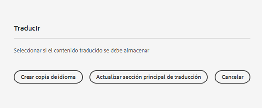

1. El contenido ahora se incluye en el trabajo.

   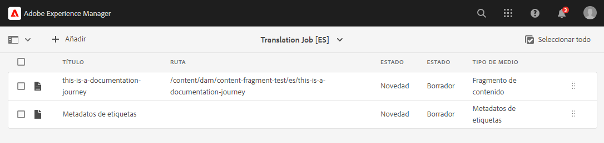

1. Seleccione la casilla de verificación de selección de un elemento de línea para ver más opciones, como la opción de eliminarlo del trabajo o verlo en las consolas Fragmentos de contenido o Recursos.


1. Repita estos pasos para incluir todo el contenido necesario en el trabajo.

>[!TIP]
>
>El navegador de rutas es una potente herramienta que le permite buscar, filtrar y navegar por el contenido. Seleccione el botón **Solo contenido/Filtros** para alternar el panel lateral y mostrar filtros avanzados como **Fecha de modificación** o **Estado de la traducción**.
>
>Puede obtener más información sobre el explorador de rutas en la [sección de recursos adicionales](#additional-resources).

Puede utilizar los pasos anteriores para agregar el contenido necesario a todos los idiomas (trabajos) del proyecto. Una vez que haya seleccionado todo el contenido, puede iniciar la traducción.

Normalmente, el contenido del trabajo de traducción se inicia en el estado **Borrador** tal como indica la columna **Estado** en la ventana **Trabajo de traducción**.

Para iniciar el trabajo de traducción, vuelva a la descripción general del proyecto de traducción y seleccione el botón de comillas angulares en la parte superior de la tarjeta de **Trabajo de traducción** e **Iniciar**.


Ahora, AEM se comunica con la configuración de traducción y con el conector para enviar el contenido al servicio de traducción. Para ver el progreso de la traducción, vuelva a la ventana **Trabajo de traducción** y visualice la columna **Estado** de las entradas.


Las traducciones automáticas se devuelven automáticamente con un estado de **Aprobado**. La traducción humana permite una mayor interacción, pero está fuera del alcance de este recorrido.

## Revisión del contenido traducido {#reviewing}

[Como se ha visto anteriormente](#using-translation-project), el contenido traducido automáticamente vuelve a AEM con el estado **Aprobado**, ya que se supone que, al utilizar la traducción automática, no se requiere intervención humana. Sin embargo, todavía es posible revisar el contenido traducido.

Simplemente, vaya al trabajo de traducción completado y seleccione un elemento de línea tocando o haciendo clic en la casilla de verificación. El icono **Revelar en Fragmento de contenido** se muestra en la barra de herramientas.

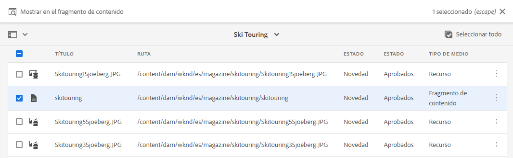

Seleccione dicho icono para abrir el fragmento de contenido traducido en la consola de editor para ver los detalles del contenido traducido.

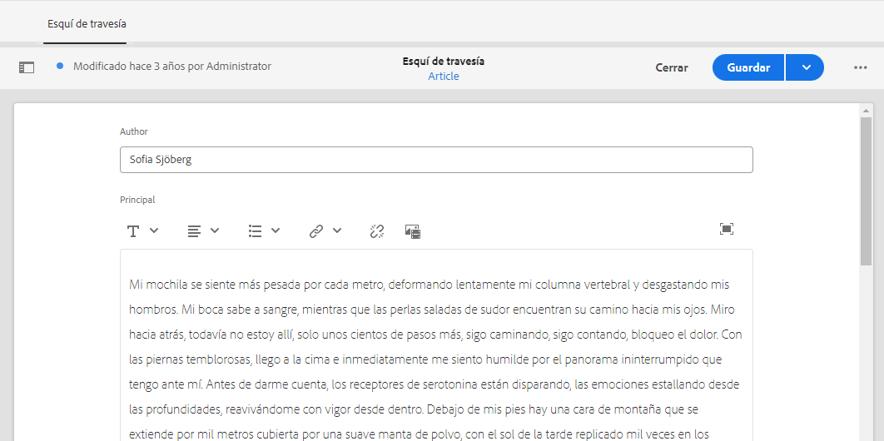

Puede modificar todavía más el contenido traducido necesario, siempre que tenga el permiso adecuado, pero la edición de fragmentos de contenido está fuera del ámbito de este recorrido. Consulte la sección [Recursos adicionales](#additional-resources) al final de este documento para obtener más información sobre este tema.

El propósito del proyecto es reunir todos los recursos relacionados con una traducción en un solo lugar para facilitar el acceso y una visión general clara. Sin embargo, como puede ver al visualizar el detalle de un elemento traducido, las propias traducciones vuelven a la carpeta de recursos del idioma de traducción. En este ejemplo, la carpeta es la siguiente:

```text
/content/dam/wknd/es
```

Si va a esta carpeta mediante **Navegación** > **Archivos** > **Recursos**, verá el contenido traducido.

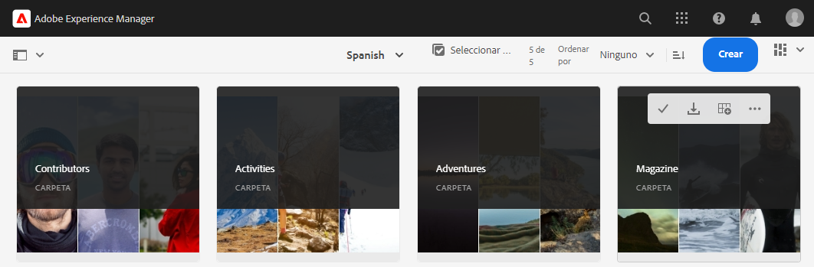

El marco de trabajo de traducción de AEM recibe las traducciones del conector de traducción y, a continuación, crea automáticamente la estructura de contenido en función de la raíz del idioma y utilizando las traducciones proporcionadas por el conector.

Es importante comprender que este contenido no está publicado y, por consiguiente, no está disponible para los servicios sin encabezado. Aprenderemos sobre esta estructura de creación y publicación y veremos cómo publicar nuestro contenido traducido en el siguiente paso del recorrido de traducción.

## Traducción humana {#human-translation}

Si el servicio de traducción proporciona traducción humana, el proceso de revisión ofrece más opciones. Por ejemplo, las traducciones vuelven al proyecto con el estado **Borrador** y deben revisarse y aprobarse o rechazarse manualmente.

La traducción humana está fuera del alcance de este recorrido de localización. Consulte la sección [Recursos adicionales](#additional-resources) al final de este documento para obtener más información sobre este tema. Sin embargo, más allá de las opciones de aprobación adicionales, el flujo de trabajo para las traducciones humanas es el mismo que las traducciones automáticas, tal como se describe en este recorrido.

## Siguientes pasos {#what-is-next}

Ahora que ha completado esta parte del recorrido de traducción sin encabezado, debería lograr lo siguiente:

* Comprender qué es un proyecto de traducción.
* Poder crear nuevos proyectos de traducción.
* Utilice los proyectos de traducción para traducir el contenido sin encabezado.

Amplíe este conocimiento y continúe con su recorrido de traducción sin encabezado de AEM revisando el documento [Publicar contenido traducido](publish-content.md). Aquí aprenderá a publicar su contenido traducido y a actualizar esas traducciones a medida que cambie el contenido raíz del idioma.

## Recursos adicionales {#additional-resources}

Aunque se recomienda pasar a la siguiente parte del recorrido de traducción sin encabezado revisando el documento [Publicar contenido traducido](publish-content.md), a continuación se presentan algunos recursos adicionales y opcionales que profundizan en algunos conceptos mencionados en este documento, pero que no son necesarios para continuar con el recorrido de traducción sin encabezado.

* [Administración de proyectos de traducción](/help/sites-cloud/administering/translation/managing-projects.md): Conozca los detalles de los proyectos de traducción y las funciones adicionales, como flujos de trabajo de traducción humana y proyectos en varios idiomas.
* [Herramientas y entorno de creación](/help/sites-cloud/authoring/path-selection.md#path-selection): AEM ofrece varios mecanismos para organizar y editar el contenido, incluido un explorador de rutas robusto.
