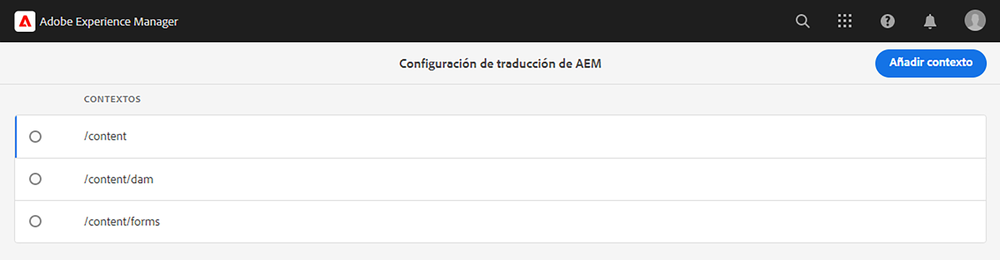
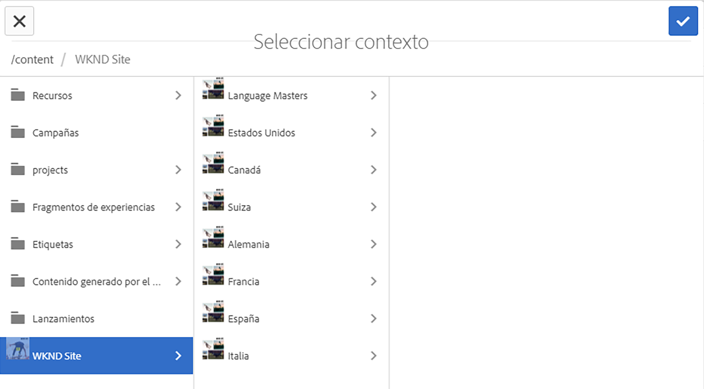
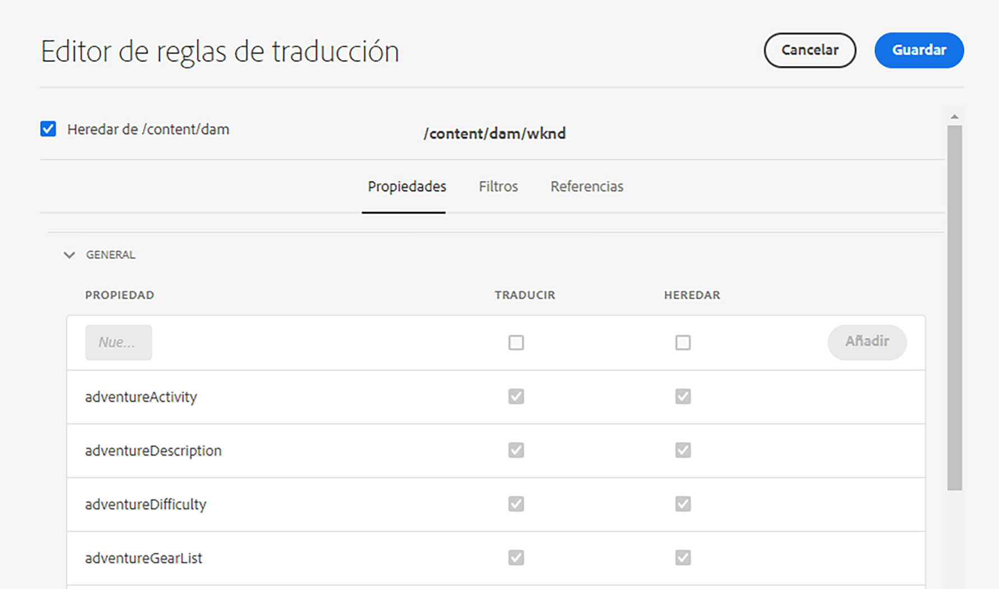
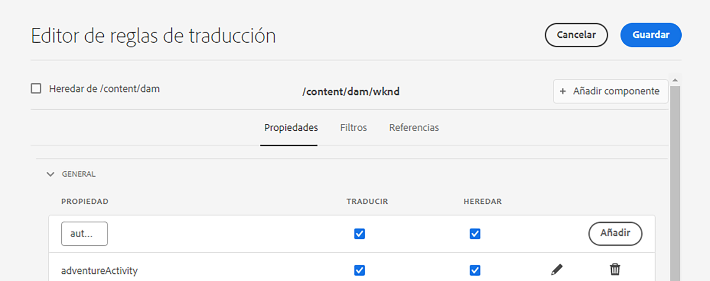

# Configuración de las reglas de traducción {#configure-translation-rules}

Aprenda a definir reglas de traducción para identificar el contenido que se va a traducir.

## Lo que hemos visto hasta ahora {#story-so-far}

En el documento anterior del recorrido de traducción sin encabezado de AEM, [Configuración de la integración de traducción](configure-connector.md), ha aprendido a instalar y configurar la integración de traducción y ahora, deberá hacer lo siguiente:

* Comprender los parámetros importantes del marco de trabajo de integración de traducción en AEM.
* Puede configurar su propia conexión con el servicio de traducción.

Ahora que la integración está configurada, este artículo le explica el siguiente paso para identificar qué contenido debe traducir.

>[!CAUTION]
>
>Este paso del recorrido de la documentación solo es necesario si no utiliza el indicador **Traducible** en los fragmentos de contenido.
>
>* El indicador **Traducible** crea automáticamente reglas de traducción y no requiere intervención.
>* El indicador **Traducible** solo se utiliza si la configuración del marco de trabajo de integración de traducción está establecida en **[Habilitar los campos del modelo de contenido para la traducción](/help/sites-cloud/administering/translation/integration-framework.md)**.
>* Al habilitar esta opción en la configuración de TIF, se reemplazará cualquier regla de traducción creada manualmente.|

## Objetivo {#objective}

Este documento le ayuda a comprender cómo utilizar las reglas de traducción de AEM para identificar el contenido de la traducción. Después de leer este documento, debería poder hacer lo siguiente:

* Comprender lo que hacen las reglas de traducción.
* Poder definir sus propias reglas de traducción.

## Reglas de traducción {#translation-rules}

Los fragmentos de contenido, que representan el contenido sin encabezado, pueden contener mucha información organizada en campos estructurados. Según las necesidades del proyecto, es probable que no todos los campos de un Fragmento de contenido deban traducirse.

Las reglas de traducción identifican el contenido que se incluye en los proyectos de traducción o que se excluye de ellos. Cuando se traduce contenido, AEM lo extrae o saca en función de estas reglas. De este modo, solo el contenido que debe traducirse se envía al servicio de traducción.

Las reglas de traducción incluyen la siguiente información:

* Ruta del contenido al que se aplica la regla
   * La regla también se aplica a los descendientes del contenido
* Nombres de las propiedades que contienen el contenido que se va a traducir
   * La propiedad puede ser específica para un tipo de recurso específico o para todos los tipos de recurso

Debido a que los Modelos de fragmento de contenido, que definen la estructura de los Fragmentos de contenido, son únicos para su propio proyecto, es vital configurar reglas de traducción para que AEM sepa qué elementos de los modelos de contenido hay que traducir.

>[!TIP]
>
>Por lo general, el arquitecto de contenido proporciona al especialista de traducción los **Nombres de propiedad** de todos los campos necesarios para la traducción. Estos nombres son necesarios para configurar las reglas de traducción. Como especialista en traducción, [puede encontrar estos **Nombres de propiedad** por sí mismo](getting-started.md#content-modlels), tal como se ha descrito anteriormente en este recorrido.

## Creación de reglas de traducción {#creating-rules}

Se pueden crear varias reglas para admitir requisitos de traducción complejos. Por ejemplo, un proyecto en el que esté trabajando requiere que se traduzcan todos los campos del modelo, pero en otro solo deben traducirse las descripciones, mientras que los títulos se dejan sin traducir.

Las reglas de traducción están diseñadas para manejar estos escenarios. Sin embargo, en este ejemplo ilustramos cómo crear reglas centrándose en una configuración simple y única.

Hay una consola de **Configuración de traducción** disponible para configurar las reglas de traducción. Para acceder a ella, haga lo siguiente:

1. Vaya a **Herramientas** > **General**.
1. Seleccione **Configuración de traducción**.

En la IU **Configuración de traducción**, hay un número de opciones disponibles para las reglas de traducción. Aquí destacamos los pasos más necesarios y típicos para una configuración de localización sin encabezado básica.

1. Seleccione **Agregar contexto** para añadir una ruta. Esta es la ruta del contenido que se ve afectado por la regla.
   
1. Utilice el navegador de rutas para seleccionar la ruta requerida y seleccione **Confirmar** para guardar. Recuerde que los fragmentos de contenido, que contienen contenido sin encabezado, generalmente se encuentran debajo de `/content/dam/<your-project>`.
   
1. Seleccione el contexto que acaba de crear y luego seleccione **Editar**. Esto abre el **Editor de reglas de traducción** para configurar las propiedades.
   
1. De forma predeterminada, todas las configuraciones se heredan de la ruta principal, en este caso, `/content/dam`. Desmarque la opción **Heredar de`/content/dam`** para añadir campos adicionales a la configuración.
1. Una vez desmarcado, en la sección **General** de la lista, añada los nombres de propiedad del modelo o modelos de fragmentos de contenido que haya [identificado previamente como campos para la traducción](getting-started.md#content-models).
   1. En el campo **Nueva propiedad**, introduzca el nombre de la propiedad. Las opciones **Traducir** y **Heredar** se marcan automáticamente.
   1. Seleccione **Añadir**.
   1. Repita estos pasos para todos los campos que debe traducir.
   1. Seleccione **Guardar**.
      

Ya ha configurado las reglas de traducción.

## Uso avanzado {#advanced-usage}

Hay varias propiedades adicionales que se pueden configurar como parte de las reglas de traducción. Además, puede especificar las reglas manualmente como XML, lo que permite una mayor especificidad y flexibilidad.

Normalmente, estas funciones no son necesarias para empezar a localizar el contenido sin encabezado. De igual manera, puede leer más sobre ellas en la sección [Recursos adicionales](#additional-resources).

## Siguientes pasos {#what-is-next}

Ahora que ha completado esta parte del recorrido de traducción sin encabezado, debería lograr lo siguiente:

* Comprender lo que hacen las reglas de traducción.
* Poder definir sus propias reglas de traducción.

Aproveche este conocimiento y continúe con su recorrido de traducción de AEM sin encabezado. Revise el documento [Traducir contenido](translate-content.md) donde aprenderá cómo funcionan juntos su integración y sus reglas para traducir contenido sin encabezado.

## Recursos adicionales {#additional-resources}

Aunque se recomienda pasar a la siguiente parte del recorrido de traducción sin encabezado revisando el documento [Traducción de contenido](translate-content.md), a continuación se presentan algunos recursos adicionales y opcionales que profundizan en algunos conceptos mencionados en este documento, pero que no son necesarios para continuar con el recorrido de traducción sin encabezado.

* [Identificación del contenido para traducir](/help/sites-cloud/administering/translation/rules.md): aprenda cómo las reglas de traducción identifican el contenido que necesita traducirse.
