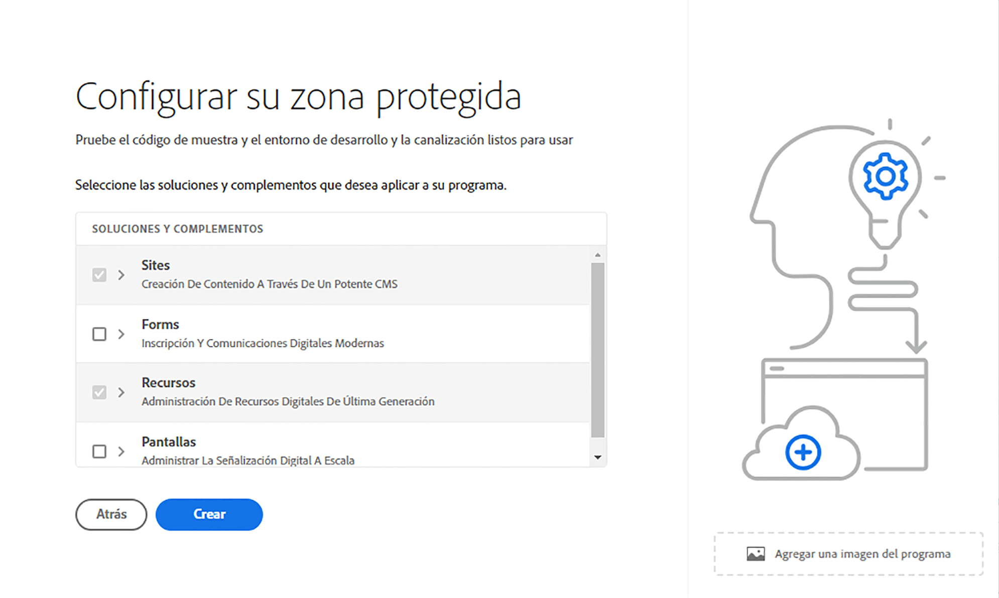

# Creación de un programa {#create-program}

En esta parte del [recorrido de incorporación](overview.md), aprenderá a utilizar Cloud Manager para crear su primer programa.

## Objetivo {#objective}

Tras revisar el documento anterior de este recorrido de incorporación, [Acceder a Cloud Manager](cloud-manager.md), se ha asegurado de tener acceso adecuado a Cloud Manager. Ahora puede crear su primer programa.

Después de leer este documento, debería poder hacer lo siguiente:

* Comprender y explicar qué es un programa.
* Conocer la diferencia entre los programas de producción y los de las zonas protegidas.
* Crear su propio programa.

## ¿Qué es un programa? {#programs}

Los programas son el nivel más alto de organización en Cloud Manager. Según la licencia con Adobe, los programas permiten organizar la solución y conceder acceso a miembros concretos del equipo a esos programas.

Los programas de Cloud Manager representan conjuntos de entornos de Cloud Manager. Estos programas admiten conjuntos lógicos de iniciativas del negocio, que normalmente corresponden a un Contrato de nivel de servicio (SLA) con licencia. Por ejemplo, un programa puede representar los recursos de Adobe Experience Manager (AEM) para apoyar un sitio web público mundial para una organización, mientras que otro programa representa un DAM central interno.

Consideremos el ejemplo de WKND Travel and Adventure Enterprises teórico, un inquilino especializado en medios relacionados con viajes. Pueden tener dos programas. Un programa de AEM Sites para su división WKND Magazine y un programa de AEM Assets para la división de WKND Media. Los distintos integrantes del equipo tendrían entonces acceso a los diferentes programas debido a su propia división de las necesidades laborales.

Existen dos tipos diferentes de programas:

* Un **programa de producción** se crea para habilitar el tráfico en directo para el sitio. Este programa es su entorno &quot;real&quot;.
* Un **programa de zona protegida** normalmente se crea para servir los propósitos de formación, ejecución de demostraciones, habilitación, POC o documentación.

Dado que sirven para diferentes propósitos, los diferentes entornos tienen diferentes opciones. Sin embargo, el proceso de creación es similar. Para este recorrido de integración, debe crear un entorno de zona protegida.

>[!TIP]
>
>Si necesita crear un programa de producción, consulte la sección [Recursos adicionales](#additional-resources) para obtener un vínculo a la documentación que describe los programas en detalle.

## Creación de un programa de zona protegida {#create-sandbox}

1. Inicie sesión en Cloud Manager en [my.cloudmanager.adobe.com](https://my.cloudmanager.adobe.com/) y seleccione la organización adecuada.

1. En la página de aterrizaje de Cloud Manager, haga clic en **Agregar programa** en la esquina superior derecha de la pantalla.

   

1. En el asistente Crear programa, seleccione **Configurar una zona protegida**, proporcione un nombre de programa y seleccione **Continuar**.

   

1. En el cuadro de diálogo **Configurar la zona protegida**, puede elegir qué soluciones desea habilitar en el programa de zona protegida. Las soluciones de **Sites** y **Assets** siempre se incluyen en los programas de zonas protegidas y se seleccionan automáticamente. Estas soluciones son suficientes para su ejemplo de incorporación. Haga clic en **Crear**.

   

Verá una nueva tarjeta de programa de zona protegida en la página de aterrizaje con un indicador de estado a medida que avance el proceso de configuración.

Una vez completado el programa, los miembros de la organización asignados al perfil de producto **Desarrollador** podrán iniciar sesión en Cloud Manager y administrar los repositorios Git de Cloud Manager.

## Siguientes pasos {#whats-next}

Con el primer programa creado, ahora puede crear entornos para él. Continúe con su recorrido de incorporación revisando el documento [Crear entornos](create-environments.md).

Vea también [Incorporar su sitio Edge Delivery Services](/help/implementing/cloud-manager/edge-delivery/create-edge-delivery-site.md).

## Recursos adicionales {#additional-resources}

Los siguientes son recursos opcionales adicionales si desea ir más allá del contenido del recorrido de incorporación.

* [Programas y tipos de programas](/help/implementing/cloud-manager/getting-access-to-aem-in-cloud/program-types.md): obtenga información sobre la jerarquía de Cloud Manager y cómo encajan los distintos tipos de programas en su estructura y cómo difieren.
* [Creación de programas de zona protegida](/help/implementing/cloud-manager/getting-access-to-aem-in-cloud/creating-sandbox-programs.md): aprenda a utilizar Cloud Manager para crear su propio programa de zona protegida para formación, demostración, POC u otros fines que no sean de producción.
* [Creación de programas de producción](/help/implementing/cloud-manager/getting-access-to-aem-in-cloud/creating-production-programs.md): aprenda a utilizar Cloud Manager para crear su propio programa de producción y alojar tráfico en directo.
* [Uso de programas de Adobe Cloud Manager](https://experienceleague.adobe.com/es/docs/experience-manager-learn/cloud-service/cloud-manager/programs): los programas de Cloud Manager representan conjuntos de entornos AEM que admiten conjuntos lógicos de iniciativas del negocio, que normalmente corresponden a un Contrato de nivel de servicio (SLA) adquirido.
* [Los perfiles de equipo y producto de AEM as a Cloud Service](/help/onboarding/aem-cs-team-product-profiles.md) - Descubra cómo los perfiles de equipo y producto de AEM as a Cloud Service pueden conceder y limitar el acceso a sus soluciones de Adobe con licencia.
