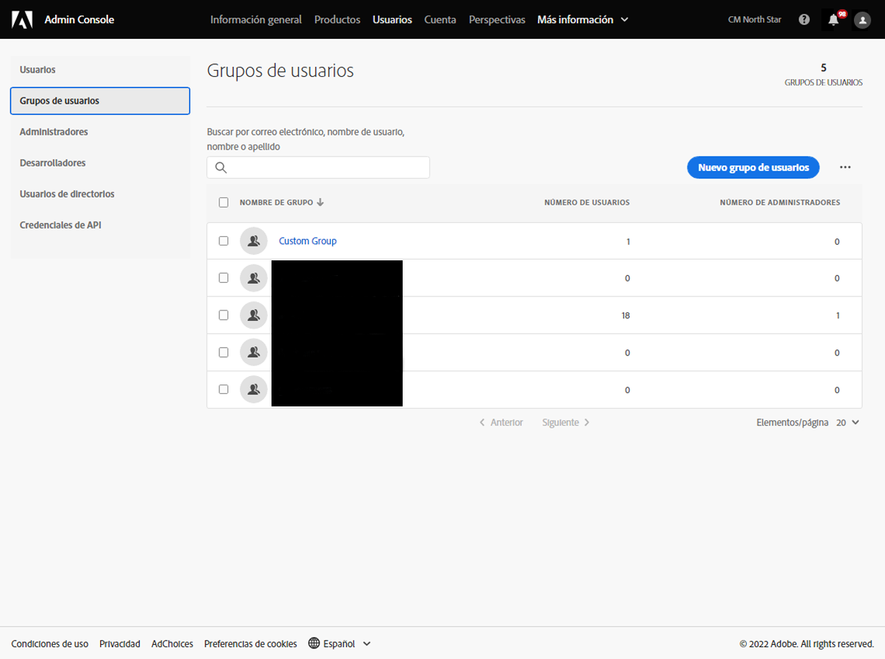
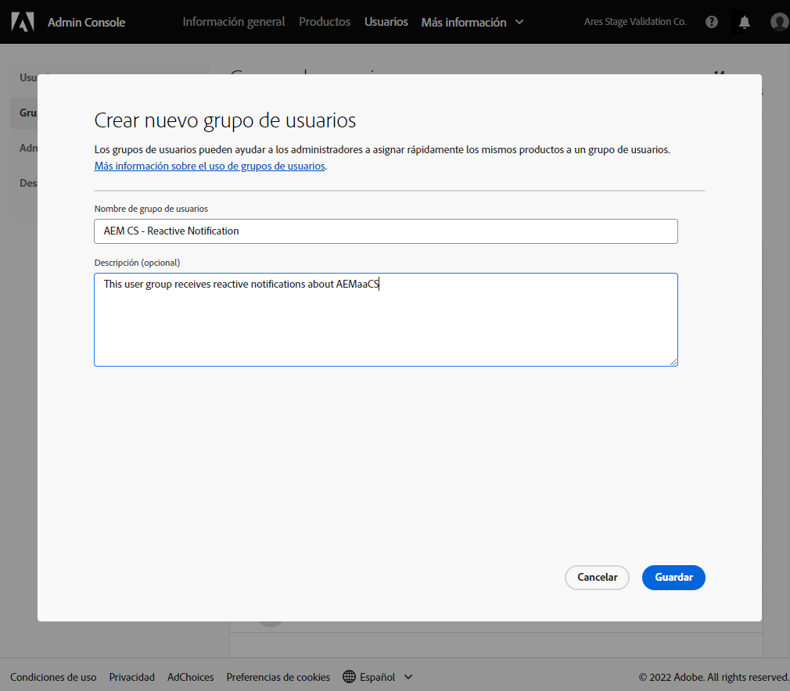
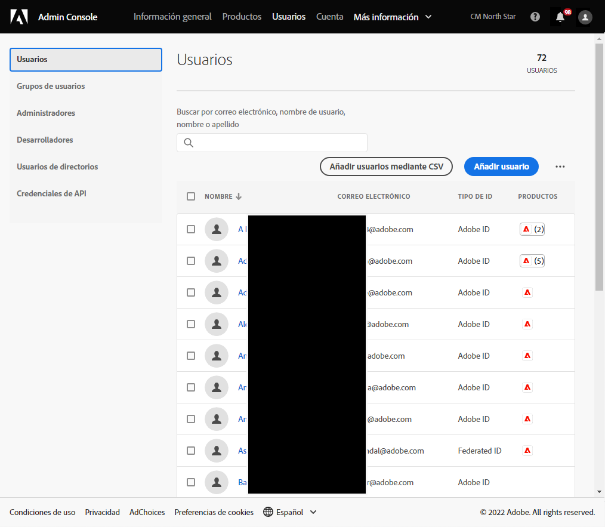
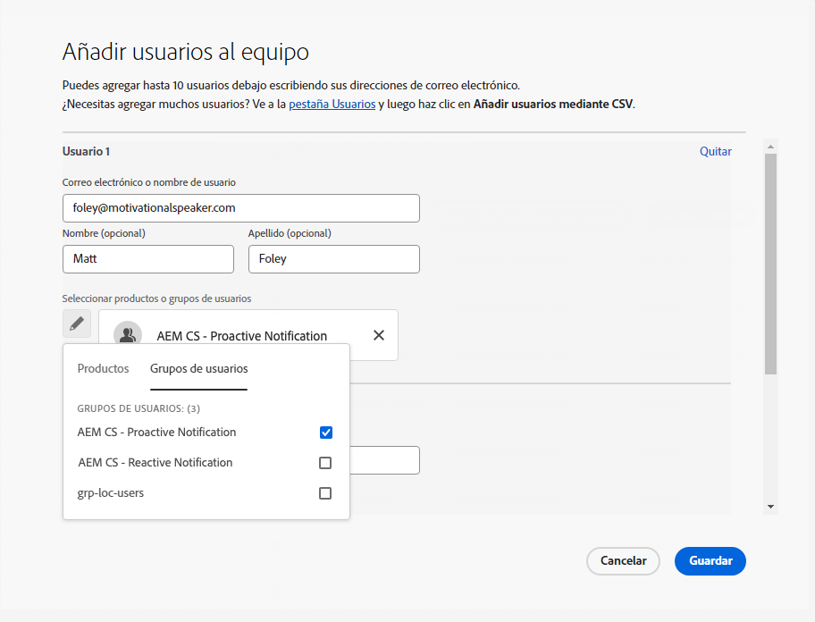
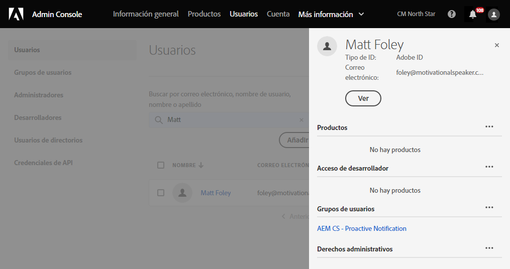

# Grupos de usuarios para notificaciones {#user-groups}

Obtenga información sobre cómo crear un grupo de usuarios en el Admin Console para administrar la recepción de notificaciones de correo electrónico importantes.

## Información general {#overview}

De vez en cuando, el Adobe debe ponerse en contacto con respecto a sus entornos as a Cloud Service AEM. Además de la notificación interna del producto, el Adobe también utiliza ocasionalmente el correo electrónico para estas notificaciones. Existen dos tipos de notificación:

* **Notificación reactiva** - Estas notificaciones se envían durante un incidente o cuando el Adobe ha identificado un posible problema de disponibilidad con su entorno as a Cloud Service AEM.
* **Notificación dinámica** : estas notificaciones se envían cuando un miembro del equipo de asistencia de Adobe desea proporcionar orientación sobre una posible optimización o recomendación que pueda beneficiar a su entorno as a Cloud Service AEM.

Para que los usuarios correctos reciban estas notificaciones, debe configurar los grupos de usuarios.

## Requisitos previos {#prerequisites}

Debido a que los grupos de usuarios se crean y mantienen en el Admin Console, antes de crear grupos de usuarios para las notificaciones, debe:

* Tiene permisos para agregar y editar miembros de grupos.
* Tener un perfil de Adobe Admin Console válido.

## Crear grupos de usuarios para la notificación {#create-groups}

Para configurar correctamente la recepción de notificaciones, deberá crear dos grupos de usuarios. Estos pasos deben realizarse una sola vez.

1. Inicie sesión en el Admin Console en [`https://adminconsole.adobe.com`.](https://adminconsole.adobe.com)

1. Haga clic en el **Usuarios** y, a continuación, **Grupos de usuarios** en el panel de navegación izquierdo.

   

1. Haga clic en el **Nuevo grupo de usuarios** y proporcione un **Nombre del grupo de usuarios** exactamente como se ha especificado y un **Descripción**.

   * Los nombres de grupo deben coincidir con los siguientes. No ajuste ni modifique los nombres de los grupos de ninguna manera.
      * `AEM CS - Reactive Notification`
      * `AEM CS - Proactive Notification`

   

1. Haga clic en **Guardar**.

1. Repita los pasos para el segundo grupo.

En los casos en los que los grupos no estén definidos, el Adobe notificará a los usuarios existentes con Cloud Manager **Desarrollador** o **Implementación** perfiles.

## Añadir usuarios a los grupos {#add-users}

Ahora que se han creado los grupos, debe asignar los usuarios adecuados. Puede hacerlo al crear usuarios nuevos o al actualizar los existentes.

### Agregar nuevos usuarios a grupos {#new-user}

1. Inicie sesión en el Admin Console en [`https://adminconsole.adobe.com`](https://adminconsole.adobe.com) si todavía no ha iniciado sesión.

1. Haga clic en el **Usuarios** y, a continuación, **Usuarios** en el panel de navegación izquierdo.

   

1. Haga clic en el **Agregar usuario** y proporcione la dirección de correo electrónico del usuario. Opcionalmente, también puede proporcionar un nombre y un apellido.

   * Si el usuario ya existe, el Admin Console coincidirá con la dirección de correo electrónico y rellenará previamente los campos.

1. Haga clic en el signo más debajo de los campos de nombre de usuario y, a continuación, haga clic en el botón **Grupos de usuarios** en la ventana emergente para seleccionar los grupos del usuario.

   

1. Haga clic en **Guardar** para guardar el nuevo usuario.

Repita estos pasos para cada usuario para el que necesite asignar los grupos de notificación.

### Agregar usuarios existentes a grupos {#existing-user}

1. Inicie sesión en el Admin Console en [`https://adminconsole.adobe.com`](https://adminconsole.adobe.com) si todavía no ha iniciado sesión.

1. Haga clic en el **Usuarios** y, a continuación, **Usuarios** en el panel de navegación izquierdo.

   

1. Haga clic en la fila del usuario que desee agregar a un grupo de notificación. Se abre un panel que muestra los detalles del usuario.

1. Haga clic en el icono de puntos suspensivos en el lado derecho del **Grupos de usuarios** en el panel de detalles.