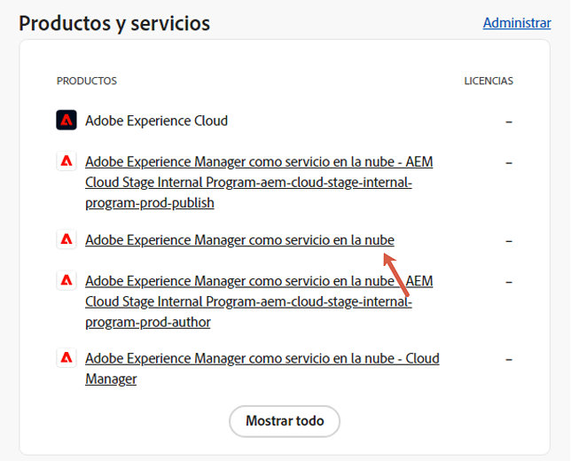
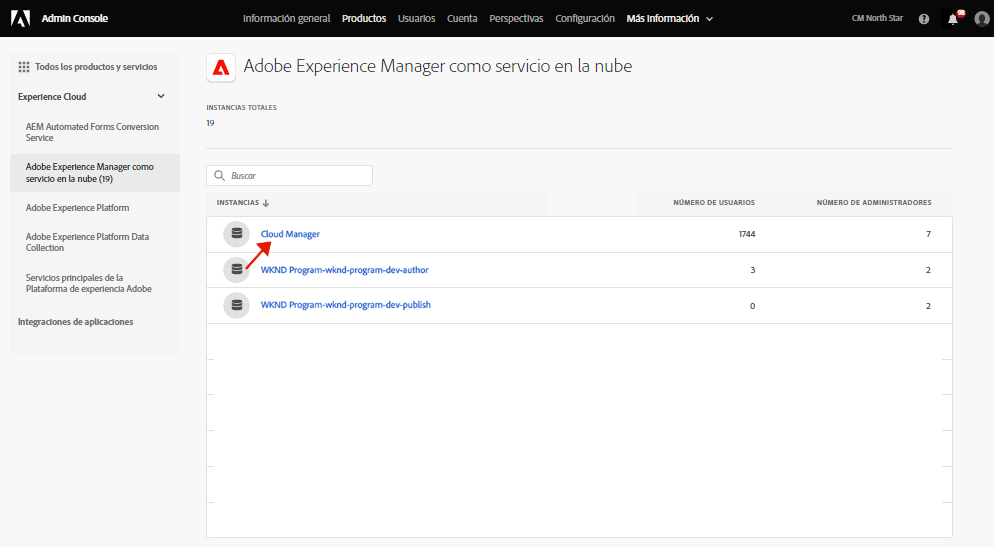
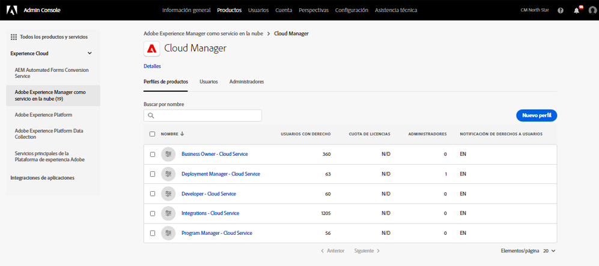
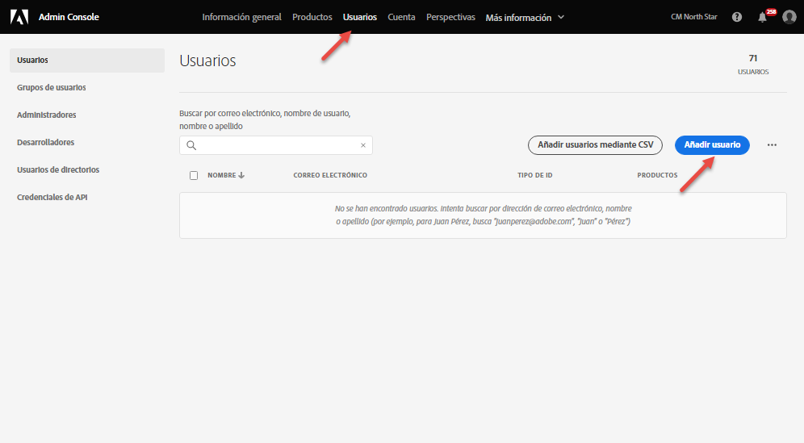

# Grupos de usuarios para notificaciones {#user-groups}

Obtenga información sobre cómo crear un grupo de usuarios en Admin Console para administrar la recepción de notificaciones de correo electrónico importantes.

## Información general {#overview}

De vez en cuando, Adobe debe ponerse en contacto con los usuarios en relación con sus entornos AEM as a Cloud Service. Además de las notificaciones internas del producto, Adobe también utiliza ocasionalmente el correo electrónico para las notificaciones. Existen dos tipos de notificaciones de correo electrónico:

* **Notificación de incidente**: estas notificaciones se envían durante un incidente o cuando Adobe ha identificado un posible problema de disponibilidad con su entorno AEM as a Cloud Service.
* **Notificación proactiva**: estas notificaciones se envían cuando un miembro del equipo de asistencia de Adobe desea proporcionar orientación sobre una posible optimización o recomendación que pueda beneficiar a su entorno AEM as a Cloud Service.

Para que los usuarios correctos reciban estas notificaciones, debe configurar y asignar grupos de usuarios y describirlos en este documento.

## Requisitos previos {#prerequisites}

Debido a que los grupos de usuarios se crean y mantienen en Admin Console, antes de crear grupos de usuarios para las notificaciones, debe:

* Tiene permisos para agregar y editar pertenencias de grupos.
* Tener un perfil de Adobe Admin Console válido.

## Crear nuevos perfiles de producto de Cloud Manager {#create-groups}

Para configurar correctamente la recepción de notificaciones, deberá crear dos grupos de usuarios. Estos pasos deben realizarse una sola vez.

1. Inicie sesión en Admin Console en [`https://adminconsole.adobe.com`.](https://adminconsole.adobe.com)

1. Desde la página **Información general**, seleccione **Adobe Experience Manager as a Cloud Service** en la tarjeta **Productos y servicios**.

   

1. Vaya a la instancia de **Cloud Manager** de la lista de todas las instancias.

   

1. Verá la lista de perfiles de producto configurados de Cloud Manager.

   

1. Haga clic en **Nuevo perfil** y proporcione los siguientes detalles:

   * **Nombre del perfil del producto**: `Incident Notification - Cloud Service`
   * **Nombre para mostrar**: `Incident Notification - Cloud Service`
   * **Descripción**: perfil de Cloud Manager para los usuarios que recibirán notificaciones durante un incidente o cuando Adobe haya identificado un posible problema de disponibilidad con su entorno AEM as a Cloud Service

1. Haga clic en **Guardar**.

1. Haga clic en **Nuevo perfil** una vez más y proporcione los siguientes detalles:

   * **Nombre del perfil del producto**: `Proactive Notification - Cloud Service`
   * **Nombre para mostrar**: `Proactive Notification - Cloud Service`
   * **Descripción**: perfil de Cloud Manager para los usuarios que recibirán notificaciones cuando un miembro del equipo de asistencia de Adobe desee proporcionar orientación sobre una posible optimización o recomendación relacionada con la configuración del entorno de AEM as a Cloud Service

1. Haga clic en **Guardar**.

Se crean sus dos nuevos grupos de notificación.

>[!NOTE]
>
>Es importante que el **nombre del perfil de producto** de Cloud Manager es exactamente igual que se proporciona. Copie y pegue el nombre de perfil de producto proporcionado para evitar errores. Cualquier desviación o error tipográfico ocasionará que las notificaciones no se envíen como se desea.
>
>En caso de error o si los perfiles no se han definido, Adobe notificará de forma predeterminada a los usuarios existentes asignados a los perfiles del **Desarrollador de Cloud Manager** o del **Administrador de implementación**.

## Asignar los usuarios a los nuevos perfiles de producto de notificación {#add-users}

Ahora que se han creado los grupos, debe asignar los usuarios adecuados. Puede hacerlo al crear usuarios nuevos o al actualizar los existentes.

### Añadir nuevos usuarios a los grupos {#new-user}

Siga estos pasos para agregar usuarios para los que aún no se han configurado los Federated ID.

1. Identifique al/los usuario(s) que deben recibir notificaciones de incidente o dinámicas.

1. Inicie sesión en Admin Console en [`https://adminconsole.adobe.com`](https://adminconsole.adobe.com) si todavía no ha iniciado sesión.

1. Desde la página **Información general**, seleccione **Adobe Experience Manager as a Cloud Service** en la tarjeta **Productos y servicios**.

   

1. Si el Federated ID para los integrantes del equipo aún no se ha configurado, seleccione la pestaña **Usuarios** en la barra de navegación superior. A continuación, seleccione **Agregar usuario**. De lo contrario, vaya a la sección [Agregar usuarios existentes a grupos.](#existing-users)

   

1. En el cuadro de diálogo **Añadir usuarios a su equipo**, escriba el ID de correo electrónico del usuario que desea agregar y seleccione `Adobe ID` para el **Tipo de ID**.

1. Haga clic en el botón “+” debajo del encabezado **Seleccionar productos** para comenzar la selección del producto.

1. Seleccione **Adobe Experience Manager as a Cloud Service** y asigne uno o ambos de los nuevos grupos al usuario.

   * **Notificación de incidentes: Cloud Service**
   * **Notificación proactiva: Cloud Service**

1. Haga clic en **Guardar** y se enviará un correo electrónico de bienvenida al usuario que ha añadido.

El usuario invitado recibirá ahora las notificaciones. Repita estos pasos para los usuarios de su equipo que desee que reciban notificaciones.

### Añadir usuarios existentes a grupos {#existing-user}

Siga estos pasos para agregar usuarios para los que ya existen Federated ID.

1. Identifique al/los usuario(s) que deben recibir notificaciones de incidente o dinámicas.

1. Inicie sesión en Admin Console en [`https://adminconsole.adobe.com`](https://adminconsole.adobe.com) si todavía no ha iniciado sesión.

1. Desde la página **Información general**, seleccione **Adobe Experience Manager as a Cloud Service** en la tarjeta **Productos y servicios**.

1. Seleccione la pestaña **Usuarios** en la barra de navegación superior.

1. Si el Federated ID ya existe para el miembro del equipo al que desea agregar un grupo de notificación, localice ese usuario en la lista y haga clic en él. De lo contrario, vaya a la sección [Agregar nuevos usuarios a grupos.](#add-user)

1. En la sección **Productos** de la ventana de detalles del usuario, haga clic en los puntos suspensivos y, a continuación, seleccione **Editar**.

1. En la ventana **Editar productos**, haga clic en el icono del lápiz situado debajo de la ventana **Seleccionar productos** para comenzar la selección del producto.

1. Seleccione **Adobe Experience Manager as a Cloud Service** y asigne uno o ambos de los nuevos grupos al usuario.

   * **Notificación de incidentes: Cloud Service**
   * **Notificación proactiva: Cloud Service**

1. Haga clic en **Guardar** y se enviará un correo electrónico de bienvenida al usuario que ha añadido.

El usuario invitado recibirá ahora las notificaciones. Repita estos pasos para los usuarios de su equipo que desee que reciban notificaciones.
