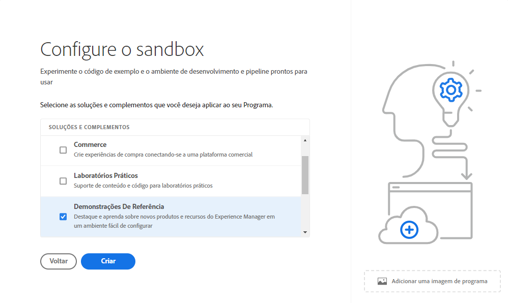
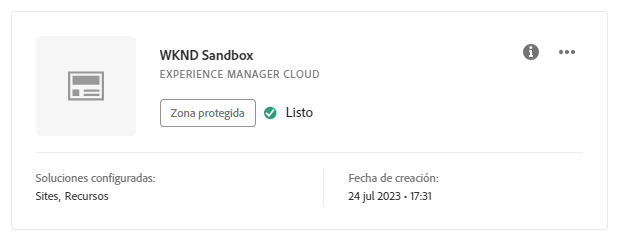
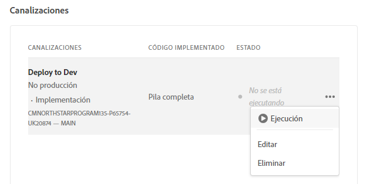

# Creación de un programa {#creating-a-program}

Obtenga información sobre cómo configurar un nuevo programa y una canalización para implementar el complemento.

## La historia hasta ahora {#story-so-far}

En el documento anterior del recorrido del complemento de demostraciones de referencia de Adobe Experience Manager AEM (), [Comprender la instalación del complemento de demostraciones de referencia](installation.md), ha aprendido cómo funciona el proceso de instalación del complemento de demostraciones de referencia, ilustrando cómo funcionan juntas las diferentes piezas. Ahora debería hacer lo siguiente:

* Obtenga información básica sobre Cloud Manager.
* Comprenda cómo las canalizaciones ofrecen contenido y configuración a AEM.
* Vea cómo las plantillas pueden crear sitios previamente rellenados con contenido de demostración con solo unos clics.

Este artículo se basa en estos aspectos básicos y realiza el primer paso de configuración para crear un programa con fines de prueba y utiliza una canalización para implementar el contenido del complemento.

## Objetivo {#objective}

Este documento le ayuda a comprender cómo configurar un nuevo programa y canalización para implementar el complemento. Después de leer, debería poder hacer lo siguiente:

* Comprender y explicar cómo utilizar Cloud Manager para crear un nuevo programa.
* Activar el complemento Demostraciones de referencia para el nuevo programa.
* Ejecutar una canalización para poder implementar el contenido del complemento.

## Crear un programa {#create-program}

Después de iniciar sesión en Cloud Manager, puede crear un programa de zona protegida para realizar pruebas y demostraciones.

>[!NOTE]
>
>El usuario debe ser miembro de la función **Propietario del negocio** en Cloud Manager en su organización para crear programas.

1. Inicie sesión en Adobe Cloud Manager en [my.cloudmanager.adobe.com](https://my.cloudmanager.adobe.com/).

1. Una vez que haya iniciado sesión, compruebe que se encuentra en la organización correcta en la esquina superior derecha de la pantalla. Si solo es miembro de una organización, este paso no es necesario.

   

1. Seleccione **Agregar programa** en la parte superior derecha de la ventana.

1. En el cuadro de diálogo **Vamos a crear su programa**:

   1. Proporcione un **Nombre del programa** para describir su programa.
   1. Seleccione **Configuración de una zona protegida** para su **Objetivo del programa**
   1. Seleccione **Continuar**.

   

1. En el cuadro de diálogo **Configurar su zona protegida** en la tabla **Soluciones y complementos**, expanda la entrada **Sites** en la lista pulsando o haciendo clic en ella y, a continuación, marque **Demostraciones de referencia**.

   * Si también desea crear demostraciones para AEM Screens, consulte la opción **Screens** también en la lista. Seleccione **Actualizar**.

   

1. Haga clic en **Crear** y Cloud Manager configurará el programa de su zona protegida. Se le dirigirá a la pantalla de información general del programa y una breve notificación indica que el proceso se ha iniciado. Se ha añadido una tarjeta a la página de información general del programa nuevo. El proceso de configuración tardará unos minutos en completarse.

1. Una vez completada la configuración, la tarjeta del entorno en la página de información general muestra su estado como **Listo**. Seleccione la tarjeta para poder abrir el entorno.

   

1. Su entorno está listo y el complemento ahora está habilitado como opción, pero el contenido de la demostración debe implementarse para que el contenido esté disponible. Para ello, haga clic en el botón de los tres puntos situado junto a la canalización Implementar en Desarrollo en la tarjeta **Canalizaciones** y seleccione **Ejecutar**.

   

1. La canalización comienza y se le redirige a una página que detalla el progreso de la implementación. Puede salir de esta pantalla a medida que se crea el programa y volver más tarde si es necesario.

   

La canalización puede tardar varios minutos en completarse. Una vez completados, el complemento y su contenido de demostración están disponibles para su uso en el entorno de creación de AEM.

## Siguientes pasos {#what-is-next}

Ahora que ha completado esta parte del recorrido del complemento de demostración de referencia de AEM, podrá hacer lo siguiente:

* Aprenda a utilizar Cloud Manager para crear un programa.
* Obtenga información sobre cómo activar el complemento de demostraciones de referencia para el programa.
* Poder ejecutar una canalización para implementar el contenido del complemento.

Aproveche este conocimiento y continúe con el recorrido del complemento Demostraciones de referencia de AEM mediante la revisión siguiente [Creación de un sitio de demostración](create-site.md). Allí, aprenderá a crear un sitio de demostración en AEM basado en una biblioteca de plantillas preconfiguradas que implementó la canalización.

## Recursos adicionales {#additional-resources}

* [Documentación de Cloud Manager](https://experienceleague.adobe.com/docs/experience-manager-cloud-service/onboarding/onboarding-concepts//cloud-manager-introduction.html?lang=es): Si desea obtener más información sobre las funciones de Cloud Manager, puede consultar directamente los documentos técnicos detallados.
