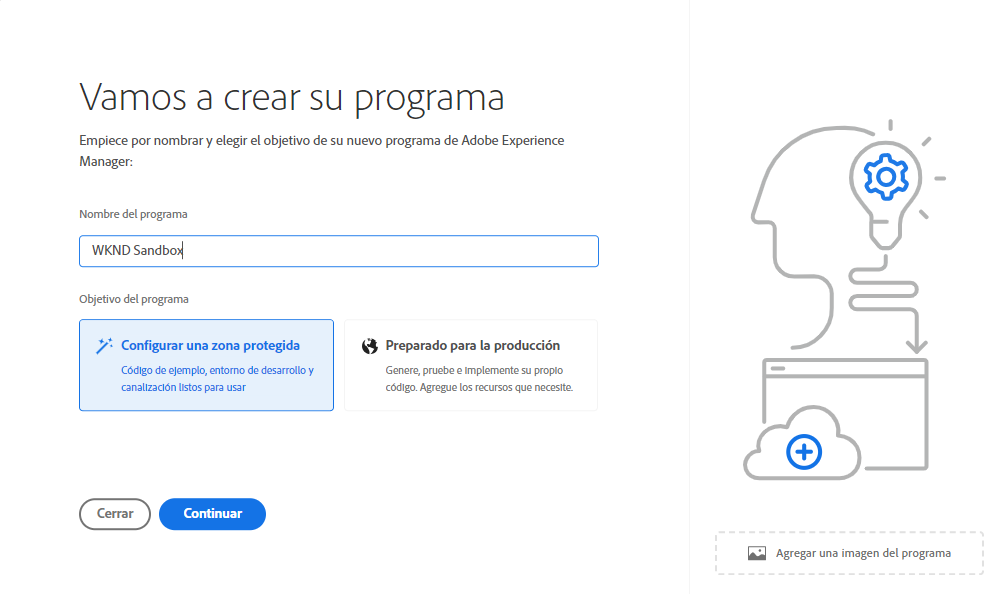
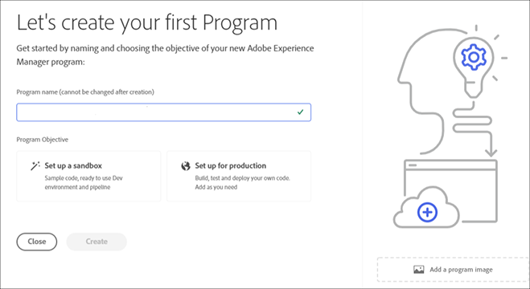
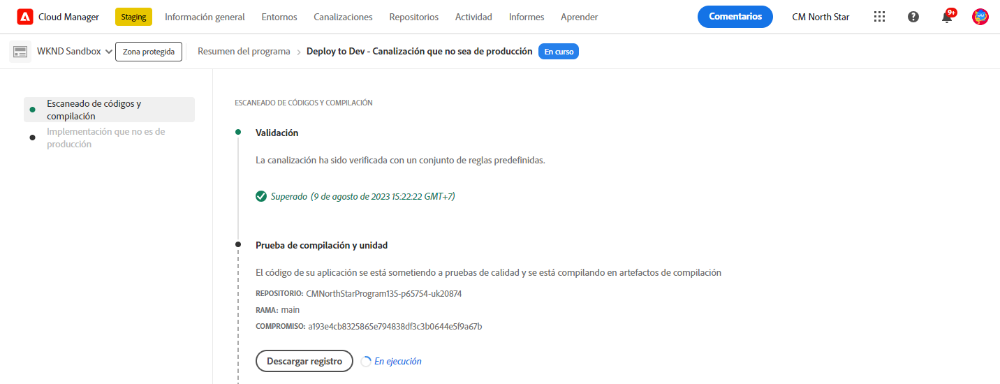

# Creación de un programa {#creating-a-program}

Obtenga información sobre cómo configurar un nuevo programa y una canalización para implementar el complemento.

## La historia hasta ahora {#story-so-far}

En el documento anterior del recorrido del complemento de las demostraciones de referencia de AEM, [Comprender la instalación del complemento de demostración de referencia,](installation.md) ha aprendido cómo funciona el proceso de instalación del complemento de demostraciones de referencia, ilustrando cómo funcionan juntas las diferentes piezas. Ahora debería hacer lo siguiente:

* Obtenga información básica sobre Cloud Manager.
* Comprenda cómo las canalizaciones ofrecen contenido y configuración a AEM.
* Vea cómo las plantillas pueden crear nuevos sitios previamente rellenados con contenido de demostración con solo unos clics.

Este artículo se basa en estos aspectos básicos y realiza el primer paso de configuración para crear un programa con fines de prueba y utiliza una canalización para implementar el contenido del complemento.

## Objetivo {#objective}

Este documento le ayuda a comprender cómo configurar un nuevo programa y canalización para implementar el complemento. Después de leer, debería haber logrado lo siguiente:

* Aprenda a utilizar Cloud Manager para crear un nuevo programa.
* Obtenga información sobre cómo activar el complemento de demostraciones de referencia para el nuevo programa.
* Poder ejecutar una canalización para implementar el contenido del complemento.

## Crear un programa {#create-program}

Después de iniciar sesión en Cloud Manager, puede crear un nuevo programa de zona protegida para realizar pruebas y demostraciones.

>[!NOTE]
>
>El usuario debe ser miembro de **Propietario del negocio** función en Cloud Manager en su organización para crear programas.

1. Inicie sesión en Adobe Cloud Manager en [my.cloudmanager.adobe.com](https://my.cloudmanager.adobe.com/).

1. Una vez que haya iniciado sesión, compruebe que se encuentra en la organización correcta en la esquina superior derecha de la pantalla. Si solo es miembro de una organización, este paso no es necesario.

   

1. Toque o haga clic en **Agregar programa** en la parte superior derecha de la ventana.

1. En el cuadro de diálogo **Vamos a crear su programa**, asegúrese de que **Adobe Experience Manager** se selecciona en **Productos** y, a continuación, toque o haga clic en **Continuar**.

   

1. En el siguiente cuadro de diálogo:

   * Proporcione un **Nombre del programa** para describir su programa.
   * Toque o haga clic en **Configuración de una zona protegida** para su **Objetivo del programa**

   Haga clic o pulse **Crear**.

   

1. Se le dirigirá a la pantalla de información general del programa, donde podrá observar el proceso de creación del programa. Cloud Manager proporciona estimaciones del tiempo restante. Puede salir de esta pantalla a medida que se crea el programa y volver más tarde si es necesario.

   

1. Una vez finalizada, Cloud Manager presenta una descripción general que incluye los entornos y canalizaciones creados automáticamente.

   

1. Edite los detalles del programa haciendo clic en el nombre del programa en la parte superior izquierda de la página y, en la lista desplegable, seleccione **Editar programa**.

   

1. En el cuadro de diálogo **Editar programa**, cambie a la pestaña **Soluciones y complementos**.

   

1. En la pestaña **Soluciones y complementos** expanda la entrada **Sitios** en la lista y, a continuación, marque **Demostraciones de referencia**. Si también desea crear demostraciones para AEM Screens, consulte la opción **Screens** también en la lista. Haga clic o pulse **Actualización de estado**.

   

1. El complemento ahora está habilitado como opción, pero su contenido debe implementarse en AEM para que esté disponible. Vuelva a la página de información general del programa, toque o haga clic en **Inicio** para iniciar la canalización e implementar el contenido del complemento en AEM.

   

1. La canalización comienza y se le redirige a una página que detalla el progreso de la implementación. Puede salir de esta pantalla a medida que se crea el programa y volver más tarde si es necesario.

   

Una vez finalizada la canalización, el complemento y su contenido de demostración están disponibles para su uso en el entorno de creación de AEM.

## Siguientes pasos {#what-is-next}

Ahora que ha completado esta parte del recorrido del complemento de demostración de referencia de AEM, podrá hacer lo siguiente:

* Aprenda a utilizar Cloud Manager para crear un nuevo programa.
* Obtenga información sobre cómo activar el complemento de demostraciones de referencia para el nuevo programa.
* Poder ejecutar una canalización para implementar el contenido del complemento.

Aproveche este conocimiento y continúe con su recorrido de demostración de referencia de AEM al revisar el documento [Crear un sitio de demostración,](create-site.md) donde aprenderá a crear un sitio de demostración en AEM basado en una biblioteca de plantillas preconfiguradas que implementó la canalización.

## Recursos adicionales {#additional-resources}

* [Documentación de Cloud Manager](https://experienceleague.adobe.com/docs/experience-manager-cloud-service/onboarding/onboarding-concepts/cloud-manager-introduction.html?lang=es): Si desea obtener más información sobre las funciones de Cloud Manager, puede consultar directamente los documentos técnicos detallados.
