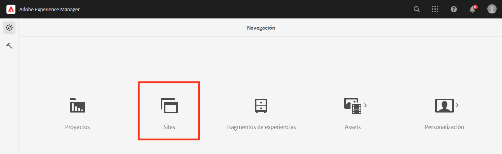
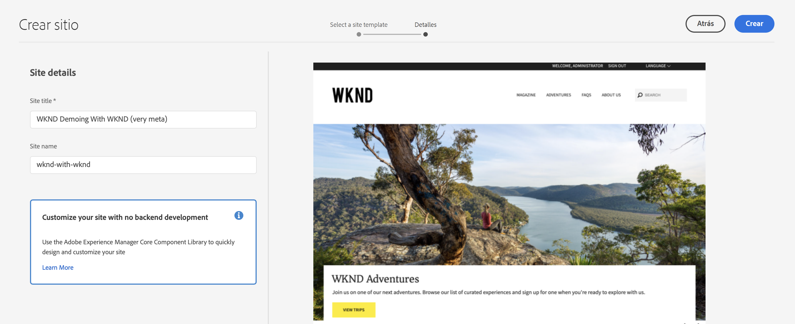
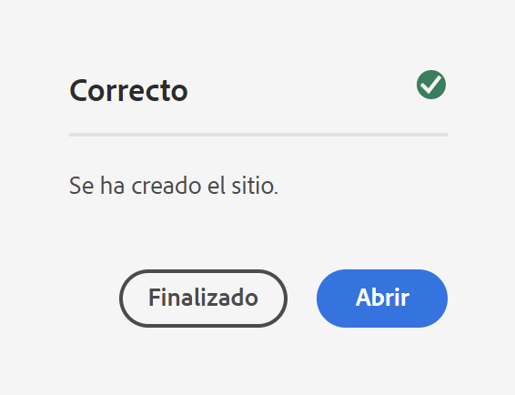
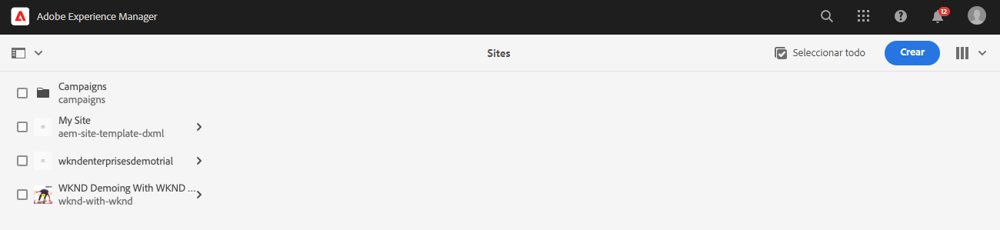
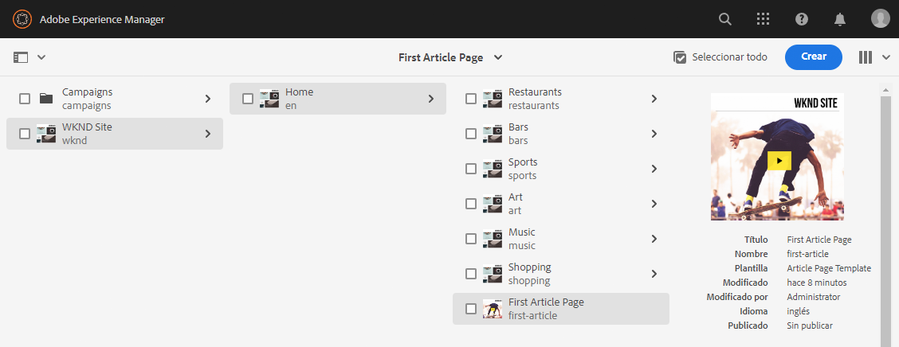
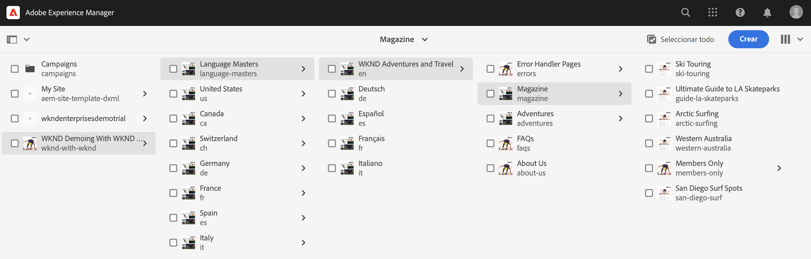
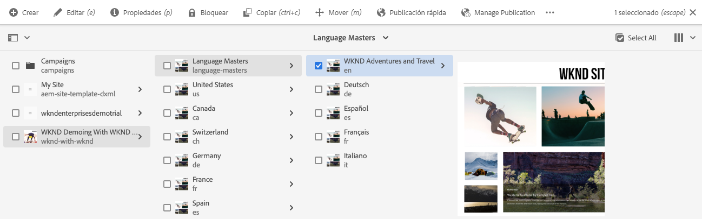

# Creación de un sitio de muestra {#creating-a-site}

Cree un sitio de demostración en AEM basado en una biblioteca de plantillas preconfiguradas.

## La historia hasta ahora {#story-so-far}

En el documento anterior del recorrido del complemento Demostraciones de referencia de AEM, [Creación de un programa,](create-program.md) ha dado el primer paso de configuración para crear un programa con fines de prueba y ha utilizado una canalización para implementar el contenido del complemento. Ahora debería hacer lo siguiente:

* Aprenda a utilizar Cloud Manager para crear un programa.
* Obtenga información sobre cómo activar el complemento de demostraciones de referencia para el nuevo programa.
* Poder ejecutar una canalización para implementar el contenido del complemento.

En este artículo se describe el siguiente paso del proceso: crear un nuevo sitio o proyecto de AEM Screens en AEM basado en las plantillas del complemento Demostraciones de referencia.

## Objetivo {#objective}

Este documento le ayuda a comprender cómo crear un sitio basado en las plantillas del complemento Demostraciones de referencia. Después de leer, debería haber logrado lo siguiente:

* Comprender cómo acceder al entorno de creación de AEM.
* Saber cómo crear un sitio basado en una plantilla.
* Entender los conceptos básicos para navegar por la estructura del sitio y editar una página.

## Creación de un sitio de demostración o un proyecto de Screens {#create-site}

Una vez que la canalización haya implementado el complemento Demostraciones de referencia, puede acceder al entorno de creación de AEM para crear sitios de demostración basados en el contenido del complemento.

1. AEM En la página de información general del programa de Cloud Manager, pulse o haga clic en el vínculo al entorno de creación de la.

   

1. AEM En el menú principal de la, toque o haga clic en **Sites**.

   

1. Desde la consola Sites, pulse o haga clic en **Crear** en la parte superior derecha de la pantalla y seleccione **Sitio a partir de una plantilla** en la lista desplegable.

   

1. Se inicia el asistente para la creación del sitio. En la columna izquierda puede ver las plantillas de demostración que la canalización implementó en la instancia de creación. Pulse o haga clic en una para seleccionarla y mostrar los detalles en la columna derecha. Si desea probar o hacer una demostración de AEM Screens, asegúrese de seleccionar la opción **Plantilla de sitio de We.Cafe**. Haga clic o pulse **Siguiente**.

   

1. En la siguiente pantalla, proporcione un título para el sitio o el proyecto de Screens. Se puede proporcionar un nombre de sitio o se genera a partir del título si se omite. Haga clic o pulse en **Crear**.

   * El título del sitio aparece en la barra de título de los exploradores.
   * El nombre del sitio forma parte de la dirección URL.
   * El nombre del sitio debe cumplir las convenciones de asignación de nombres a páginas de AEM, cuyos detalles están disponibles en la sección [Recursos adicionales](#additional-resources).

   

1. La creación del sitio se confirma con un cuadro de diálogo. Haga clic o pulse en **Listo**.

   

¡Ya ha creado su propio sitio de demostración!

## Uso del sitio de demostración {#use-site}

Ahora que se ha creado el sitio de demostración, puede navegar y utilizarlo como lo haría con cualquier otro sitio de AEM.

1. El sitio ahora aparece en la consola Sites.

   

1. En la esquina superior derecha de la pantalla, asegúrese de que la vista de la consola está configurada en **Vista de columna**.

   

1. Pulse o haga clic en el sitio para explorar su estructura y contenido. La vista de columna se expande continuamente a medida que navega por el árbol de contenido del sitio de demostración.

   

1. Pulse o haga clic en una página para seleccionarla y, a continuación, en **Editar** en la barra de herramientas.

   

1. Puede editar la página como cualquier otra página de contenido de AEM, y añadir o editar componentes o recursos y probar la funcionalidad de AEM, por ejemplo.

   

Felicitaciones! Ahora puede explorar aún más el contenido de su sitio de demostración y descubrir todo lo que AEM tiene que ofrecer a través del contenido de prácticas recomendadas del complemento Demostraciones de referencia.

Cree sitios adicionales basados en otras plantillas para explorar más funcionalidades de AEM.

## Siguientes pasos {#what-is-next}

Ahora que ha completado esta parte del recorrido del complemento de demostración de referencia de AEM, podrá hacer lo siguiente:

* Comprender cómo acceder al entorno de creación de AEM.
* Saber cómo crear un sitio basado en una plantilla.
* Entender los conceptos básicos para navegar por la estructura del sitio y editar una página.

Ahora puede probar las características de AEM usando contenido de complementos. Tiene dos opciones para continuar con el recorrido:

* Si desea llevar a cabo una demostración completa y probar el contenido de AEM Screens, asegúrese de que ha implementado un sitio basado en la **Plantilla de sitio de We.Cafe**, tal como se ha descrito antes. Continúe a [Habilitación de AEM Screens para el sitio de demostración.](screens.md)
* Si solo tiene que mostrar contenido de Sites, continúe a [Administrar Los Sitios De Demostración,](manage.md) donde puede obtener información sobre las herramientas disponibles para ayudarle a administrar los sitios de muestra y cómo eliminarlos.

## Recursos adicionales {#additional-resources}

* [Documentación de Cloud Manager](https://experienceleague.adobe.com/docs/experience-manager-cloud-service/onboarding/onboarding-concepts/cloud-manager-introduction.html?lang=es): si desea obtener más información sobre las funciones de Cloud Manager, puede consultar directamente los documentos técnicos detallados.
* [Crear sitio](/help/sites-cloud/administering/site-creation/create-site.md): aprenda a utilizar AEM para crear un sitio mediante plantillas para definir el estilo y la estructura del sitio.
* [Convenciones de asignación de nombres a páginas de AEM](/help/sites-cloud/authoring/fundamentals/organizing-pages.md#page-name-restrictions-and-best-practices). Consulte esta página para comprender las convenciones y la organización de páginas de AEM.
* [Gestión básica de AEM](/help/sites-cloud/authoring/getting-started/basic-handling.md): consulte este documento si es nuevo en AEM para comprender conceptos básicos como la navegación y la organización de la consola.
