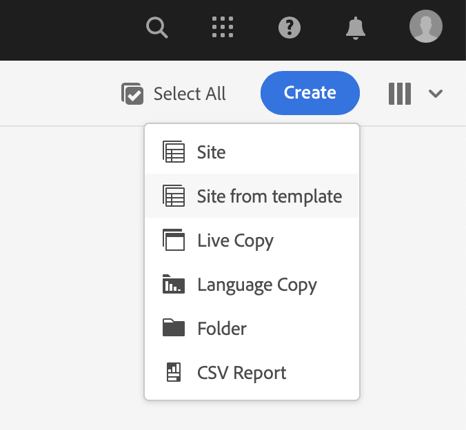

# Crear sitio de muestra {#creating-a-site}

Cree un sitio de demostración en AEM basado en una biblioteca de plantillas preconfiguradas.

## La historia hasta ahora {#story-so-far}

En el documento anterior del recorrido del complemento de las demostraciones de referencia de AEM, [Crear programa,](create-program.md) ha realizado el primer paso de configuración para crear un programa con fines de prueba y ha utilizado una canalización para implementar el contenido del complemento. Ahora debería:

* Obtenga información sobre cómo utilizar Cloud Manager para crear un nuevo programa.
* Obtenga información sobre cómo activar el complemento Demostraciones de referencia para el nuevo programa.
* Poder ejecutar una canalización para implementar el contenido del complemento.

En este artículo se describe el siguiente paso del proceso creando un nuevo sitio o proyecto de AEM Screens en AEM basándose en las plantillas del complemento de demostración de referencia.

## Objetivo {#objective}

Este documento le ayuda a comprender cómo crear un nuevo sitio basado en las plantillas del complemento de demostración de referencia. Después de leer, debe:

* Obtenga información sobre cómo acceder al entorno de creación de AEM.
* Obtenga información sobre cómo crear un sitio basado en una plantilla.
* Comprender los conceptos básicos para navegar por la estructura del sitio y editar una página.

## Creación de un sitio de demostración o un proyecto de Screens {#create-site}

Una vez que la canalización haya implementado el complemento Demostración de referencia, puede acceder al entorno de creación de AEM para crear sitios de demostración basados en el contenido del complemento.

1. En la página de información general del programa de Cloud Manager, toque o haga clic en el vínculo al entorno de creación de AEM.

   

1. En el menú principal de AEM, toque o haga clic en **Sitios**.

   

1. Desde la consola Sitios , toque o haga clic en **Crear** en la parte superior derecha de la pantalla y seleccione **Sitio a partir de una plantilla** en la lista desplegable .

   

1. Se inicia el asistente para la creación del sitio. En la columna izquierda puede ver las plantillas de demostración que la canalización implementó en la instancia de creación. Toque o haga clic en uno para seleccionarlo y mostrar los detalles en la columna derecha. Si desea probar o demostrar AEM Screens, asegúrese de seleccionar la opción **Plantilla de sitio de We.Cafe**. Haga clic o pulse **Siguiente**.

   

1. En la siguiente pantalla, proporcione un título para el sitio o el proyecto de Screens. Se puede proporcionar un nombre de sitio o se generará a partir del título si se omite. Haga clic o pulse **Crear**.

   * El título del sitio aparece en la barra de título de los navegadores.
   * El nombre del sitio forma parte de la dirección URL.
   * El nombre del sitio debe cumplir AEM convenciones de nomenclatura de páginas, cuyos detalles están disponibles en la [Recursos adicionales](#additional-resources) para obtener más información.

   

1. La creación del sitio se confirma con un cuadro de diálogo. Toque o haga clic **Listo**.

   

Ahora ha creado su propio sitio de demostración.

## Usar sitio de demostración {#use-site}

Ahora que se ha creado el sitio de demostración, puede navegar y utilizarlo como lo haría con cualquier otro sitio de AEM.

1. El sitio ahora aparece en la consola Sitios.

   

1. En la esquina superior derecha de la pantalla, asegúrese de que la vista de la consola está configurada en **Vista de columna**.

   

1. Toque o haga clic en el sitio para explorar su estructura y contenido. La vista de columna se expande continuamente a medida que navega por el árbol de contenido del sitio de demostración.

   

1. Toque o haga clic en una página para seleccionarla y, a continuación, toque o haga clic en **Editar** en la barra de herramientas.

   

1. Puede editar la página como cualquier otra página de contenido AEM, como agregar o editar componentes o recursos, y probar la funcionalidad de AEM.

   

Felicitaciones! Ahora puede explorar aún más el contenido de su sitio de demostración y descubrir todo lo que AEM ofrecer a través del contenido de prácticas recomendadas del complemento de demostración de referencia.

Cree sitios adicionales basados en otras plantillas para explorar más AEM funcionalidad.

## Siguientes pasos {#what-is-next}

Ahora que ha completado esta parte del recorrido del complemento de demostración de referencia de AEM, debe:

* Obtenga información sobre cómo acceder al entorno de creación de AEM.
* Obtenga información sobre cómo crear un sitio basado en una plantilla.
* Comprender los conceptos básicos para navegar por la estructura del sitio y editar una página.

Ahora puede probar las características de AEM usando contenido de complementos. Tiene dos opciones para continuar con el recorrido:

* Si desea realizar una demostración completa y probar el contenido de AEM Screens, asegúrese de que ha implementado un sitio basado en la variable **Plantilla de sitio de We.Cafe** tal como se describió anteriormente y continúe [Habilite AEM Screens para el sitio de demostración.](screens.md)
* Si solo tiene que mostrar contenido de Sitios, continúe con [Administrar Los Sitios De Demostración,](manage.md) donde aprenderá sobre las herramientas disponibles para ayudarle a administrar sus sitios de demostración y cómo eliminarlos.

## Recursos adicionales {#additional-resources}

* [Documentación de Cloud Manager](https://experienceleague.adobe.com/docs/experience-manager-cloud-service/onboarding/onboarding-concepts/cloud-manager-introduction.html) : Si desea obtener más información sobre las funciones de Cloud Manager, puede consultar directamente los documentos técnicos detallados.
* [Crear sitio](/help/sites-cloud/administering/site-creation/create-site.md) - Aprenda a utilizar AEM para crear un sitio mediante plantillas de sitio para definir el estilo y la estructura del sitio.
* [AEM convenciones de nomenclatura de páginas.](/help/sites-cloud/authoring/fundamentals/organizing-pages.md#page-name-restrictions-and-best-practices) - Consulte esta página para comprender las convenciones y la organización de AEM páginas.
* [Gestión básica de AEM](/help/sites-cloud/authoring/getting-started/basic-handling.md) : Explore este documento si es nuevo en AEM para comprender conceptos básicos como la navegación y la organización de la consola.