# Habilitación de AEM Screens para el sitio de demostración {#enable-screens}

Conozca los pasos para habilitar la experiencia completa de AEM Screens as a Cloud Service en su sitio de demostración.

>[!NOTE]
>
>La demostración de AEM Screens requiere que se agregue el complemento Screens al programa Cloud Manager. Descubra [aquí](https://experienceleague.adobe.com/docs/experience-manager-cloud-service/content/screens-as-cloud-service/onboarding-screens-cloud/adding-screens-addon/add-on-new-program-screens-cloud.html?lang=es) cómo se agrega.

## La historia hasta ahora {#story-so-far}

En el documento anterior del recorrido del complemento de demostraciones de referencia de AEM, [Creación de un sitio de demostración,](create-site.md) ha creado un nuevo sitio de demostración basado en las plantillas del complemento de demostraciones de referencia. Ahora debería hacer lo siguiente:

* Comprender cómo acceder al entorno de creación de AEM.
* Saber cómo crear un sitio basado en una plantilla.
* Entender los conceptos básicos para navegar por la estructura del sitio y editar una página.

Ahora que tiene su propio sitio de demostración para explorar y comprender las herramientas disponibles para ayudarle a administrar este tipo de sitios, puede habilitar la experiencia completa de AEM Screens as a Cloud Service para ellos.

## Objetivo {#objective}

El complemento de demostraciones de referencia de AEM tiene contenido de AEM Screens para We.Cafe, un negocio vertical de cafeterías. Este documento le ayuda a comprender cómo ejecutar la configuración de demostración de We.Cafe en el contexto de AEM Screens. Después de leer, debería haber logrado lo siguiente:

* Conocer los conceptos básicos de AEM Screens.
* Comprender el contenido de la demostración de We.Cafe.
* Saber cómo configurar AEM Screens para We.Cafe.
   * Poder crear un proyecto de Screens para We.Cafe.
   * Saber configurar un servicio meteorológico simulado mediante hojas de Google y API.
   * Simular el contenido de Screens que cambia de forma dinámica en función de su “servicio meteorológico”.
   * Instalar y utilizar el reproductor de Screens.

## Comprender Screens {#understand-screens}

AEM Screens as a Cloud Service es una solución de señalización digital que permite a los especialistas en marketing crear y administrar experiencias digitales dinámicas a escala. Con AEM Screens as a Cloud Service, puede crear experiencias de señalización digital atractivas y dinámicas pensadas para consumirse en espacios públicos.

>[!TIP]
>
>Para obtener todos los detalles de AEM Screens as a Cloud Service, consulte los [Recursos adicionales](#additional-resources) al final de este documento.

Al instalar el complemento de demostraciones de referencia de AEM, tendrá automáticamente el contenido de We.Cafe para AEM Screens disponible en su entorno de creación de demostración. Los pasos descritos en la sección [Implementación de un proyecto de Screens de demostración](#deploy-project) le permite activar la experiencia completa de AEM Screens publicando ese contenido e implementándolo en reproductores de medios, etc.

## Comprensión del contenido de demostración {#demo-content}

We.Cafe abarca tres cafeterías en tres lugares de los Estados Unidos. Las tres tienen tres experiencias similares:

* Un tablero de menú encima del mostrador con dos o tres paneles verticales.
* Una visualización de entrada que da a la calle con un panel horizontal o vertical que invita a los clientes a pasar.
* Un quiosco de autopedido rápido para evitar hacer cola con una tableta vertical.

>[!NOTE]
>
>Solo se puede probar la visualización de entrada en la versión actual de la demostración. Habrá otras visualizaciones en una versión futura.
>
>El quiosco no está incluido en la versión actual de la demostración. Se incluirá en una versión futura.

Se supone que la ubicación de Nueva York es en una tienda más pequeña que no tiene mucho espacio. Por lo tanto:

* El tablero de menú solo tiene dos paneles verticales en lugar de tres, como en San Francisco y San José.
* La visualización de entrada se coloca de forma vertical en lugar de horizontal.

>[!NOTE]
>
>Si decide conectarse a Screens Cloud Service en la sección [Conexión de Screens as a Cloud Service](#connect-screens), cree las ubicaciones como carpetas en visualizaciones. Consulte la sección [Recursos adicionales](#additional-resources) al final de este documento para obtener más información sobre las visualizaciones.

### Diseños de la cafetería {#care-layouts}

Las ubicaciones de We.Cafe tienen los siguientes diseños.

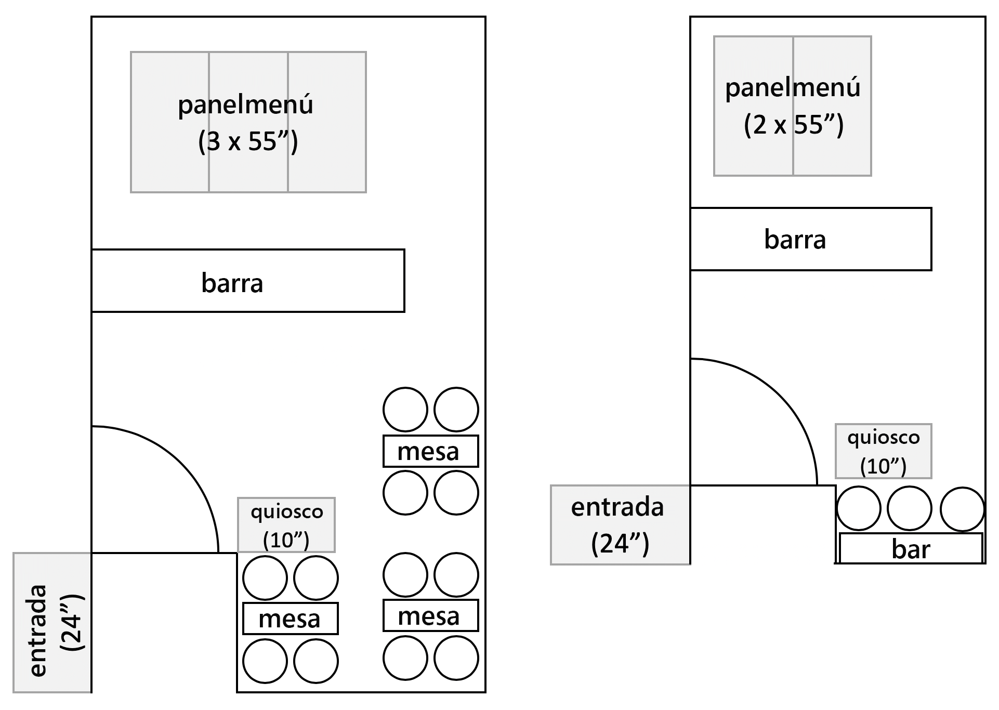

>[!NOTE]
>
>Las mediciones para las pantallas se expresan en pulgadas.

### Entrada {#entrance}

La visualización de la entrada está dividida por el día y solo cambia la primera imagen de la mañana a la tarde. En cada paso de la secuencia también se anuncia una preparación especial de café diferente, con una secuencia incrustada medida para reproducir un elemento distinto cada vez.

La última imagen de los canales de entrada también está dirigida (es decir, modificada dinámicamente) en función de la temperatura exterior, que se puede simular como se describe en la sección [Creación de una fuente de datos simulada](#data-source).

## Implementación de un proyecto de Screens de demostración {#deploy-project}

Para utilizar el contenido de demostración en la zona protegida creada en el paso [Creación de un programa](create-program.md), debe crearse un sitio basado en una plantilla.

Si aún no ha creado un sitio de demostración de We.Cafe, solo tiene que seguir los mismos pasos que en la sección [Creación de un sitio de muestra](create-site.md). Al seleccionar la plantilla, simplemente elija **Plantilla del sitio web de We.Cafe**.

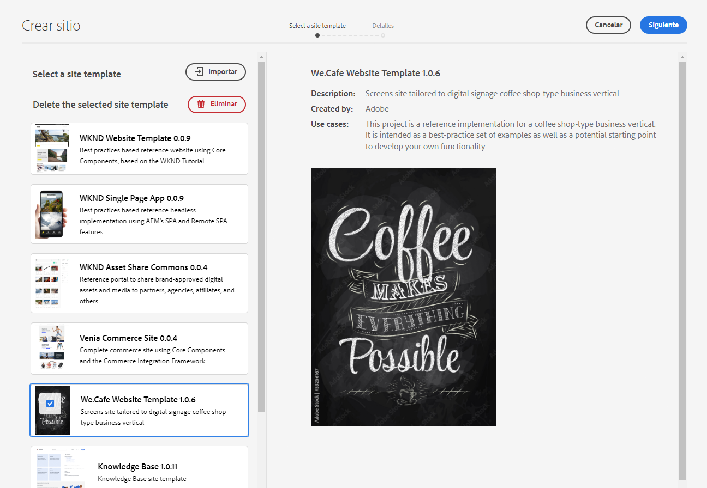

Una vez se complete el asistente, encontrará el contenido implementado en Sites y puede navegarlo y explorarlo como lo haría con cualquier otro contenido.

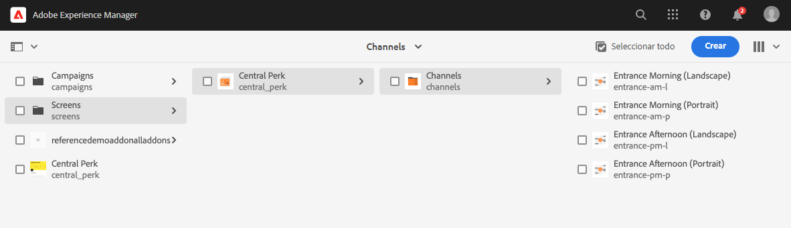

Ahora que tiene contenido de demostración de We.Cafe, puede elegir cómo desea probar AEM Screens:

* Si solo desea explorar el contenido de la consola de AEM Sites, basta con comenzar a investigar y descubrir más en la sección [Recursos adicionales](#additional-resources). No se requieren más acciones.
* Si desea experimentar todas las funciones dinámicas de AEM Screens, continúe a la siguiente sección: [Cambio dinámico del contenido de Screens.](#dynamically-change)

## Cambio dinámico del contenido de Screens {#dynamically-change}

Al igual que AEM Sites, AEM Screens puede cambiar el contenido de forma dinámica en función del contexto. La demostración de We.Cafe tiene canales configurados para mostrar contenido diferente según la temperatura del momento. Para simular esta experiencia, debe crear su propio servicio meteorológico simple.

### Creación de una fuente de datos simulada {#data-source}

Dado que es muy difícil modificar el clima durante una demostración o durante las pruebas, los cambios de temperatura deben simularse. Un servicio meteorológico se simula almacenando un valor de temperatura en una hoja de cálculo de Hojas de cálculo de Google a la que ContextHub de AEM llama para recuperar la temperatura.

#### Creación de una clave de API de Google {#create-api-key}

En primer lugar, debe crear una clave de API de Google para facilitar el intercambio de datos.

1. Inicie sesión en una cuenta de Google.
1. Abra la consola de Cloud mediante este vínculo `https://console.cloud.google.com`.
1. Para crear un nuevo proyecto, haga clic en el nombre del proyecto actual en la parte superior izquierda de la barra de herramientas, después de la etiqueta **Google Cloud Platform**.

   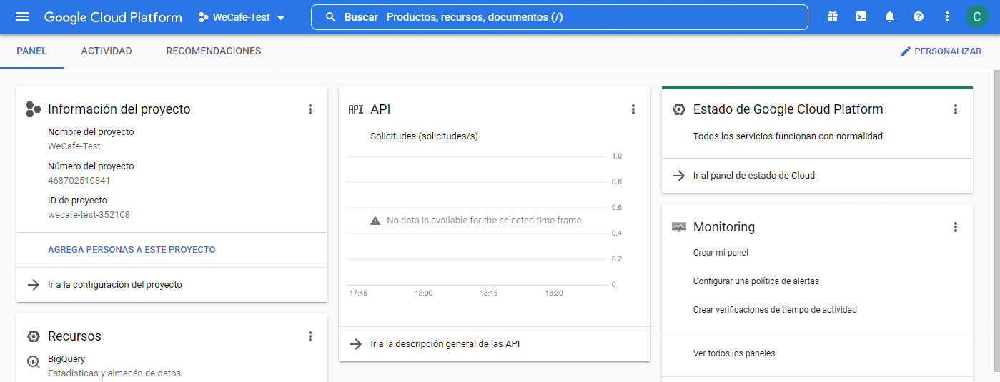

1. En el cuadro de diálogo selector de proyecto, haga clic en **PROYECTO NUEVO**.

   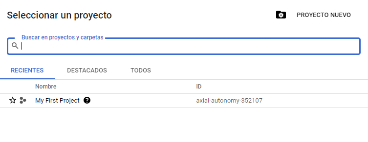

1. Asigne un nombre al proyecto y haga clic en **CREAR**.

   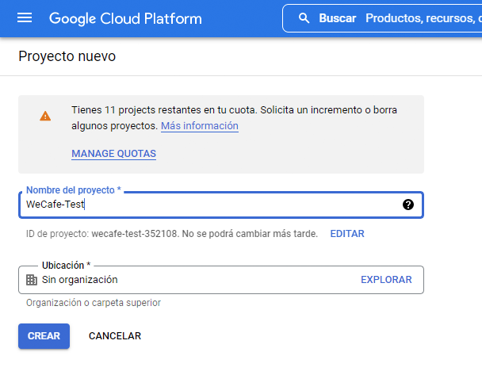

1. Asegúrese de que el proyecto nuevo esté seleccionado y, a continuación, utilizando el menú de hamburguesa del panel de la consola de Cloud, seleccione **API y servicios**.

   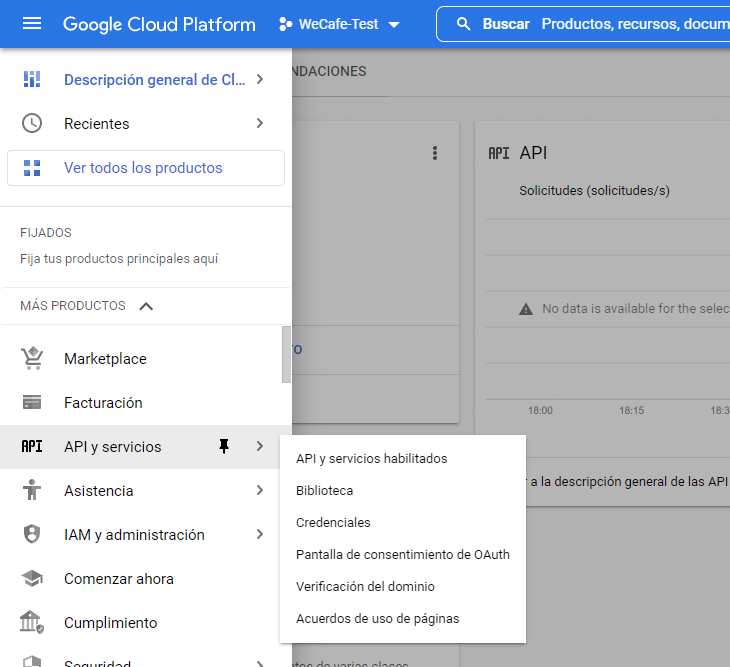

1. En el panel izquierdo de la ventana API y servicios, haga clic en **Credenciales** en la parte superior de la ventana, en **CREAR CREDENCIALES** y **Clave de API**.

   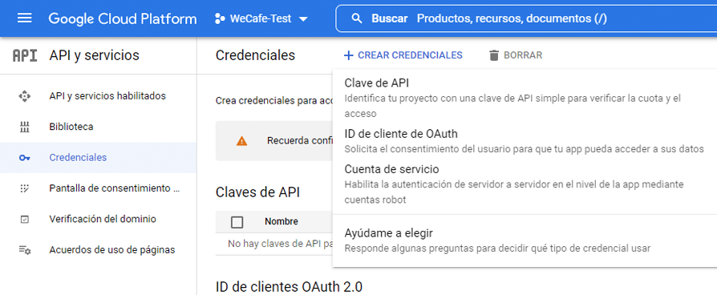

1. En el cuadro de diálogo, copie la nueva clave de API y guárdela para usarla más adelante. Haga clic en **Cerrar** para cerrar el cuadro de diálogo.

#### Habilitación de la API de Hojas de cálculo de Google {#enable-sheets}

Para permitir el intercambio de datos de Hojas de cálculo de Google mediante la clave de API, debe habilitar la API de Hojas de cálculo de Google.

1. Vuelva a la consola de Google Cloud en `https://console.cloud.google.com` para el proyecto y, a continuación, utilice el menú de hamburguesa para seleccionar **API y servicios > Biblioteca**.

   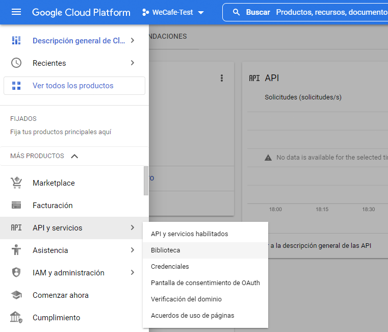

1. En la pantalla Biblioteca de API, desplácese hasta encontrar su búsqueda de **API de Hojas de cálculo de Google**, y, a continuación, haga clic en ella.

   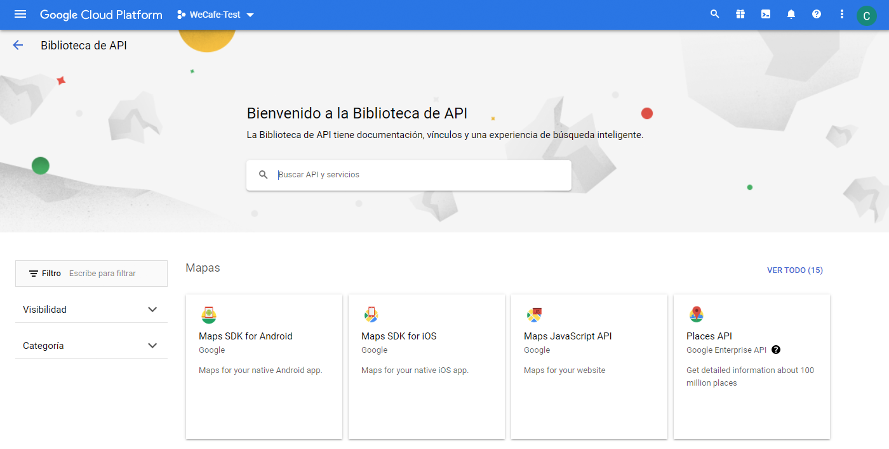

1. En la ventana **API de Hojas de cálculo de Google**, haga clic en **Habilitar**.

   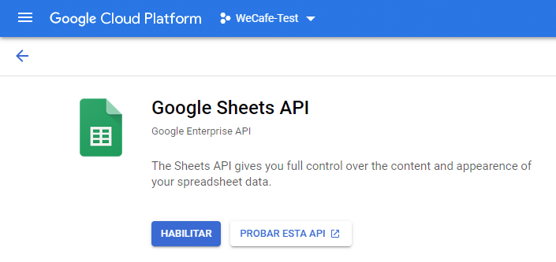

#### Creación de una hoja de cálculo de Hojas de cálculo de Google {#create-spreadsheet}

Ahora puede crear una hoja de cálculo de Hojas de cálculo de Google para almacenar los datos del tiempo.

1. Vaya a `https://docs.google.com` y cree una hoja de cálculo de hojas de cálculo de Google.
1. Defina la temperatura introduciendo `32` en la celda A2.
1. Para compartir el documento, haga clic en **Compartir** en la parte superior derecha de la ventana y, debajo de **Obtener vínculo**, haga clic en **Cambiar**.

   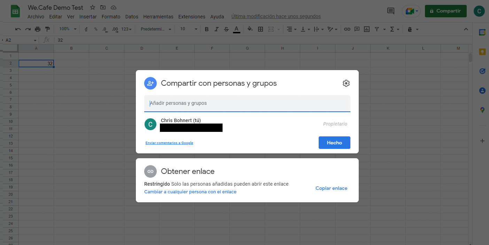

1. Copie el vínculo para el paso siguiente.

   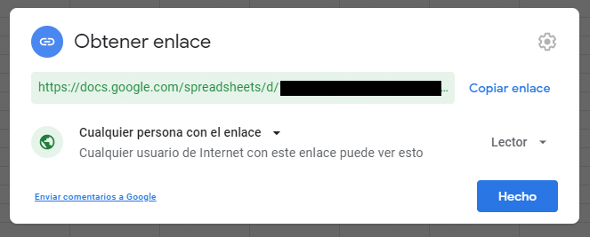

1. Busque el ID de hoja.

   * El ID de hoja es la cadena aleatoria de caracteres del vínculo de hoja que ha copiado después de `d/` y antes de `/edit`.
   * Por ejemplo:
      * Si la dirección URL es `https://docs.google.com/spreadsheets/d/1cNM7j1B52HgMdsjf8frCQrXpnypIb8NkJ98YcxqaEP30/edit#gid=0`
      * El ID de hoja es `1cNM7j1B52HgMdsjf8frCQrXpnypIb8NkJ98YcxqaEP30`.

1. Copie el ID de hoja para uso futuro.

#### Probar el servicio meteorológico {#test-weather-service}

Ahora que ha creado su fuente de datos como hoja de cálculo de Hojas de cálculo de Google y ha habilitado el acceso mediante API, pruébelo para asegurarse de que el &quot;servicio meteorológico&quot; sea accesible.

1. Abra un navegador web.

1. Introduzca la siguiente solicitud, sustituyendo el ID de hoja y los valores de clave de API que guardó anteriormente.

   ```
   https://sheets.googleapis.com/v4/spreadsheets/<yourSheetID>/values/Sheet1?key=<yourAPIKey>
   ```

1. Si recibe datos JSON similares a los siguientes, lo ha configurado correctamente.

   ```json
   {
     "range": "Sheet1!A1:Z1000",
     "majorDimension": "ROWS",
     "values": [
       [],
       [
         "32"
       ]
     ]
   }
   ```

AEM Screens puede utilizar este mismo servicio para acceder a los datos meteorológicos simulados que se configuran en el siguiente paso.

### Configurar ContextHub {#configure-contexthub}

AEM Screens puede cambiar el contenido dinámicamente según el contexto. La demostración de We.Cafe tiene canales configurados para mostrar contenido diferente según la temperatura actual utilizando ContextHub de AEM.

>[!TIP]
>
>Para obtener todos los detalles de ContextHub, consulte la sección de [Recursos adicionales](#additional-resources) al final de este documento.

Cuando se muestre el contenido de la pantalla, ContextHub llama al servicio meteorológico para obtener la temperatura actual y determinar qué contenido mostrar.

Para fines de demostración, se pueden cambiar los valores de la hoja. ContextHub reconoce este hecho y el contenido se ajusta en el canal según la temperatura actualizada.

1. En la instancia de autor de AEMaaCS, vaya a **Navegación global > Herramientas > Sites > ContextHub**.
1. Seleccione el contenedor de configuración que tenga el mismo nombre del proyecto cuando creó el proyecto Screens desde la **Plantilla del sitio web de We.Cafe**.
1. Seleccione **Configuración > Configuración de ContextHub > Hojas de cálculo de Google** y, a continuación, haga clic en **Siguiente** en la parte superior derecha.
1. La configuración ya debería tener los datos JSON preconfigurados. Hay dos valores que deben cambiarse:
   1. Reemplace `[your Google Sheets id]` con el ID de hoja [que guardó anteriormente](#create-spreadsheet).
   1. Reemplace `[your Google API Key]` con la clave de API [que guardó anteriormente](#create-api-key).
1. Haga clic en **Guardar**.

Ahora puede cambiar el valor de temperatura en la hoja de cálculo de Hojas de cálculo de Google y ContextHub actualizará Screens dinámicamente a medida que “observe cambios meteorológicos”.

### Prueba de datos dinámica {#test-dynamic}

Ahora que AEM Screens y ContextHub están conectados al servicio meteorológico, puede probarlo para ver cómo las pantallas pueden actualizar el contenido de forma dinámica.

1. Acceda a la instancia de autor de la zona protegida.
1. Vaya a la consola Sites a través de **Navegación global > Sites** y seleccione la siguiente página **Screens > &lt;project-name> > Canales > Entrada mañana (vertical)**.

   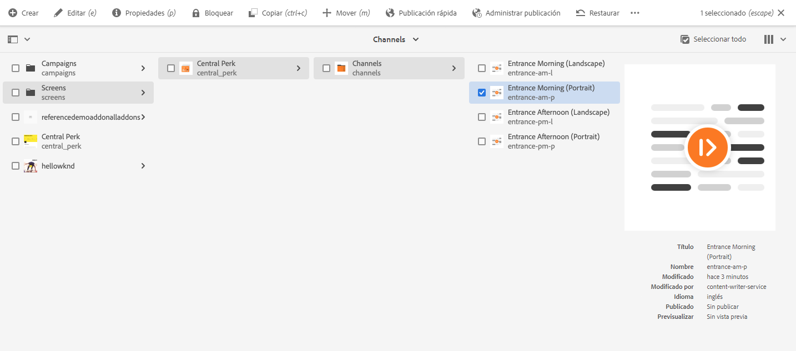

1. Haga clic en **Editar** en la barra de herramientas o escriba la tecla de método abreviado `e` para editar la página.

1. En el editor, puede ver el contenido. Se resalta en azul una imagen con un icono de segmentación en la esquina.

   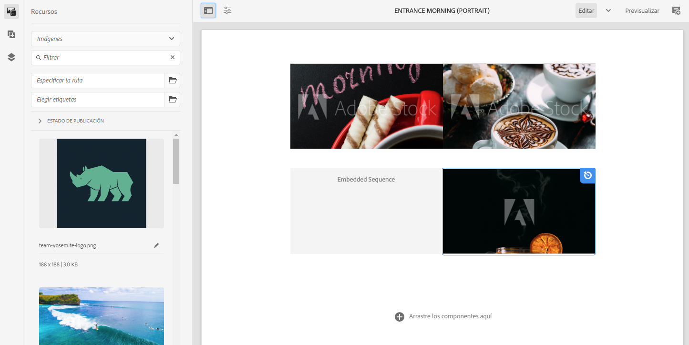

1. Cambie la temperatura introducida en la hoja de cálculo de 32 a 70 y observe cómo cambia el contenido.

   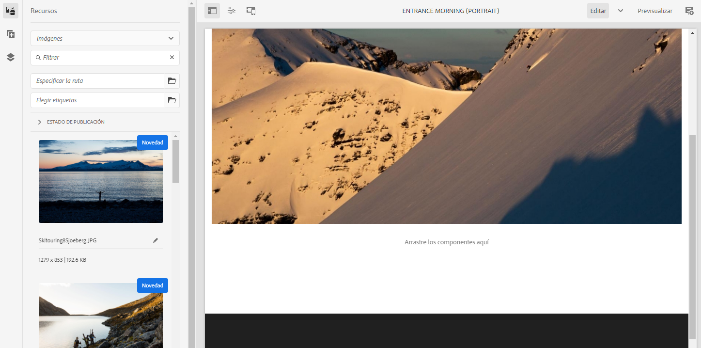

Debido a que la temperatura cambió de 0 °C invernales a 21 °C primaverales, la imagen destacada cambió de una taza de té caliente a un café helado.

>[!IMPORTANT]
>
>Utilice únicamente la solución de Hojas de cálculo de Google descrita para fines de demostración. Adobe no admite el uso de Hojas de cálculo de Google para entornos de producción.

## Conectar Screens as a Cloud Service {#connect-screens}

Si también desea configurar una experiencia de señalización digital real, incluido un reproductor que se ejecute en un dispositivo de señalización digital o en el equipo, siga los siguientes pasos.

Como alternativa, puede previsualizar la demostración simplemente en el editor de canales en AEMaaCS.

>[!TIP]
>
>Para obtener todos los detalles del editor de canales, consulte la sección de [Recursos adicionales](#additional-resources) al final de este documento.

### Configurar AEM Screens as a Cloud Service {#configure-screens}

Primero, tendrá que publicar el contenido de la demostración de Screens en AEM Screens as a Cloud Service y configurar el servicio.

1. Publique el contenido del proyecto Screens de demostración.
1. Vaya a Screens as a Cloud Service en `https://experience.adobe.com/screens` e inicie sesión.
1. En la parte superior derecha de la pantalla, compruebe que se encuentra en la organización correcta.

   

1. Cerca de la esquina superior izquierda, haga clic en el icono **Editar configuración** con forma de engranaje.

   

1. Proporcione las URL de las instancias de autor y publicación de AEMaaCS donde creó el sitio de demostración y haga clic en **Guardar**.

   

1. Una vez que se haya conectado a las instancias de demostración, Screens extrae el contenido del canal. Haga clic en **Canales** en el panel izquierdo para ver los canales publicados. La información puede tardar un momento en rellenarse. Puede hacer clic en el botón azul **Sincronizar** en la parte superior derecha de la pantalla para actualizar la información.

   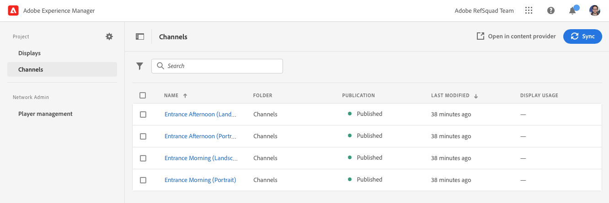

1. Haga clic en **Pantallas** en el panel izquierdo. Todavía no ha creado ninguna para la demostración. Puede simular las ubicaciones de We.Cafe creando carpetas para cada una. Haga clic en **Crear** en la parte superior derecha de la pantalla y seleccione **Carpeta**.

   

1. En el cuadro de diálogo, proporcione un nombre de carpeta como **San José** y haga clic en **Crear**.

1. Abra la carpeta haciendo clic en ella y, a continuación, haga clic en **Crear** en la parte superior derecha y seleccione **Visualización**.

1. Proporcione un nombre y haga clic en **Crear**.

   

1. Una vez creada la visualización, haga clic en el nombre de la visualización para abrir la pantalla de detalles de visualización. Se debe asignar a la pantalla un canal que se haya sincronizado desde el sitio de demostración. Haga clic en **Asignar canal** en la parte superior derecha de la pantalla.

   

1. En el cuadro de diálogo, seleccione el canal y haga clic en **Asignar**.

   

Puede repetir estos pasos para las ubicaciones y pantallas adicionales. Una vez finalizado, habrá vinculado su sitio de demostración con AEM Screens y habrá completado la configuración necesaria.

Puede previsualizar la demostración simplemente en el editor de canales en AEMaaCS.

### Uso del reproductor Screens {#screens-player}

Para ver el contenido como en una pantalla real, puede descargar el reproductor y configurarlo localmente. AEM Screens as a Cloud Service envía el contenido a su reproductor

#### Generación de un código de registro {#registration-code}

En primer lugar, deberá crear un código de registro para conectar de forma segura un reproductor a AEM Screens as a Cloud Service.

1. Vaya a Screens as a Cloud Service en `https://experience.adobe.com/screens` e inicie sesión.
1. En la parte superior derecha de la pantalla, compruebe que se encuentra en la organización correcta.

   

1. En el panel izquierdo, haga clic en **Administración del reproductor > Códigos de registro** y luego, en **Crear código** en la parte superior derecha de la pantalla.


1. Introduzca un nombre para el código y haga clic en **Crear**.

   

1. Una vez creado el código, aparece en la lista. Haga clic para copiar el código.

   

#### Instalación y configuración del reproductor {#install-player}

1. Descargue el reproductor para su plataforma desde `https://download.macromedia.com/screens/` e instálelo.
1. Ejecute el reproductor y, a continuación, cambie a la pestaña **Configuración**.
1. Desplácese hasta la parte inferior y, a continuación, haga clic en las opciones **Restablecer de fábrica** y **Cambiar a modo de nube** y confírmelas.

   

1. El reproductor cambiará automáticamente a la pestaña **Registro del reproductor**. Introduzca el código que ha generado anteriormente y haga clic en **Registrar**.

   

1. Cambie a la pestaña **Información del sistema** para confirmar que el reproductor se ha registrado.

   

#### Asignar reproductor a una pantalla {#assign-player}

1. Vaya a Screens as a Cloud Service en `https://experience.adobe.com/screens` e inicie sesión.
1. En la parte superior derecha de la pantalla, compruebe que se encuentra en la organización correcta.

   

1. En el panel izquierdo, haga clic en **Administración del reproductor > Reproductores** y verá el reproductor que instaló y registró anteriormente.

   

1. Haga clic en el nombre del reproductor para poder abrir sus detalles. Haga clic en **Asignar para visualizar** en la parte superior derecha de la pantalla.

   

1. En el cuadro de diálogo, seleccione la visualización que creó anteriormente y, a continuación, haga clic en **Seleccionar**.

   

#### Reproducción {#playback}

Una vez que haya asignado una pantalla a un reproductor, AEM Screens as a Cloud Service envía el contenido al reproductor donde está visible.


## Siguientes pasos {#what-is-next}

Ahora que ha completado esta parte del recorrido del complemento de demostración de referencia de AEM, podrá hacer lo siguiente:

* Conocer los conceptos básicos de AEM Screens.
* Comprender el contenido de la demostración de We.Cafe.
* Saber cómo configurar AEM Screens para We.Cafe.

Está listo para explorar las capacidades de AEM Screens con sus propios sitios de muestra. Continúe con la siguiente sección del recorrido, [Administrar los sitios de muestra](manage.md), aquí aprenderá sobre las herramientas disponibles para administrar los sitios de muestra y cómo eliminarlos.

También puede consultar algunos de los recursos adicionales disponibles en la [sección de Recursos adicionales](#additional-resources) para obtener más información sobre las funciones que ha visto en este recorrido.

## Recursos adicionales {#additional-resources}

* [Documentación de ContextHub](/help/sites-cloud/authoring/personalization/contexthub.md): aprenda cómo se puede utilizar ContextHub para personalizar el contenido en función del contexto de usuario más allá de las condiciones meteorológicas.
* [Uso de claves de API - Documentación de Google](https://developers.google.com/maps/documentation/javascript/get-api-key): una referencia práctica para obtener detalles acerca del uso de claves de API de Google.
* [Pantallas](/help/screens-cloud/creating-content/creating-displays-screens-cloud.md): obtenga más información acerca de qué es una pantalla en AEM Screens y qué puede hacer.
* [Descargar reproductor](/help/screens-cloud/managing-players-registration/installing-screens-cloud-player.md): aprenda cómo acceder al reproductor Screens y cómo instalarlo.
* [Registrar reproductor](/help/screens-cloud/managing-players-registration/registering-players-screens-cloud.md): aprenda a configurar y registrar un reproductor en su proyecto de AEM Screens.
* [Asignación del reproductor a una pantalla](/help/screens-cloud/managing-players-registration/assigning-player-display.md): configure un reproductor para mostrar el contenido.
