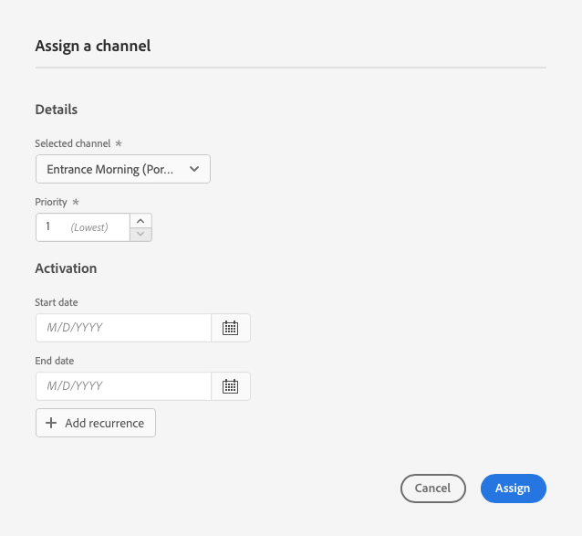

# Habilitar AEM Screens para el sitio de demostración {#enable-screens}

Conozca los pasos para habilitar la experiencia as a Cloud Service completa de AEM Screens en su sitio de demostración.

## La historia hasta ahora {#story-so-far}

En el documento anterior del recorrido del complemento de las demostraciones de referencia de AEM, [Crear sitio de demostración,](create-site.md) ha creado un nuevo sitio de demostración basado en las plantillas del complemento Demostración de referencia. Ahora debería:

* Obtenga información sobre cómo acceder al entorno de creación de AEM.
* Obtenga información sobre cómo crear un sitio basado en una plantilla.
* Comprender los conceptos básicos para navegar por la estructura del sitio y editar una página.

Ahora que tiene su propio sitio de demostración para explorar y comprender las herramientas disponibles para ayudarle a administrar sus sitios de demostración, puede habilitar la experiencia as a Cloud Service completa de AEM Screens para sus sitios de demostración.

## Objetivo {#objective}

El complemento AEM de demostraciones de referencia contiene contenido de AEM Screens para We.Cafe, un sector comercial de cafeterías. Este documento le ayuda a comprender cómo ejecutar la configuración de demostración de We.Cafe en el contexto de AEM Screens. Después de leer, debe:

* Conozca los conceptos básicos de AEM Screens.
* Comprender el contenido de la demostración de We.Cafe.
* Obtenga información sobre cómo configurar AEM Screens para We.Cafe.
   * Obtenga información sobre cómo crear un proyecto de Screens para We.Cafe.
   * Puede configurar un servicio meteorológico simulado mediante hojas de Google y API.
   * Simule el contenido de Screens que cambia de forma dinámica en función de su &quot;servicio meteorológico&quot;.
   * Instale y utilice el reproductor de pantallas.

## Explicación de las pantallas {#understand-screens}

AEM Screens as a Cloud Service es una solución de señalización digital que permite a los especialistas en marketing crear y administrar experiencias digitales dinámicas a escala. Con AEM Screens as a Cloud Service, puede crear experiencias de señalización digital atractivas y dinámicas que se pretendan consumir en espacios públicos.

>[!TIP]
>
>Para obtener todos los detalles de AEM Screens as a Cloud Service, consulte la [Recursos adicionales](#additional-resources) al final de este documento.

Al instalar el complemento Demostraciones de referencia de AEM, tendrá automáticamente el contenido de We.Cafe para AEM Screens disponible en su entorno de creación de demostración. Los pasos descritos en la sección [Implementar un proyecto de Demo Screens](#deploy-project) le permite activar la experiencia completa de AEM Screens publicando ese contenido e implementando en reproductores de contenido, etc.

## Comprender el contenido de la demostración {#demo-content}

La cafetería We.Cafe está compuesta por tres tiendas en tres lugares en Estados Unidos. Las tres tiendas tienen tres experiencias similares:

* Un tablero de menús encima del contador con dos o tres paneles verticales
* Una pantalla de entrada que da a la calle con un panel horizontal o vertical que invita a los clientes a entrar en la tienda
* Un quiosco autoordenado rápido para evitar la cola con una tableta vertical

>[!NOTE]
>
>Solo se puede probar la pantalla de entrada en la versión actual de la demostración. A continuación se mostrarán otras visualizaciones en una versión futura.
>
>El quiosco no está incluido en la versión actual de la demostración. Se incluirá en una versión futura.

Se supone que la ubicación de Nueva York es en una tienda más pequeña que no tiene mucho espacio y, por lo tanto,:

* El panel de menú solo tiene dos paneles verticales en lugar de tres para San Francisco y San José
* La pantalla de entrada se coloca verticalmente en lugar de horizontalmente

>[!NOTE]
>
>Si decide conectarse al Cloud Service Screens en la [Conectar Screens as a Cloud Service](#connect-screens) , cree las ubicaciones como carpetas en pantallas. Consulte la [Recursos adicionales](#additional-resources) al final de este documento para obtener más información sobre las visualizaciones.

### Diseños del café {#care-layouts}

Las ubicaciones de We.Cafe tienen los siguientes diseños.


>[!NOTE]
>
>Las mediciones para las pantallas se expresan en pulgadas.

### Entrada {#entrance}

El mostrador de la entrada es diurno y cambia la primera imagen de la mañana a la tarde. En cada paso de la secuencia también anunciará una preparación especial para café diferente, usando una secuencia incrustada medida para reproducir un elemento diferente cada vez.

La última imagen de los canales de entrada también está dirigida (es decir, modificada dinámicamente) en función de la temperatura exterior, que se puede simular como se describe en la variable [Crear una fuente de datos simulada](#data-source) para obtener más información.

## Implementar un proyecto de Demo Screens {#deploy-project}

Para utilizar el contenido de demostración en el simulador de pruebas creado en la variable [Crear programa](create-program.md) , un sitio debe crearse en función de una plantilla.

Si aún no ha creado un sitio de demostración de We.Cafe, simplemente siga los mismos pasos que en la [Crear sitio de muestra](create-site.md) para obtener más información. Al seleccionar la plantilla, simplemente elija el **Plantilla de sitio web de We.Cafe**.


Una vez completado el asistente, encontrará el contenido implementado en Sitios y puede navegar y explorar como lo haría con cualquier otro contenido.


Ahora que tiene contenido de demostración de We.Cafe, puede elegir cómo desea probar AEM Screens:

* Si solo desea explorar el contenido de la consola de AEM Sites, simplemente comience a explorar y descubrir más en la [Recursos adicionales](#additional-resources) sección! no se requiere más acción.
* Si desea ver todas las funciones dinámicas de AEM Screens, continúe con la siguiente sección, [Cambiar De Forma Dinámica El Contenido De Screens.](#dynamically-change)

## Cambiar dinámicamente el contenido de Screens {#dynamically-change}

Al igual que AEM Sites, AEM Screens puede cambiar el contenido dinámicamente en función del contexto. La demostración de We.Cafe tiene canales configurados para mostrar contenido diferente según la temperatura actual. Para simular esto, tendremos que crear nuestro propio servicio meteorológico sencillo.

### Crear una fuente de datos simulada {#data-source}

Dado que es muy difícil cambiar el clima durante una demostración o durante las pruebas, los cambios de temperatura deben simularse. Simularemos un servicio meteorológico almacenando un valor de temperatura en una hoja de cálculo de Google Sheet que AEM ContextHub llamará para recuperar la temperatura.

#### Crear clave de API de Google {#create-api-key}

En primer lugar, tendremos que crear una clave de API de Google para facilitar el intercambio de datos.

1. Inicie sesión en una cuenta de Google.
1. Abra la consola de Cloud mediante este vínculo `https://console.cloud.google.com`.
1. Para crear un nuevo proyecto, haga clic en el nombre del proyecto actual en la parte superior izquierda de la barra de herramientas, después de **Google Cloud Platform** etiqueta.

   

1. En el cuadro de diálogo selector de proyecto, haga clic en **NUEVO PROYECTO**.

   

1. Asigne un nombre al proyecto y haga clic en **CREAR**.

   

1. Asegúrese de que el nuevo proyecto esté seleccionado y, a continuación, utilizando el menú hamburguesa en el panel de la consola de Cloud, seleccione **API y servicios**.

   

1. En el panel izquierdo de la ventana API y servicios, haga clic en **Credenciales** en la parte superior de la ventana, haga clic en **CREAR CREDENCIALES** y **Clave de API**.

   

1. En el cuadro de diálogo , copie la nueva clave de API y guárdela para usarla más adelante. Haga clic en **CERRAR** para cerrar el cuadro de diálogo.

#### Habilitar la API de hojas de Google {#enable-sheets}

Para permitir el intercambio de datos de hojas de Google mediante la clave de API, debe habilitar la API de hojas de Google.

1. Vuelva a la consola de Google Cloud en `https://console.cloud.google.com` para el proyecto y, a continuación, utilice el menú hamburguesa para seleccionar **API y servicios -> Biblioteca**.

   

1. En la pantalla Biblioteca de API, desplácese hasta encontrar nuestra búsqueda de **API de hojas de Google**. Haga clic en él.

   

1. En el **API de hojas de Google** clic en la ventana **HABILITAR**.

   

#### Crear hoja de cálculo de Google {#create-spreadsheet}

Ahora puede crear una hoja de cálculo de hojas de Google para almacenar los datos del tiempo.

1. Vaya a `https://docs.google.com` y cree una nueva hoja de cálculo de hojas de Google.
1. Defina la temperatura introduciendo `32` en la celda A2.
1. Para compartir el documento, haga clic en **Compartir** en la parte superior derecha de la ventana y debajo de **Obtener vínculo** click **Cambiar**.

   

1. Copie el vínculo del paso siguiente.

   

1. Busque el ID de hoja.

   * El ID de hoja es la cadena aleatoria de caracteres del vínculo de hoja que ha copiado después de `d/` y antes `/edit`.
   * Por ejemplo:
      * Si la dirección URL es `https://docs.google.com/spreadsheets/d/1cNM7j1B52HgMdsjf8frCQrXpnypIb8NkJ98YcxqaEP30/edit#gid=0`
      * El ID de hoja es `1cNM7j1B52HgMdsjf8frCQrXpnypIb8NkJ98YcxqaEP30`.

1. Copie el ID de hoja para su uso futuro.

#### Probar el servicio meteorológico {#test-weather-service}

Ahora que ha creado su fuente de datos como hoja de cálculo de hojas de Google y ha habilitado el acceso mediante API, pruébelo para asegurarse de que el &quot;servicio meteorológico&quot; sea accesible.

1. Abra un explorador web.

1. Introduzca la siguiente solicitud, sustituyendo el ID de hoja y los valores de clave de API que guardó anteriormente.

   ```
   https://sheets.googleapis.com/v4/spreadsheets/<yourSheetID>/values/Sheet1?key=<yourAPIKey>
   ```

1. Si recibe datos JSON similares a los siguientes, configúrelos correctamente.

   ```json
   {
     "range": "Sheet1!A1:Z1000",
     "majorDimension": "ROWS",
     "values": [
       [],
       [
         "32"
       ]
     ]
   }
   ```

AEM Screens puede utilizar este mismo servicio para acceder a los datos meteorológicos simulados. Esto se configurará en el siguiente paso.

### Configuración de ContextHub {#configure-contexthub}

AEM Screens puede cambiar el contenido dinámicamente según el contexto. La demostración de We.Cafe tiene canales configurados para mostrar contenido diferente según la temperatura actual aprovechando AEM ContextHub.

>[!TIP]
>
>Para obtener todos los detalles de ContextHub, consulte la [Recursos adicionales](#additional-resources) al final de este documento.

Cuando se muestre el contenido de la pantalla, ContextHub llamará al servicio meteorológico para determinar la temperatura actual para determinar qué contenido mostrar.

Para fines de demostración, se pueden cambiar los valores de la hoja. ContextHub lo reconocerá y el contenido se ajustará en el canal según la temperatura actualizada.

1. En la instancia de autor de AEMaaCS, vaya a **Navegación global -> Herramientas -> Sitios -> ContextHub**.
1. Seleccione el contenedor de configuración que tenga el mismo nombre que le dio al proyecto cuando creó el proyecto Screens desde el **Plantilla de sitio web de We.Cafe**.
1. Select **Configuración -> Configuración de ContextHub -> Hojas de Google** a continuación, haga clic en **Siguiente** en la parte superior derecha.
1. La configuración ya debería tener datos JSON preconfigurados. Hay dos valores que deben cambiarse:
   1. Reemplazar `[your Google Sheets id]` con el ID de hoja [guardó anteriormente.](#create-spreadsheet)
   1. Reemplazar `[your Google API Key]` con la clave de API [guardó anteriormente.](#create-api-key)
1. Haga clic en **Guardar**.

Ahora puede cambiar el valor de temperatura en la hoja de cálculo de Google Sheet y ContextHub actualizará Screens dinámicamente ya que &quot;ve el cambio climático&quot;.

### Prueba de datos dinámicos {#test-dynamic}

Ahora que AEM Screens y ContextHub están conectados al servicio meteorológico, puede probarlo para ver cómo las pantallas pueden actualizar el contenido de forma dinámica.

1. Acceda a la instancia de autor del entorno limitado.
1. Vaya a la consola Sitios a través de **Navegación global -> Sitios** y seleccione la siguiente página **Pantallas -> &lt;project-name> -> Canales -> Mañana de entrada (Vertical)**.

   

1. Haga clic en Editar en la barra de herramientas o escriba la tecla de método abreviado `e` para editar la página.

1. En el editor, puede ver el contenido. Tenga en cuenta que una imagen está iluminada en azul con un icono de objetivo en la esquina.

   

1. Cambie la temperatura introducida en la hoja de cálculo de 32 a 70 y observe cómo cambia el contenido.

   

En función de la temperatura que cambia de un congelador de 32°C a un cómodo de 21°C, la imagen destacada cambió de una taza de té caliente a un café frío.

>[!IMPORTANT]
>
>Utilice únicamente la solución de hojas de Google descrita para fines de demostración. Adobe no admite el uso de hojas de Google para entornos de producción.

## Conectar Screens as a Cloud Service {#connect-screens}

Si también desea configurar una experiencia de señalización digital real, incluido un reproductor que se ejecute en un dispositivo de señalización digital o en el equipo, siga los siguientes pasos.

Como alternativa, puede previsualizar la demostración simplemente en el Editor de canales en AEMaaCS.

>[!TIP]
>
>Para obtener todos los detalles del Editor de canales, consulte la [Recursos adicionales](#additional-resources) al final de este documento.

### Configuración de AEM Screens as a Cloud Service {#configure-screens}

Primero, tendrá que publicar el contenido de la demostración de Screens en AEM Screens as a Cloud Service y configurar el servicio.

1. Publique el contenido del proyecto de pantallas de demostración.
1. Vaya a Pantallas as a Cloud Service en `https://experience.adobe.com/screens` e inicie sesión.
1. En la parte superior derecha de la pantalla, compruebe que se encuentra en la organización correcta.

   

1. En la parte superior izquierda, haga clic en la **Editar configuración** , con forma de engranaje.

   

1. Proporcione las direcciones URL de las instancias de autor y publicación de AEMaaCS donde creó el sitio de demostración y haga clic en **Guardar**.

   

1. Una vez que se haya conectado a las instancias de demostración, Screens extraerá el contenido del canal. Haga clic en **Canales** en el panel izquierdo para ver los canales publicados. La información puede tardar un momento en rellenarse. Puede hacer clic en el icono azul **Sincronización** en la parte superior derecha de la pantalla para actualizar la información.

   

1. Haga clic en **Visualizaciones** en el panel izquierdo. Todavía no ha creado ninguno para la demostración. Simularemos las ubicaciones de We.Cafe creando carpetas para cada una. Haga clic en **Crear** en la parte superior derecha de la pantalla y seleccione **Carpeta**.

   

1. En el cuadro de diálogo, proporcione un nombre de carpeta como **San José** y haga clic en **Crear**.

1. Abra la carpeta haciendo clic en ella y, a continuación, haga clic en **Crear** en la parte superior derecha y seleccione **Mostrar**.

1. Proporcione un nombre para mostrar y haga clic en **Crear**.

   

1. Una vez creada la pantalla, haga clic en el nombre de la pantalla para abrir la pantalla de detalles de visualización. Se debe asignar un canal que se haya sincronizado desde el sitio de demostración. Haga clic en **Asignar canal** en la parte superior derecha de la pantalla.

   

1. En el cuadro de diálogo , seleccione el canal y haga clic en **Asignar**.

   

Puede repetir estos pasos para las ubicaciones y visualizaciones adicionales. Una vez finalizado, ha vinculado su sitio de demostración con AEM Screens y ha completado la configuración necesaria.

Puede previsualizar la demostración simplemente en el Editor de canales en AEMaaCS.

### Uso del reproductor Screens {#screens-player}

Para ver el contenido como en una pantalla real, puede descargar el reproductor y configurarlo localmente. AEM Screens as a Cloud Service enviará el contenido a su reproductor

#### Generar un código de registro {#registration-code}

En primer lugar, deberá crear un código de registro para conectar de forma segura un reproductor a AEM Screens as a Cloud Service.

1. Vaya a Pantallas as a Cloud Service en `https://experience.adobe.com/screens` e inicie sesión.
1. En la parte superior derecha de la pantalla, compruebe que se encuentra en la organización correcta.

   

1. En el panel izquierdo, haga clic en **Administración del reproductor -> Códigos de registro** y haga clic en **Crear código** en la parte superior derecha de la pantalla.


1. Introduzca un nombre para el código y haga clic en **Crear**.

   

1. Una vez creado el código, aparece en la lista. Haga clic en para copiar el código.

   

#### Instalación y configuración del reproductor {#install-player}

1. Descargue el reproductor para su plataforma desde `https://download.macromedia.com/screens/` e instálelo.
1. Ejecute el reproductor y cambie a la **Configuración** , desplácese hasta la parte inferior para hacer clic y confirmar ambos **Restablecer a fábrica** y luego **Cambiar al modo de nube**.

   

1. El reproductor cambiará automáticamente a **Registro del reproductor** pestaña . Introduzca el código que ha generado anteriormente y haga clic en **Registro**.

   

1. Cambie a la **Información del sistema** para confirmar que el reproductor se ha registrado.

   

#### Asignar reproductor a una pantalla {#assign-player}

1. Vaya a Pantallas as a Cloud Service en `https://experience.adobe.com/screens` e inicie sesión.
1. En la parte superior derecha de la pantalla, compruebe que se encuentra en la organización correcta.

   

1. En el panel izquierdo, haga clic en **Administración del reproductor -> Reproductores** y verá el reproductor que instaló y registró anteriormente.

   

1. Haga clic en el nombre del reproductor para abrir sus detalles y, a continuación, haga clic en **Asignar a visualización** en la parte superior derecha de la pantalla.

   

1. En el cuadro de diálogo, seleccione la visualización que creó anteriormente y, a continuación, haga clic en **Select**.

   

#### Reproducción! {#playback}

Una vez que haya asignado una visualización a un reproductor, AEM Screens as a Cloud Service envía el contenido al reproductor donde está visible.


## Siguientes pasos {#what-is-next}

Ahora que ha completado esta parte del recorrido del complemento de demostración de referencia de AEM, debe:

* Conozca los conceptos básicos de AEM Screens.
* Comprender el contenido de la demostración de We.Cafe.
* Obtenga información sobre cómo configurar AEM Screens para We.Cafe.

Ya está listo para explorar las capacidades de AEM Screens con sus propios sitios de demostración. Continúe con la siguiente sección del recorrido, [Administrar Los Sitios De Demostración,](manage.md) donde aprenderá sobre las herramientas disponibles para ayudarle a administrar sus sitios de demostración y cómo eliminarlos.

También puede consultar algunos de los recursos adicionales disponibles en la [Sección Recursos adicionales](#additional-resources) para obtener más información sobre las funciones que ha visto en este recorrido.

## Recursos adicionales {#additional-resources}

* [Documentación de ContextHub](/help/sites-cloud/authoring/personalization/contexthub.md) : Aprenda cómo se puede utilizar ContextHub para personalizar el contenido en función del contexto del usuario más allá de las condiciones meteorológicas.
* [Uso de claves de API: documentación de Google](https://developers.google.com/maps/documentation/javascript/get-api-key) : Una referencia práctica para obtener detalles sobre el uso de claves de API de Google.
* [Visualizaciones](/help/screens-cloud/creating-content/creating-displays-screens-cloud.md) : obtenga más información sobre qué es una pantalla en AEM Screens y qué puede hacer.
* [Descargar reproductor](/help/screens-cloud/managing-players-registration/installing-screens-cloud-player.md) - Obtenga información sobre cómo acceder al reproductor Screens y cómo instalarlo.
* [Registrar reproductor](/help/screens-cloud/managing-players-registration/registering-players-screens-cloud.md) : Aprenda a configurar y registrar un reproductor en su proyecto de AEM Screens.
* [Asignación del reproductor a una pantalla](/help/screens-cloud/managing-players-registration/assigning-player-display.md) - Configure un reproductor para mostrar el contenido.
