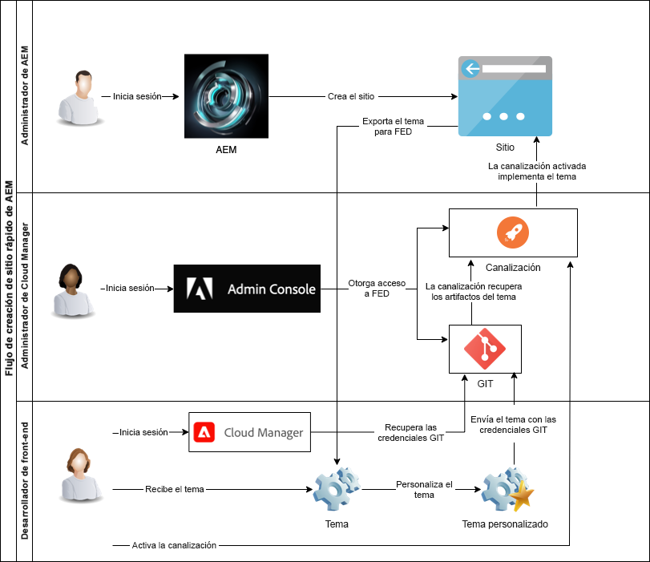

# Comprender Cloud Manager y el flujo de trabajo de creación rápida de sitios {#understand-cloud-manager}

{{traditional-aem}}

Obtenga información sobre Cloud Manager y cómo vincula el nuevo proceso de creación rápida de sitios.

>[!TIP]
>
>Si su función es exclusivamente desarrollo front-end, puede saltar al artículo [Recuperar información de acceso al repositorio de Git](retrieve-access.md) en este recorrido.
>
>Si es administrador de AEM y de Cloud Manager y es responsable de las tareas de desarrollo del front-end y de administrador, o simplemente es una persona que desea comprender el proceso de extremo a extremo en AEM para el desarrollo del front-end, siga leyendo el documento actual y continúe con este recorrido.

## Objetivo {#objective}

Este documento le ayuda a comprender cómo funciona la herramienta de creación rápida de sitios de AEM y le ofrece una visión general del flujo de extremo a extremo. Después de leer, debería haber logrado lo siguiente:

* Comprender cómo AEM Sites y Cloud Manager colaboran para facilitar el desarrollo front-end
* Vea cómo el paso de personalización del front-end está completamente disociado de AEM y no requiere conocimientos de AEM.

Este documento se centra en comprender estas partes fundamentales de la solución de creación rápida de sitios antes de pasar al siguiente paso del recorrido en el que se inicia la configuración.

Aunque se recomienda continuar con este recorrido paso a paso, si ya comprende que AEM Sites y Cloud Manager trabajan juntos, y desea comenzar directamente con la configuración, puede [ir al siguiente paso del recorrido](create-site.md).

## Función responsable {#responsible-role}

Esta parte del recorrido se aplica tanto al administrador de AEM como al administrador de Cloud Manager.

## Requisitos y requisitos previos {#requirements-prerequisites}

Antes de empezar a crear y personalizar sitios, debe cumplir varios requisitos con la herramienta de creación rápida de sitios.

Dado que este recorrido está diseñado para desarrolladores de front-end, administradores y combinaciones de todas las funciones, los requisitos para ambos se enumeran aquí.

Es importante comprender que para el desarrollador del front-end no es necesario tener acceso AEM ni conocimientos.

### Conocimiento {#knowledge}

| Conocimiento | Función |
|---|---|
| Comprensión de las herramientas y los procesos estándar del desarrollo front-end | Desarrollador front-end |
| Conocimientos básicos sobre cómo crear y administrar sitios en AEM | Administrador de AEM |
| Conocimientos básicos de Cloud Manager | Administrador de Cloud Manager |

Para el desarrollador de front-end, no se necesita ningún conocimiento sobre AEM.

### Herramientas {#tools}

| Herramienta | Función |
|---|---|
| Entorno de desarrollo front-end preferido | Desarrollador front-end |
| npm | Desarrollador front-end |
| webpack | Desarrollador front-end |
| Acceso a Cloud Manager | Administrador de Cloud Manager |
| Ser miembro de la función **Propietario empresarial** en Cloud Manager | Administrador de Cloud Manager |
| Ser administrador de sistemas en Cloud Manager | Administrador de Cloud Manager |
| Acceso a Admin Console | Administrador de Cloud Manager |
| Sea miembro de la función **Administrador de implementación** en Cloud Manager | Administrador de Cloud Manager |
| Sea miembro de la función de **Administrador de implementación** en Cloud Manager | Desarrollador front-end |

Para el desarrollador front-end, no es necesario utilizar AEM.

>[!TIP]
>
>Si no está familiarizado con las funciones y la administración de funciones de Cloud Manager, consulte el documento Permisos basados en funciones en la sección [Recursos adicionales](#additional-resources).

## Cloud Manager {#cloud-manager}

Cloud Manager es un componente esencial de AEM as a Cloud Service y sirve como punto de entrada único para la plataforma.

Para dar compatibilidad a los clientes con configuraciones de desarrollo empresarial, AEM as a Cloud Service se integra completamente con Cloud Manager y sus canalizaciones de CD/CI creadas específicamente. La herramienta de creación rápida de sitios amplía estas funciones para admitir canalizaciones de desarrollo front-end dedicadas.

A los efectos del presente recorrido, no es necesario tener una comprensión completa de Cloud Manager. En un nivel superior, Cloud Manager consta de varios niveles de estructura.

* **INQUILINO**: cada cliente está aprovisionado con un inquilino.
* **PROGRAMAS**: cada inquilino tiene uno o más programas, que a menudo reflejan las soluciones con licencia del cliente.
* **ENTORNOS**: cada programa tiene múltiples entornos, como producción para contenido en directo, uno para ensayo y otro para desarrollo.
* **REPOSITORIO**: los entornos tienen repositorios Git donde se mantiene el código de la aplicación y del front-end.
* **HERRAMIENTAS Y FLUJOS DE TRABAJO**: las canalizaciones administran la implementación de código desde los repositorios a los entornos.

Un ejemplo suele ser útil para contextualizar esta jerarquía.

* Las empresas de viajes y aventura de WKND pueden ser un **inquilino** que se centra en medios relacionados con viajes.
* El inquilino de empresas de viajes y aventura de WKND puede tener dos **programas**: un programa de Sites para la revista de WKND y uno de Assets para los medios de WKND.
* Los programas de revista de WKND y de medios de WKND tendrían **entornos** de desarrollo, ensayo y producción.

## El flujo de desarrollo front-end para la Creación rápida de sitios {#flow}

El flujo general es sencillo e intuitivo, incluso si aún no tiene mucha experiencia con Cloud Manager.

1. El administrador de AEM inicia sesión en un entorno de AEM y crea un nuevo sitio con una plantilla de sitio.
1. El administrador de Cloud Manager crea una canalización front-end en Cloud Manager. La canalización organiza la implementación de código desde un repositorio de Git a un entorno de AEM.
1. El administrador de AEM exporta el tema del sitio desde la instancia de AEM del programa y lo proporciona al desarrollador front-end.
1. El administrador de Cloud Manager concede al desarrollador front-end acceso al repositorio de Git de AEM donde se pueden llevar a cabo personalizaciones.
1. El desarrollador front-end recupera las credenciales de acceso para acceder a Git y a la canalización.
1. El desarrollador front-end personaliza el tema, lo prueba con contenido real del sitio mediante un proxy y luego confirma los cambios en el repositorio de Git.
1. El desarrollador front-end ejecuta la canalización para implementar las personalizaciones de temas en el entorno de producción del programa.

La principal ventaja de utilizar la herramienta de Creación rápida de sitios es que el desarrollador front-end es el único responsable de la personalización real. El desarrollador front-end no interactúa con AEM ni necesita tener conocimientos de AEM.

{{add-cm-allowlist-frontend-pipeline}}

## Siguientes pasos {#what-is-next}

Ahora que ha completado esta parte del Recorrido de creación rápida de sitios de AEM, debe hacer lo siguiente:

* Comprender cómo AEM Sites y Cloud Manager colaboran para facilitar el desarrollo front-end
* Vea cómo el paso de personalización del front-end está completamente disociado de AEM y no requiere conocimientos de AEM.

Partiendo de estos conocimientos, continúe con el recorrido de creación rápida de sitios de AEM y revise el documento [Creación de un sitio a partir de una plantilla](create-site.md), donde aprenderá a crear rápidamente un nuevo sitio de AEM con una plantilla.

## Recursos adicionales {#additional-resources}

Aunque se recomienda pasar a la siguiente parte del recorrido de creación rápida de sitios revisando el documento [Creación de un sitio a partir de una plantilla](create-site.md), a continuación se presentan algunos recursos adicionales y opcionales que profundizan en algunos conceptos mencionados en este documento, pero que no son necesarios para continuar con el recorrido.

* [Documentación de Cloud Manager](https://experienceleague.adobe.com/docs/experience-manager-cloud-service/onboarding/onboarding-concepts/cloud-manager-introduction.html?lang=es): si desea obtener más información sobre las funciones de Cloud Manager, puede consultar directamente los documentos técnicos detallados.
* [Permisos basados en roles](https://experienceleague.adobe.com/docs/experience-manager-cloud-manager/using/requirements/role-based-permissions.html?lang=es): Cloud Manager tiene funciones preconfiguradas con los permisos adecuados. Vea este documento para obtener detalles sobre estas funciones y cómo administrarlas.
* [npm](https://www.npmjs.com): los temas de AEM utilizados para construir sitios rápidamente se basan en npm.
* [webpack](https://webpack.js.org): los temas de AEM utilizados para construir sitios rápidamente dependen del webpack.
