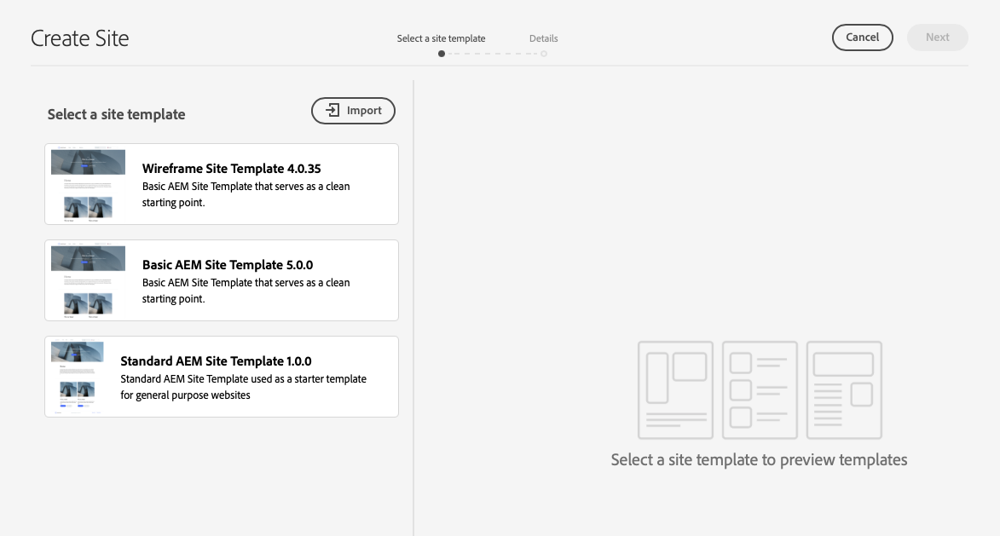

# Creación de un sitio a partir de una plantilla {#create-site-from-template}

AEM Obtenga información sobre cómo crear rápidamente un sitio de con una plantilla de sitio.

## La historia hasta ahora {#story-so-far}

En el documento anterior del Recorrido de creación rápida de sitios de AEM, [Comprensión de Cloud Manager y el Flujo de trabajo de creación rápida de sitios,](cloud-manager.md) ha aprendido acerca de Cloud Manager y cómo vincula el nuevo proceso de creación rápida de sitios. Ahora debería hacer lo siguiente:

* Comprender cómo AEM Sites y Cloud Manager colaboran para facilitar el desarrollo front-end
* Vea cómo el paso de personalización del front-end está completamente disociado de AEM y no requiere conocimientos de AEM.

Este artículo se basa en estos aspectos básicos para que pueda realizar el primer paso de configuración y crear un sitio para una plantilla que luego pueda personalizar con herramientas front-end.

## Objetivo {#objective}

AEM Este documento le ayuda a comprender cómo crear rápidamente un sitio con una plantilla de sitio de. Después de leer, debería haber logrado lo siguiente:

* Entender cómo obtener plantillas del sitio de AEM.
* Aprenda a crear un sitio con una plantilla.
* Consulte cómo descargar la plantilla del nuevo sitio para facilitarla al desarrollador front-end.

## Función responsable {#responsible-role}

Esta parte del recorrido se aplica al administrador de AEM.

## Plantillas de sitios {#site-templates}

Las plantillas del sitio son una forma de combinar el contenido básico del sitio en un paquete cómodo y reutilizable. Las plantillas del sitio suelen contener contenido y estructura base del sitio, así como información de estilo, para comenzar con uno nuevo rápidamente. La estructura real es la siguiente:

* `files`: carpeta con el kit de IU, el archivo XD y, posiblemente, otros archivos.
* `previews`: carpeta con capturas de pantalla de la plantilla del sitio.
* `site`: paquete de contenido del contenido que se copia para cada sitio creado a partir de esta plantilla, como plantillas de página, páginas, etc.
* `theme`: fuentes del tema de la plantilla para modificar el aspecto del sitio, incluidos CSS, JavaScript, etc.

Las plantillas son potentes, porque se pueden reutilizar para que los autores de contenido creen rápidamente un sitio. Y dado que puede tener varias plantillas disponibles en su instalación de AEM, tiene flexibilidad para satisfacer diversas necesidades comerciales.

>[!NOTE]
>
>La plantilla del sitio no se debe confundir con las plantillas de página. Las plantillas del sitio descritas aquí definen la estructura general de un sitio. Una plantilla de página define la estructura y el contenido inicial de una página individual.

## Obtención de una plantilla del sitio {#obtaining-template}

La forma más sencilla de empezar es [descargar la última versión de la plantilla de sitio estándar de AEM desde su repositorio de GitHub.](https://github.com/adobe/aem-site-template-standard/releases)

Una vez descargado, puede cargarlo en su entorno de AEM como lo haría con cualquier otro paquete. Consulte la [sección Recursos adicionales](#additional-resources) para obtener más información sobre cómo trabajar con paquetes si necesita más detalles sobre este tema.

>[!TIP]
>
>La plantilla del sitio estándar de AEM se puede personalizar para satisfacer las necesidades del proyecto y puede obviar la necesidad de una mayor personalización. Sin embargo, este tema está fuera del ámbito de este recorrido. Consulte la documentación de GitHub de la plantilla del sitio estándar para obtener más información.

>[!TIP]
>
>También puede optar por crear la plantilla a partir del origen, como parte del flujo de trabajo del proyecto. Sin embargo, este tema está fuera del ámbito de este recorrido. Consulte la documentación de GitHub de la plantilla del sitio estándar para obtener más información.

## Instalación de una plantilla del sitio {#installing-template}

Usar una plantilla para crear un sitio es fácil.

1. Inicie sesión en el entorno de creación de AEM y vaya a la consola Sites.

   * `https://<your-author-environment>.adobeaemcloud.com/sites.html/content`

1. Seleccionar **Crear** en la parte superior derecha de la pantalla y en el menú desplegable, seleccione **Sitio a partir de plantilla**.

   

1. En el asistente Crear sitio, seleccione **Importar** en la parte superior de la columna izquierda.

   

1. En el explorador de archivos, busque la plantilla [que descargó anteriormente](#obtaining-template) y seleccione **Cargar**.

1. Una vez cargada, aparece en la lista de plantillas disponibles. Selecciónela para seleccionarla (lo que también revela información sobre la plantilla en la columna derecha) y, a continuación, seleccione **Siguiente**.

   

1. Proporcione un título para el sitio. Se puede proporcionar un nombre de sitio o se genera a partir del título si se omite.

   * El título del sitio aparece en la barra de título de los exploradores.
   * El nombre del sitio forma parte de la dirección URL.

1. Seleccionar **Crear** y el nuevo sitio se crea a partir de la plantilla del sitio.

   

1. En el cuadro de diálogo de confirmación que aparece, seleccione **Listo**.

   

1. En la consola Sites, se ve el nuevo sitio y se puede navegar por él para explorar su estructura básica, según se define en la plantilla.

   

Los autores de contenido ahora pueden empezar a crear.

## ¿Es necesaria una mayor personalización? {#customization-required}

Las plantillas del sitio son muy potentes y flexibles, y se puede crear cualquier número para un proyecto, lo que permite producir variaciones de sitio con facilidad. Según el nivel de personalización que ya tenga la plantilla del sitio que utilice, es posible que ni siquiera necesite una personalización adicional del front-end.

* Si su sitio no lo requiere, ¡enhorabuena! Su recorrido termina aquí.
* Si todavía necesita personalizar el front-end o simplemente desea entender el proceso completo en caso de que la requiera en el futuro, continúe leyendo.

## Página de ejemplo {#example-page}

Si necesita personalizar más el front-end, tenga en cuenta que el desarrollador de este puede no estar familiarizado con los detalles del contenido. Por lo tanto, es aconsejable proporcionarle una ruta al contenido típico que se pueda usar como base de referencia al personalizar el tema. Un ejemplo típico es la página de inicio del idioma principal del sitio.

1. En el explorador de sitios, vaya a la página de inicio del idioma principal del sitio y, a continuación, seleccione la página para seleccionarla y, a continuación, seleccione **Editar** en la barra de menús.

   

1. En el editor, seleccione la opción **Información de la página** en la barra de herramientas y, a continuación, **Ver tal y como aparece publicado**.

   

1. En la pestaña que se abre, copie la ruta del contenido de la barra de direcciones. Se parecerá a `/content/<your-site>/en/home.html?wcmmode=disabled`.

   

1. Guarde la ruta para facilitarla más adelante al desarrollador front-end.

## Descarga del tema {#download-theme}

Ahora que el sitio se ha creado, el tema del sitio generado por la plantilla se puede descargar y proporcionar al desarrollador front-end para que lo personalice.

1. En la consola Sites, muestre el carril **Sitio**.

   

1. Seleccione la raíz del nuevo sitio y, a continuación, seleccione **Descargar fuentes de temas** en el carril del sitio.

   

Ahora tiene una copia de los archivos de origen del tema en los archivos de descarga.

## Configuración del usuario proxy {#proxy-user}

Para que el desarrollador front-end pueda previsualizar las personalizaciones utilizando contenido de AEM real de su sitio, debe configurar un usuario proxy.

1. AEM En el caso de la navegación principal, vaya a **Herramientas** > **Seguridad** > **Usuarios**.
1. En la consola de administración de usuarios, seleccione **Crear**.

   
1. En la ventana **Crear nuevo usuario**, debe proporcionar como mínimo, lo siguiente:
   * **ID**: tome nota de este valor, ya que debe proporcionárselo al desarrollador front-end.
   * **Contraseña**: guarde este valor de forma segura en un almacén de contraseñas, ya que debe proporcionárselo al desarrollador front-end.

   

1. En la pestaña **Grupos**, añada el usuario del proxy al grupo `contributors`.
   * Escribir el término `contributors` activa la función de autocompletar de AEM para facilitar la selección del grupo.

   

1. Seleccionar **Guardar y cerrar**.

Ahora ha completado la configuración. Los autores de contenido ahora pueden empezar a crear contenido en el momento en que comienza la preparación del sitio para la personalización del front-end en el siguiente paso del recorrido.

## Siguientes pasos {#what-is-next}

Ahora que ha completado esta parte del Recorrido de creación rápida de sitios de AEM, debe hacer lo siguiente:

* Entender cómo obtener plantillas del sitio de AEM.
* Aprenda a crear un sitio con una plantilla.
* Consulte cómo descargar la plantilla del nuevo sitio para facilitarla al desarrollador front-end.

Aproveche este conocimiento y continúe con su Recorrido de creación rápida de sitios de AEM revisando el documento [Configurar la canalización,](pipeline-setup.md) donde creará una canalización front-end para administrar la personalización del tema de su sitio.

## Recursos adicionales {#additional-resources}

Aunque se recomienda pasar a la siguiente parte del Recorrido de creación rápida de sitios de AEM al revisar el documento [Configuración de la canalización,](pipeline-setup.md) los siguientes son algunos recursos opcionales extra. Profundizan en varios conceptos mencionados en este documento, pero no son necesarios para continuar el recorrido.

* [Plantilla de sitio estándar de AEM](https://github.com/adobe/aem-site-template-standard): este es el repositorio de GitHub de la plantilla de sitio estándar de AEM.
* [Crear y organizar páginas](/help/sites-cloud/authoring/fundamentals/organizing-pages.md) AEM : Esta guía detalla cómo administrar las páginas de su sitio de si desea personalizarlo aún más después de crearlo a partir de la plantilla.
* [Cómo trabajar con el paquete](/help/implementing/developing/tools/package-manager.md): los paquetes permiten importar y exportar el contenido del repositorio. Este documento explica cómo trabajar con paquetes en AEM 6.5, que también se aplica a AEMaaCS.
* [Documentación de administración del sitio](/help/sites-cloud/administering/site-creation/create-site.md). Consulte los documentos técnicos sobre la creación de sitios para obtener más información sobre las funciones de la herramienta de creación rápida de sitios.
* [Crear o agregar formularios a una página de AEM Sites](/help/forms/create-or-add-an-adaptive-form-to-aem-sites-page.md): conozca las técnicas paso a paso y las prácticas recomendadas para integrar formularios en su sitio web y optimizar sus experiencias digitales para lograr el máximo impacto.
