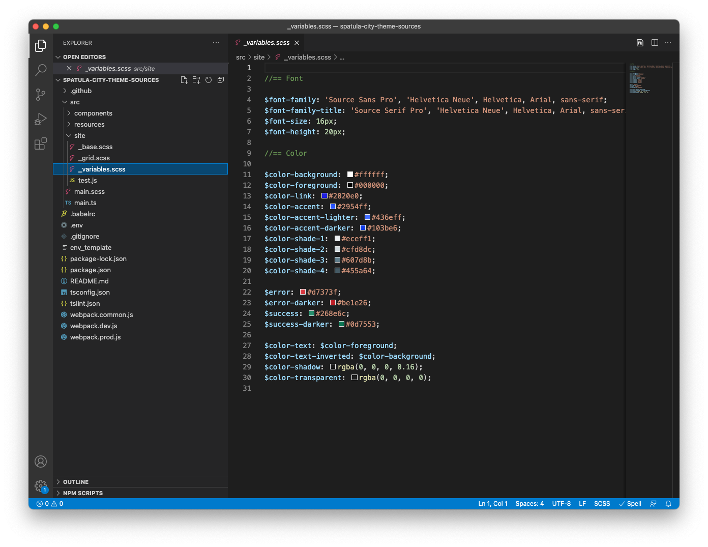

# Personalización del tema del sitio {#customize-the-site-theme}

{{traditional-aem}}

Descubra cómo se crea el tema del sitio, cómo personalizarlo y cómo probarlo con contenido de AEM en directo.

## Lo que hemos visto hasta ahora {#story-so-far}

En el documento anterior del recorrido de creación rápida de sitios de AEM, [Recuperación de información de acceso al repositorio de Git](retrieve-access.md), ha aprendido cómo los desarrolladores front-end usan Cloud Manager para acceder a la información del repositorio de Git, y ahora debería hacer lo siguiente:

* Comprender a alto nivel qué es Cloud Manager.
* Haber recuperado sus credenciales para acceder al Git de AEM y confirmar sus personalizaciones.

Esta parte del recorrido da el siguiente paso y explora el tema del sitio. Le muestra cómo personalizarlo y, a continuación, confirmar esas personalizaciones utilizando las credenciales de acceso que ha recuperado.

## Objetivo {#objective}

Este documento explica cómo se crea el tema del sitio de AEM, cómo personalizarlo y cómo probarlo con contenido de AEM en directo. Después de leer, debería haber logrado lo siguiente:

* Comprender la estructura básica del tema del sitio y cómo editarlo.
* Consulte cómo probar las personalizaciones de temas mediante contenido AEM real a través de un proxy local.
* Obtenga información sobre cómo confirmar los cambios en el repositorio de Git de AEM.

## Función responsable {#responsible-role}

Esta parte del recorrido se aplica al desarrollador front-end.

## Explicación de la estructura del tema {#understand-theme}

Extraiga el tema proporcionado por el administrador de AEM donde desee editar el tema y ábralo en su editor preferido.



Verá que el tema es un proyecto front-end típico. Las partes más importantes de la estructura son estas:

* `src/main.ts`: el punto de entrada principal del tema de JS y CSS
* `src/site`: archivos JS y CSS que se aplican a todo el sitio
* `src/components`: archivos JS y CSS específicos de componentes de AEM
* `src/resources`: archivos estáticos como iconos, logotipos y fuentes

>[!TIP]
>
>Si desea obtener más información sobre el tema estándar del sitio de AEM, consulte el vínculo de GitHub en la sección [Recursos adicionales](#additional-resources) al final de este documento.

Una vez que esté cómodo con la estructura del proyecto de tema, inicie el proxy local para poder ver cualquier personalización de tema en tiempo real basada en el contenido de AEM real.

## Inicio del proxy local {#starting-proxy}

1. Desde la línea de comandos, vaya a la raíz del tema en el equipo local.
1. Ejecutar `npm install` y npm recupera dependencias e instala el proyecto.

   

1. Ejecute `npm run live` y se inicia el servidor proxy.

   

1. Cuando se inicia el servidor proxy, se abre automáticamente un explorador a `http://localhost:7001/`. Selecciona  **INICIAR SESIÓN LOCALMENTE (SOLO TAREAS DE ADMINISTRACIÓN)** e inicia sesión con las credenciales del usuario proxy proporcionadas por el administrador de AEM.

   

   >[!TIP]
   >
   >Si no dispone de estas credenciales, hable con el administrador haciendo referencia a la sección [Configurar usuario proxy del artículo Crear sitio a partir de una plantilla](/help/journey-sites/quick-site/create-site.md#proxy-user) en este recorrido.

1. Una vez que haya iniciado sesión, cambie la dirección URL en el explorador para que apunte a la ruta del contenido de ejemplo que le proporcionó el administrador de AEM.

   * Por ejemplo, si la ruta proporcionada era `/content/<your-site>/en/home.html?wcmmode=disabled`
   * Cambiaría la dirección URL a `http://localhost:7001/content/<your-site>/en/home.html?wcmmode=disabled`

   

Puede navegar por el sitio para explorar el contenido. El sitio se extrae de la instancia de AEM en directo para que pueda personalizar temas con contenido real.

## Personalización del tema {#customize-theme}

Ahora puede empezar a personalizar el tema. El siguiente es un ejemplo sencillo que ilustra cómo puede ver los cambios en directo a través del proxy.

1. En el editor, abra el archivo `<your-theme-sources>/src/site/_variables.scss`

   

1. Edite la variable `$color-background` y configúrela con un valor distinto de blanco. En este ejemplo, se utiliza `orange`.

   

1. Cuando guarde el archivo, verá que el servidor proxy reconoce el cambio a través de la línea `[Browsersync] File event [change]`.

   

1. Al volver al explorador del servidor proxy, el cambio es visible de inmediato.

   

Puede seguir personalizando el tema en función de los requisitos que le proporcione el administrador de AEM.

## Envío de los cambios {#committing-changes}

Una vez completadas las personalizaciones, puede enviarlas al repositorio de Git de AEM. Primero debe clonar el repositorio en el equipo local.

1. Desde la línea de comandos, vaya a donde desee clonar el repositorio.
1. Ejecute el comando que [ha recuperado anteriormente de Cloud Manager](retrieve-access.md).  Debe ser similar a `git clone https://git.cloudmanager.adobe.com/<my-org>/<my-program>/`. Utilice el nombre de usuario y la contraseña de Git que [recuperó en la parte anterior de este recorrido](retrieve-access.md).

   

1. Mueva el proyecto de tema que estaba editando al repositorio clonado con un comando similar a `mv <site-theme-sources> <cloned-repo>`
1. En el directorio del repositorio clonado, confirme los archivos de tema que acaba de mover con los siguientes comandos.

   ```text
   git add .
   git commit -m "Adding theme sources"
   git push
   ```

1. Las personalizaciones se insertan en el repositorio de Git de AEM.

   

Sus personalizaciones ahora se almacenan de forma segura en el repositorio de Git de AEM.

## Siguientes pasos {#what-is-next}

Ahora que ha completado esta parte del Recorrido de creación rápida de sitios de AEM, debe hacer lo siguiente:

* Comprender la estructura básica del tema del sitio y cómo editarlo.
* Consulte cómo probar las personalizaciones de temas mediante contenido AEM real a través de un proxy local.
* Obtenga información sobre cómo confirmar los cambios en el repositorio de Git de AEM.

Partiendo de estos conocimientos, continúe con el recorrido de creación rápida de sitios de AEM revisando el documento [Implementar un tema personalizado](deploy-theme.md), donde aprenderá a implementar el tema utilizando la canalización front-end.

## Recursos adicionales {#additional-resources}

Aunque se recomienda pasar a la siguiente parte del recorrido de creación rápida de sitios revisando el documento [Implementar un tema personalizado](deploy-theme.md), a continuación se presentan algunos recursos adicionales y opcionales que profundizan en algunos conceptos mencionados en este documento, pero que no son necesarios para continuar con el recorrido.

* [Tema del sitio de AEM](https://github.com/adobe/aem-site-template-standard-theme-e2e): este es el repositorio de GitHub del tema del sitio de AEM.
* [npm](https://www.npmjs.com): los temas de AEM utilizados para construir sitios rápidamente se basan en npm.
* [webpack](https://webpack.js.org): los temas de AEM utilizados para construir sitios rápidamente dependen del webpack.
