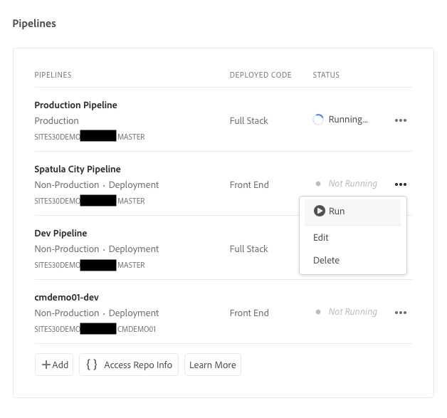
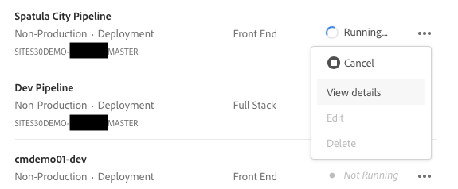
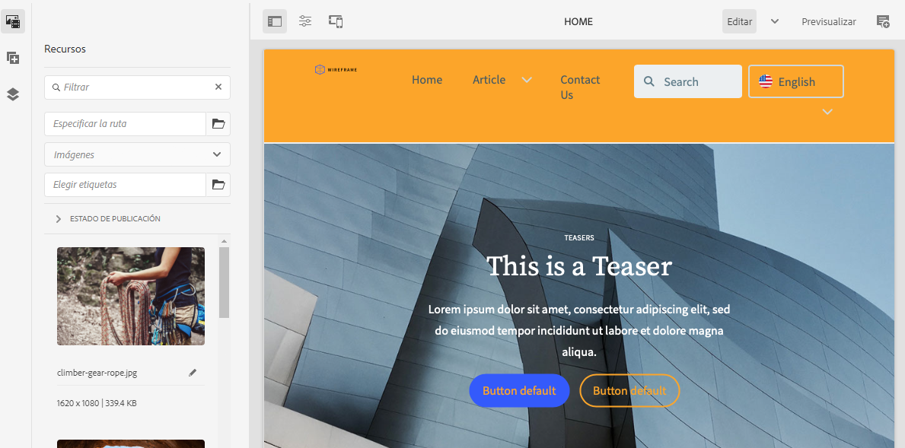

# Implementar el tema personalizado {#deploy-your-customized-theme}

{{traditional-aem}}

Aprenda cómo implementar el tema del sitio mediante la canalización.

## Lo que hemos visto hasta ahora {#story-so-far}

En el documento anterior del recorrido de creación rápida de sitios de AEM, [Personalizar el tema del sitio](customize-theme.md), ha aprendido cómo se crea el tema, cómo personalizarlo y probarlo con contenido de AEM en directo. Ahora debería ser capaz de lo siguiente:

* Comprender la estructura básica del tema del sitio y cómo editarlo.
* Consulte cómo probar las personalizaciones de temas mediante contenido AEM real a través de un proxy local.
* Obtenga información sobre cómo confirmar los cambios en el repositorio de Git de AEM.

Ahora puede dar el último paso y utilizar la canalización para implementarlos.

## Objetivo {#objective}

En este documento se explica cómo implementar el tema mediante la canalización. Después de leer, debería haber logrado lo siguiente:

* Conozca cómo puede activar una implementación de canalización.
* Consulte cómo comprobar el estado de implementación.

## Función responsable {#responsible-role}

Esta parte del recorrido se aplica al desarrollador front-end.

## Iniciar la canalización {#start-pipeline}

Una vez que haya confirmado los cambios de personalización del tema en el repositorio de Git de AEM, puede ejecutar [la canalización que el administrador creó](pipeline-setup.md) para implementar los cambios.

1. Inicie sesión en Cloud Manager [como lo hizo para recuperar la información de acceso de Git](retrieve-access.md) y acceda a su programa. En la pestaña **Información general**, verá una tarjeta para **Canalizaciones**.

   

1. Haga clic en los puntos suspensivos junto a la canalización que necesita iniciar. En el menú desplegable, seleccione **Ejecutar**.

   

1. En el cuadro de diálogo **Ejecutar canalización** de confirmación, seleccione **Sí**.

   

1. En la lista de canalizaciones, la columna de estado indica que la canalización se está ejecutando.

   

## Comprobar estado de la canalización {#pipeline-status}

Puede comprobar el estado de la canalización para ver los detalles de su progreso en cualquier momento.

1. Seleccione los puntos suspensivos junto a la canalización.

   

1. La ventana de detalles de la canalización muestra el desglose del progreso de la canalización.

   

>[!TIP]
>
>En la ventana de detalles de la canalización, puede hacer clic en **Descargar registro** para cualquier paso de la canalización con fines de depuración en caso de que algún paso falle. La depuración de la canalización está fuera del ámbito de este recorrido. Consulte los documentos técnicos de Cloud Manager en la sección [Recursos adicionales](#additional-resources) de esta página.

## Validación de las personalizaciones implementadas {#view-customizations}

Una vez finalizada la canalización, puede informar al administrador para validar los cambios. El administrador deberá hacer lo siguiente:

1. Abrir el entorno de creación de AEM.
1. Navegue hasta [el sitio que el administrador creó previamente](create-site.md).
1. Editar una de las páginas de contenido.
1. Consultar los cambios aplicados.

## ¿Fin del recorrido? {#end-of-journey}

Felicitaciones. Ha completado el recorrido de creación rápida de sitios de AEM. Ahora debería ser capaz de:

* Obtenga información sobre cómo Cloud Manager y la canalización front-end funcionan para administrar e implementar personalizaciones front-end.
* Aprenda a crear un sitio de AEM basado en una plantilla y cómo descargar el tema del sitio.
* Cómo incorporar un desarrollador front-end para que pueda acceder al repositorio de Git de AEM.
* Personalización y prueba de un tema mediante contenido AEM proxy y confirmación de esos cambios en el repositorio de Git de AEM.
* Cómo implementar personalización front-end mediante canalización.

Ya está listo para personalizar los temas de su propio sitio AEM. Sin embargo, antes de empezar a crear diferentes flujos de trabajo usando varias canalizaciones front-end, revise el documento [Desarrollo de sitios con la canalización front-end](/help/implementing/developing/introduction/developing-with-front-end-pipelines.md). Puede ayudarle a sacar el máximo partido a su desarrollo front-end al hacer lo siguiente:

* Mantener una única fuente de datos.
* Mantener una separación de intereses.

AEM es una herramienta potente y hay muchas opciones adicionales disponibles. Consulte algunos de los recursos adicionales disponibles en la sección [Recursos adicionales](#additional-resources) para obtener más información acerca de las funciones que ha visto en este recorrido.

## Recursos adicionales {#additional-resources}

A continuación se muestran algunos recursos adicionales que profundizan en algunos conceptos mencionados en este documento.

* [Uso del carril del sitio para administrar el tema del sitio](/help/sites-cloud/administering/site-creation/site-rail.md): conozca las potentes funciones del carril del sitio para ayudarle a personalizar y administrar fácilmente el tema del sitio, lo que incluye la descarga de fuentes temáticas y la administración de versiones de temas.
* [Documentación técnica de AEM as a Cloud Service](https://experienceleague.adobe.com/docs/experience-manager-cloud-service.html?lang=es): si ya tiene suficientes conocimientos de AEM, puede que desee consultar directamente los documentos técnicos detallados.
* [Documentación de Cloud Manager](https://experienceleague.adobe.com/docs/experience-manager-cloud-service/onboarding/onboarding-concepts/cloud-manager-introduction.html?lang=es): si desea obtener más información sobre las funciones de Cloud Manager, puede consultar directamente los documentos técnicos detallados.
* [Permisos basados en roles](https://experienceleague.adobe.com/docs/experience-manager-cloud-manager/using/requirements/role-based-permissions.html?lang=es): Cloud Manager tiene funciones preconfiguradas con los permisos adecuados. Vea este documento para obtener detalles sobre estas funciones y cómo administrarlas.
* [Repositorios de Cloud Manager](/help/implementing/cloud-manager/managing-code/managing-repositories.md): si necesita más información sobre cómo configurar y administrar repositorios Git para su proyecto AEMaaCS, vea este documento.
* [Configuración de la canalización de CI/CD, Cloud Services](/help/implementing/cloud-manager/configuring-pipelines/introduction-ci-cd-pipelines.md): obtenga más información sobre la configuración de canalizaciones, tanto de pila completa como del front-end, en este documento.
* [Plantilla de sitio AEM estándar](https://github.com/adobe/aem-site-template-standard): este es el repositorio de GitHub de la plantilla de sitio AEM estándar.
* [Tema del sitio AEM](https://github.com/adobe/aem-site-template-standard-theme-e2e): este es el repositorio de GitHub del tema del sitio AEM.
* [npm](https://www.npmjs.com): los temas de AEM utilizados para construir sitios rápidamente se basan en npm.
* [webpack](https://webpack.js.org): los temas de AEM utilizados para construir sitios rápidamente dependen del webpack.
* [Organización de páginas](/help/sites-cloud/authoring/sites-console/organizing-pages.md): esta guía detalla cómo organizar las páginas de su sitio de AEM.
* [Creación de páginas](/help/sites-cloud/authoring/sites-console/creating-pages.md): esta guía detalla cómo añadir nuevas páginas al sitio.
* [Administración de páginas](/help/sites-cloud/authoring/sites-console/managing-pages.md): esta guía detalla cómo administrar las páginas del sitio, incluido el movimiento, la copia y la eliminación.
* [Cómo trabajar con el paquete](/help/implementing/developing/tools/package-manager.md): los paquetes permiten importar y exportar el contenido del repositorio. Este documento explica cómo trabajar con paquetes en AEM 6.5, que también se aplica a AEMaaCS.
* [Recorrido de incorporación](/help/journey-onboarding/overview.md): esta guía sirve como punto de partida para garantizar que sus equipos estén configurados y tengan acceso a AEM as a Cloud Service.
* [Documentación de Cloud Manager de Adobe Experience Manager](https://experienceleague.adobe.com/docs/experience-manager-cloud-manager/using/introduction-to-cloud-manager.html?lang=es): explore la documentación de Cloud Manager para obtener toda la información detallada sobre sus funciones.
* [Documentación de administración del sitio](/help/sites-cloud/administering/site-creation/create-site.md): consulte la documentación técnica sobre la creación de sitios para obtener más información sobre las funciones de la herramienta de Creación rápida de sitios.
* [Desarrollo de sitios con canalización front-end](/help/implementing/developing/introduction/developing-with-front-end-pipelines.md): este documento describe algunas consideraciones que hay que tener en cuenta para aprovechar todo el potencial del proceso de desarrollo front-end mediante la canalización front-end.
