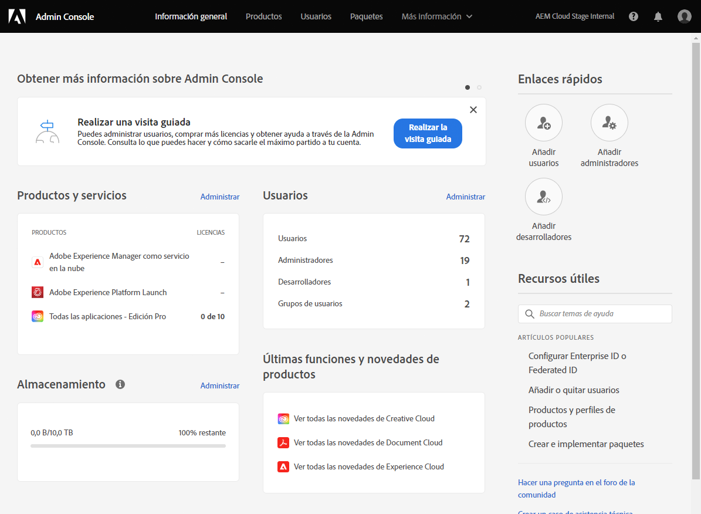
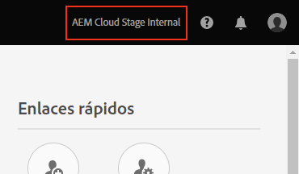
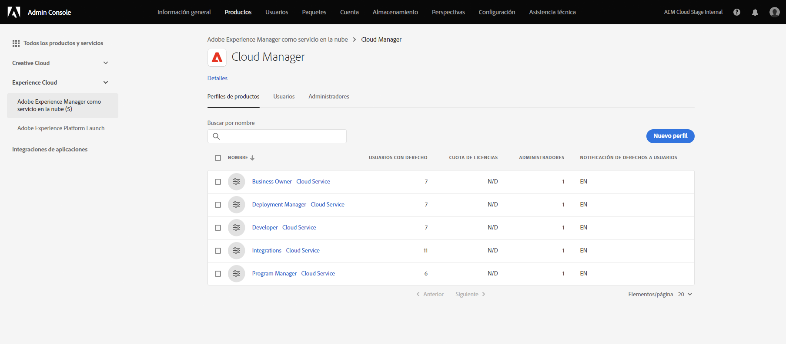
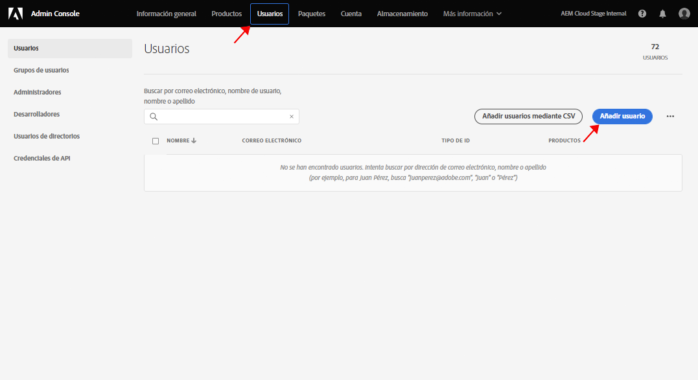
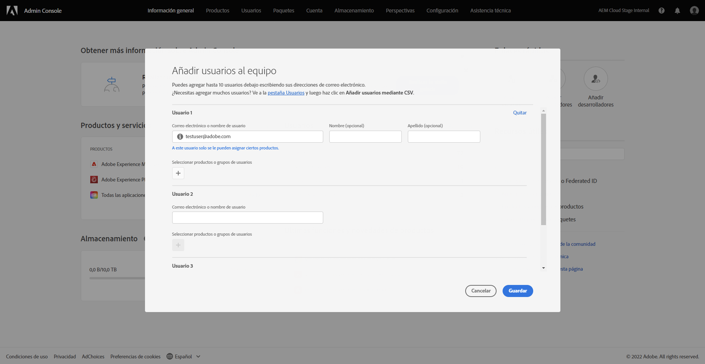
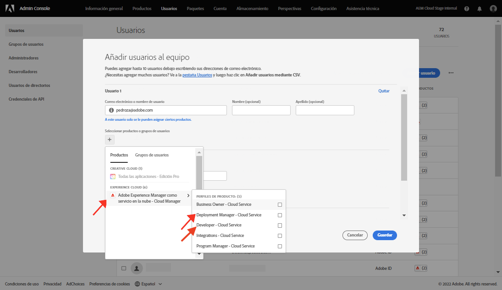

# Concesión de acceso al desarrollador front-end {#grant-fed-access}

{{traditional-aem}}

Incorpore a los desarrolladores front-end en Cloud Manager para que tengan acceso al repositorio de Git y a la canalización del sitio de AEM.

## Lo que hemos visto hasta ahora {#story-so-far}

En el documento anterior del recorrido de creación rápida de sitios de AEM, [Configuración de la canalización](pipeline-setup.md), ha aprendido a crear una canalización front-end para administrar la personalización del tema de su sitio, y ahora debería ser capaz de:

* Comprender qué es una canalización front-end.
* Saber cómo configurar una canalización front-end en Cloud Manager.

Ahora debe otorgar a su desarrollador front-end acceso a Cloud Manager a través del proceso de incorporación para que pueda entrar en el repositorio de Git de AEM y a la canalización que ha creado.

## Objetivo {#objective}

El proceso de conceder acceso a Cloud Manager y asignar funciones de usuario a los usuarios se llama “incorporación”. En este documento se ofrece una descripción general de los pasos más importantes para incorporar a un desarrollador front-end y, después de leerlo, sabrá lo siguiente:

* Cómo añadir un desarrollador front-end como usuario.
* Cómo conceder las funciones necesarias al desarrollador front-end.

>[!TIP]
>
>Si necesita detalles adicionales acerca del proceso, hay un recorrido de documentación completo dedicado a la incorporación de su equipo en AEM as a Cloud Service, en la [sección Recursos adicionales](#additional-resources) de este documento.

## Función responsable {#responsible-role}

Esta parte del recorrido se aplica al administrador de Cloud Manager.

## Requisitos  {#requirements}

* Debe ser miembro de la función **Propietario de la empresa** en Cloud Manager.
* Debe ser **Administrador de sistemas** en Cloud Manager.
* Debe tener acceso a Admin Console.

## Adición del desarrollador front-end como usuario {#add-fed-user}

En primer lugar, debe añadir al desarrollador front-end como usuario mediante Admin Console.

1. Inicie sesión en Admin Console en [https://adminconsole.adobe.com/](https://adminconsole.adobe.com/).

1. Una vez que haya iniciado sesión, aparecerá una página de información general similar a la de la siguiente imagen.

   

1. Asegúrese de que está en la organización adecuada: compruebe el nombre en la esquina superior derecha de la pantalla.

   

1. Seleccione **Adobe Experience Manager as a Cloud Service** en la tarjeta **Productos y servicios**.

   

1. Verá la lista de perfiles de producto preconfigurados de Cloud Manager. Si no ve estos perfiles, póngase en contacto con el administrador de Cloud Manager, ya que es posible que no tenga los permisos correctos en su organización.

   

1. Para asignar al desarrollador front-end a los perfiles correctos, selecciona la pestaña **Usuarios** y, a continuación, en el botón **Añadir usuario**. 

   

1. En el cuadro de diálogo **Añadir usuarios a su equipo**, escriba el ID de correo electrónico del usuario que desea agregar. Para el tipo de ID, seleccione Adobe ID si el Federated ID de los integrantes del equipo aún no se ha configurado.

   

1. En la selección **Producto**, seleccione el signo más y, a continuación, **Adobe Experience Manager as a Cloud Service** y asigne los perfiles de producto **Administrador de implementación** y **Desarrollador** al usuario.

   

1. Seleccione **Guardar**. Se enviará un correo electrónico de bienvenida al desarrollador front-end que se añadió como usuario.

El desarrollador front-end invitado puede acceder a Cloud Manager haciendo clic en el vínculo del correo electrónico de bienvenida e iniciando sesión con su Adobe ID.

## Envío al desarrollador front-end {#handover}

Una vez que la invitación a Cloud Manager enviada por correo electrónico al desarrollador front-end esté en camino, usted y el administrador de AEM pueden proporcionarle el resto de la información necesaria para comenzar la personalización.

* Una [ruta al contenido habitual](#example-page)
* La fuente del tema que [ha descargado](#download-theme)
* Las [credenciales de usuario de proxy](#proxy-user)
* El nombre del programa o la URL a este [copiados de Cloud Manager](pipeline-setup.md#login)
* Los requisitos del diseño front-end

## Siguientes pasos {#what-is-next}

Ahora que ha completado esta parte del Recorrido de creación rápida de sitios de AEM, debería saber lo siguiente:

* Cómo añadir un desarrollador front-end como usuario.
* Cómo conceder las funciones necesarias al desarrollador front-end.

Partiendo de estos conocimientos, continúe con el recorrido de creación rápida de sitios de AEM revisando el documento [Recuperación de información de acceso al repositorio de Git](retrieve-access.md), que pasa a centrarse exclusivamente en la perspectiva del desarrollador de front-end y explica cómo los usuarios desarrolladores de front-end utilizan Cloud Manager para acceder a la información del repositorio de Git.

## Recursos adicionales {#additional-resources}

Aunque se recomienda pasar a la siguiente parte del recorrido de creación rápida de sitios de AEM revisando el documento [Recuperación de credenciales de desarrollador de front-end](retrieve-access.md), a continuación se presentan algunos recursos adicionales y opcionales que profundizan en algunos conceptos mencionados en este documento, pero que no son necesarios para continuar con el recorrido.

* [Recorrido de incorporación](/help/journey-onboarding/overview.md): esta guía sirve como punto de partida para garantizar que sus equipos estén configurados y tengan acceso a AEM as a Cloud Service.
