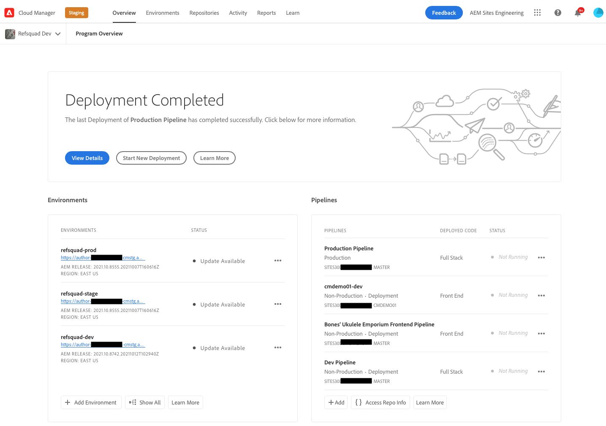
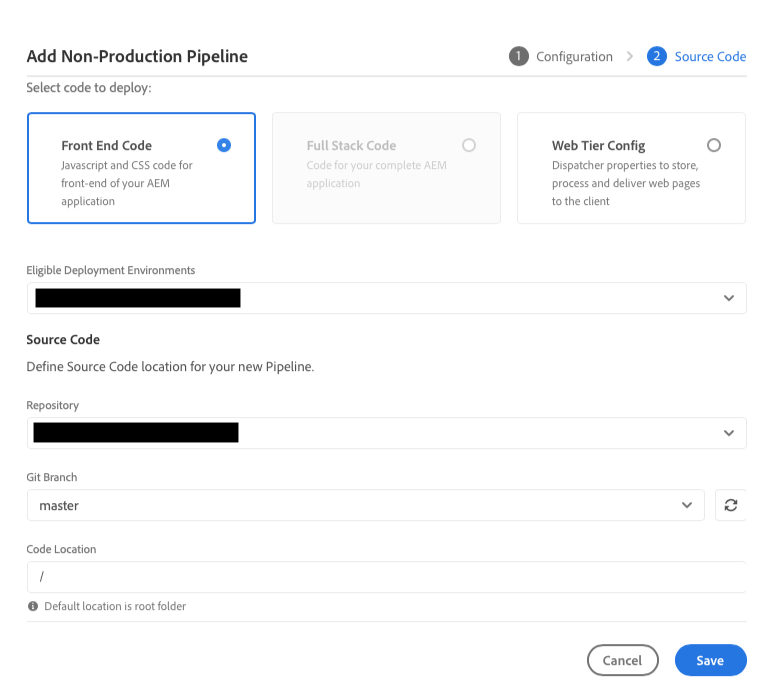

# Configurar la canalización {#set-up-your-pipeline}

{{traditional-aem}}

Cree una canalización front-end para administrar la personalización del tema del sitio.

## Lo que hemos visto hasta ahora {#story-so-far}

En el documento anterior del recorrido de creación rápida de sitios de AEM, [Crear sitio a partir de una plantilla](create-site.md), ha aprendido a utilizar una plantilla de sitio para crear rápidamente un sitio de AEM que se pueda personalizar aún más con herramientas front-end, y ahora debería ser capaz de:

* Entender cómo obtener plantillas de sitio de AEM.
* Obtenga información sobre cómo crear un sitio con una plantilla.
* Vea cómo descargar la plantilla de su nuevo sitio para proporcionársela al desarrollador de front-end.

Este artículo se basa en estos aspectos básicos para que pueda configurar una canalización front-end que el desarrollador de front-end utilizará más adelante en el recorrido para implementar personalizaciones front-end.

## Objetivo {#objective}

Este documento le ayuda a comprender las canalizaciones de front-end y cómo crearlas para administrar la implementación del tema personalizado del sitio. Después de leer, debería haber logrado lo siguiente:

* Comprender qué es una canalización front-end.
* Saber cómo configurar una canalización front-end en Cloud Manager.

## Función responsable {#responsible-role}

Esta parte del recorrido se aplica al administrador de Cloud Manager.

## Requisitos  {#requirements}

* Debe tener acceso a Cloud Manager.
* Debe ser miembro de la función **Administrador de implementación** en Cloud Manager.
* Se debe configurar un repositorio de Git para el entorno de AEM en Cloud Manager.
   * Esto suele ocurrir ya en cualquier proyecto activo. Sin embargo, si no es así, consulte la documentación de los repositorios de Cloud Manager disponible en la sección [Recursos adicionales](#additional-resources) para obtener más información.

## ¿Qué es una canalización front-end? {#front-end-pipeline}

El desarrollo de front-end implica la personalización de JavaScript, CSS y recursos estáticos que definen el estilo del sitio AEM. El desarrollador de front-end trabajará en sus propios entornos locales para realizar estas personalizaciones. Una vez que estén listos, los cambios se comprometen con el repositorio de Git AEM. Pero solo están comprometidos con el código fuente. Todavía no están creados.

La canalización front-end lleva estas personalizaciones asignadas y las implementa en un entorno AEM, generalmente en entornos de producción o de prueba.

De este modo, el desarrollo de front-end puede funcionar de forma independiente y paralela a cualquier desarrollo de back-end completo en AEM, ya que tiene sus propias canalizaciones de implementación.

>[!NOTE]
>
>Las canalizaciones front-end solo pueden implementar recursos estáticos, CSS y JavaScript para aplicar algún estilo a su sitio AEM. El contenido del sitio, como páginas o recursos, no se puede implementar en una canalización.

## Acceso a Cloud Manager {#login}

1. Inicie sesión en Adobe Cloud Manager en [my.cloudmanager.adobe.com](https://my.cloudmanager.adobe.com/).

1. Cloud Manager enumera los distintos programas disponibles. Seleccione el que desee administrar. Si acaba de empezar con AEM as a Cloud Service, es probable que solo tenga disponible un programa.

   

Ahora verá una descripción general del programa. Su página tendrá un aspecto diferente, pero será similar al de este ejemplo.

Observe el nombre del programa al que ha accedido o copie la URL. Deberá proporcionárselo más adelante al desarrollador de front-end.

## Creación de una canalización front-end {#create-front-end-pipeline}

Ahora que ha accedido a Cloud Manager, puede crear una canalización para la implementación de front-end.

1. En la sección **Canalizaciones** de la página Cloud Manager, haga clic en el botón **Agregar**.

   

1. En el menú emergente que aparece debajo del botón **Agregar** seleccione **Agregar canalización que no sea de producción** a efectos del presente recorrido.

1. Abra la pestaña **Configuración** del cuadro de diálogo **Agregar canalización que no sea de producción** y haga lo siguiente:
   * Seleccione **Canalización de implementación**.
   * Proporcione un nombre a la canalización en el campo **Nombre de canalización de prueba**.

   

1. Seleccione **Continuar**.

1. En la pestaña **Código fuente**:
   * Seleccione **Código front-end** como el tipo de código que se va a implementar.
   * Asegúrese de que esté seleccionado el entorno correcto en **Entornos de implementación aptos**.
   * Seleccione el **Repositorio** correcto.
   * Defina a qué **Rama de Git** debe estar asociada la canalización.
   * Defina la **Ubicación del código** si el desarrollo front-end se encuentra bajo una ruta particular en el repositorio seleccionado. El valor predeterminado es la raíz del repositorio, pero a menudo el desarrollo front-end y back-end están en rutas diferentes.

   

1. Seleccione **Guardar**.

La nueva canalización se crea y se puede ver en la sección **Canalizaciones** de la ventana Cloud Manager. Si toca hacer clic en los puntos suspensivos después del nombre de la canalización, aparecerán opciones para editar o ver los detalles según sea necesario.

>[!TIP]
>
>Si ya está familiarizado con las canalizaciones en AEMaaCS y desea obtener más información sobre las diferencias entre los distintos tipos de canalizaciones, incluidos más detalles sobre la canalización front-end, consulte Configurar canalización de CI/CD: Cloud Services vinculados en la sección [Recursos adicionales](#additional-resources).

## Siguientes pasos {#what-is-next}

Ahora que ha completado esta parte del Recorrido de creación rápida de sitios de AEM, debe hacer lo siguiente:

* Comprender qué es una canalización front-end.
* Saber cómo configurar una canalización front-end en Cloud Manager.

Partiendo de estos conocimientos, continúe con el recorrido de creación rápida de sitios de AEM revisando el documento [Conceder acceso al desarrollador de front-end](grant-access.md), donde incorporará a los desarrolladores de front-end en Cloud Manager para que tengan acceso al repositorio de Git y a la canalización de su sitio de AEM.

## Recursos adicionales {#additional-resources}

Aunque se recomienda pasar a la siguiente parte del recorrido de creación rápida de sitios de AEM revisando el documento [Personalización del tema del sitio](customize-theme.md), a continuación se presentan algunos recursos adicionales y opcionales que profundizan en algunos conceptos mencionados en este documento, pero que no son necesarios para continuar con el recorrido.

* [Documentación de Cloud Manager](https://experienceleague.adobe.com/docs/experience-manager-cloud-service/onboarding/onboarding-concepts/cloud-manager-introduction.html?lang=es): si desea obtener más información sobre las funciones de Cloud Manager, puede consultar directamente los documentos técnicos detallados.
* [Repositorios de Cloud Manager](/help/implementing/cloud-manager/managing-code/managing-repositories.md): si necesita más información sobre cómo configurar y administrar repositorios Git para su proyecto AEMaaCS, consulte este documento.
* [Configuración de la canalización de CI/CD, Cloud Services](/help/implementing/cloud-manager/configuring-pipelines/introduction-ci-cd-pipelines.md): obtenga más información sobre la configuración de canalizaciones, tanto de pila completa como del front-end, en este documento.
