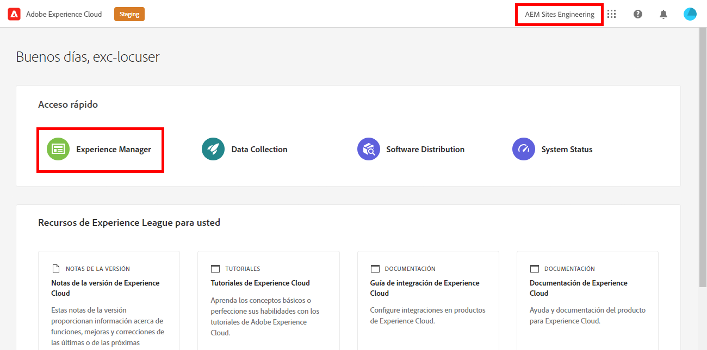
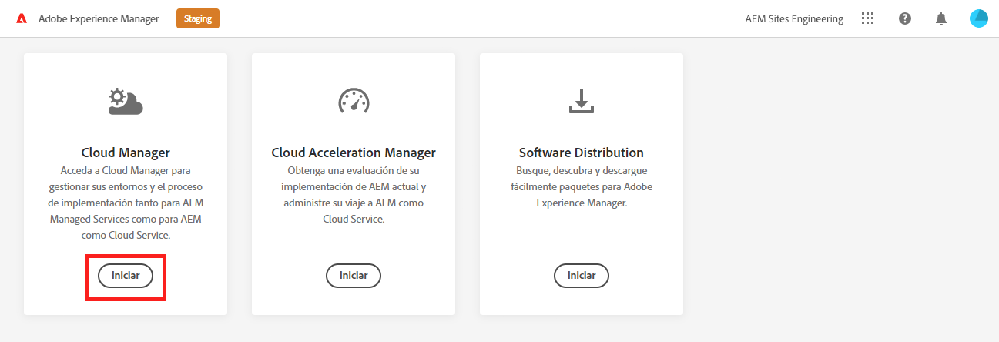

# Recuperar información de acceso al repositorio Git {#retrieve-access}

Descubra cómo el desarrollador de front-end utiliza Cloud Manager para acceder a la información del repositorio de Git.

>[!CAUTION]
>
>La herramienta Creación rápida de sitios es actualmente una vista previa técnica. Está disponible con fines de ensayo y evaluación y no está pensado para su uso en producción a menos que se acuerde con la asistencia al Adobe.

## La historia hasta ahora {#story-so-far}

Si usted es un desarrollador de front-end solo responsable de la personalización del tema del sitio, no necesita saber cómo se configuró AEM y puede ir al [Objetivo](#objective) de este documento.

Si también desempeña el papel de Cloud Manager o AEM administrador, así como de desarrollador de front-end, ha aprendido en el documento anterior del recorrido de creación rápida del sitio de AEM, [Conceder acceso al desarrollador de front-end,](grant-access.md) cómo incorporar al desarrollador de front-end para que tenga acceso al repositorio de git, y ahora debería saber:

* Cómo añadir un desarrollador front-end como usuario.
* Cómo conceder las funciones necesarias al desarrollador del front-end.

Este artículo realiza el siguiente paso para mostrar cómo el desarrollador front-end utiliza el acceso de Cloud Manager para recuperar credenciales para acceder al repositorio de Git de AEM.

Ahora que hay un sitio creado basado en una plantilla, hay una canalización configurada, el desarrollador de front-end está incorporado y tiene toda la información que necesita, este artículo cambia la perspectiva de los administradores y exclusivamente al rol de desarrollador de front-end.

## Objetivo {#objective}

En este documento se explica cómo usted, como desarrollador de front-end, puede acceder a Cloud Manager y recuperar las credenciales de acceso al repositorio de Git de AEM. Después de leer:

* Comprender en un nivel superior qué es Cloud Manager.
* Ha recuperado sus credenciales para acceder a la Git de AEM para que pueda confirmar sus personalizaciones.

## Función responsable {#responsible-role}

Esta parte del recorrido se aplica al desarrollador del front-end.

## Requisitos {#requirements}

La herramienta de creación rápida de sitios permite a los desarrolladores de front-end trabajar de forma independiente sin tener conocimiento de AEM o cómo se configura. Sin embargo, el administrador de Cloud Manager debe incluir al desarrollador de front-end en el equipo del proyecto y el administrador de AEM debe proporcionarle la información necesaria. Asegúrese de tener la siguiente información antes de continuar.

* Desde el administrador de AEM:
   * Archivos de origen de tema para personalizar
   * Ruta a una página de ejemplo para usar como base de referencia
   * Credenciales del usuario proxy para probar las personalizaciones respecto al contenido AEM en directo
   * Requisitos de diseño front-end
* Desde el administrador de Cloud Manager:
   * Un correo electrónico de bienvenida de Cloud Manager que le informa de su acceso
   * El nombre del programa o la URL a él dentro de Cloud Manager

Si falta alguno de estos elementos, póngase en contacto con el administrador de AEM o con el administrador de Cloud Manager.

Se da por hecho que el desarrollador del front-end tiene una amplia experiencia con flujos de trabajo de desarrollo del front-end, así como herramientas comunes instaladas que incluyen:

* git
* npm
* webpack
* Un editor preferido

## Explicación de Cloud Manager {#understanding-cloud-manager}

Cloud Manager permite que las organizaciones administren sus AEM en la nube. Incluye un marco de trabajo de integración y entrega continuas (CI/CD) que permite a los equipo de TI y a los asociados de la implementación acelerar la entrega de las personalizaciones o actualizaciones sin poner en riesgo el rendimiento o la seguridad.

Para el desarrollador de front-end, es la puerta de enlace a:

* Acceda AEM información del repositorio de Git para poder confirmar las personalizaciones del front-end.
* Inicie la canalización de implementación para implementar las personalizaciones.

El administrador de Cloud Manager lo habrá incorporado como usuario de Cloud Manager. Debería haber recibido un correo electrónico de bienvenida similar al siguiente.

Si no ha recibido este correo electrónico, póngase en contacto con el administrador de Cloud Manager.

## Acceso a Cloud Manager {#access-cloud-manager}

1. Inicie sesión en Adobe Experience Cloud en [my.cloudmanager.adobe.com](https://my.cloudmanager.adobe.com/) o haga clic en el vínculo proporcionado en el correo electrónico de bienvenida.

1. Una vez que haya iniciado sesión, compruebe que se encuentra en la organización correcta en la esquina superior derecha de la pantalla. Si solo es miembro de una organización, este paso no es necesario. A continuación, toque o haga clic en **Experience Manager**.

   

1. En la página siguiente, toque o haga clic en el botón **Launch** para iniciar el **Cloud Manager** aplicación.

   

1. En la página siguiente se enumeran los distintos programas disponibles. Toque o haga clic en el que necesita acceder como lo proporciona el administrador de Cloud Manager. Si este es su primer proyecto front-end para AEMaaCS, es probable que solo tenga un programa disponible.

   

Ahora verá una descripción general de su Cloud Manager. Su página tendrá un aspecto diferente pero similar al de este ejemplo.

## Recuperar información de acceso al repositorio {#repo-access}

1. En el **Canalizaciones** de la página Cloud Manager, toque o haga clic en el botón **Acceder a información de repositorios** botón.

   

1. La variable **Información del repositorio** se abre.

   

1. Toque o haga clic en el botón **Generar contraseña** para crear una contraseña.

1. Guarde la contraseña generada en un administrador de contraseñas seguro. La contraseña no se volverá a mostrar nunca más.

1. Copie también el **username** y **Línea de comandos de Git** campos. Utilizará esta información más adelante para acceder a la cesión temporal.

1. Toque o haga clic **Cerrar**.

## Siguientes pasos {#what-is-next}

Ahora que ha completado esta parte del recorrido de creación rápida AEM sitio, debe:

* Comprender en un nivel superior qué es Cloud Manager.
* Ha recuperado sus credenciales para acceder a la Git de AEM para que pueda confirmar sus personalizaciones.

Aproveche este conocimiento y continúe con su recorrido de Creación Rápida AEM Sitio revisando el documento [Personalizar el tema del sitio,](customize-theme.md) donde aprenderá cómo se crea el tema del sitio, cómo personalizarlo y cómo probarlo con contenido AEM en directo.

## Recursos adicionales {#additional-resources}

Aunque se recomienda pasar a la siguiente parte del recorrido de creación rápida del sitio revisando el documento [Personalizar el tema del sitio,](customize-theme.md) los siguientes son algunos recursos opcionales adicionales que profundizan en algunos conceptos mencionados en este documento, pero no son necesarios para continuar en el recorrido.

* [Documentación de Adobe Experience Manager Cloud Manager](https://experienceleague.adobe.com/docs/experience-manager-cloud-manager/using/introduction-to-cloud-manager.html?lang=es) : Explore la documentación de Cloud Manager para obtener información detallada sobre sus funciones.
