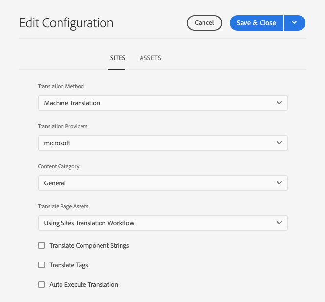

# Configuración del conector de traducción {#configure-connector}

Aprenda a conectar AEM a un servicio de traducción.

## Lo que hemos visto hasta ahora {#story-so-far}

En el documento anterior del recorrido de traducción de AEM Sites, [Introducción a la traducción de AEM Sites](learn-about.md) ha aprendido a organizar el contenido y cómo funcionan las herramientas de traducción de AEM, y ahora debería poder hacer lo siguiente:

* Comprender la importancia de la estructura de contenido para la traducción.
* Entender cómo AEM almacena contenido.
* Estar familiarizado con las herramientas de traducción de AEM.

Este artículo se basa en estos aspectos básicos para que pueda realizar el primer paso de configuración y configurar un servicio de traducción que utilizará más adelante en el recorrido para traducir contenido.

## Objetivo {#objective}

Este documento le ayuda a comprender cómo configurar un conector de AEM en el servicio de traducción seleccionado. Después de leer, debería haber logrado lo siguiente:

* Comprender los parámetros importantes del marco de trabajo de integración de traducción en AEM.
* Puede configurar su propia conexión con el servicio de traducción.

## El marco de trabajo de integración de traducción {#tif}

El Marco de trabajo de integración de traducción de AEM (TIF) se integra con los servicios de traducción de terceros para organizar la traducción de contenido AEM. Requiere tres pasos básicos.

1. Conéctese a su proveedor de servicios de traducción.
1. Cree una configuración del marco de trabajo de integración de traducción.
1. Asocie la configuración con el contenido.

Las secciones siguientes describen estos pasos con más detalle.

## Conexión a un proveedor de servicios de traducción {#connect-translation-provider}

El primer paso es elegir qué servicio de traducción desea utilizar. Hay muchas opciones para servicios de traducción humana y automática disponibles para AEM. La mayoría de los proveedores ofrecen un paquete de traductores para instalar. Consulte la sección [Recursos adicionales](#additional-resources) para ver una selección de las opciones disponibles.

>[!NOTE]
>
>El especialista en traducción es responsable generalmente de elegir qué servicio de traducción utilizar, pero el administrador suele ser responsable de instalar el paquete del conector de traducción requerido.

Para los fines de este recorrido, utilizamos el traductor de Microsoft que AEM proporciona con una licencia de prueba lista para usar. Consulte la sección [Recursos adicionales](#additional-resources) para obtener más información sobre este proveedor.

Si elige otro proveedor, el administrador debe instalar el paquete del conector según las instrucciones proporcionadas por el servicio de traducción.

>[!NOTE]
>
>El uso del traductor de Microsoft incorporado en AEM no requiere ninguna configuración adicional y funciona tal cual sin tener que configurar el conector adicional.
>
>Si decide utilizar el conector de Microsoft Translator para realizar pruebas, no es necesario realizar los pasos de las dos secciones siguientes: [Creación de una configuración de integración de traducción](#create-config) y [Asociar la configuración con su contenido](#associate).  Sin embargo, se recomienda leer estas secciones para que se familiarice con los pasos que debe seguir cuando necesite configurar su conector preferido.
>
>La licencia de la versión de prueba del conector del traductor de Microsoft no está pensada para fines de producción y si decide conceder la licencia, el administrador del sistema debe seguir los pasos detallados en la sección [Recursos adicionales](#additional-resources) al final de este documento para configurar esa licencia.

## Creación de una configuración de integración de traducción {#create-config}

Una vez instalado el paquete de conector para el servicio de traducción preferido, debe crear una configuración del Marco de trabajo de integración de traducción para ese servicio. La configuración incluye la siguiente información:

* Qué proveedor de servicios de traducción utilizar
* Si se va a realizar una traducción humana o automática
* Si se debe traducir otro contenido asociado con las páginas, como etiquetas

Para crear una nueva configuración de traducción haga lo siguiente:

1. En el menú de navegación global, haga clic en **Herramientas** > **Cloud Services** > **Cloud Services de traducción**.
1. Desplácese hasta donde desee crear la configuración en la estructura de contenido. Esto suele basarse en un proyecto en particular o puede ser global.
   * Por ejemplo, en este caso, se podría realizar una configuración global para aplicar a todo el contenido o solo para el proyecto WKND.

   

1. Haga clic en **Crear** en la barra de herramientas para crear la nueva configuración.
1. Proporcione la siguiente información en los campos y, a continuación, haga clic en **Crear**.
   1. Seleccione **Tipo de configuración** en la lista desplegable. Seleccione **Integración de traducción** de la lista.
   1. Escriba un **Título** para su configuración. El **Título** identifica la configuración en la consola **Cloud Services**, así como en las listas desplegables de propiedad de página.
   1. Opcionalmente, escriba un **Nombre** para usar para el nodo del repositorio que almacena la configuración.

   

1. Haga clic en **Crear** y se mostrará la ventana **Editar configuración** donde puede configurar las propiedades de configuración.

1. Dado que el contenido se administra como sitios, haga clic en la pestaña **Sites**.



1. Proporcione la siguiente información.

   1. **Método de traducción**: seleccione **Traducción automática** o **Traducción humana** según el proveedor de traducción. A los efectos del presente recorrido asumimos la traducción automática.
   1. **Proveedores de traducción**: seleccione el conector que instaló para su servicio de traducción de la lista.
   1. **Categoría de contenido**: seleccione la categoría más adecuada para dirigir mejor la traducción (solo para traducción automática).
   1. **Traducir activos de página**: seleccione **Uso del flujo de trabajo de traducción de Sites** para traducir los activos asociados con las páginas del sitio.
   1. **Traducir cadenas de componentes**: marque esta opción para traducir la información del componente.
   1. **Traducir etiquetas**: marque esta opción para traducir las etiquetas asociadas con la página.
   1. **Ejecución automática de la traducción**: compruebe esta propiedad si desea que las traducciones se envíen automáticamente al servicio de traducción.

1. Seleccione **Guardar y cerrar**.

Ahora ha configurado el conector en el servicio de traducción.

## Asociar la configuración con el contenido {#associate}

AEM es una herramienta flexible y potente que soporta múltiples servicios de traducción simultánea a través de varios conectores y configuraciones. La configuración no entra dentro del ámbito de este recorrido. Sin embargo, esta flexibilidad significa que debe especificar qué conectores y configuración deben utilizarse para traducir el contenido asociando esta configuración con el contenido.

Para ello, vaya a la raíz de idioma del contenido. Como ejemplo, sería lo siguiente:

```text
/content/<your-project>/en
```

1. Vaya a la navegación global y luego a **Navegación** > **Recursos** > **Archivos**.
1. En la consola de recursos, seleccione la raíz de idioma que desea configurar y haga clic en **Propiedades**.
1. Seleccione la pestaña **Cloud Services**.
1. En **Configuraciones de Cloud Service** en el menú desplegable **Agregar configuración**, seleccione el conector. Debería aparecer en la lista desplegable cuando haya instalado su paquete como se ha [descrito anteriormente](#connect-translation-provider).
1. En **Configuraciones de Cloud Service** en el menú desplegable **Agregar configuración**, seleccione también la configuración.
1. Seleccione **Guardar y cerrar**.


## Siguientes pasos {#what-is-next}

Ahora que ha completado esta parte del recorrido de traducción de AEM Sites, debe:

* Comprender los parámetros importantes del marco de trabajo de integración de traducción en AEM.
* Puede configurar su propia conexión con el servicio de traducción.

Partiendo de estos conocimientos, continúe con el recorrido de traducción de AEM Sites revisando el documento [Configurar las reglas de traducción](translation-rules.md), donde aprenderá a definir qué contenido traducir.

## Recursos adicionales {#additional-resources}

Aunque se recomienda pasar a la siguiente parte del recorrido de traducción al revisar el documento [Configuración de reglas de traducción](translation-rules.md) los siguientes son otros recursos opcionales que profundizan ciertos conceptos mencionados en este documento, pero que no son necesarios para continuar el recorrido.

* [Configuración del marco de trabajo de integración de traducción](/help/sites-cloud/administering/translation/integration-framework.md): revise la lista de conectores de traducción seleccionados y aprenda a configurar el marco de trabajo de integración de traducción para integrar servicios de traducción de terceros.
* [Conexión al traductor de Microsoft](/help/sites-cloud/administering/translation/connect-ms-translator.md): AEM proporciona una cuenta de prueba del traductor de Microsoft para realizar pruebas.
