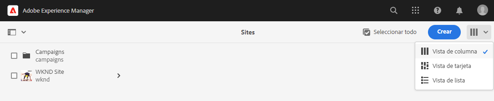

# Introducción a la traducción de AEM Sites {#getting-started}

Obtenga información sobre cómo organizar el contenido de AEM Sites y cómo funcionan las herramientas de traducción de AEM.

## La historia hasta ahora {#story-so-far}

En el documento anterior del recorrido de traducción de AEM Sites, [Información acerca del contenido de AEM Sites y cómo traducirlo en AEM](learn-about.md), ha aprendido la teoría básica de AEM Sites y ahora debería hacer lo siguiente:

* Comprender los conceptos básicos de la creación de contenido de AEM Sites.
* Estar familiarizado con cómo AEM admite la traducción.

Este artículo se basa en estos aspectos básicos para que pueda comprender cómo AEM almacena y administra el contenido y cómo puede utilizar sus herramientas de traducción para traducirlo.

## Objetivo {#objective}

Este documento le ayuda a comprender cómo empezar a traducir contenido de sitios en AEM. Después de leer, debería haber logrado lo siguiente:

* Comprender la importancia de la estructura de contenido para la traducción.
* Entender cómo AEM almacena contenido.
* Estar familiarizado con las herramientas de traducción de AEM.

## Requisitos y requisitos previos {#requirements-prerequisites}

Antes de comenzar a traducir el contenido de AEM, existen varios requisitos.

### Conocimiento {#knowledge}

* Experiencia en la traducción de contenido en un CMS
* Experiencia utilizando las funciones básicas de un CMS a gran escala
* Conocimiento práctico de la gestión básica de AEM
* Comprensión del servicio de traducción que utiliza
* Comprensión básica del contenido que está traduciendo

>[!TIP]
>
>Si no está familiarizado con el uso de un CMS a gran escala como AEM, considere la posibilidad de revisar la documentación de [Gestión básica](/help/sites-cloud/authoring/getting-started/basic-handling.md) antes de continuar. La documentación de Gestión básica no forma parte del recorrido. Como tal, vuelva a esta página cuando haya terminado.

### Herramientas {#tools}

* Acceso a zona protegida para probar la traducción del contenido
* Credenciales para conectarse al servicio de traducción preferido
* Ser miembro del grupo `project-administrators` en AEM

## Cómo almacena el contenido AEM {#content-in-aem}

Para el especialista en traducción, no es importante comprender en profundidad cómo administra el contenido AEM. AEM Sin embargo, familiarizarse con los conceptos básicos y la terminología es útil, ya que más adelante utilizará herramientas de traducción de la aplicación de la traducción de la manera más rápida y sencilla. Lo más importante es que debe comprender su propio contenido y cómo está estructurado para traducirlo de forma eficaz.

### Consola Sitios {#sites-console}

La consola Sites proporciona información general sobre la estructura del contenido, lo que facilita la navegación y la administración al crear páginas nuevas, mover y copiar páginas y publicar contenido.

Para acceder a la consola Sites:

1. En el menú de navegación global, pulse o haga clic en **Navegación** -> **Sitios**.
1. La consola Sites se abre en el nivel superior del contenido.
1. Asegúrese de que la **Vista de columna** se selecciona mediante el selector de vista situado en la parte superior derecha de la ventana.

   

1. Al tocar o hacer clic en un elemento de una columna, se muestra el contenido debajo de él en la jerarquía de la columna, a la derecha.

   

1. Al tocar o hacer clic en la casilla de verificación de un elemento de una columna, se selecciona ese elemento y se muestran sus detalles en la columna de la derecha, así como varias acciones disponibles en la barra de herramientas de arriba.

   

1. Al tocar o hacer clic en el selector de raíl en la parte superior izquierda, también puede mostrar la vista **Árbol de contenido** para ver un árbol de información general del contenido.

   

Con estas sencillas herramientas, puede navegar de forma intuitiva por la estructura de contenido.

>[!NOTE]
>
>El arquitecto de contenido suele definir la estructura de contenido, mientras que los autores de contenido lo crean sin salirse de esa estructura.
>
>Como especialista en traducción, es importante comprender simplemente cómo navegar por esa estructura y dónde se encuentra el contenido.

### Editor de página {#page-editor}

La consola Sites le permite desplazarse por el contenido y proporciona una descripción general de su estructura. Para ver los detalles de una página individual, debe utilizar el editor de sitios.

Para editar una página:

1. Utilice la consola Sites para localizar y seleccionar una página. Recuerde que debe tocar o hacer clic en la casilla de verificación de una página individual para seleccionarla.

   

1. Pulse la opción **Editar** en la barra de herramientas.
1. El editor de sitios se abre con la página seleccionada cargada para su edición en una nueva pestaña del explorador.
1. Si pulsa en el contenido o pasa el ratón por encima, se muestran selectores para componentes individuales. Los componentes son los bloques de creación de arrastrar y soltar que conforman la página.

   

Puede volver a la consola Sites regresando a esa pestaña en el explorador en cualquier momento. Con el editor de sitios puede ver rápidamente el contenido de la página, tal y como lo verán los autores de contenido y la audiencia.

>[!NOTE]
>
>Los autores de contenido crean el contenido del sitio mediante el editor de sitios.
>
>Como especialista en traducción, es importante comprender simplemente cómo ver los detalles de ese contenido con el editor de sitios.

## La estructura es clave {#content-structure}

El contenido de AEM depende de su estructura. AEM impone pocos requisitos a la estructura de contenido, pero tener en cuenta la jerarquía de contenido como parte de la planificación del proyecto puede hacer que la traducción sea mucho más sencilla.

>[!TIP]
>
>Planifique la traducción justo al principio del proyecto de AEM. Trabaje en estrecha colaboración con el gestor del proyecto y los arquitectos de contenido desde un primer momento.
>
>Un gestor de proyectos de internacionalización puede ser un actor independiente, cuya responsabilidad es definir qué contenido debe traducirse y cuál no, y qué contenido traducido pueden modificar los productores de contenido regionales o locales.

## Estructura de contenido recomendada {#recommended-structure}

Como se recomendó anteriormente, trabaje con su arquitecto de contenido para determinar la estructura de contenido adecuada para su propio proyecto. Sin embargo, lo siguiente es una estructura probada, simple e intuitiva bastante efectiva.

Defina una carpeta base para su proyecto en `/content`.

```text
/content/<your-project>
```

El idioma en el que se crea el contenido se denomina raíz del idioma. En nuestro ejemplo es inglés y debería estar en esta ruta.

```text
/content/<your-project>/en
```

Todo el contenido del proyecto que pueda ser necesario localizar debe colocarse bajo la raíz del idioma.

```text
/content/<your-project>/en/<your-project-content>
```

Las traducciones deben crearse como carpetas del mismo nivel a lo largo de la raíz del idioma con un nombre de carpeta que represente el código de idioma ISO-2 correspondiente. Por ejemplo, el alemán tendría la siguiente ruta.

```text
/content/<your-project>/de
```

>[!NOTE]
>
>Por lo general, el arquitecto de contenido es responsable de crear estas carpetas de idioma. Si no se crean, AEM no podrá crear más adelante trabajos de traducción.

La estructura final puede tener un aspecto similar al siguiente.

```text
/content
    |- your-project
        |- en
            |- some
            |- exciting
            |- sites
            |- content
        |- de
        |- fr
        |- it
        |- ...
    |- another-project
    |- ...
```

Debe tomar nota de la ruta específica del contenido, ya que es necesaria más adelante para configurar la traducción.

>[!NOTE]
>
>Suele ser responsabilidad del arquitecto de contenido definir la estructura de contenido, a menudo en colaboración con el especialista en traducción.
>
>Se detalla aquí para completar la información.

## Herramientas de traducción de AEM {#translation-tools}

Ahora que comprende la consola y el editor de sitios y la importancia de la estructura del contenido, podemos ver cómo traducirlo. Las herramientas de traducción de AEM son bastante potentes, pero son sencillas de entender a alto nivel.

* **Conector de traducción**: el conector es el vínculo entre AEM y el servicio de traducción que utiliza.
* **Reglas de traducción**: las reglas definen qué contenido bajo rutas particulares se debe traducir.
* **Proyectos de traducción**: los proyectos de traducción reúnen contenido que debe tratarse en un esfuerzo de traducción único y rastrean el progreso de la traducción. Interactúan con el conector para transmitir el contenido que debe traducirse y recibirlo de nuevo desde el servicio de traducción.

Generalmente, solo se configura un conector una vez para la instancia y las reglas por proyecto. Entonces, utiliza proyectos de traducción para traducir el contenido y mantener las traducciones actualizadas de forma continua.

## Siguientes pasos {#what-is-next}

Ahora que ha completado esta parte del recorrido de traducción de AEM Sites, debe:

* Comprender la importancia de la estructura de contenido para la traducción.
* Entender cómo AEM almacena contenido.
* Estar familiarizado con las herramientas de traducción de AEM.

Aproveche este conocimiento y continúe con su recorrido de traducción de AEM Sites revisando el documento [Configuración del conector de traducción](configure-connector.md), donde aprenderá a conectar AEM a un servicio de traducción.|

## Recursos adicionales {#additional-resources}

Aunque se recomienda pasar a la siguiente parte del Recorrido de creación rápida de sitios de AEM revisando el documento [Configuración del conector de traducción,](configure-connector.md) los siguientes son algunos recursos opcionales extra. Profundizan en varios conceptos mencionados en este documento, pero no son necesarios para proseguir el recorrido.

* [Gestión básica de AEM](/help/sites-cloud/authoring/getting-started/basic-handling.md): conozca los conceptos básicos de la IU de AEM para poder navegar con comodidad y desempeñar tareas esenciales como encontrar el contenido.
* [Identificación del contenido para traducir](/help/sites-cloud/administering/translation/rules.md): aprenda cómo las reglas de traducción identifican el contenido que necesita traducirse.
* [Configuración del marco de integración de traducciones](/help/sites-cloud/administering/translation/integration-framework.md): aprenda a configurar el marco de integración de traducciones para integrarlo con servicios de traducción de terceros.
* [Administración de proyectos de traducción](/help/sites-cloud/administering/translation/managing-projects.md): aprenda a crear y administrar proyectos de traducción automática y humana en AEM.
