# Traducir contenido {#translate-content}

Utilice el conector de traducción y las reglas para traducir el contenido.

## La historia hasta ahora {#story-so-far}

En el documento anterior del recorrido de traducción de AEM Sites, [Configurar reglas de traducción](translation-rules.md) ha aprendido a utilizar las reglas de traducción de AEM para identificar el contenido de traducción. Ahora debería hacer lo siguiente:

* Comprender lo que hacen las reglas de traducción.
* Poder definir sus propias reglas de traducción.

Ahora que el conector y las reglas de traducción están configurados, este artículo le guía por el siguiente paso de traducción del contenido de AEM Sites.

## Objetivo {#objective}

Este documento le ayuda a comprender cómo utilizar los proyectos de traducción de AEM junto con el conector y las reglas de traducción para traducir contenido. Después de leer este documento, debería poder hacer lo siguiente:

* Comprender qué es un proyecto de traducción.
* Poder crear nuevos proyectos de traducción.
* Utilizar proyectos de traducción para traducir el contenido de AEM Sites.

## Creación de un proyecto de traducción {#creating-translation-project}

Los proyectos de traducción le permiten administrar la traducción del contenido de AEM. Un proyecto de traducción reúne el contenido que se traduce en una ubicación para obtener una vista central del esfuerzo de traducción.

Cuando se añade contenido a un proyecto de traducción, se crea un trabajo de traducción para este. Los trabajos proporcionan comandos e información de estado que se utilizan para administrar los flujos de trabajo de traducción humana y traducción automática que se ejecutan en los recursos.

Los proyectos de traducción se pueden crear de dos formas:

1. Seleccione la raíz de idioma del contenido y deje que AEM cree automáticamente el proyecto de traducción en función de la ruta de contenido.
1. Cree un proyecto vacío y seleccione manualmente el contenido que desee añadir al proyecto de traducción

Ambos son enfoques válidos que normalmente solo difieren según el usuario que realice la traducción:

* El gestor de proyectos de traducción (TPM) suele necesitar la flexibilidad de seleccionar manualmente el contenido del proyecto de traducción.
* Si el propietario del contenido también es responsable de la traducción, dejar que AEM cree automáticamente el proyecto en función de la ruta de contenido seleccionada suele ser más fácil.

Ambos enfoques se analizan en las secciones siguientes.

### Creación automática de un proyecto de traducción basado en la ruta de contenido {#automatically-creating}

Para los propietarios de contenido que también son responsables de la traducción, a menudo es más fácil dejar que AEM cree automáticamente el proyecto de traducción. Para que AEM cree automáticamente un proyecto de traducción basado en la ruta de contenido:

1. Vaya a **Navegación** -> **Sites** y toque o haga clic en el proyecto.
1. Busque la raíz de idioma del proyecto. Por ejemplo, si la raíz de idioma es el inglés, `/content/<your-project>/en`.
   * Tenga en cuenta que antes de la primera traducción, las otras carpetas de idioma son marcadores de posición vacíos. Normalmente, los crea el arquitecto de contenido.
1. Busque la raíz de idioma del proyecto.
1. Toque o haga clic en el selector de carril y muestre el panel **Referencias**.
1. Toque o haga clic en **Copias de idioma**.
1. Marque la casilla de verificación **Copias de idioma**.
1. Expanda la sección **Actualizar copias de idioma** en la parte inferior del panel de referencias.
1. En el menú desplegable **Proyecto**, seleccione **Crear proyecto(s) de traducción**.
1. Proporcione un título adecuado para el proyecto de traducción.
1. Haga clic o pulse **Actualizar**.


Recibirá un mensaje que indica que se creó el proyecto.

>[!NOTE]
>
>Se supone que ya se ha creado la estructura lingüística necesaria para los idiomas de traducción como parte de la [definición de la estructura de contenido.](getting-started.md#content-structure) Esto debería hacerse en colaboración con el arquitecto de contenido.
>
>Si las carpetas de idioma no se crean con antelación, no podrá crear copias de idioma como se describió en los pasos anteriores.

### Creación manual de un proyecto de traducción seleccionando su contenido {#manually-creating}

Para los gestores de proyectos de traducción, a menudo es necesario seleccionar manualmente contenido específico para incluirlo en un proyecto de traducción. Para crear un proyecto de traducción manual de este tipo, debe empezar creando un proyecto vacío y luego seleccionar el contenido que desea añadir.

1. Vaya a **Navegación** -> **Proyectos**.
1. Toque o haga clic en **Crear** -> **Carpeta** para crear una carpeta para sus proyectos.
   * Esto es opcional, pero resulta útil para organizar los esfuerzos de traducción.
1. En la ventana **Crear proyecto**, agregue un **Título** para la carpeta y, a continuación, toque o haga clic en **Crear**.

   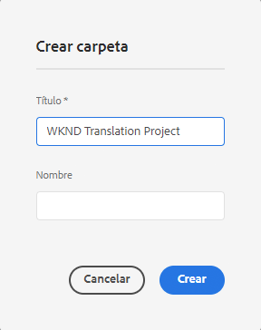

1. Toque o haga clic en la carpeta para abrirla.
1. En la nueva carpeta del proyecto, toque o haga clic en **Crear** -> **Proyecto**.
1. Los proyectos se basan en plantillas. Toque o haga clic en la plantilla **Proyecto de traducción** para seleccionarla y, a continuación, toque o haga clic en **Siguiente**.

   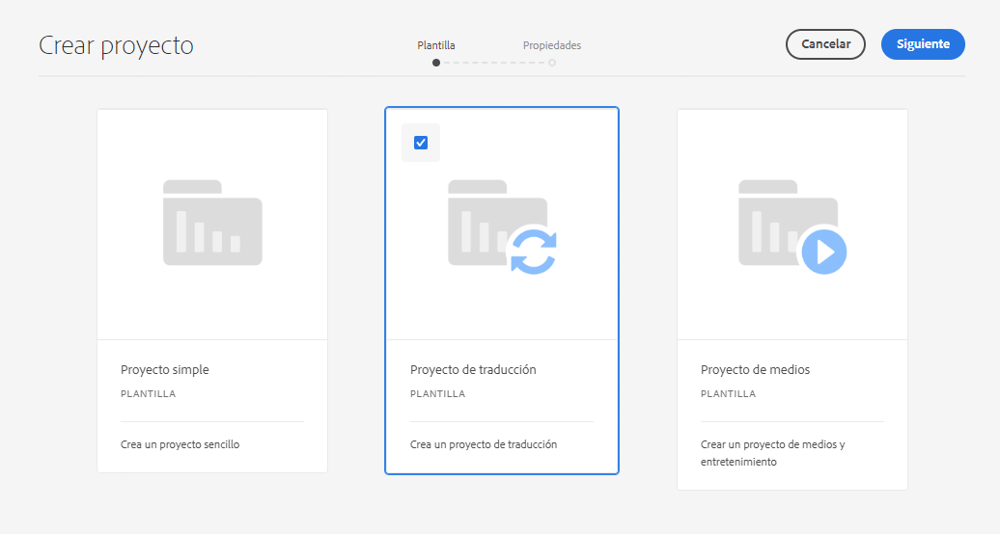

1. En la pestaña **Básico**, escriba un nombre para el nuevo proyecto.

   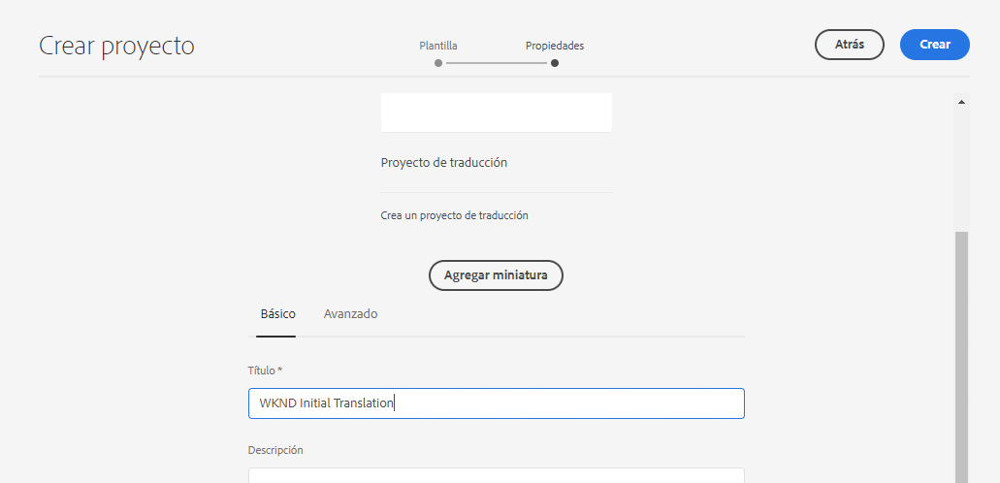

1. En la pestaña **Avanzadas**, utilice el desplegable **Idioma de destinatario** para seleccionar los idiomas a los que se debe traducir el contenido. Haga clic o pulse en **Crear**.

   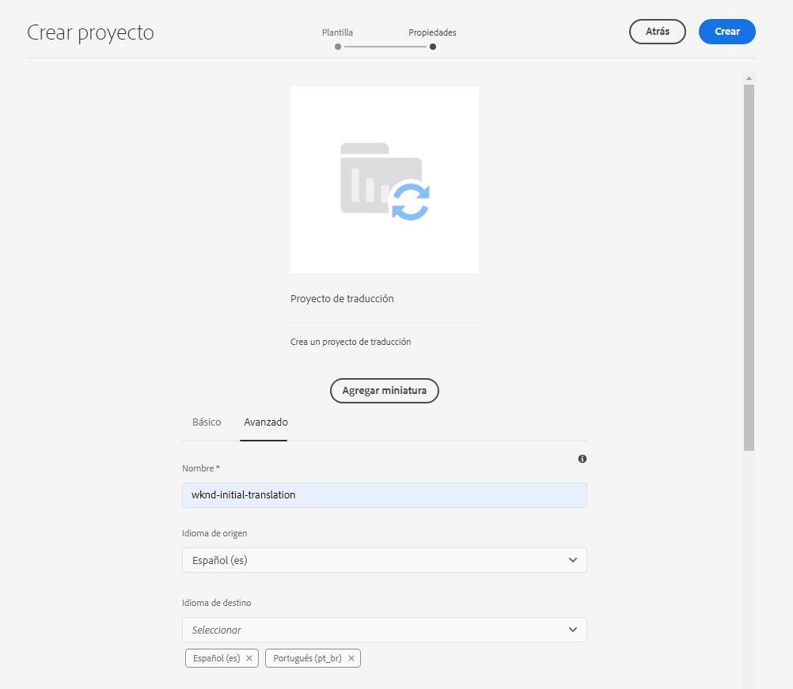

1. Toque o haga clic en **Abrir** en el cuadro de diálogo de confirmación.

   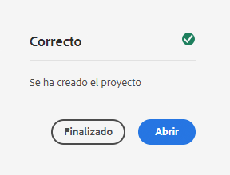

El proyecto se ha creado, pero no contiene contenido para traducir. La siguiente sección detalla cómo se estructura el proyecto y cómo añadir contenido.

## Uso de un proyecto de traducción {#using-translation-project}

Los proyectos de traducción están diseñados para recopilar todo el contenido y las tareas relacionadas con un esfuerzo de traducción en un solo lugar para que su traducción sea sencilla y fácil de administrar.

Para ver el proyecto de traducción:

1. Vaya a **Navegación** -> **Proyectos**.
1. Toque o haga clic en el proyecto creado en la sección anterior (o bien [Creación automática de un proyecto de traducción basado en la ruta de contenido](#automatically-creating) o [Creación manual de un proyecto de traducción seleccionando su contenido](#manually-creating) dependiendo de su situación).

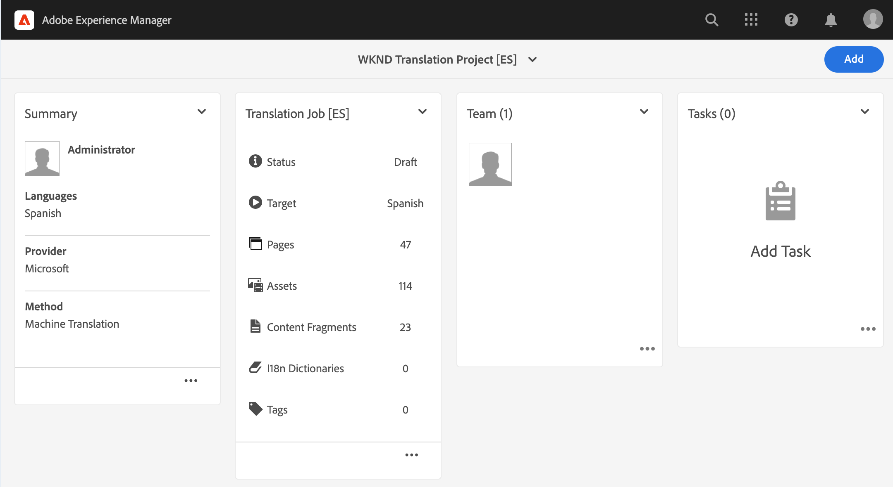

El proyecto se divide en varias tarjetas.

* **Resumen** - Esta tarjeta muestra la información básica del encabezado del proyecto, incluido el propietario, el idioma y el proveedor de traducción.
* **Trabajo de traducción** - Esta tarjeta o estos programas de tarjetas proporcionan una visión general del trabajo de traducción real incluyendo el estado, el número de activos, etc. Generalmente, hay un trabajo por idioma con el código de idioma ISO-2 anexado al nombre del trabajo.
   * Tenga en cuenta que cuando [se crean automáticamente trabajos de traducción,](#automatically-creating) AEM crea los trabajos de forma asíncrona y es posible que no aparezcan inmediatamente en el proyecto.
* **Equipo** - Esta tarjeta muestra los usuarios que están colaborando en este proyecto de traducción. Este recorrido no cubre este tema.
* **Tareas**: Tareas adicionales asociadas con la traducción del contenido, como hacer elementos o elementos de flujo de trabajo. Este recorrido no cubre este tema.

Para comprender mejor el flujo de traducción en AEM, es útil realizar un cambio en la configuración del proyecto. Este paso no es necesario para las traducciones de producción, pero ayuda a comprender el proceso.

1. En la tarjeta **Resumen**, pulse o haga clic en el botón de puntos suspensivos en la parte inferior de la tarjeta.
1. En la pestaña **Avanzadas**, desmarque la opción **Eliminar lanzamiento después de la promoción**.

   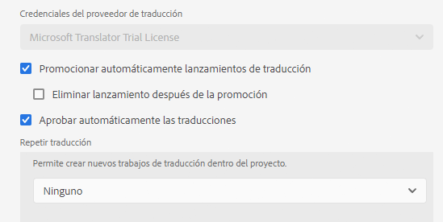

1. Haga clic o pulse en **Guardar y cerrar**.

Ahora está listo para usar su proyecto de traducción. El uso de un proyecto de traducción depende de cómo se creó: automáticamente por AEM o manualmente.

### Uso de un proyecto de traducción creado automáticamente {#using-automatic-project}

Al crear automáticamente el proyecto de traducción, AEM evalúa el contenido en la ruta seleccionada en función de las reglas de traducción que haya definido anteriormente. Basándose en esa evaluación, extrae el contenido que requiere traducción en un nuevo proyecto de traducción.

Para ver los detalles del contenido incluido en este proyecto:

1. Toque o haga clic en el botón de puntos suspensivos en la parte inferior de la tarjeta **Trabajo de traducción**.
1. La ventana **Trabajo de traducción** lista todos los elementos del trabajo.

   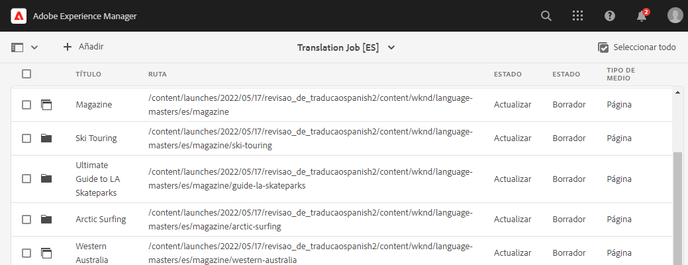

1. Toque o haga clic en una línea para ver el detalle de esa línea, teniendo en cuenta que una línea puede representar varios elementos de contenido para traducir.
1. Toque o haga clic en la casilla de verificación de selección de un elemento de línea para ver más opciones, como la opción de eliminarlo del trabajo o verlo en la consola Sitios.

   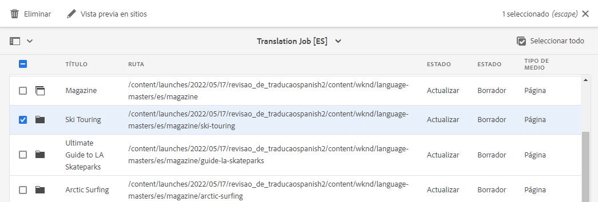

Normalmente, el contenido del trabajo de traducción se inicia en el estado **Borrador** tal como indica la columna **Estado** en la ventana **Trabajo de traducción**.

Para iniciar el trabajo de traducción, vuelva a la descripción general del proyecto de traducción y toque o haga clic en el botón de comillas angulares en la parte superior de la tarjeta **Trabajo de traducción** y seleccione **Inicio**.

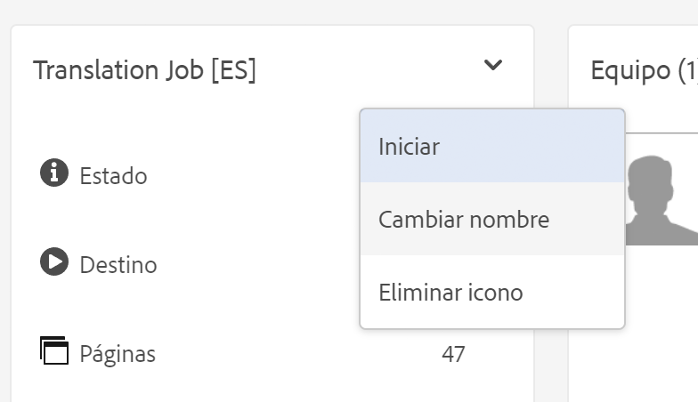

Ahora, AEM se comunica con la configuración de traducción y con el conector para enviar el contenido al servicio de traducción. Para ver el progreso de la traducción, vuelva a la ventana **Trabajo de traducción** y visualice la columna **Estado** de las entradas.

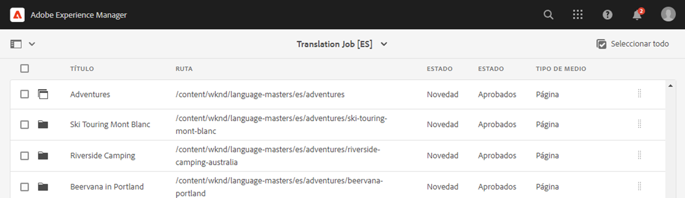

Las traducciones automáticas se devuelven automáticamente con un estado de **Aprobado**. La traducción humana permite una mayor interacción, pero está fuera del alcance de este recorrido.

>[!TIP]
>
>Procesar un trabajo de traducción puede llevar algún tiempo y es posible que vea que los elementos de traducción se mueven del estado de **Borrador** a **Traducción en curso** a **Listo para revisión** antes de llegar al estado de **Aprobado**. Esto es lo que se espera que pase.

>[!NOTE]
>
>Si no desactivó la opción del proyecto **Eliminar lanzamiento después de la promoción** como [se describe en la sección anterior,](#using-translation-project) los elementos traducidos aparecerán con el estado de **Eliminado**. Esto es normal, ya que AEM descarta automáticamente los registros de traducción una vez que llegan los elementos traducidos. Los elementos traducidos se han importado como copias de idiomas, solo se han eliminado los registros de traducción porque ya no son necesarios.
>
>No se preocupe si no le ha quedado claro. Estos son detalles exhaustivos de cómo funciona AEM y no afectan a su comprensión del recorrido. AEM Si desea profundizar en cómo procesa las traducciones en la forma en que lo hace el usuario, consulte la sección sobre procesos de traducción. [recursos adicionales](#additional-resources) de este artículo.

### Uso de un proyecto de traducción creado manualmente {#using-manual-project}

Al crear manualmente un proyecto de traducción, AEM crea los trabajos necesarios, pero no selecciona automáticamente ningún contenido para incluir en esos trabajos. Esto permite al gestor del proyecto de traducción tener la flexibilidad de elegir qué contenido traducir.

Para añadir contenido a un trabajo de traducción:

1. Toque o haga clic en los puntos suspensivos en la parte inferior de una de las tarjetas de **Trabajo de traducción**.
1. Compruebe que el trabajo no incluya contenido. Toque o haga clic en el botón **Agregar** en la parte superior de la ventana y, a continuación, seleccione **Recursos/Páginas** en la lista desplegable.

   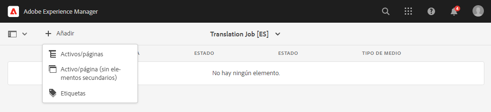

1. Se abre un navegador de rutas que le permite seleccionar específicamente qué contenido añadir. Busque el contenido y toque o haga clic para seleccionarlo.

   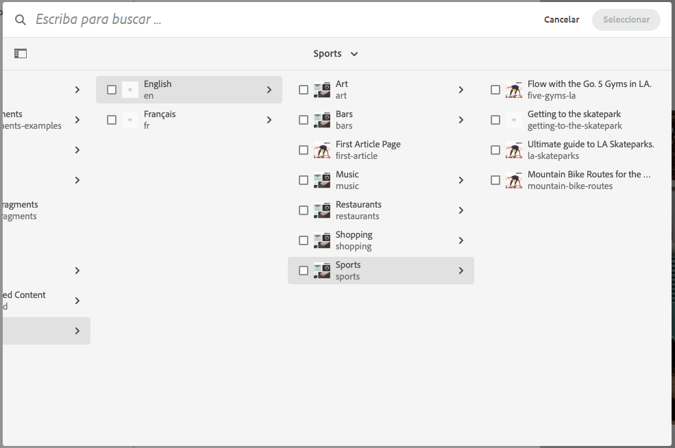

1. Toque o haga clic en **Seleccionar** para añadir el contenido seleccionado al trabajo.
1. En el cuadro de diálogo **Traducir**, especifique que desea **Crear copia de idioma**.

   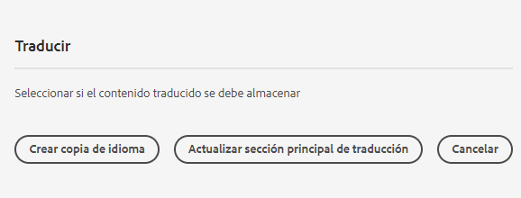

1. El contenido ahora se incluye en el trabajo.

   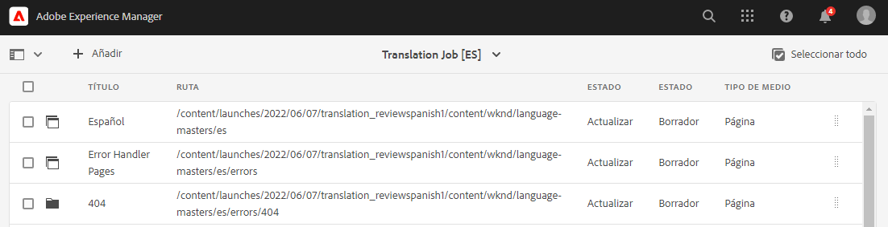

1. Toque o haga clic en la casilla de verificación de selección de un elemento de línea para ver más opciones, como la opción de eliminarlo del trabajo o verlo en la consola Sitios.

   

1. Repita estos pasos para incluir todo el contenido necesario en el trabajo.

>[!TIP]
>
>El navegador de rutas es una potente herramienta que le permite buscar, filtrar y navegar por el contenido. Toque o haga clic en el botón **Solo contenido/Filtros** para alternar el panel lateral y mostrar filtros avanzados como **Fecha de modificación** o **Estado de la traducción**.
>
>Puede obtener más información sobre el navegador de rutas en la [sección de recursos adicionales.](#additional-resources)

Puede utilizar los pasos anteriores para agregar el contenido necesario a todos los idiomas (trabajos) del proyecto. Una vez que haya seleccionado todo el contenido, puede iniciar la traducción.

Normalmente, el contenido del trabajo de traducción se inicia en el estado de **Borrador** tal como lo indica la columna **Estado** en la ventana **Trabajo de traducción**.

Para iniciar el trabajo de traducción, vuelva a la descripción general del proyecto de traducción y toque o haga clic en el botón de comillas angulares en la parte superior de la tarjeta **Trabajo de traducción** y seleccione **Inicio**.


Ahora, AEM se comunica con la configuración de traducción y con el conector para enviar el contenido al servicio de traducción. Para ver el progreso de la traducción, vuelva a la ventana **Trabajo de traducción** y visualice la columna **Estado** de las entradas.


Las traducciones automáticas se devuelven automáticamente con un estado de **Aprobado**. La traducción humana permite una mayor interacción, pero está fuera del alcance de este recorrido.

>[!TIP]
>
>Procesar un trabajo de traducción puede llevar algún tiempo y es posible que vea que los elementos de traducción se mueven del estado de **Borrador** a **Traducción en curso** a **Listo para revisión** antes de llegar al estado de **Aprobado**. Esto es lo que se espera que pase.

>[!NOTE]
>
>Si no desactivó la opción del proyecto **Eliminar lanzamiento después de la promoción** como [se describe en la sección anterior,](#using-translation-project) los elementos traducidos aparecerán con el estado de **Eliminado**. Esto es normal, ya que AEM descarta automáticamente los registros de traducción una vez que llegan los elementos traducidos. Los elementos traducidos se han importado como copias de idiomas, solo se han eliminado los registros de traducción porque ya no son necesarios.
>
>No se preocupe si no le ha quedado claro. Estos son detalles exhaustivos de cómo funciona AEM y no afectan a su comprensión del recorrido. AEM Si desea profundizar en cómo procesa las traducciones en la forma en que lo hace el usuario, consulte la sección sobre procesos de traducción. [recursos adicionales](#additional-resources) de este artículo.

## Revisión del contenido traducido {#reviewing}

[Como se ha visto anteriormente,](#using-translation-project) el contenido traducido por el equipo vuelve a AEM con el estado de **Aprobado** dado que se supone que como se está utilizando la traducción automática, no se requiere ninguna intervención humana. Sin embargo, por supuesto que todavía es posible revisar el contenido traducido.

Simplemente, vaya al trabajo de traducción completado y seleccione un elemento de línea tocando o haciendo clic en la casilla de verificación. El icono **Previsualización en Sities** se muestra en la barra de herramientas.

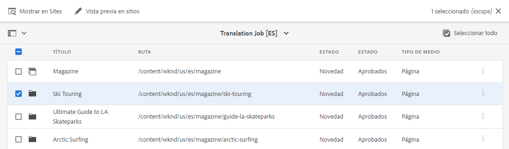

Toque o haga clic en ese icono para abrir el contenido traducido en su consola para ver los detalles del contenido traducido.

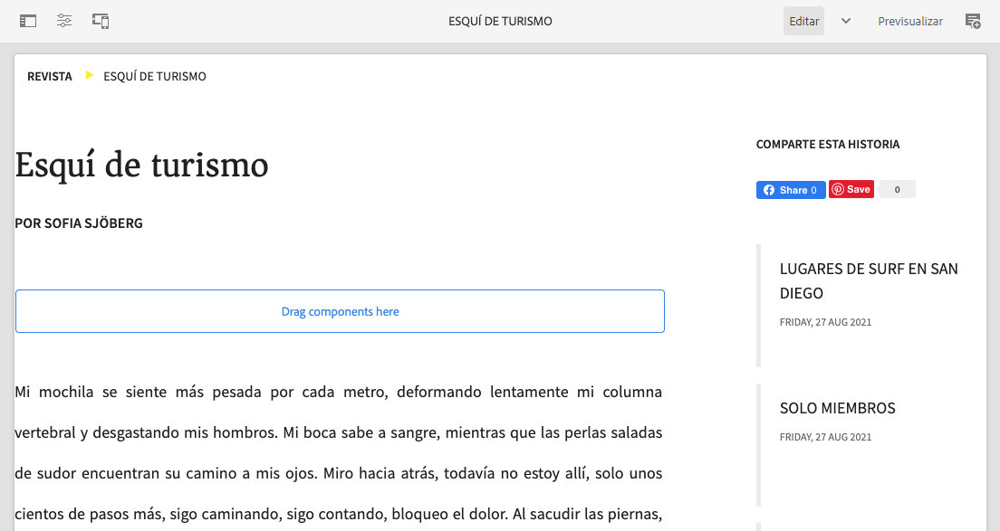

Puede modificar aún más el contenido traducido necesario, siempre que tenga el permiso adecuado, pero la edición de contenido está fuera del ámbito de este recorrido. Consulte la [Recursos adicionales](#additional-resources) al final de este documento para obtener más información sobre este tema.

El propósito del proyecto es reunir todos los recursos relacionados con una traducción en un solo lugar para facilitar el acceso y una visión general clara. Sin embargo, como puede ver viendo el detalle de un elemento traducido, las traducciones mismas regresan a la carpeta de Sitios del idioma de traducción. En este ejemplo, la carpeta es

```text
/content/<your-project>/es
```

Si va a esta carpeta mediante **Navegación** -> **Sitios**, verá el contenido traducido.

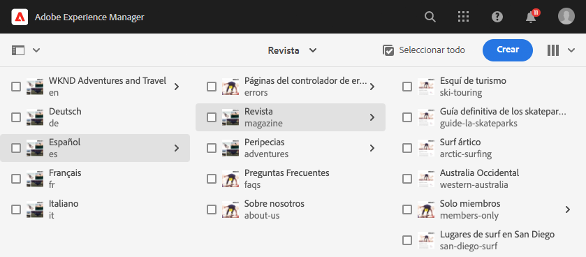

El marco de trabajo de traducción de AEM recibe las traducciones del conector de traducción y, a continuación, crea automáticamente la estructura de contenido en función de la raíz del idioma y utilizando las traducciones proporcionadas por el conector.

Es importante comprender que este contenido no se publica y, por lo tanto, no está disponible para el consumo. Aprenderemos sobre esta estructura de creación y publicación y veremos cómo publicar nuestro contenido traducido en el siguiente paso del recorrido de traducción.

## Traducción humana {#human-translation}

Si el servicio de traducción proporciona traducción humana, el proceso de revisión ofrece más opciones. Por ejemplo, las traducciones vuelven al proyecto con el estado **Borrador** y deben revisarse y aprobarse o rechazarse manualmente.

La traducción humana está fuera del alcance de este recorrido de localización. Consulte la [Recursos adicionales](#additional-resources) al final de este documento para obtener más información sobre este tema. Sin embargo, más allá de las opciones de aprobación adicionales, el flujo de trabajo para las traducciones humanas es el mismo que las traducciones automáticas, tal como se describe en este recorrido.

## Siguientes pasos {#what-is-next}

Ahora que ha completado esta parte del recorrido de traducción de AEM Sites, debe:

* Comprender qué es un proyecto de traducción.
* Poder crear nuevos proyectos de traducción.
* Utilice proyectos de traducción para traducir el contenido.

Aproveche este conocimiento y continúe con su recorrido de traducción de AEM Sites revisando el documento [Publicar contenido traducido](publish-content.md) donde aprenderá a publicar su contenido traducido y a actualizar esas traducciones a medida que cambie su contenido raíz de idioma.

## Recursos adicionales {#additional-resources}

Aunque se recomienda pasar a la siguiente parte del recorrido de traducción revisando el documento [Publicar contenido traducido,](publish-content.md) los siguientes son algunos recursos opcionales adicionales que profundizan en algunos conceptos mencionados en este documento, pero no son necesarios para continuar en el recorrido.

* [Administración de proyectos de traducción](/help/sites-cloud/administering/translation/managing-projects.md): Conozca los detalles de los proyectos de traducción y las funciones adicionales, como flujos de trabajo de traducción humana y proyectos en varios idiomas.
* [Herramientas y entorno de creación](/help/sites-cloud/authoring/fundamentals/environment-tools.md##path-selection): AEM ofrece varios mecanismos para organizar y editar el contenido, incluido un explorador de rutas robusto.
