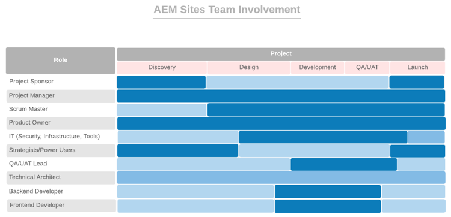

# **Primero, obtenga las personas adecuadas en los roles correctos**

>[!CONTEXTUALHELP]
>id="aemcloud_chooseteam"
>title="Elija el equipo adecuado"
>abstract="Poner a las personas adecuadas en los trabajos adecuados para ayudar a llevar la implementación de Adobe Experience Manager al éxito."
>additional-url="https://experienceleague.adobe.com/docs/experience-manager-cloud-service/onboarding/best-practices/aligning-kpis.html?lang=en" text="Alineación de KPI"
>additional-url="https://experienceleague.adobe.com/docs/experience-manager-cloud-service/onboarding/best-practices/assessing-kpis.html?lang=en" text="Evaluación de KPI"

Es probable que en su organización varios departamentos posean diferentes aspectos de la experiencia digital. Sin gobierno, el escenario está preparado para un debate interminable, luchas internas y confusión.

El gobierno digital inicio en averiguar quién está a cargo de qué y quién está haciendo qué trabajo centrado en el digital. Es posible que deba realizar alguna contratación estratégica para agregar las habilidades necesarias. Un desafío aún mayor es impulsar un cambio cultural — construir un amplio apoyo a la nueva tecnología y ayudar a la gente a acostumbrarse a nuevas formas de hacer las cosas. Una parte clave de ese esfuerzo es crear una comunidad digital, que permita a la gente aprender y apoyarse mutuamente.

Por ahora, nos centraremos en poner a las personas adecuadas en los trabajos adecuados para ayudar a impulsar la implementación de Adobe Experience Manager. Para cada producto principal: Sitios Experience Manager y recursos Experience Manager — hemos proporcionado una lista de funciones que debe desempeñar, junto con las habilidades, niveles de experiencia y atributos que hacen que las personas sean eficaces en los distintos roles.

Su tarea de esta semana es revisar ambas listas con su equipo de implementación y asegurarse de que tiene personas con las cualificaciones relevantes en cada función.

## **Funciones clave para AEM sitios Experience Manager**

Un equipo ganador necesita nueve personas en los asientos adecuados — igual que el equipo de implementación. Su éxito con Adobe Experience Manager Sites depende de la fuerza de los miembros de su equipo y de su eficacia en el trabajo conjunto. Asegúrese de tener asignadas estas nueve funciones
a personas con las cualificaciones sugeridas.

| Función | Habilidades | Nivel de capacidad | Cualidades |
|--- |--- |--- |--- |
| Administrador de proyectos | Certificación de PMP, certificación Agile, experiencia en gestión de riesgos | Experto | Justo, coherente, responsable, organizado, positivo, accesible, dispuesto a aceptar el cambio |
| Patrón de limpieza | Certificación ScrumMaster, certificación Agile, experiencia de facilitación | Experto | Consistente y creativo |
| Propietario del producto | Certificación ágil, profunda comprensión de las necesidades comerciales | Experto | Equilibrado, seguro |
| TI es líder en seguridad, infraestructura, herramientas | Certificación CISM, certificación Adobe Experience Manager Component Developer | Experto | Orientado al detalle |
| Estrategias/Usuarios avanzados | Competencia en Adobe Experience Manager Sites | Novato a experto | Tenaz, curiosa, meticulosa, de mente abierta, dispuesta a aceptar el cambio, colaborativa |
| Líder de control de calidad/UAT | Certificación ágil, comprensión del SDLC | Novice to Intermediate | Segmentación de detalles, unidad de proceso, coherente |
| Arquitecto técnico | Experiencia de infraestructura de TI | Experto | Orientado a los detalles, impulsado por procesos, coherente |
| Desarrollador back-end | Certificación ágil, experiencia en programación informática y ciencias de la computación | Novice to Intermediate | Orientado a los detalles, impulsado por procesos, coherente |
| Desarrollador front-end | Certificación ágil, comprensión de HTML, CSS y JavaScript | Novice to Intermediate | Orientado a los detalles, impulsado por procesos, coherente |

Ahora que sabe qué funciones son necesarias, consulte el gráfico siguiente para ver cuándo entra en juego cada función en el proceso de implementación.

 

**Revise esta lista con su** equipo de implementación y asegúrese de que tiene personas con las cualificaciones relevantes en cada función. Los integrantes del equipo que estén menos familiarizados con Adobe Experience Cloud pueden utilizar [recursos de aprendizaje de Experience League](https://experienceleague.adobe.com/#recommended/solutions/experience-manager) para obtener la certificación mediante [Adobe Digital Learning](https://learning.adobe.com/certification.html).

## **Funciones clave para AEM recursos Experience Manager**

De Architect a ScrumMaster, todo rol en este equipo es indispensable: incluyendo la Biblioteca DAM.

Es posible que ya tenga la mayoría de las personas que necesita para ejecutar una implementación correcta de Adobe Experience Manager Assets. Esta lista es similar a la de Adobe Experience Manager Sites, con una adición importante: necesitará un bibliotecario para asegurarse de que sus recursos digitales estén organizados y etiquetados de manera que sean fáciles de encontrar.

| Función | Habilidades | Nivel de capacidad | Cualidades |
|--- |--- |--- |--- |
| Administrador de proyectos | Certificación de PMP, certificación Agile, experiencia en gestión de riesgos | Experto | Justo, coherente, responsable, organizado, positivo, accesible, dispuesto a aceptar el cambio |
| Patrón de limpieza | Certificación ScrumMaster, certificación Agile, experiencia de facilitación | Experto | Consistente y creativo |
| Propietario del producto | Certificación ágil, profunda comprensión de las necesidades comerciales | Experto | Equilibrado, seguro |
| TI es líder en seguridad, infraestructura, herramientas | Certificación CISM, certificación Adobe Experience Manager Component Developer | Experto | Orientado al detalle |
| Estrategias/Usuarios avanzados | Competencia en Adobe Experience Manager Sites | Novato a experto | Tenaz, curiosa, meticulosa, de mente abierta, dispuesta a aceptar el cambio, colaborativa |
| Líder de control de calidad/UAT | Certificación ágil, comprensión del SDLC | Novice to Intermediate | Segmentación de detalles, unidad de proceso, coherente |
| Arquitecto técnico | Experiencia de infraestructura de TI | Experto | Orientado a los detalles, impulsado por procesos, coherente |
| Desarrollador back-end | Certificación ágil, experiencia en programación informática y ciencias de la computación | Novice to Intermediate | Orientado a los detalles, impulsado por procesos, coherente |
| Desarrollador front-end | Certificación ágil, comprensión de HTML, CSS y JavaScript | Novice to Intermediate | Orientado a los detalles, impulsado por procesos, coherente |
| Biblioteca DAM | Antecedentes y titulación en ciencias de la biblioteca | Experto | Orientado a los detalles, impulsado por procesos, organizado |

Ahora que sabe qué funciones son necesarias, consulte el gráfico siguiente para ver cuándo entra en juego cada función en el proceso de implementación.

 

>[!TIP]
>
> Obtenga más información sobre Adobe Experience Cloud y aproveche los recursos en [Experience League](https://experienceleague.adobe.com/#recommended/solutions/experience-manager) y obtenga la certificación mediante [Adobe Digital Learning](https://learning.adobe.com/certification.html).