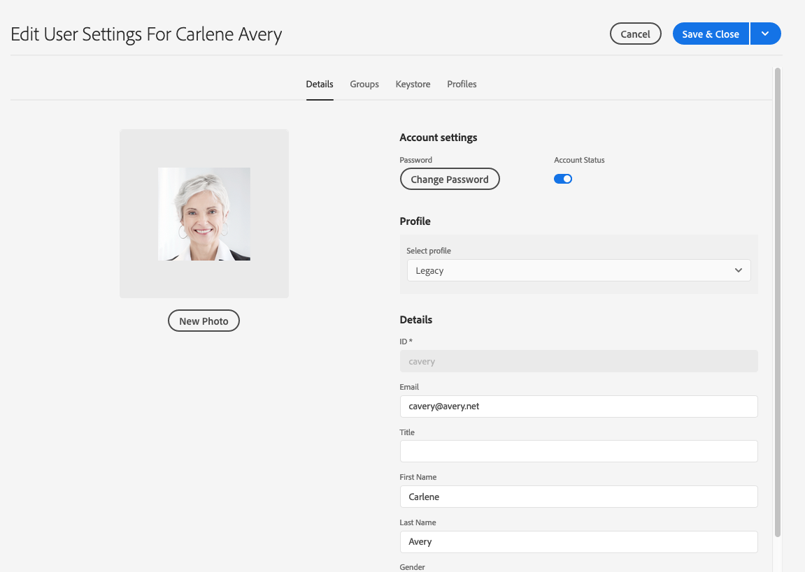

# Adobe Experience Manager como base de servicios en la nube Preparación para la protección de datos y Regulaciones de privacidad de datos {#aem-foundation-readiness-for-data-protection-and-data-privacy-regulations}

>[!WARNING]
>
>El contenido de este documento no constituye asesoramiento jurídico y no se pretende sustituir al asesoramiento jurídico.
>
>Consulte con el departamento legal de su empresa para obtener asesoramiento acerca de las normas de protección de datos y privacidad de datos.

>[!NOTE]
>
>Para obtener más información sobre la respuesta de Adobe a los problemas de privacidad y lo que esto significa para usted como cliente de Adobe, consulte el Centro [de privacidad de](https://www.adobe.com/privacy.html)Adobe.

## Compatibilidad con Protección y privacidad de datos de AEM Foundation {#aem-foundation-data-privacy-and-protection-support}

A nivel de AEM Foundation, los datos personales almacenados se guardan en el perfil de usuario. Por lo tanto, la información de este artículo trata principalmente de cómo acceder y eliminar perfiles de usuario, para abordar las solicitudes de acceso y eliminación respectivamente.

## Acceso a un perfil de usuario {#accessing-a-user-profile}

### Pasos manuales {#manual-steps}

1. Abra la consola Administración de usuarios, navegando hasta **[!UICONTROL Herramientas - Seguridad - Usuarios]** o navegando directamente a `https://<serveraddress>:<serverport>/security/users.html`

<!--
   
-->

1. A continuación, busque el usuario en cuestión escribiendo el nombre en la barra de búsqueda situada en la parte superior de la página:

   

1. Por último, abra el perfil de usuario haciendo clic en él y, a continuación, marque la casilla de verificación en la ficha **[!UICONTROL Detalles]** .

   

### API HTTP {#http-api}

Como se mencionó anteriormente, Adobe proporciona API para acceder a los datos de usuario, con el fin de facilitar la automatización. Existen varios tipos de API que puede utilizar:

**API UserProperties**

```shell
curl -u user:password http://localhost:4502/libs/granite/security/search/profile.userproperties.json\?authId\=cavery
```

**Sling API**

**Descubriendo la página principal del usuario:**

```xml
curl -g -u user:password 'http://localhost:4502/libs/granite/security/search/authorizables.json?query={"condition":[{"named":"cavery"}]}'
     {"authorizables":[{"type":"user","authorizableId_xss":"cavery","authorizableId":"cavery","name_xss":"Carlene Avery","name":"Carlene Avery","home":"/home/users/we-retail/DSCP-athB1NYLBXvdTuN"}],"total":1}
```

**Recuperando datos de usuario:**

Utilizando la ruta de nodo de la propiedad home de la carga útil JSON devuelta por el comando anterior:

```shell
curl -u user:password  'http://localhost:4502/home/users/we-retail/DSCP-athB1NYLBXvdTuN/profile.-1.json'
```

```shell
curl -u user:password  'http://localhost:4502/home/users/we-retail/DSCP-athB1NYLBXvdTuN/profiles.-1.json'
```

## Desactivación de un usuario y eliminación de los perfiles asociados {#disabling-a-user-and-deleting-the-associated-profiles}

### Deshabilitar usuario {#disable-user}

1. Abra la consola Administración de usuarios y busque al usuario en cuestión, tal como se describe más arriba.
2. Pase el ratón sobre el usuario y haga clic en el icono de selección. El perfil cambiará a gris indicando que está seleccionado.

3. Pulse el botón **Deshabilitar** en el menú superior para deshabilitar el usuario:

   

4. Finalmente, confirme la acción.

   A continuación, la interfaz de usuario indicará que la cuenta de usuario se ha desactivado al atenuar y agregar un bloqueo a la tarjeta de perfil:

   

### Eliminar información de perfil de usuario {#delete-user-profile-information}

>[!NOTE]
>
> Para AEM como servicio de nube, no hay ningún procedimiento manual disponible en la interfaz de usuario para eliminar un perfil de usuario, ya que no se puede acceder a CRXDE.

### API HTTP {#http-api-1}

Los siguientes procedimientos utilizan la herramienta de línea de comandos para ilustrar cómo deshabilitar al usuario con la `curl` captura **** `userId` y eliminar sus perfiles disponibles en la ubicación predeterminada.

**Descubriendo la página principal del usuario:**

```shell
curl -g -u user:password 'http://localhost:4502/libs/granite/security/search/authorizables.json?query={"condition":[{"named":"cavery"}]}'
     {"authorizables":[{"type":"user","authorizableId_xss":"cavery","authorizableId":"cavery","name_xss":"Carlene Avery","name":"Carlene Avery","home":"/home/users/we-retail/DSCP-athB1NYLBXvdTuN"}],"total":1}
```

**Desactivación del usuario:**

Utilizando la ruta de nodo de la propiedad home de la carga útil JSON devuelta por el comando anterior:

```shell
curl -X POST -u user:password -FdisableUser="describe the reasons for disabling this user (Data Privacy in this case)" 'http://localhost:4502/home/users/we-retail/DSCP-athB1NYLBXvdTuN.rw.userprops.html'
```

**Eliminación de perfiles de usuario**

Utilizando la ruta de acceso del nodo de la propiedad home de la carga útil JSON devuelta por el comando de detección de cuenta y las ubicaciones de nodos de perfil conocidas fuera del cuadro:

```shell
curl -X POST -u user:password -H "Accept: application/json,**/**;q=0.9" -d ':operation=delete' 'http://localhost:4502/home/users/we-retail/DSCP-athB1NYLBXvdTuN/profile'
```

```shell
curl -X POST -u user:password -H "Accept: application/json,**/**;q=0.9" -d ':operation=delete' 'http://localhost:4502/home/users/we-retail/DSCP-athB1NYLBXvdTuN/profile'
```
