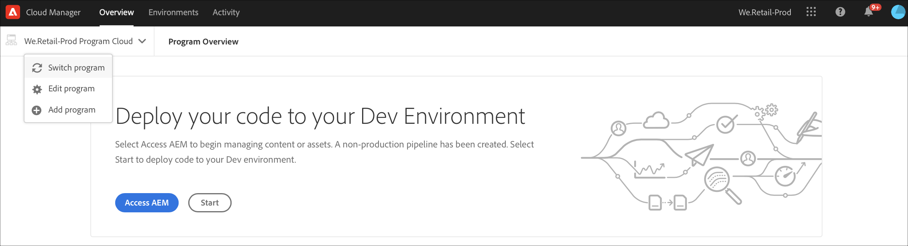
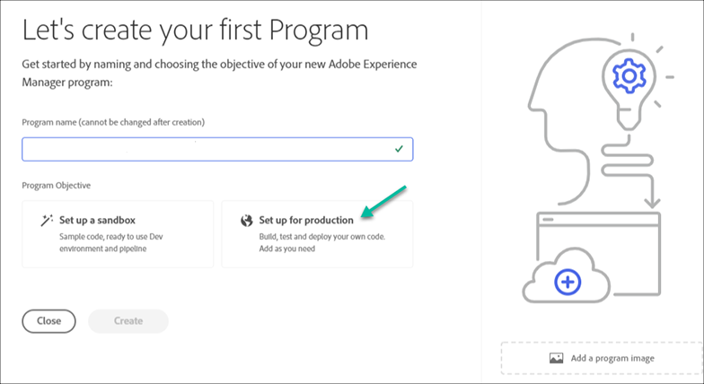

# Creación de un programa {#create-a-program}

La solución nativa de la nube proporciona al usuario los permisos necesarios y la capacidad de crear un programa en un modelo de autoservicio.

Un asistente para la creación de programas pedirá al usuario que envíe detalles, según el objetivo del usuario de crear el programa dentro de los límites de lo que está disponible para el cliente o la organización en cuestión.

En el evento del acceso por primera vez a Cloud Manager o si no hay programas en el inquilino, el usuario verá **Crear su primera pantalla de Programa** . Si el usuario selecciona *Esc* o hace clic fuera del cuadro de diálogo, se muestra la siguiente pantalla:

## Uso del Asistente para crear Programas {#using-create-program-wizard}

Según el objetivo del usuario de crear el programa dentro de los límites de lo que está disponible para el cliente o la organización específicos, un asistente para la creación de programas solicitará al usuario que envíe uno o varios detalles.

>[!NOTE]
>If a program already exists, then you will see **Add Program** on the top right of the landing page, as shown in the figure below.

## Creación de un Programa de Simulador para pruebas {#create-sandbox-program}

Siga los pasos a continuación para crear un programa de simulación de pruebas:

1. En el asistente para crear programa, seleccione **Configurar un simulador para pruebas**. El usuario envía el nombre del programa antes de seleccionar **Crear**.

   

1. El usuario verá la nueva tarjeta de programa de simulación de pruebas en la página de aterrizaje y podrá pasar el ratón sobre ella para seleccionar el icono Administrador de nubes y navegar hasta la página de información general del Administrador de nubes. La tarjeta informará al usuario sobre el estado de la configuración automática del programa de simulación de pruebas recién creado. El usuario verá progresión.

   

1. Una vez que se haya configurado el programa y se haya completado el paso de creación del proyecto, el usuario podrá acceder al vínculo **Administrar Git** , como se muestra en la figura siguiente:

   

   >[!NOTE]
   >
   >Para obtener más información sobre el acceso y la administración del repositorio Git mediante la administración de cuentas Git de autoservicio desde la interfaz de usuario de Cloud Manager, consulte [Acceso a Git](/help/implementing/cloud-manager/accessing-git.md).

1. Una vez creado el entorno de desarrollo, el usuario puede **acceder a AEM** vínculo, como se muestra en la figura siguiente:

   

1. Una vez que se haya completado la implementación de la canalización sin producción en el desarrollo, el asistente guiará al usuario para que acceda a AEM (en desarrollo) o implemente código en el entorno de desarrollo:

   

   >[!NOTE]
   >También puede editar, cambiar o agregar un programa desde la página Información general de Cloud Manager, como se muestra a continuación:

   

## Eliminación de un Programa de Simulador para pruebas {#delete-sandbox-program}

A Sandbox Program user in *Business Owner* or *Deployment Manager* role in Cloud Manager can delete their Production and Stage environment set via the Cloud Manager UI.

>[!NOTE]
>Al seleccionar la opción de eliminación en producción o fase también se eliminan las otras del conjunto.

La opción Eliminar está disponible en la página de aterrizaje, como se muestra a continuación:

O bien,

Seleccione **Eliminar Programa** en la página Información general **de** Programa para eliminar el Programa del Simulador para pruebas.

## Creación de un Programa normal {#create-regular-program}

Un programa *regular* está dirigido a un usuario que esté familiarizado con AEM y Cloud Manager y esté listo para escribir, crear y probar código con el objetivo de implementarlo en Producción.

Siga los pasos a continuación para crear un programa normal:

1. Seleccione **Configurar para producción** en el asistente Crear Programa para crear un programa normal. El usuario puede aceptar el nombre de programa predeterminado o editarlo antes de seleccionar **Continuar**.

   

1. El usuario seleccionará las soluciones que se incluirán en el programa en la pantalla que se presentará después de la pantalla de arriba.

   >[!NOTE]
   >
   >La pantalla siguiente solo se muestra para el segmento de clientes que han comprado más de una solución. Para los clientes que han comprado una sola solución, no se mostrará la pantalla de selección de la solución que aparece a continuación.

   

1. Una vez que haya seleccionado las soluciones, haga clic en **Crear**.

   

1. Una vez que vea la tarjeta de programa en la página de aterrizaje, pase el ratón sobre ella para seleccionar el icono Administrador de nube y navegar hasta la página **Información general** del Administrador de nube.

   

1. La tarjeta principal de llamada a acción guiará al usuario para crear un entorno, crear un canal que no sea de producción y, finalmente, un canal de producción.
   

   >[!NOTE]
   >
   >A regular program does not have **Auto-setup** feature.

